# 区块链电子病历系统架构文档

## 1. 系统概述

### 1.1 项目简介

区块链电子病历系统是一个基于 Hyperledger
Fabric 和 IPFS 的去中心化医疗数据管理平台，旨在为医疗机构和患者提供安全、透明、可追溯的电子病历管理服务。

### 1.2 核心特性

- **去中心化存储**: 基于 IPFS 的分布式文件存储
- **数据完整性**: 基于 Hyperledger Fabric 的区块链数据验证
- **隐私保护**: AES-256 加密 + 差分隐私
- **智能诊断**: AI 辅助医学影像分析和诊断
- **联邦学习**: 跨机构协作的机器学习
- **跨链互操作**: 多区块链网络数据互通
- **合规管理**: HIPAA/GDPR 合规框架

### 1.3 技术栈

| 层级   | 技术组件                       | 说明                   |
| ------ | ------------------------------ | ---------------------- |
| 前端   | React 18 + TypeScript          | 现代化 Web 界面        |
| 后端   | Node.js + Express + TypeScript | RESTful API 服务       |
| 区块链 | Hyperledger Fabric 2.5         | 联盟链平台             |
| 存储   | IPFS + MySQL + Redis           | 分布式 + 关系型 + 缓存 |
| 容器化 | Docker + Kubernetes            | 容器编排和部署         |
| 监控   | Prometheus + Grafana           | 性能监控和可视化       |
| 安全   | JWT + MFA + TLS                | 多层安全防护           |

## 2. 系统架构

### 2.1 整体架构图

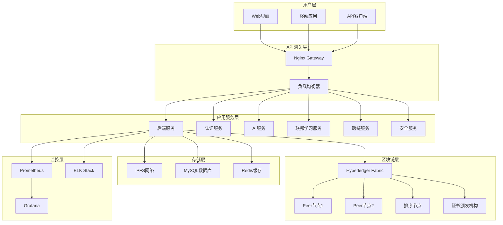

### 2.2 分层架构详解

#### 2.2.1 表示层 (Presentation Layer)

- **Web 前端**: React 18 + TypeScript + Ant Design
- **移动端**: React Native (计划中)
- **API 文档**: OpenAPI 3.0 规范

#### 2.2.2 API 网关层 (API Gateway Layer)

- **Nginx**: 反向代理和负载均衡
- **SSL 终端**: TLS 1.3 加密
- **速率限制**: 防 DDoS 攻击
- **CORS 处理**: 跨域请求管理

#### 2.2.3 业务逻辑层 (Business Logic Layer)

- **用户管理服务**: 认证、授权、用户资料
- **病历管理服务**: CRUD 操作、权限控制
- **AI 诊断服务**: 医学影像分析、临床决策支持
- **联邦学习服务**: 多机构协作学习
- **跨链服务**: 区块链网络互操作
- **安全合规服务**: 威胁检测、合规监控

#### 2.2.4 数据访问层 (Data Access Layer)

- **区块链适配器**: Hyperledger Fabric SDK
- **IPFS 客户端**: 分布式文件存储
- **数据库连接池**: MySQL 连接管理
- **缓存服务**: Redis 数据缓存

#### 2.2.5 基础设施层 (Infrastructure Layer)

- **容器编排**: Kubernetes 集群
- **服务发现**: Kubernetes Service
- **配置管理**: ConfigMap + Secret
- **日志聚合**: ELK Stack
- **监控告警**: Prometheus + Grafana

## 3. 核心模块设计

### 3.1 用户认证模块

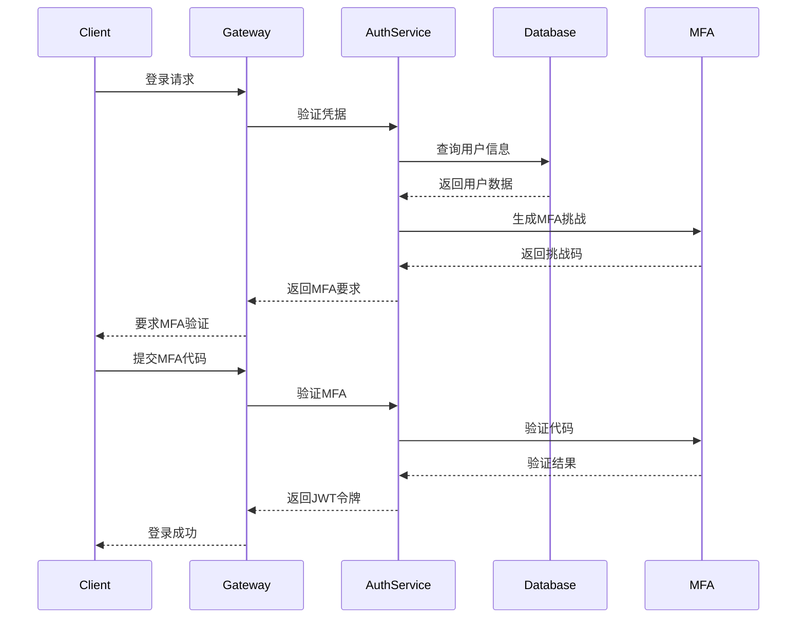

#### 3.1.1 组件说明

- **JWT 管理器**: 令牌生成、验证、刷新
- **MFA 服务**: TOTP 二维码生成和验证
- **会话管理**: Redis 会话存储
- **安全策略**: 密码复杂度、登录频次限制

### 3.2 病历管理模块

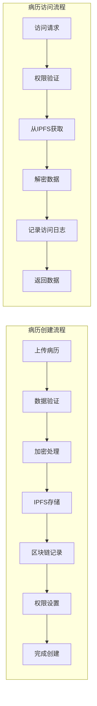

#### 3.2.1 数据流程

1. **上传阶段**: 文件验证 → 加密 → IPFS 存储 → 哈希记录
2. **区块链记录**: 元数据上链 → 完整性验证 → 智能合约执行
3. **权限控制**: 基于角色的访问控制 → 细粒度权限管理
4. **检索优化**: 缓存热点数据 → 索引优化 → 分页查询

### 3.3 AI 诊断模块

```mermaid
graph TB
    subgraph "AI诊断流程"
        Input[医学影像输入]
        Preprocess[图像预处理]
        CNN[卷积神经网络]
        Analysis[特征分析]
        Classification[疾病分类]
        Confidence[置信度评估]
        Report[诊断报告生成]

        Input --> Preprocess
        Preprocess --> CNN
        CNN --> Analysis
        Analysis --> Classification
        Classification --> Confidence
        Confidence --> Report
    end

    subgraph "模型管理"
        Training[模型训练]
        Validation[验证集测试]
        Deployment[模型部署]
        Monitoring[性能监控]
        Update[模型更新]

        Training --> Validation
        Validation --> Deployment
        Deployment --> Monitoring
        Monitoring --> Update
        Update --> Training
    end
```

#### 3.3.1 技术实现

- **深度学习框架**: TensorFlow/PyTorch
- **模型架构**: ResNet50 + DenseNet + Transformer
- **训练数据**: 医学影像数据集 (DICOM 格式)
- **推理优化**: TensorRT 加速 + 模型量化
- **模型版本管理**: MLflow + Docker Registry

### 3.4 联邦学习模块

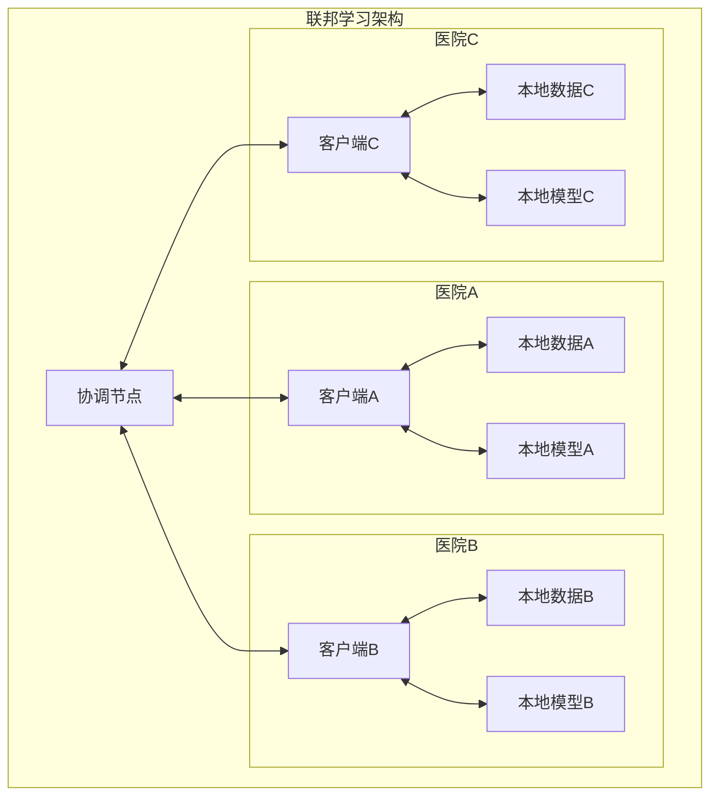

#### 3.4.1 实现特性

- **差分隐私**: ε-差分隐私保护
- **安全聚合**: 同态加密 + 秘密共享
- **拜占庭容错**: 恶意节点检测和处理
- **自适应优化**: FedAvg + FedProx 算法
- **异构数据处理**: Non-IID 数据分布优化

### 3.5 跨链互操作模块

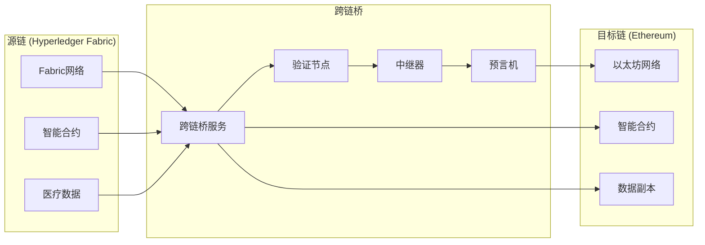

#### 3.5.1 支持的区块链网络

- **Hyperledger Fabric**: 主要存储网络
- **Ethereum**: 智能合约和 DeFi 集成
- **Polygon**: 低成本的侧链解决方案
- **Binance Smart Chain**: 高性能应用场景

## 4. 数据模型设计

### 4.1 数据库 ER 图

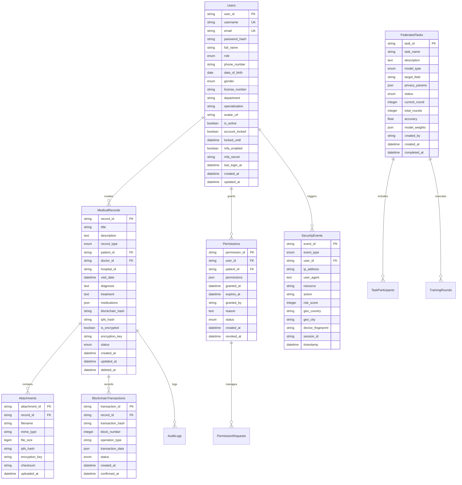

### 4.2 区块链数据结构

#### 4.2.1 智能合约结构

```go
// 医疗记录合约
type MedicalRecord struct {
    RecordID      string    `json:"recordId"`
    PatientID     string    `json:"patientId"`
    DoctorID      string    `json:"doctorId"`
    HospitalID    string    `json:"hospitalId"`
    Title         string    `json:"title"`
    RecordType    string    `json:"recordType"`
    IPFSHash      string    `json:"ipfsHash"`
    ContentHash   string    `json:"contentHash"`
    Permissions   []string  `json:"permissions"`
    CreatedAt     time.Time `json:"createdAt"`
    UpdatedAt     time.Time `json:"updatedAt"`
    IsDeleted     bool      `json:"isDeleted"`
}

// 权限记录合约
type Permission struct {
    PermissionID  string    `json:"permissionId"`
    UserID        string    `json:"userId"`
    PatientID     string    `json:"patientId"`
    Permissions   []string  `json:"permissions"`
    GrantedAt     time.Time `json:"grantedAt"`
    ExpiresAt     time.Time `json:"expiresAt"`
    GrantedBy     string    `json:"grantedBy"`
    IsActive      bool      `json:"isActive"`
}
```

### 4.3 IPFS 文件组织

```
/medical-records/
├── patients/
│   ├── {patient-id}/
│   │   ├── records/
│   │   │   ├── {record-id}/
│   │   │   │   ├── metadata.json
│   │   │   │   ├── attachments/
│   │   │   │   │   ├── {file-hash}.enc
│   │   │   │   │   └── ...
│   │   │   │   └── thumbnails/
│   │   │   └── ...
│   │   └── profile/
│   │       ├── avatar.jpg
│   │       └── preferences.json
│   └── ...
├── ai-models/
│   ├── diagnostic/
│   │   ├── {model-version}/
│   │   │   ├── model.pb
│   │   │   ├── weights.h5
│   │   │   └── metadata.json
│   │   └── ...
│   └── federated/
│       ├── {task-id}/
│       │   ├── global-model/
│       │   ├── participant-updates/
│       │   └── aggregated-weights/
│       └── ...
└── backups/
    ├── daily/
    ├── weekly/
    └── monthly/
```

## 5. 安全架构

### 5.1 多层安全防护

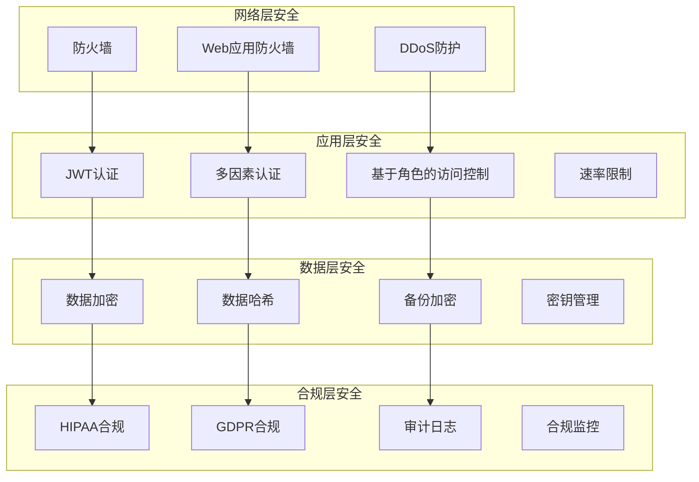

### 5.2 加密策略

#### 5.2.1 数据加密

- **传输中**: TLS 1.3 端到端加密
- **静态存储**: AES-256-GCM 加密
- **数据库**: 透明数据加密 (TDE)
- **备份**: 独立密钥加密

#### 5.2.2 密钥管理

- **密钥生成**: CSPRNG + PBKDF2
- **密钥轮换**: 定期自动轮换
- **密钥存储**: HSM 硬件安全模块
- **密钥分发**: 安全密钥交换协议

### 5.3 威胁检测与响应

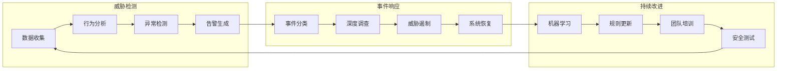

## 6. 性能优化

### 6.1 缓存策略

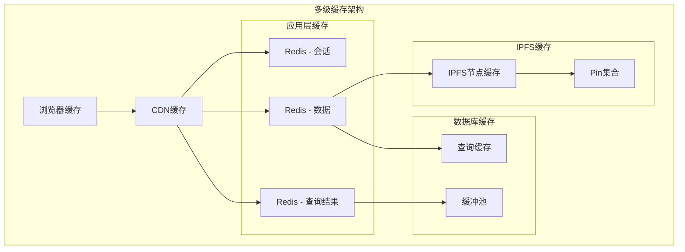

### 6.2 数据库优化

#### 6.2.1 索引策略

```sql
-- 复合索引
CREATE INDEX idx_medical_records_patient_date
ON medical_records(patient_id, visit_date DESC);

-- 覆盖索引
CREATE INDEX idx_records_search
ON medical_records(patient_id, record_type, is_deleted)
INCLUDE (title, description, created_at);

-- 部分索引
CREATE INDEX idx_active_permissions
ON permissions(user_id, patient_id)
WHERE status = 'active' AND expires_at > NOW();
```

#### 6.2.2 分区策略

```sql
-- 按时间分区
CREATE TABLE medical_records (
    record_id VARCHAR(36) PRIMARY KEY,
    -- 其他字段...
    created_at TIMESTAMP NOT NULL
) PARTITION BY RANGE (YEAR(created_at)) (
    PARTITION p2023 VALUES LESS THAN (2024),
    PARTITION p2024 VALUES LESS THAN (2025),
    PARTITION p2025 VALUES LESS THAN (2026),
    PARTITION p_future VALUES LESS THAN MAXVALUE
);
```

### 6.3 负载均衡

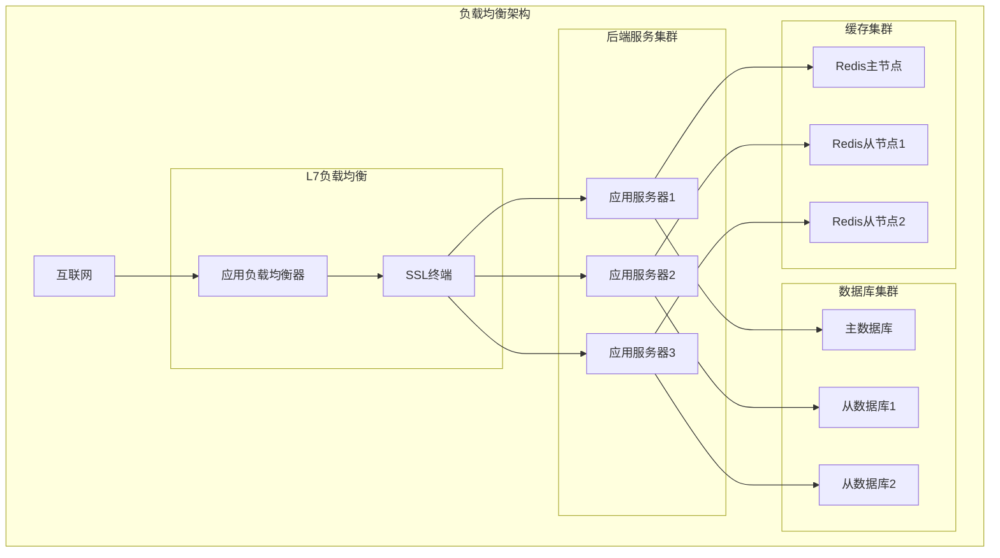

## 7. 监控和运维

### 7.1 监控指标

#### 7.1.1 系统监控

- **CPU 使用率**: < 80%
- **内存使用率**: < 85%
- **磁盘 I/O**: < 80%
- **网络带宽**: < 70%

#### 7.1.2 应用监控

- **API 响应时间**: < 200ms (P95)
- **错误率**: < 0.1%
- **QPS**: 监控峰值
- **连接池**: 使用率 < 80%

#### 7.1.3 业务监控

- **用户注册率**: 日增长
- **病历上传成功率**: > 99.9%
- **AI 诊断准确率**: > 95%
- **区块链交易成功率**: > 99.99%

### 7.2 告警策略

```yaml
# Prometheus 告警规则示例
groups:
  - name: emr-system-alerts
    rules:
      - alert: HighErrorRate
        expr: rate(http_requests_total{status=~"5.."}[5m]) > 0.01
        for: 2m
        labels:
          severity: critical
        annotations:
          summary: '高错误率告警'
          description: '错误率超过 1% 持续 2 分钟'

      - alert: HighResponseTime
        expr:
          histogram_quantile(0.95,
          rate(http_request_duration_seconds_bucket[5m])) > 0.5
        for: 5m
        labels:
          severity: warning
        annotations:
          summary: '响应时间过长'
          description: '95% 请求响应时间超过 500ms'

      - alert: DatabaseConnectionHigh
        expr:
          mysql_global_status_threads_connected /
          mysql_global_variables_max_connections > 0.8
        for: 3m
        labels:
          severity: warning
        annotations:
          summary: '数据库连接数过高'
          description: '数据库连接使用率超过 80%'
```

### 7.3 日志管理

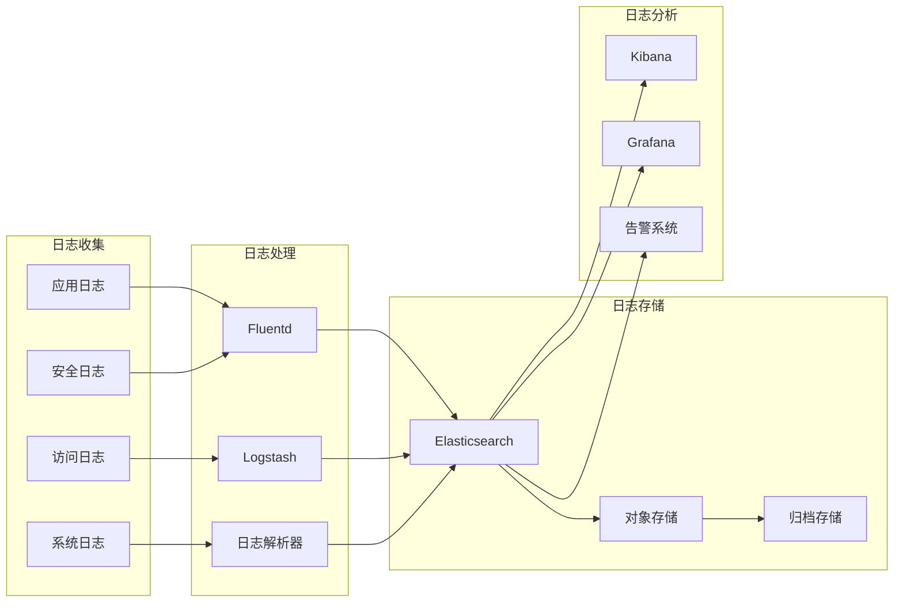

## 8. 部署架构

### 8.1 Kubernetes 部署拓扑

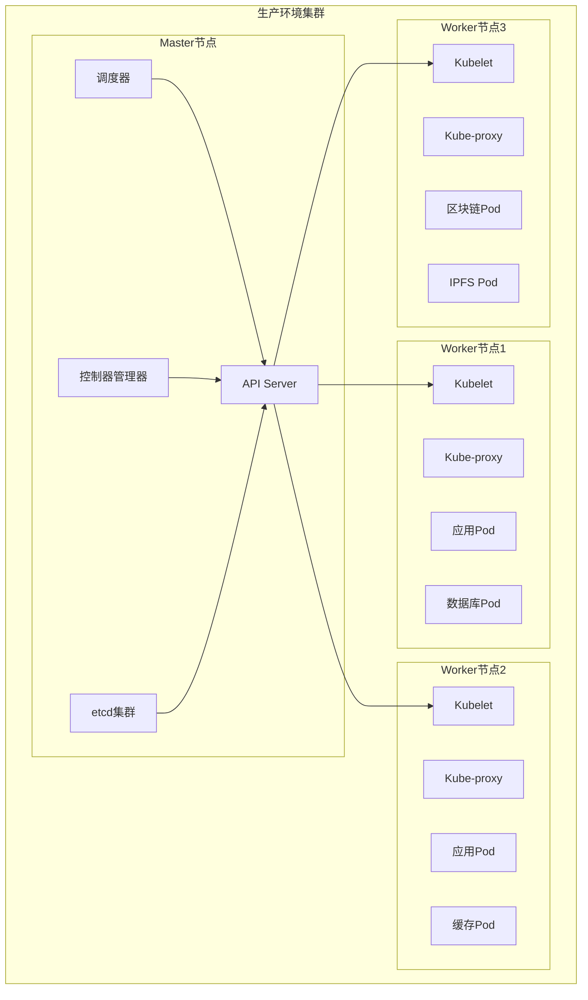

### 8.2 微服务部署

```yaml
# 服务部署清单
apiVersion: apps/v1
kind: Deployment
metadata:
  name: emr-backend
  namespace: emr-blockchain-prod
spec:
  replicas: 3
  strategy:
    type: RollingUpdate
    rollingUpdate:
      maxSurge: 1
      maxUnavailable: 0
  selector:
    matchLabels:
      app: emr-backend
  template:
    metadata:
      labels:
        app: emr-backend
    spec:
      containers:
        - name: backend
          image: emr-backend:v2.0.0
          ports:
            - containerPort: 3001
          env:
            - name: NODE_ENV
              value: 'production'
            - name: DATABASE_URL
              valueFrom:
                secretKeyRef:
                  name: db-secret
                  key: url
          resources:
            requests:
              memory: '1Gi'
              cpu: '500m'
            limits:
              memory: '2Gi'
              cpu: '1000m'
          livenessProbe:
            httpGet:
              path: /health
              port: 3001
            initialDelaySeconds: 30
            periodSeconds: 10
          readinessProbe:
            httpGet:
              path: /ready
              port: 3001
            initialDelaySeconds: 5
            periodSeconds: 5
```

## 9. 技术选型说明

### 9.1 前端技术栈

- **React 18**: 最新的并发特性和 Suspense
- **TypeScript**: 类型安全和开发体验
- **Ant Design**: 企业级 UI 组件库
- **React Query**: 服务端状态管理
- **Vite**: 快速构建工具

### 9.2 后端技术栈

- **Node.js**: 高性能异步 I/O
- **Express.js**: 轻量级 Web 框架
- **TypeScript**: 类型安全的服务端开发
- **Prisma**: 现代数据库工具包
- **Jest**: 测试框架

### 9.3 区块链技术栈

- **Hyperledger Fabric**: 企业级联盟链
- **Go**: 智能合约开发语言
- **Fabric SDK**: Node.js 客户端库
- **Caliper**: 性能测试工具

### 9.4 存储技术栈

- **MySQL 8.0**: 主要关系型数据库
- **Redis 7**: 缓存和会话存储
- **IPFS**: 分布式文件存储
- **MinIO**: 对象存储服务

## 10. 扩展性设计

### 10.1 水平扩展策略

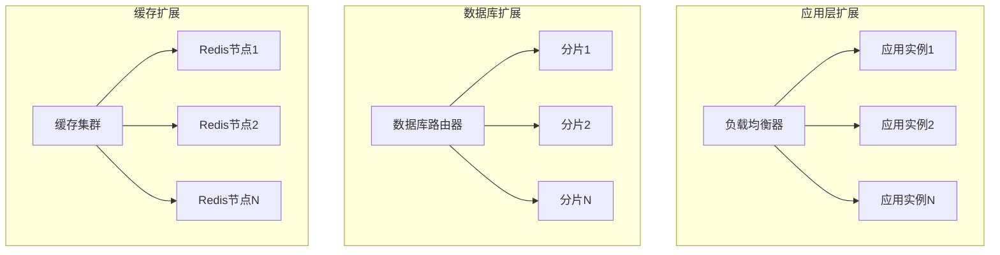

### 10.2 多地域部署

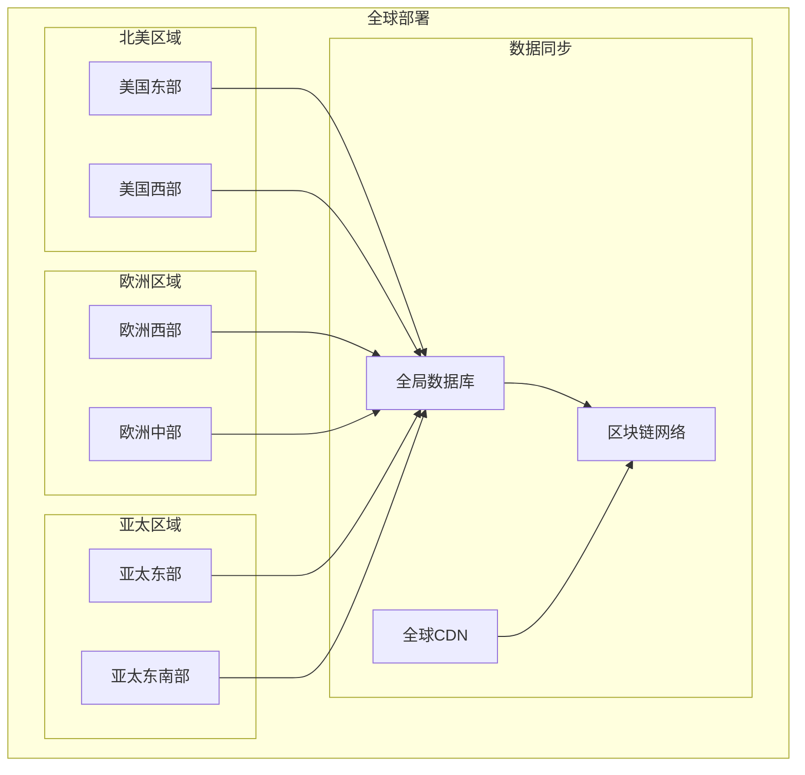

## 11. 总结

本架构文档详细描述了区块链电子病历系统的技术架构、设计思路和实现方案。系统采用现代化的微服务架构，结合区块链、AI 和云原生技术，为医疗行业提供了安全、可靠、高性能的数字化解决方案。

关键技术亮点：

- 基于 Hyperledger Fabric 的企业级区块链
- IPFS 分布式存储确保数据可用性
- AI 辅助诊断提升医疗服务质量
- 联邦学习保护隐私的同时实现协作
- 全面的安全合规体系
- 云原生的部署和运维模式

该架构设计充分考虑了可扩展性、可维护性和安全性，能够满足大规模医疗机构的业务需求，并为未来的技术演进预留了充足的扩展空间。
