# 区块链电子病历系统部署指南

## 目录
1. [环境要求](#1-环境要求)
2. [快速开始](#2-快速开始)
3. [生产环境部署](#3-生产环境部署)
4. [监控配置](#4-监控配置)
5. [故障排除](#5-故障排除)
6. [运维管理](#6-运维管理)

## 1. 环境要求

### 1.1 硬件要求

#### 开发环境
- **CPU**: 4核心或以上
- **内存**: 8GB RAM 或以上
- **存储**: 100GB 可用空间
- **网络**: 100Mbps 带宽

#### 生产环境
- **CPU**: 16核心或以上 (每个节点)
- **内存**: 32GB RAM 或以上 (每个节点)
- **存储**: 1TB SSD 或以上 (每个节点)
- **网络**: 1Gbps 带宽

### 1.2 软件依赖

```bash
# 必需软件
Docker >= 20.10.0
Docker Compose >= 2.0.0
Kubernetes >= 1.25.0
kubectl >= 1.25.0
Helm >= 3.10.0

# 开发工具
Node.js >= 18.0.0
npm >= 8.0.0
Go >= 1.21.0
Git >= 2.30.0
```

### 1.3 系统要求
- **操作系统**: Ubuntu 20.04 LTS 或更高版本
- **容器运行时**: containerd 或 Docker
- **网络**: IPv4/IPv6 双栈支持
- **时间同步**: NTP 时间同步

## 2. 快速开始

### 2.1 克隆项目

```bash
# 克隆仓库
git clone https://github.com/your-org/blockchain-emr-system.git
cd blockchain-emr-system

# 检查环境
./scripts/health-check.sh
```

### 2.2 本地开发环境

```bash
# 安装依赖
npm install

# 启动开发环境
docker-compose -f docker-compose.dev.yml up -d

# 等待服务就绪
./scripts/wait-for-services.sh

# 初始化数据库
npm run db:migrate
npm run db:seed

# 启动前端和后端
npm run dev
```

### 2.3 验证安装

```bash
# 检查服务状态
curl http://localhost:3001/api/v1/health

# 检查前端
curl http://localhost:3000

# 检查区块链网络
docker exec fabric-peer peer channel list
```

## 3. 生产环境部署

### 3.1 Kubernetes 集群准备

#### 3.1.1 创建命名空间

```bash
# 创建生产命名空间
kubectl create namespace emr-blockchain-prod

# 创建开发命名空间
kubectl create namespace emr-blockchain-dev

# 设置默认命名空间
kubectl config set-context --current --namespace=emr-blockchain-prod
```

#### 3.1.2 配置存储类

```yaml
# storage-class.yaml
apiVersion: storage.k8s.io/v1
kind: StorageClass
metadata:
  name: fast-ssd
provisioner: kubernetes.io/aws-ebs  # 或其他云服务商
parameters:
  type: gp3
  iops: "3000"
  throughput: "125"
allowVolumeExpansion: true
volumeBindingMode: WaitForFirstConsumer
```

```bash
kubectl apply -f storage-class.yaml
```

### 3.2 配置密钥管理

#### 3.2.1 创建数据库密钥

```bash
# 生成数据库密码
DB_PASSWORD=$(openssl rand -base64 32)
echo $DB_PASSWORD

# 创建数据库密钥
kubectl create secret generic db-secrets \
  --from-literal=mysql-root-password=$DB_PASSWORD \
  --from-literal=mysql-user-password=$(openssl rand -base64 24) \
  --namespace=emr-blockchain-prod
```

#### 3.2.2 创建应用密钥

```bash
# 生成 JWT 密钥
JWT_SECRET=$(openssl rand -base64 64)

# 生成加密密钥
ENCRYPTION_KEY=$(openssl rand -base64 32)

# 创建应用密钥
kubectl create secret generic emr-secrets \
  --from-literal=jwt-secret=$JWT_SECRET \
  --from-literal=encryption-key=$ENCRYPTION_KEY \
  --from-literal=fabric-admin-key=$(cat fabric-certs/admin.key | base64 -w 0) \
  --from-literal=blockchain-private-key=$(openssl rand -base64 32) \
  --namespace=emr-blockchain-prod
```

### 3.3 部署基础服务

#### 3.3.1 部署数据库

```bash
# 部署 MySQL
kubectl apply -f deployment/k8s/mysql.yaml

# 等待数据库就绪
kubectl wait --for=condition=ready pod -l app=mysql --timeout=300s

# 初始化数据库架构
kubectl exec -it mysql-0 -- mysql -u root -p$DB_PASSWORD emr_blockchain < backend-app/src/database/medical_records_schema.sql
```

#### 3.3.2 部署缓存服务

```bash
# 部署 Redis
kubectl apply -f deployment/k8s/redis.yaml

# 验证 Redis 状态
kubectl exec -it $(kubectl get pod -l app=redis -o jsonpath='{.items[0].metadata.name}') -- redis-cli ping
```

#### 3.3.3 部署 IPFS 网络

```bash
# 部署 IPFS
kubectl apply -f deployment/k8s/ipfs.yaml

# 验证 IPFS 网络
kubectl port-forward svc/ipfs-service 5001:5001 &
curl http://localhost:5001/api/v0/id
```

### 3.4 部署区块链网络

#### 3.4.1 准备 Fabric 网络

```bash
# 生成证书
cd chaincode/scripts
./generate-certificates.sh

# 创建创世区块
./generate-genesis.sh

# 部署 Fabric 网络
kubectl apply -f deployment/k8s/fabric/
```

#### 3.4.2 安装链码

```bash
# 打包链码
cd chaincode
go mod tidy
go build -o medical-records

# 安装到集群
./scripts/install-chaincode.sh production
```

### 3.5 部署应用服务

#### 3.5.1 构建应用镜像

```bash
# 构建后端镜像
docker build -t emr-backend:v2.0.0 ./backend-app

# 构建前端镜像
docker build -t emr-frontend:v2.0.0 ./react-app

# 推送到镜像仓库
docker push your-registry/emr-backend:v2.0.0
docker push your-registry/emr-frontend:v2.0.0
```

#### 3.5.2 部署应用

```bash
# 更新镜像标签
sed -i 's|emr-backend:latest|your-registry/emr-backend:v2.0.0|g' deployment/k8s/production.yaml
sed -i 's|emr-frontend:latest|your-registry/emr-frontend:v2.0.0|g' deployment/k8s/production.yaml

# 部署到生产环境
kubectl apply -f deployment/k8s/production.yaml

# 等待部署完成
kubectl rollout status deployment/emr-backend --timeout=300s
kubectl rollout status deployment/emr-frontend --timeout=300s
```

### 3.6 配置网络访问

#### 3.6.1 配置 Ingress

```bash
# 安装 Nginx Ingress Controller
helm repo add ingress-nginx https://kubernetes.github.io/ingress-nginx
helm install ingress-nginx ingress-nginx/ingress-nginx \
  --namespace ingress-nginx --create-namespace

# 配置 SSL 证书
kubectl apply -f deployment/k8s/certificates.yaml

# 应用 Ingress 规则
kubectl apply -f deployment/k8s/ingress.yaml
```

#### 3.6.2 DNS 配置

```bash
# 获取外部 IP
kubectl get service -n ingress-nginx

# 配置 DNS 记录
# A 记录: app.emr-blockchain.com -> EXTERNAL-IP
# A 记录: api.emr-blockchain.com -> EXTERNAL-IP
```

## 4. 监控配置

### 4.1 Prometheus 部署

```bash
# 安装 Prometheus Operator
helm repo add prometheus-community https://prometheus-community.github.io/helm-charts
helm install prometheus prometheus-community/kube-prometheus-stack \
  --namespace monitoring --create-namespace \
  --values deployment/monitoring/prometheus-values.yaml
```

### 4.2 Grafana 配置

```bash
# 获取 Grafana 密码
kubectl get secret --namespace monitoring prometheus-grafana \
  -o jsonpath="{.data.admin-password}" | base64 --decode

# 导入仪表板
kubectl apply -f deployment/monitoring/grafana-dashboards.yaml
```

### 4.3 日志聚合

```bash
# 部署 ELK Stack
helm repo add elastic https://helm.elastic.co
helm install elasticsearch elastic/elasticsearch \
  --namespace logging --create-namespace \
  --values deployment/logging/elasticsearch-values.yaml

helm install kibana elastic/kibana \
  --namespace logging \
  --values deployment/logging/kibana-values.yaml

helm install filebeat elastic/filebeat \
  --namespace logging \
  --values deployment/logging/filebeat-values.yaml
```

## 5. 故障排除

### 5.1 常见问题

#### 5.1.1 服务启动失败

```bash
# 检查 Pod 状态
kubectl get pods -o wide

# 查看 Pod 详情
kubectl describe pod POD_NAME

# 查看日志
kubectl logs POD_NAME --previous

# 进入容器调试
kubectl exec -it POD_NAME -- /bin/bash
```

#### 5.1.2 数据库连接问题

```bash
# 检查数据库服务
kubectl get svc mysql-service

# 测试数据库连接
kubectl run mysql-client --image=mysql:8.0 -it --rm --restart=Never -- \
  mysql -h mysql-service -u root -p

# 检查数据库状态
kubectl exec -it mysql-0 -- mysqladmin status -u root -p
```

#### 5.1.3 区块链网络问题

```bash
# 检查 Fabric 网络状态
kubectl exec -it fabric-peer-0 -- peer channel list

# 查看链码状态
kubectl exec -it fabric-peer-0 -- peer chaincode list --installed

# 检查节点连接
kubectl exec -it fabric-peer-0 -- peer node status
```

### 5.2 性能调优

#### 5.2.1 数据库优化

```sql
-- 慢查询分析
SELECT * FROM mysql.slow_log WHERE start_time >= DATE_SUB(NOW(), INTERVAL 1 HOUR);

-- 索引使用分析
SELECT * FROM sys.schema_unused_indexes;

-- 连接数监控
SHOW PROCESSLIST;
```

#### 5.2.2 应用优化

```bash
# 内存使用分析
kubectl top pods --sort-by=memory

# CPU 使用分析
kubectl top pods --sort-by=cpu

# 网络延迟测试
kubectl exec -it POD_NAME -- ping DESTINATION_IP
```

### 5.3 备份恢复

#### 5.3.1 数据库备份

```bash
# 创建备份任务
kubectl create job mysql-backup-$(date +%Y%m%d) \
  --from=cronjob/mysql-backup

# 手动备份
kubectl exec -it mysql-0 -- mysqldump -u root -p \
  --single-transaction --routines --triggers \
  emr_blockchain > backup-$(date +%Y%m%d).sql
```

#### 5.3.2 区块链数据备份

```bash
# 备份 Fabric 数据
kubectl exec -it fabric-peer-0 -- tar -czf /tmp/ledger-backup.tar.gz \
  /var/hyperledger/production/ledgersData

# 导出到本地
kubectl cp fabric-peer-0:/tmp/ledger-backup.tar.gz ./ledger-backup-$(date +%Y%m%d).tar.gz
```

#### 5.3.3 IPFS 数据备份

```bash
# 导出 IPFS 数据
kubectl exec -it ipfs-0 -- ipfs repo gc
kubectl exec -it ipfs-0 -- tar -czf /tmp/ipfs-backup.tar.gz /data/ipfs

# 备份 Pin 列表
kubectl exec -it ipfs-0 -- ipfs pin ls > ipfs-pins-$(date +%Y%m%d).txt
```

## 6. 运维管理

### 6.1 滚动更新

```bash
# 更新后端服务
kubectl set image deployment/emr-backend \
  emr-backend=your-registry/emr-backend:v2.1.0

# 监控更新状态
kubectl rollout status deployment/emr-backend

# 回滚到上一版本
kubectl rollout undo deployment/emr-backend
```

### 6.2 扩容缩容

```bash
# 手动扩容
kubectl scale deployment emr-backend --replicas=5

# 配置自动扩容
kubectl autoscale deployment emr-backend \
  --min=3 --max=10 --cpu-percent=70

# 检查 HPA 状态
kubectl get hpa
```

### 6.3 配置管理

```bash
# 更新配置
kubectl edit configmap emr-config

# 重启服务应用新配置
kubectl rollout restart deployment/emr-backend

# 查看配置变更历史
kubectl rollout history deployment/emr-backend
```

### 6.4 日常维护

#### 6.4.1 健康检查脚本

```bash
#!/bin/bash
# daily-health-check.sh

echo "=== 每日健康检查报告 $(date) ==="

# 检查 Pod 状态
echo "1. Pod 状态检查:"
kubectl get pods --field-selector=status.phase!=Running

# 检查服务状态
echo "2. 服务状态检查:"
kubectl get svc

# 检查存储使用
echo "3. 存储使用检查:"
kubectl get pvc

# 检查资源使用
echo "4. 资源使用检查:"
kubectl top nodes
kubectl top pods

# 检查事件
echo "5. 异常事件检查:"
kubectl get events --sort-by=.metadata.creationTimestamp

# 检查证书到期
echo "6. 证书到期检查:"
kubectl get certificates

echo "=== 健康检查完成 ==="
```

#### 6.4.2 自动化备份脚本

```bash
#!/bin/bash
# automated-backup.sh

BACKUP_DATE=$(date +%Y%m%d_%H%M%S)
BACKUP_DIR="/backups/$BACKUP_DATE"

mkdir -p $BACKUP_DIR

echo "开始自动备份 - $BACKUP_DATE"

# 1. 数据库备份
echo "备份数据库..."
kubectl exec mysql-0 -- mysqldump -u root -p$MYSQL_ROOT_PASSWORD \
  --single-transaction --routines --triggers \
  emr_blockchain > $BACKUP_DIR/database_backup.sql

# 2. IPFS 备份
echo "备份 IPFS 数据..."
kubectl exec ipfs-0 -- ipfs pin ls > $BACKUP_DIR/ipfs_pins.txt

# 3. 区块链数据备份
echo "备份区块链数据..."
kubectl exec fabric-peer-0 -- tar -czf /tmp/fabric_backup.tar.gz \
  /var/hyperledger/production
kubectl cp fabric-peer-0:/tmp/fabric_backup.tar.gz \
  $BACKUP_DIR/fabric_backup.tar.gz

# 4. 配置备份
echo "备份配置文件..."
kubectl get configmaps -o yaml > $BACKUP_DIR/configmaps.yaml
kubectl get secrets -o yaml > $BACKUP_DIR/secrets.yaml

# 5. 压缩备份
echo "压缩备份文件..."
tar -czf $BACKUP_DIR.tar.gz $BACKUP_DIR
rm -rf $BACKUP_DIR

# 6. 上传到云存储
echo "上传到云存储..."
aws s3 cp $BACKUP_DIR.tar.gz s3://emr-backups/daily/

# 7. 清理旧备份 (保留30天)
find /backups -name "*.tar.gz" -mtime +30 -delete

echo "备份完成 - $BACKUP_DATE"
```

### 6.5 监控告警配置

#### 6.5.1 Prometheus 告警规则

```yaml
# alerts.yaml
apiVersion: monitoring.coreos.com/v1
kind: PrometheusRule
metadata:
  name: emr-alerts
  namespace: emr-blockchain-prod
spec:
  groups:
  - name: emr.critical
    rules:
    - alert: ServiceDown
      expr: up == 0
      for: 1m
      labels:
        severity: critical
      annotations:
        summary: "服务 {{ $labels.instance }} 已下线"
        description: "服务 {{ $labels.instance }} 已下线超过 1 分钟"
    
    - alert: HighMemoryUsage
      expr: (node_memory_MemTotal_bytes - node_memory_MemAvailable_bytes) / node_memory_MemTotal_bytes > 0.9
      for: 5m
      labels:
        severity: warning
      annotations:
        summary: "内存使用率过高"
        description: "节点 {{ $labels.instance }} 内存使用率超过 90%"
    
    - alert: DatabaseConnectionHigh
      expr: mysql_global_status_threads_connected / mysql_global_variables_max_connections > 0.8
      for: 3m
      labels:
        severity: warning
      annotations:
        summary: "数据库连接数过高"
        description: "数据库连接使用率超过 80%"
```

#### 6.5.2 Slack 告警配置

```yaml
# alertmanager-config.yaml
apiVersion: v1
kind: Secret
metadata:
  name: alertmanager-main
  namespace: monitoring
data:
  alertmanager.yml: |
    global:
      slack_api_url: 'YOUR_SLACK_WEBHOOK_URL'
    
    route:
      group_by: ['alertname']
      group_wait: 10s
      group_interval: 10s
      repeat_interval: 1h
      receiver: 'web.hook'
    
    receivers:
    - name: 'web.hook'
      slack_configs:
      - channel: '#alerts'
        title: 'EMR系统告警'
        text: '{{ range .Alerts }}{{ .Annotations.summary }}{{ end }}'
```

### 6.6 SSL 证书管理

#### 6.6.1 使用 cert-manager

```bash
# 安装 cert-manager
helm repo add jetstack https://charts.jetstack.io
helm install cert-manager jetstack/cert-manager \
  --namespace cert-manager --create-namespace \
  --set installCRDs=true

# 配置 Let's Encrypt
cat << EOF | kubectl apply -f -
apiVersion: cert-manager.io/v1
kind: ClusterIssuer
metadata:
  name: letsencrypt-prod
spec:
  acme:
    server: https://acme-v02.api.letsencrypt.org/directory
    email: admin@emr-blockchain.com
    privateKeySecretRef:
      name: letsencrypt-prod
    solvers:
    - http01:
        ingress:
          class: nginx
EOF
```

#### 6.6.2 证书自动续期

```yaml
# certificate.yaml
apiVersion: cert-manager.io/v1
kind: Certificate
metadata:
  name: emr-tls-cert
  namespace: emr-blockchain-prod
spec:
  secretName: emr-tls-secret
  issuerRef:
    name: letsencrypt-prod
    kind: ClusterIssuer
  dnsNames:
  - app.emr-blockchain.com
  - api.emr-blockchain.com
```

## 7. 安全配置

### 7.1 网络安全

```yaml
# network-policy.yaml
apiVersion: networking.k8s.io/v1
kind: NetworkPolicy
metadata:
  name: emr-network-policy
  namespace: emr-blockchain-prod
spec:
  podSelector: {}
  policyTypes:
  - Ingress
  - Egress
  ingress:
  - from:
    - namespaceSelector:
        matchLabels:
          name: ingress-nginx
    - podSelector: {}
  egress:
  - to:
    - namespaceSelector:
        matchLabels:
          name: kube-system
  - to: []
    ports:
    - protocol: TCP
      port: 443
    - protocol: TCP
      port: 53
    - protocol: UDP
      port: 53
```

### 7.2 Pod 安全策略

```yaml
# pod-security-policy.yaml
apiVersion: policy/v1beta1
kind: PodSecurityPolicy
metadata:
  name: emr-psp
spec:
  privileged: false
  allowPrivilegeEscalation: false
  requiredDropCapabilities:
    - ALL
  volumes:
    - 'configMap'
    - 'emptyDir'
    - 'projected'
    - 'secret'
    - 'downwardAPI'
    - 'persistentVolumeClaim'
  runAsUser:
    rule: 'MustRunAsNonRoot'
  seLinux:
    rule: 'RunAsAny'
  fsGroup:
    rule: 'RunAsAny'
```

### 7.3 密钥轮换

```bash
#!/bin/bash
# rotate-secrets.sh

echo "开始密钥轮换..."

# 1. 生成新的 JWT 密钥
NEW_JWT_SECRET=$(openssl rand -base64 64)

# 2. 更新密钥
kubectl patch secret emr-secrets -p \
  "{\"data\":{\"jwt-secret\":\"$(echo -n $NEW_JWT_SECRET | base64 -w 0)\"}}"

# 3. 滚动重启应用
kubectl rollout restart deployment/emr-backend

# 4. 验证更新
kubectl rollout status deployment/emr-backend

echo "密钥轮换完成"
```

## 8. 多环境管理

### 8.1 环境划分

| 环境 | 用途 | 域名 | 分支 |
|-----|------|-----|-----|
| 开发 | 日常开发测试 | dev.emr-blockchain.com | develop |
| 测试 | 集成测试 | test.emr-blockchain.com | release/* |
| 预生产 | 生产前验证 | staging.emr-blockchain.com | main |
| 生产 | 正式环境 | app.emr-blockchain.com | main |

### 8.2 配置差异化

```bash
# 不同环境的配置
├── deployment/
│   ├── k8s/
│   │   ├── base/                # 基础配置
│   │   ├── development/         # 开发环境
│   │   ├── staging/             # 预生产环境
│   │   └── production/          # 生产环境
│   └── helm/
│       ├── values.yaml          # 默认值
│       ├── values-dev.yaml      # 开发环境值
│       ├── values-staging.yaml  # 预生产环境值
│       └── values-prod.yaml     # 生产环境值
```

### 8.3 环境部署脚本

```bash
#!/bin/bash
# deploy-to-env.sh

ENVIRONMENT=$1
VERSION=$2

if [ -z "$ENVIRONMENT" ] || [ -z "$VERSION" ]; then
    echo "用法: $0 <environment> <version>"
    echo "环境: development, staging, production"
    exit 1
fi

echo "部署版本 $VERSION 到 $ENVIRONMENT 环境..."

# 1. 切换到目标环境
kubectl config use-context emr-$ENVIRONMENT

# 2. 更新镜像版本
helm upgrade emr-system ./deployment/helm \
  --namespace emr-blockchain-$ENVIRONMENT \
  --values deployment/helm/values-$ENVIRONMENT.yaml \
  --set image.tag=$VERSION \
  --wait --timeout=600s

# 3. 验证部署
./scripts/verify-deployment.sh $ENVIRONMENT

echo "部署完成!"
```

## 9. 灾难恢复

### 9.1 恢复策略

#### 9.1.1 RTO/RPO 目标
- **RTO (恢复时间目标)**: < 4小时
- **RPO (恢复点目标)**: < 15分钟
- **可用性目标**: 99.95%

#### 9.1.2 备份策略
- **全量备份**: 每周一次
- **增量备份**: 每日一次
- **事务日志备份**: 每15分钟
- **跨地域复制**: 实时同步

### 9.2 恢复步骤

```bash
#!/bin/bash
# disaster-recovery.sh

BACKUP_DATE=$1

echo "开始灾难恢复 - 备份日期: $BACKUP_DATE"

# 1. 恢复基础设施
kubectl apply -f deployment/k8s/production.yaml

# 2. 恢复数据库
kubectl exec -i mysql-0 -- mysql -u root -p$MYSQL_ROOT_PASSWORD \
  emr_blockchain < backups/$BACKUP_DATE/database_backup.sql

# 3. 恢复 IPFS 数据
kubectl exec -i ipfs-0 -- ipfs pin add \
  $(cat backups/$BACKUP_DATE/ipfs_pins.txt | awk '{print $1}')

# 4. 恢复区块链数据
kubectl cp backups/$BACKUP_DATE/fabric_backup.tar.gz \
  fabric-peer-0:/tmp/
kubectl exec fabric-peer-0 -- tar -xzf /tmp/fabric_backup.tar.gz \
  -C /var/hyperledger/production

# 5. 验证恢复
./scripts/verify-recovery.sh

echo "灾难恢复完成"
```

## 10. CI/CD 集成

### 10.1 GitHub Actions 配置

项目已配置完整的 CI/CD 流水线，包括：

- **代码质量检查**: ESLint + TypeScript + SonarCloud
- **自动化测试**: 单元测试 + 集成测试 + E2E测试
- **安全扫描**: Trivy + OWASP 依赖检查
- **镜像构建**: Multi-arch Docker 镜像
- **自动部署**: 基于分支的环境部署

### 10.2 部署流程

```mermaid
graph LR
    Code[代码提交] --> Build[构建测试]
    Build --> Security[安全扫描]
    Security --> Deploy_Dev[部署开发环境]
    Deploy_Dev --> E2E[E2E测试]
    E2E --> Approve[人工审批]
    Approve --> Deploy_Prod[部署生产环境]
    Deploy_Prod --> Monitor[监控验证]
```



## 11. 成本优化

### 11.1 资源配置优化

```yaml
# 资源请求和限制建议
resources:
  requests:
    memory: "512Mi"    # 保证资源
    cpu: "250m"        # 保证CPU
  limits:
    memory: "1Gi"      # 最大内存
    cpu: "500m"        # 最大CPU
```

### 11.2 集群优化

```bash
# 节点池配置
# 计算密集型节点池（AI/联邦学习）
gcloud container node-pools create compute-pool \
  --cluster=emr-cluster \
  --machine-type=c2-standard-8 \
  --num-nodes=2 \
  --enable-autoscaling \
  --min-nodes=1 \
  --max-nodes=5

# 存储优化节点池（数据库/IPFS）
gcloud container node-pools create storage-pool \
  --cluster=emr-cluster \
  --machine-type=n2-highmem-4 \
  --disk-type=pd-ssd \
  --disk-size=200GB \
  --num-nodes=3
```

## 12. 安全检查清单

### 12.1 部署前检查

- [ ] 所有密钥已正确生成和配置
- [ ] 网络策略已应用
- [ ] Pod 安全策略已配置
- [ ] RBAC 权限已设置
- [ ] SSL 证书已配置
- [ ] 备份策略已验证
- [ ] 监控告警已配置
- [ ] 日志聚合已设置

### 12.2 安全基线检查

```bash
#!/bin/bash
# security-baseline-check.sh

echo "=== 安全基线检查 ==="

# 1. 检查 Pod 安全上下文
kubectl get pods -o jsonpath='{range .items[*]}{.metadata.name}{"\t"}{.spec.securityContext}{"\n"}{end}'

# 2. 检查镜像安全扫描
kubectl get vulnerabilityreports

# 3. 检查网络策略
kubectl get networkpolicies

# 4. 检查密钥安全
kubectl get secrets -o custom-columns=NAME:.metadata.name,TYPE:.type

# 5. 检查 RBAC 配置
kubectl auth can-i --list --as=system:serviceaccount:default:default

echo "=== 安全检查完成 ==="
```

## 13. 总结

本部署指南涵盖了从开发环境到生产环境的完整部署流程，包括：

- 📋 详细的环境要求和依赖清单
- 🚀 一键启动的开发环境配置
- 🏗️ 生产级 Kubernetes 部署架构
- 📊 全面的监控和告警配置
- 🔒 多层次的安全防护策略
- 🛠️ 完善的运维管理工具
- 🔄 自动化的 CI/CD 流水线
- 💰 成本优化和性能调优建议

遵循本指南可以确保系统在各种环境下稳定、安全、高效地运行，同时提供了丰富的运维工具和最佳实践，帮助团队更好地管理和维护区块链电子病历系统。