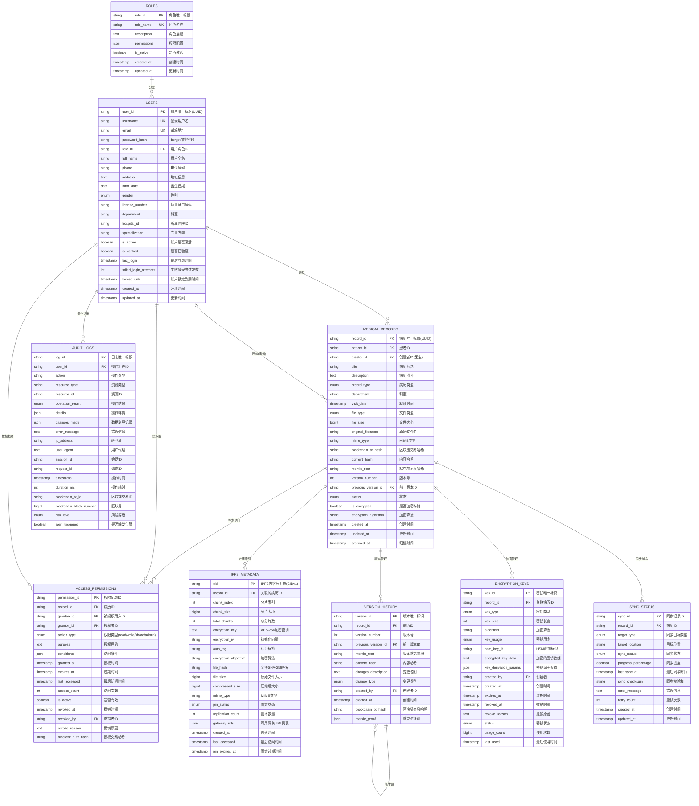
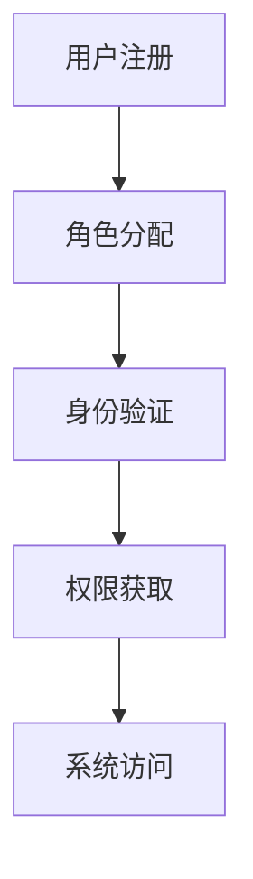
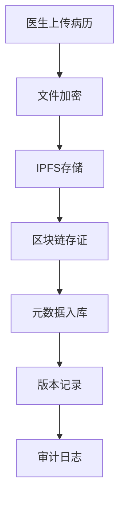
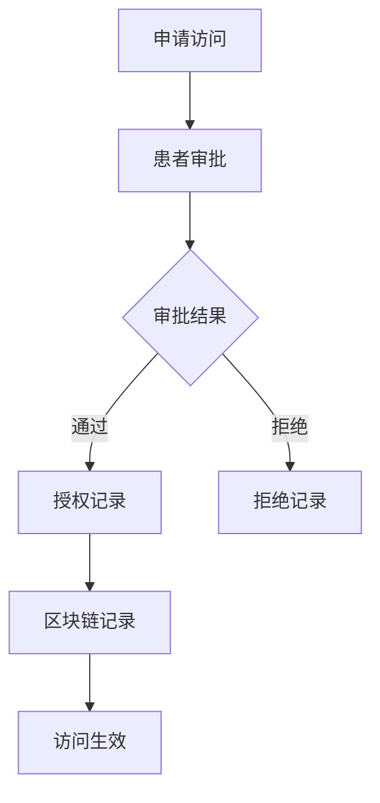
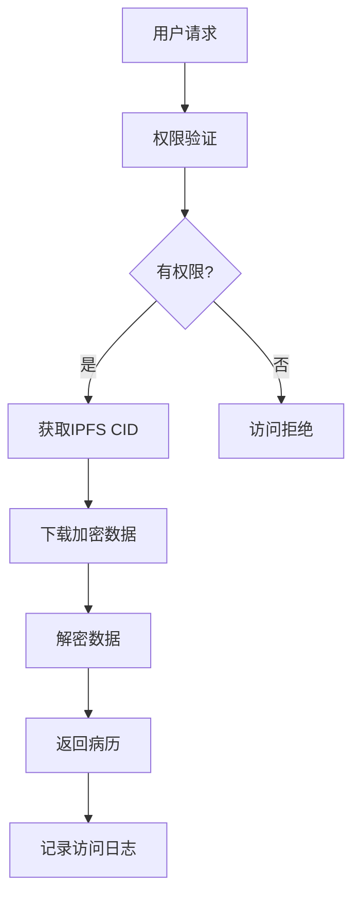

# 电子病历区块链系统 - 实体关系图 (ER Diagram)

## 系统架构概览

## 核心业务流程

### 1. 用户管理流程

### 2. 病历创建流程

### 3. 权限管理流程

### 4. 数据访问流程

## 数据完整性保证

### 1. 默克尔树验证

- 每个病历文件都有对应的默克尔根哈希
- 版本更新时重新计算默克尔树
- 支持数据完整性验证

### 2. 区块链存证

- 重要操作记录在区块链
- 不可篡改的操作历史
- 分布式共识验证

### 3. 加密存储

- 端到端AES-256-GCM加密
- HSM硬件安全模块密钥管理
- 分片存储降低风险

## 性能优化策略

### 1. 数据库优化

- 分区表存储（按时间）
- 复合索引优化查询
- 读写分离架构

### 2. 缓存策略

- 热点数据Redis缓存
- IPFS本地网关缓存
- 权限信息内存缓存

### 3. 分片存储

- IPFS文件分片存储
- 多副本冗余备份
- 就近访问加速

## 安全保障机制

### 1. 访问控制

- 基于角色的访问控制(RBAC)
- 基于属性的访问控制(ABAC)
- 时间和地点限制

### 2. 审计追踪

- 完整的操作日志
- 风险等级评估
- 异常行为检测

### 3. 数据保护

- 端到端加密传输
- 静态数据加密存储
- 密钥轮换管理

## 灾难恢复

### 1. 备份策略

- 定期数据库备份
- IPFS数据同步
- 异地备份存储

### 2. 故障恢复

- 多节点高可用
- 自动故障转移
- 数据一致性保证

### 3. 业务连续性

- 服务健康监控
- 自动扩缩容
- 降级保护机制
