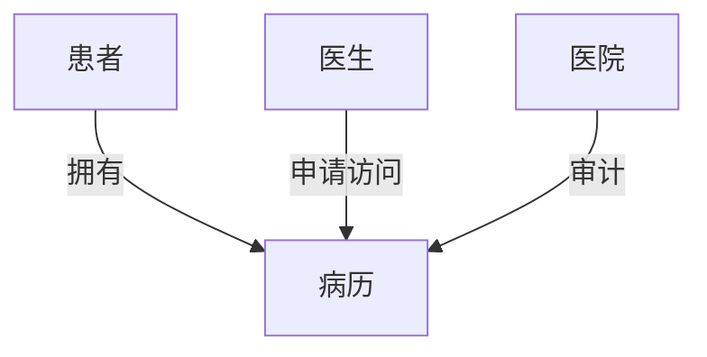

# 基于区块链电子病历共享系统设计书

## 1. 系统架构

### 1.1 整体架构图

```
[患者/医生/机构终端] ←REST API→ [业务逻辑层] ←智能合约→ [区块链网络]
                              ↓
                          [IPFS存储]
```

### 1.2 技术栈

- **区块链平台**：Hyperledger Fabric
- **分布式存储**：IPFS
- **加密算法**：SHA-256, AES-256
- **前端框架**：React.js
- **后端框架**：Node.js

## 2. 核心模块设计

### 2.1 区块链模块

**类结构：**

```python
class Blockchain:
    def __init__(self, channel_name, chaincode_name)
    def create_record(self, record_hash)
    def query_record(self, record_id)
    def grant_access(self, user_id, record_id)
```

### 2.2 数据存储模块

**IPFS接口设计：**

```typescript
interface IPFSInterface {
  uploadFile(content: Buffer): Promise<CID>;
  retrieveFile(cid: CID): Promise<Buffer>;
}
```

### 2.3 权限管理模块

**RBAC模型：**



### 2.4 病历管理模块

**数据结构：**

```json
{
  "record_id": "hash123",
  "patient_id": "pid456",
  "timestamp": 1672531200,
  "content_hash": "QmXyZ...",
  "access_list": ["doc789", "hosp012"]
}
```

## 3. 详细模块设计

### 3.1 用户服务模块

**接口：**

- `/api/v1/register` (POST)
- `/api/v1/login` (POST)
- `/api/v1/roles` (GET)

### 3.2 病历管理模块

**核心算法（默克尔树验证）：**

```python
def verify_merkle_proof(root_hash, target_hash, proof):
    current_hash = target_hash
    for node in proof:
        current_hash = sha256(node + current_hash)
    return current_hash == root_hash
```

### 3.3 查询模块

**加密搜索流程：**

1. 用户提交加密查询请求
2. 智能合约验证访问权限
3. 返回匹配的加密记录索引
4. 客户端本地解密

## 4. 核心类设计

### 4.1 MedicalRecord类

```java
public class MedicalRecord {
    private String recordId;
    private String patientId;
    private String encryptedData;
    private List<String> accessList;
    private LocalDateTime createTime;

    public void grantAccess(String userId) { ... }
    public void revokeAccess(String userId) { ... }
}
```

### 4.2 BlockchainService类

```typescript
class BlockchainService {
    async initializeChannel(): Promise<void> { ... }
    async invokeChaincode(method: string, args: string[]): Promise<any> { ... }
    async queryChaincode(method: string, args: string[]): Promise<any> { ... }
}
```

## 5. 视图设计

### 5.1 患者视图

```html
<div class="patient-dashboard">
  <div class="access-requests"></div>
  <div class="medical-history"></div>
  <div class="permission-control"></div>
</div>
```

### 5.2 医生视图

```jsx
function DoctorView() {
    return (
        <SearchBar onSearch={handleSearch} />
        <PatientRecordsTable data={filteredRecords} />
        <AccessRequestForm />
    )
}
```

## 6. 安全设计

### 6.1 加密方案

- **病历数据**：AES-256-GCM
- **传输层**：TLS 1.3
- **密钥管理**：HSM硬件模块

### 6.2 访问控制模型

```bnf
<policy> ::= (<entity> <operation> <resource>)
<entity> ::= "PATIENT:"<id> | "DOCTOR:"<id>
<operation> ::= "READ" | "WRITE" | "SHARE"
```

## 7. 智能合约设计

### 7.1 核心合约方法

```solidity
function grantAccess(address requester, bytes32 recordHash) public {
    require(msg.sender == records[recordHash].owner);
    accessList[recordHash].push(requester);
}
```

## 8. 性能优化

### 8.1 分层存储架构

- **高频访问数据** → 本地缓存
- **长期存档数据** → IPFS冷存储

## 9. 测试方案

### 9.1 测试用例矩阵

| 测试类型 | 覆盖率目标  | 工具   |
| -------- | ----------- | ------ |
| 单元测试 | 90%+        | Jest   |
| 性能测试 | 1000TPS     | JMeter |
| 安全测试 | OWASP Top10 | ZAP    |

---

# 基于区块链的电子病历共享系统的API详细规范文档和数据库ER图设计

## 一、API详细规范文档

_（遵循OpenAPI 3.0规范）_

### 1. 基础信息

```yaml
openapi: 3.0.0
info:
  title: 区块链电子病历共享系统API
  version: 1.0.0
  description: 包含用户管理、病历操作和权限控制的核心接口
servers:
  - url: https://api.emedchain.com/v1
```

### 2. 核心接口定义

#### 2.1 用户服务

| 端点                | 方法 | 描述                       | 认证 |
| ------------------- | ---- | -------------------------- | ---- |
| `/auth/register`    | POST | 用户注册（患者/医生/机构） | 无   |
| `/auth/login`       | POST | 用户登录（JWT令牌）        | 无   |
| `/users/{id}/roles` | GET  | 查询用户角色权限           | JWT  |

**请求/响应示例（注册）：**

```yaml
requestBody:
  application/json:
    schema:
      type: object
      properties:
        username: { type: string }
        password: { type: string }
        role: { enum: [patient, doctor, hospital] }
responses:
  201:
    description: 注册成功
    content:
      application/json:
        schema:
          type: object
          properties:
            userId: { type: string }
```

#### 2.2 病历管理

| 端点                         | 方法 | 描述                   | 认证 |
| ---------------------------- | ---- | ---------------------- | ---- |
| `/records`                   | POST | 上传新病历（IPFS哈希） | JWT  |
| `/records/{recordId}`        | GET  | 查询病历元数据         | JWT  |
| `/records/{recordId}/access` | PUT  | 更新访问权限列表       | JWT  |

请求/响应示例（上传病历）：requestBody: multipart/form-data: schema: type:
object properties: file: { type: string, format: binary } patientId: { type:
string } responses: 200: description: 返回区块链交易ID content:
application/json: schema: type: object properties: txId: { type: string }
ipfsCid: { type: string }

```

#### 2.3 权限验证

| 端点 | 方法 | 描述 |
|------|------|------|
| `/permissions/check` | POST | 验证用户对某病历的权限 |
请求参数：
{
  "userId": "doc_123",
  "recordId": "rec_456",
  "action": "read"
}
响应：
{
  "hasAccess": true,
  "expiresAt": "2024-12-31T23:59:59Z"
}
```

### 3. 错误码规范

| 状态码 | 描述               |
| ------ | ------------------ |
| 401    | 无效的JWT令牌      |
| 403    | 权限不足           |
| 404    | 病历不存在         |
| 500    | 区块链网络通信失败 |

二、数据库ER图

1.  核心实体关系图erDiagram USERS ||--o{ ROLES : "分配" USERS ||--o{
    MEDICAL_RECORDS : "拥有" MEDICAL_RECORDS ||--o{ ACCESS_PERMISSIONS :
    "权限控制" MEDICAL_RECORDS ||--|| IPFS_METADATA : "存储索引"
        USERS {
            string user_id PK
            string username
            string password_hash
            datetime created_at
        }

        ROLES {
            string role_id PK
            string role_name
        }

        MEDICAL_RECORDS {
            string record_id PK
            string patient_id FK
            string creator_id FK
            string blockchain_tx_hash
            datetime created_at
        }

        ACCESS_PERMISSIONS {
            string permission_id PK
            string record_id FK
            string grantee_id FK
            string action_type
            datetime expires_at
    }
2.  关键表结构说明 2.1 用户表 (USERS) 字段 类型 说明 user_id
    VARCHAR(36) 用户唯一标识（UUID）username
    VARCHAR(50) 登录用户名 password_hash CHAR(60) bcrypt加密密码 created_at
    TIMESTAMP 注册时间 2.2 病历表 (MEDICAL_RECORDS) 字段 类型 说明 record_id
    VARCHAR(36) 病历唯一标识（UUID）patient_id
    VARCHAR(36) 患者ID（关联USERS表）blockchain_tx_hash
    CHAR(64) 区块链交易哈希（SHA-256）2.3 权限表 (ACCESS_PERMISSIONS) 字段 类型 说明 permission_id
    VARCHAR(36) 权限记录ID record_id VARCHAR(36) 病历ID（外键）grantee_id
    VARCHAR(36) 被授权用户ID action_type ENUM('read') 权限类型（未来可扩展）2.4
    IPFS元数据表 (IPFS_METADATA) 字段 类型 说明 cid VARCHAR(46)
    IPFS内容标识符（CIDv1）record_id VARCHAR(36) 关联的病历ID encryption_key
    TEXT AES-256加密密钥（HSM托管）三、关键设计说明
3.  API安全设计JWT认证流程：sequenceDiagram用户->>API网关: POST /auth/login
    API网关->>区块链: 验证身份区块链-->>API网关: 返回签名JWT
    API网关->>用户: 返回JWT令牌用户->>业务服务: 携带JWT访问API
4.  数据库优化策略索引设计：MEDICAL_RECORDS.patient_id 创建B+Tree索引ACCESS_PERMISSIONS(record_id,
    grantee_id) 创建联合索引分区策略：按时间范围对MEDICAL_RECORDS表进行水平分区
5.  区块链与数据库协同数据一致性保证：def save_record(record_data): #
    Step1: 存储到IPFS ipfs_cid = ipfs_client.upload(record_data) #
    Step2: 写入区块链 tx_hash = blockchain.create_record(
    patient_id=current_user.id, content_hash=ipfs_cid )
        # Step3: 写入关系型数据库
        db.execute(
            "INSERT INTO medical_records VALUES (?, ?, ?)",
            (generate_uuid(), current_user.id, tx_hash)
        )

        IPFS_METADATA {
            string cid PK
            string record_id FK
            string encryption_key
            string file_size
        }

基于区块链病历共享系统模块总览

1. 模块分层架构┌───────────────┐
   │用户终端 │患者/医生/医院管理端└──────┬────────┘ ↓ ┌───────────────┐
   │业务逻辑层│API服务/权限控制/加密服务└──────┬────────┘ ↓ ┌───────────────┐
   │区块链层│智能合约/节点网络/共识机制└──────┬────────┘ ↓ ┌───────────────┐
   │存储层│ IPFS/关系型数据库/缓存└───────────────┘二、核心模块功能描述
1. 用户管理模块功能组件：身份认证JWT令牌生成与验证多因素认证（可选短信/生物识别）角色管理graph
   LR SUPER_ADMIN --> HOSPITAL_ADMIN HOSPITAL_ADMIN --> DOCTOR PATIENT -->
   SELF_DATA审计日志记录用户登录、敏感操作（符合HIPAA审计要求）技术实现：使用OAuth
   2.0协议实现机构间单点登录（SSO）RBAC（基于角色的访问控制）模型审计日志加密存储至区块链
1. 病历管理模块功能组件：子模块 功能描述病历创建 - 支持PDF/DICOM格式上传

- 自动生成SHA-256数据指纹加密存储 - 使用患者公钥进行AES-256加密
- IPFS分片存储（分块大小256KB）版本控制 - 基于Merkle Tree的版本追溯
- 每次修改生成新CID 访问控制 - 基于属性的动态权限控制（ABAC）
- 支持临时访问令牌（最长24小时有效期）关键流程：def create_medical_record(user,
  file): # 1. 数据加密encrypted_data = aes_encrypt(file, user.public_key)
      # 2. IPFS存储
      cid = ipfs_client.add(encrypted_data)

      # 3. 区块链存证
      tx_hash = blockchain.invoke_contract(
          method='createRecord',
          args=[user.id, cid, timestamp]
      )

      # 4. 本地元数据存储
      db.insert_record(
          record_id=generate_uuid(),
          patient_id=user.id,
          tx_hash=tx_hash,
          ipfs_cid=cid
  )

3. 区块链模块核心组件：组件 功能描述智能合约 - 包含病历存证、权限管理、审计追踪合约

- 使用Chaincode（Go语言实现）节点网络 - 基于Hyperledger Fabric的联盟链架构
- 医疗机构作为验证节点共识机制 - RAFT共识算法（容忍1/3节点故障）
- 交易确认时间<2秒跨链桥接 - 支持与其他医疗链的数据交互（预留设计）合约方法示例：// 病历访问控制智能合约 func
  (s \*SmartContract) GrantAccess(ctx contractapi.TransactionContextInterface,
  recordID string, granteeID string) error { // 验证调用者身份 caller :=
  ctx.GetClientIdentity() if !validateOwner(caller, recordID) { return
  fmt.Errorf("access denied") }
      // 更新权限列表
      accessList := getAccessList(recordID)
      accessList[granteeID] = time.Now().Add(24*time.Hour)
      return ctx.GetStub().PutState(recordID, marshalData(accessList))
  }

4. 数据存储模块分层存储设计：┌───────────────┐ │热数据│
   Redis缓存最近访问记录（LRU策略）├───────────────┤ │温数据│
   MySQL关系型数据库（存储元数据）├───────────────┤
   │冷数据│IPFS分布式存储（病历本体）└───────────────┘关键技术点：IPFS优化：使用Cluster实现数据自动复制（默认3副本）Pin
   Service防止垃圾回收数据库设计：采用Sharding分片策略（按患者ID哈希分片）时间序列数据使用TimescaleDB扩展
5. 权限控制模块动态访问控制流程：sequenceDiagram医生->>系统: 请求访问病历123系统->>区块链: 查询权限合约区块链-->>系统: 返回权限状态系统->>系统: 验证时效性/范围alt 有权限系统->>IPFS: 获取加密数据IPFS-->>系统: 返回加密内容系统->>医生: 解密数据并展示else 无权限系统->>医生: 发起访问申请患者->>系统: 审批请求系统->>区块链: 更新权限合约End策略引擎：支持基于属性的策略（ABAC）：{
   "effect": "allow", "resource": "records:\*", "action": "read", "conditions":
   [ { "type": "time", "range": ["09:00", "17:00"] }, { "type": "location",
   "ip_range": ["192.168.1.0/24"] } ] }
6. 辅助功能模块 6.1 审计追踪区块链不可篡改日志操作类型包括：病历创建/修改权限变更数据访问记录 6.2 通知服务实时WebSocket通知：新访问请求提醒权限变更确认系统警报（异常访问检测）6.3 数据分析联邦学习接口：def
   federated_analysis(encrypted_models): # 在本地加密数据上训练模型 local_model
   = train(encrypted_data) # 安全聚合全局模型 global_model =
   secure_aggregation([local_model]) return
   global_model三、跨模块协作示例病历共享完整流程：医生发起请求：POST
   /records/access-requests { "recordId": "rec_789", "purpose": "诊疗需要"
   } 患者审批：// 智能合约触发事件contract.on('AccessGranted', (from, recordId)
   => { sendSMS(`新权限授予：${from}可访问病历${recordId}`);
   }); 数据访问：// 客户端请求GET /records/rec_789 // 服务器响应 { "data":
   "加密后的病历数据", "key": "用于解密的会话密钥" }
