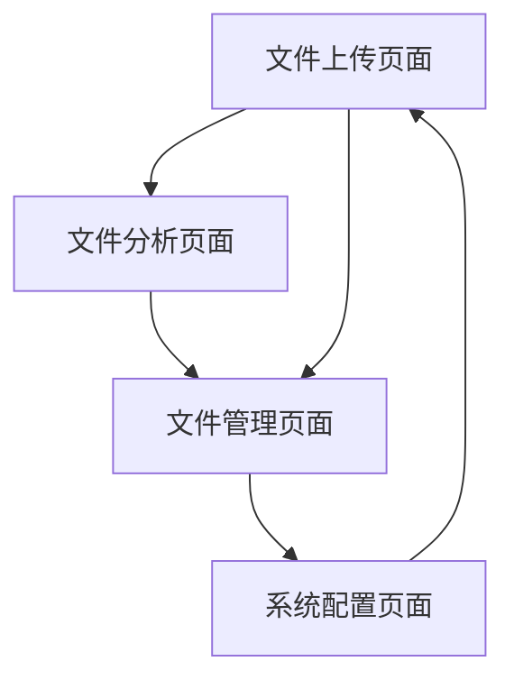
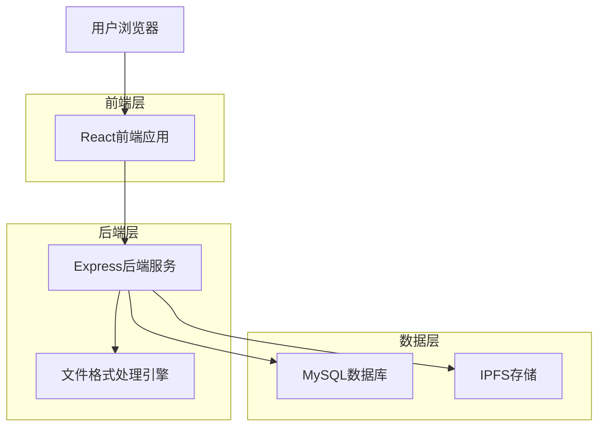
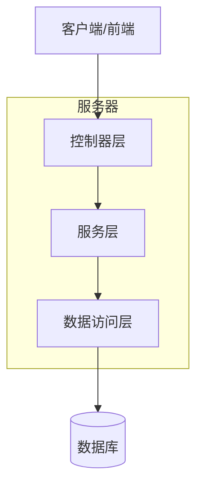
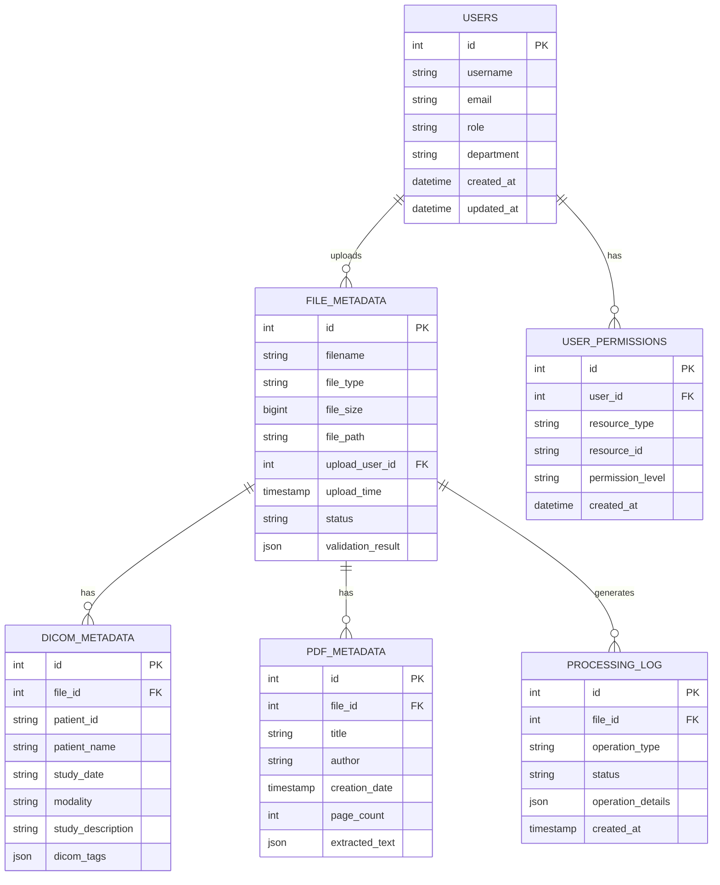

# 医学文件格式支持技术设计文档

## 1. 产品概述

本模块实现医学文件格式处理系统，支持DICOM医学影像和PDF文档的解析、验证和元数据提取，为医疗数据管理平台提供专业的文件处理能力。

## 2. 核心功能

### 2.1 用户角色

| 角色   | 注册方式           | 核心权限                                     |
| ------ | ------------------ | -------------------------------------------- |
| 医生   | 医院系统集成       | 可上传、查看、分析所有医学文件，创建诊断报告 |
| 管理员 | 系统管理员分配     | 可管理用户、配置系统、查看所有数据和日志     |
| 患者   | 邮箱注册或医院分配 | 只能查看自己的医学文件和报告                 |

### 2.2 功能模块

本系统包含以下核心页面：

1. **文件上传页面**: 文件选择器、格式检测、上传进度
2. **文件分析页面**: 元数据展示、验证结果、处理状态
3. **文件管理页面**: 文件列表、搜索过滤、批量操作
4. **系统配置页面**: 格式设置、验证规则、性能参数

### 2.3 页面详情

| 页面名称     | 模块名称   | 功能描述                             |
| ------------ | ---------- | ------------------------------------ |
| 文件上传页面 | 文件选择器 | 支持拖拽上传、多文件选择、格式预检测 |
| 文件上传页面 | 上传进度   | 实时显示上传进度、错误提示、取消操作 |
| 文件分析页面 | 元数据展示 | 结构化显示DICOM/PDF元数据、支持导出  |
| 文件分析页面 | 验证结果   | 显示文件完整性、合规性检查结果       |
| 文件管理页面 | 文件列表   | 分页显示、排序、筛选、搜索功能       |
| 文件管理页面 | 批量操作   | 批量下载、删除、元数据导出           |
| 系统配置页面 | 格式设置   | 支持的文件格式配置、大小限制设置     |
| 系统配置页面 | 验证规则   | DICOM标准配置、PDF安全策略设置       |

## 3. 核心流程

### 管理员流程

1. 登录系统 → 系统配置页面 → 设置文件格式规则 → 配置验证策略
2. 系统配置页面 → 监控处理性能 → 调整系统参数

### 医生流程

1. 登录系统 → 文件上传页面 → 选择医学文件 → 自动格式检测 → 确认上传
2. 文件分析页面 → 查看元数据 → 验证文件完整性 → 导出报告
3. 文件管理页面 → 搜索历史文件 → 批量操作



## 4. 用户界面设计

### 4.1 设计风格

- **主色调**: #2563EB (医疗蓝), #F8FAFC (背景灰)
- **辅助色**: #10B981 (成功绿), #EF4444 (错误红), #F59E0B (警告橙)
- **按钮样式**: 圆角8px，渐变效果，悬停状态变化
- **字体**: Inter 14px (正文), Inter 16px (标题), Monaco 12px (代码)
- **布局风格**: 卡片式设计，左侧导航，响应式网格布局
- **图标风格**: Heroicons线性图标，医疗主题图标集

### 4.2 页面设计概览

| 页面名称     | 模块名称   | UI元素                                         |
| ------------ | ---------- | ---------------------------------------------- |
| 文件上传页面 | 文件选择器 | 拖拽区域(虚线边框)、文件图标、进度条、格式标签 |
| 文件分析页面 | 元数据展示 | 表格组件、JSON树形展示、复制按钮、导出按钮     |
| 文件管理页面 | 文件列表   | 数据表格、分页器、搜索框、筛选下拉框           |
| 系统配置页面 | 格式设置   | 开关组件、输入框、滑块、配置卡片               |

### 4.3 响应式设计

- **桌面优先**: 1200px+宽屏布局，三栏式设计
- **移动适配**: 768px以下单栏布局，触摸优化
- **触摸交互**: 文件拖拽、手势缩放、长按菜单

## 5. 技术架构

### 5.1 架构设计



### 5.2 技术描述

- **前端**: React@18 + TypeScript + TailwindCSS + Vite
- **后端**: Express@4 + TypeScript + Multer + Sharp
- **数据库**: MySQL
- **文件存储**: IPFS + 本地缓存
- **文件处理**: dcmjs (DICOM) + pdf-parse (PDF)

### 5.3 路由定义

| 路由              | 用途                                   |
| ----------------- | -------------------------------------- |
| /upload           | 文件上传页面，支持多文件上传和格式检测 |
| /analysis/:fileId | 文件分析页面，显示详细元数据和验证结果 |
| /files            | 文件管理页面，文件列表和批量操作       |
| /settings         | 系统配置页面，格式规则和验证策略设置   |

### 5.4 API定义

#### 4.1 核心API

**文件上传接口**

```
POST /api/v1/files/upload
```

请求: | 参数名称 | 参数类型 | 是否必需 | 描述 |
|----------|----------|----------|------| | file | File | true
| 上传的文件对象 | | metadata | object | false | 额外的元数据信息 |

响应: | 参数名称 | 参数类型 | 描述 | |----------|----------|------| | fileId |
string | 文件唯一标识符 | | status | string | 处理状态 | | detectedFormat |
string | 检测到的文件格式 |

示例:

```json
{
  "fileId": "f47ac10b-58cc-4372-a567-0e02b2c3d479",
  "status": "processing",
  "detectedFormat": "DICOM"
}
```

**文件分析接口**

```
POST /api/v1/files/analyze
```

请求: | 参数名称 | 参数类型 | 是否必需 | 描述 |
|----------|----------|----------|------| | fileId | string | true | 文件ID | |
analysisType | string | true | 分析类型(metadata/validation/full) |

响应: | 参数名称 | 参数类型 | 描述 | |----------|----------|------| | metadata |
object | 提取的元数据 | | validation | object | 验证结果 | | processingTime |
number | 处理耗时(ms) |

**文件验证接口**

```
POST /api/v1/files/validate
```

**元数据查询接口**

```
GET /api/v1/files/{id}/metadata
```

### 5.5 服务器架构图



### 5.6 数据模型

#### 6.1 数据模型定义



#### 6.2 数据定义语言

**用户表 (users)**

```sql
-- 创建用户表
CREATE TABLE users (
    id INT AUTO_INCREMENT PRIMARY KEY,
    username VARCHAR(50) UNIQUE NOT NULL,
    email VARCHAR(100) UNIQUE NOT NULL,
    password_hash VARCHAR(255) NOT NULL,
    role ENUM('doctor', 'administrator', 'patient') NOT NULL DEFAULT 'patient',
    department VARCHAR(100),
    full_name VARCHAR(100) NOT NULL,
    phone VARCHAR(20),
    is_active BOOLEAN DEFAULT TRUE,
    created_at TIMESTAMP DEFAULT CURRENT_TIMESTAMP,
    updated_at TIMESTAMP DEFAULT CURRENT_TIMESTAMP ON UPDATE CURRENT_TIMESTAMP
);

-- 创建索引
CREATE INDEX idx_users_role ON users(role);
CREATE INDEX idx_users_department ON users(department);
CREATE INDEX idx_users_email ON users(email);
```

**文件元数据表 (file_metadata)**

```sql
-- 创建表
CREATE TABLE file_metadata (
    id INT AUTO_INCREMENT PRIMARY KEY,
    filename VARCHAR(255) NOT NULL,
    file_type VARCHAR(50) NOT NULL,
    file_size BIGINT NOT NULL,
    file_path VARCHAR(500) NOT NULL,
    upload_user_id INT NOT NULL,
    upload_time TIMESTAMP DEFAULT CURRENT_TIMESTAMP,
    status VARCHAR(50) DEFAULT 'pending',
    validation_result JSON,
    created_at TIMESTAMP DEFAULT CURRENT_TIMESTAMP,
    updated_at TIMESTAMP DEFAULT CURRENT_TIMESTAMP ON UPDATE CURRENT_TIMESTAMP,
    FOREIGN KEY (upload_user_id) REFERENCES users(id) ON DELETE CASCADE
);

-- 创建索引
CREATE INDEX idx_file_metadata_user_id ON file_metadata(upload_user_id);
CREATE INDEX idx_file_metadata_file_type ON file_metadata(file_type);
CREATE INDEX idx_file_metadata_status ON file_metadata(status);
CREATE INDEX idx_file_metadata_upload_time ON file_metadata(upload_time DESC);
```

**DICOM元数据表 (dicom_metadata)**

```sql
-- 创建表
CREATE TABLE dicom_metadata (
    id INT AUTO_INCREMENT PRIMARY KEY,
    file_id INT NOT NULL,
    patient_id VARCHAR(100),
    patient_name VARCHAR(255),
    study_date DATE,
    study_time TIME,
    modality VARCHAR(10),
    study_description TEXT,
    series_description TEXT,
    dicom_tags JSON,
    created_at TIMESTAMP DEFAULT CURRENT_TIMESTAMP,
    FOREIGN KEY (file_id) REFERENCES file_metadata(id) ON DELETE CASCADE
);

-- 创建索引
CREATE INDEX idx_dicom_metadata_file_id ON dicom_metadata(file_id);
CREATE INDEX idx_dicom_metadata_patient_id ON dicom_metadata(patient_id);
CREATE INDEX idx_dicom_metadata_study_date ON dicom_metadata(study_date);
CREATE INDEX idx_dicom_metadata_modality ON dicom_metadata(modality);
```

**PDF元数据表 (pdf_metadata)**

```sql
-- 创建表
CREATE TABLE pdf_metadata (
    id INT AUTO_INCREMENT PRIMARY KEY,
    file_id INT NOT NULL,
    title VARCHAR(500),
    author VARCHAR(255),
    subject VARCHAR(500),
    creation_date TIMESTAMP,
    modification_date TIMESTAMP,
    page_count INTEGER,
    extracted_text TEXT,
    metadata_json JSON,
    created_at TIMESTAMP DEFAULT CURRENT_TIMESTAMP,
    FOREIGN KEY (file_id) REFERENCES file_metadata(id) ON DELETE CASCADE
);

-- 创建索引
CREATE INDEX idx_pdf_metadata_file_id ON pdf_metadata(file_id);
CREATE INDEX idx_pdf_metadata_title ON pdf_metadata(title);
CREATE INDEX idx_pdf_metadata_author ON pdf_metadata(author);
CREATE INDEX idx_pdf_metadata_creation_date ON pdf_metadata(creation_date);
```

**处理日志表 (processing_log)**

```sql
-- 创建表
CREATE TABLE processing_log (
    id INT AUTO_INCREMENT PRIMARY KEY,
    file_id INT NOT NULL,
    operation_type VARCHAR(100) NOT NULL,
    status VARCHAR(50) NOT NULL,
    operation_details JSON,
    error_message TEXT,
    processing_time_ms INTEGER,
    created_at TIMESTAMP DEFAULT CURRENT_TIMESTAMP,
    FOREIGN KEY (file_id) REFERENCES file_metadata(id) ON DELETE CASCADE
);

-- 创建索引
CREATE INDEX idx_processing_log_file_id ON processing_log(file_id);
CREATE INDEX idx_processing_log_operation_type ON processing_log(operation_type);
CREATE INDEX idx_processing_log_status ON processing_log(status);
CREATE INDEX idx_processing_log_created_at ON processing_log(created_at DESC);
```

**用户权限表 (user_permissions)**

```sql
-- 创建用户权限表
CREATE TABLE user_permissions (
    id INT AUTO_INCREMENT PRIMARY KEY,
    user_id INT NOT NULL,
    resource_type ENUM('file', 'patient', 'study', 'system') NOT NULL,
    resource_id VARCHAR(255) NOT NULL,
    permission_level ENUM('read', 'write', 'admin') NOT NULL DEFAULT 'read',
    granted_by INT,
    granted_at TIMESTAMP DEFAULT CURRENT_TIMESTAMP,
    expires_at TIMESTAMP NULL,
    FOREIGN KEY (user_id) REFERENCES users(id) ON DELETE CASCADE,
    FOREIGN KEY (granted_by) REFERENCES users(id) ON DELETE SET NULL
);

-- 创建索引
CREATE INDEX idx_permissions_user_id ON user_permissions(user_id);
CREATE INDEX idx_permissions_resource ON user_permissions(resource_type, resource_id);
CREATE INDEX idx_permissions_level ON user_permissions(permission_level);

-- 初始数据
INSERT INTO users (username, email, password_hash, role, department, full_name) VALUES
('admin', 'admin@hospital.com', '$2b$12$hash_here', 'administrator', 'IT部门', '系统管理员'),
('dr_zhang', 'zhang@hospital.com', '$2b$12$hash_here', 'doctor', '放射科', '张医生'),
('patient001', 'patient@email.com', '$2b$12$hash_here', 'patient', NULL, '患者张三');

INSERT INTO file_metadata (filename, file_type, file_size, file_path, upload_user_id, status)
VALUES
('sample_ct_scan.dcm', 'DICOM', 2048576, '/uploads/dicom/sample_ct_scan.dcm', 2, 'validated'),
('medical_report.pdf', 'PDF', 1024000, '/uploads/pdf/medical_report.pdf', 2, 'validated');
```

## 6. 实现步骤

### 阶段1: 基础架构搭建 (1-2天)

1. 创建项目结构和依赖配置
2. 设置数据库表结构
3. 实现基础的文件上传接口
4. 配置IPFS存储连接

### 阶段2: 文件格式检测 (1天)

1. 实现文件头部检测算法
2. 添加MIME类型验证
3. 创建格式检测服务
4. 编写单元测试

### 阶段3: DICOM处理引擎 (2-3天)

1. 集成dcmjs库
2. 实现DICOM元数据提取
3. 添加DICOM验证功能
4. 处理各种DICOM传输语法

### 阶段4: PDF处理引擎 (1-2天)

1. 集成pdf-parse库
2. 实现PDF元数据提取
3. 添加PDF安全检查
4. 支持加密PDF处理

### 阶段5: 前端界面开发 (2天)

1. 创建文件上传组件
2. 实现元数据展示界面
3. 添加文件管理功能
4. 优化用户体验

## 7. 风险评估

### 高风险项

- **DICOM标准复杂性**: DICOM标准包含大量可选字段和传输语法，需要充分测试
- **大文件处理性能**: 医学影像文件通常较大，需要优化内存使用和处理速度

### 中风险项

- **文件格式兼容性**: 不同设备生成的文件可能存在格式差异
- **安全性要求**: 医疗文件包含敏感信息，需要严格的安全控制

### 低风险项

- **PDF处理**: PDF格式相对标准化，处理难度较低
- **基础文件操作**: 文件上传、存储等为成熟技术

### 风险缓解措施

1. **充分测试**: 收集各种设备的样本文件进行测试
2. **性能监控**: 实时监控处理性能，及时优化
3. **错误处理**: 完善的错误处理和日志记录机制
4. **安全审计**: 定期进行安全审计和漏洞扫描

## 8. 性能指标

- **文件上传速度**: 支持100MB/s的上传速度
- **元数据提取时间**: DICOM文件<2秒，PDF文件<1秒
- **并发处理能力**: 支持50个并发文件处理
- **存储效率**: IPFS分块存储，去重率>30%
- **可用性**: 99.9%系统可用性

## 9. 监控和日志

- **处理日志**: 记录每个文件的处理过程和结果
- **性能监控**: 监控处理时间、内存使用、错误率
- **安全日志**: 记录文件访问、权限变更等安全事件
- **告警机制**: 处理失败、性能异常时自动告警
