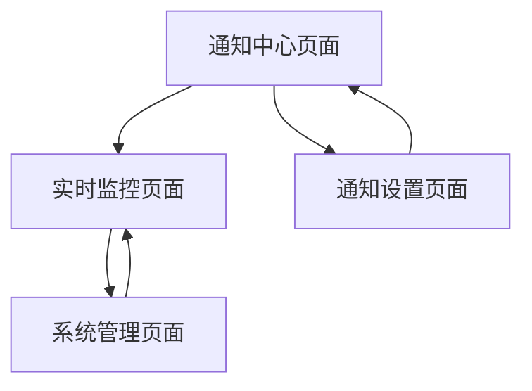
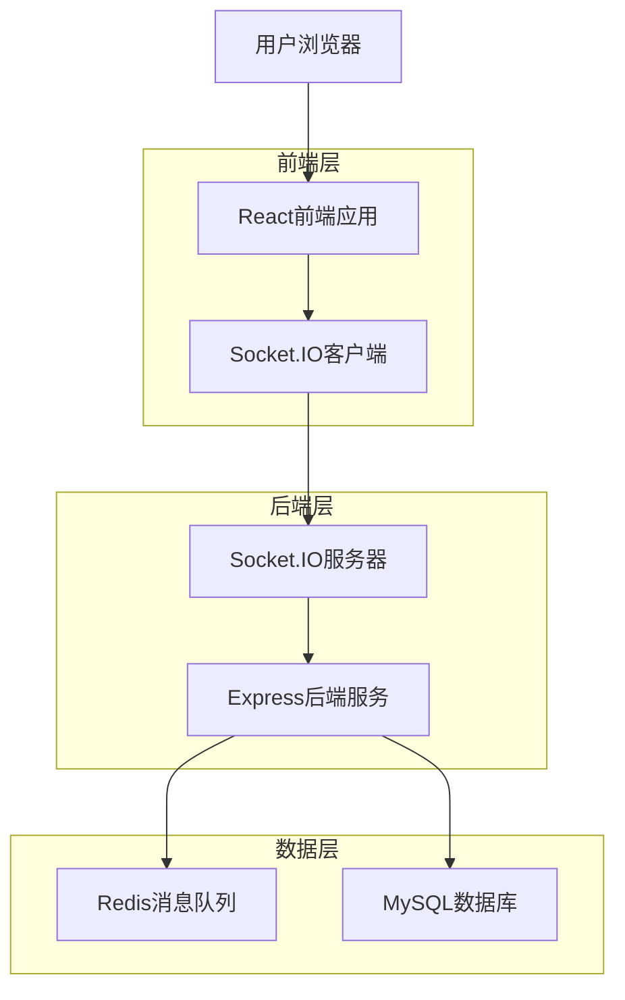
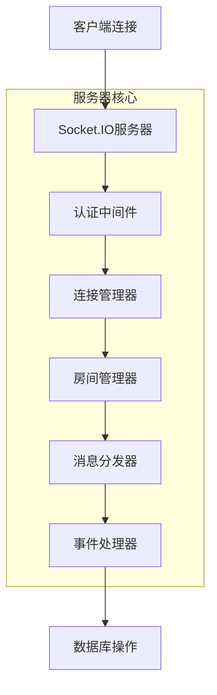
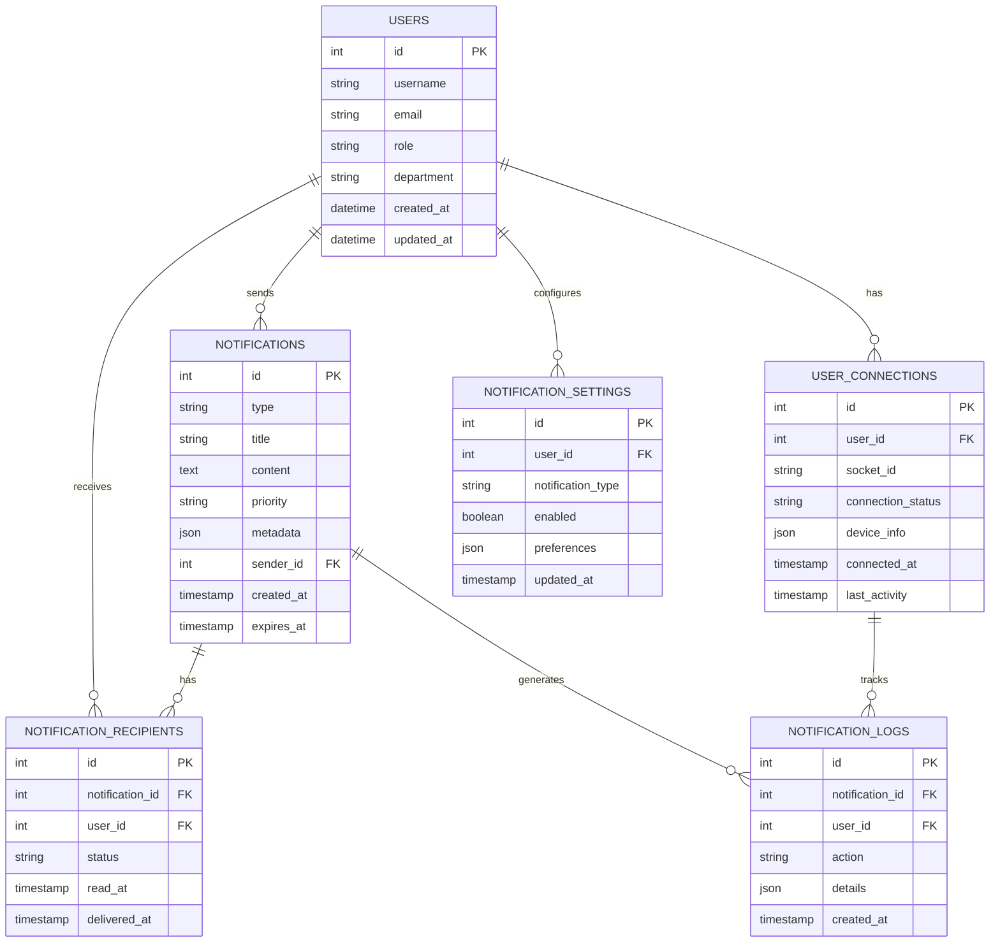

# WebSocket实时通知系统技术设计文档

## 1. 产品概述

本模块实现基于WebSocket的实时通知系统，支持医疗记录状态变更、权限更新、系统事件的即时推送，为医疗数据管理平台提供实时通信能力。

## 2. 核心功能

### 2.1 用户角色

| 角色   | 注册方式           | 核心权限                                               |
| ------ | ------------------ | ------------------------------------------------------ |
| 医生   | 医院系统集成       | 可接收患者相关通知，发送医嘱通知，查看所有患者通知历史 |
| 管理员 | 系统管理员分配     | 可管理通知配置，查看系统通知状态，管理所有用户通知权限 |
| 患者   | 邮箱注册或医院分配 | 只能接收自己的检查结果、预约提醒等通知                 |

### 2.2 功能模块

本系统包含以下核心页面：

1. **通知中心页面**: 通知列表、状态管理、历史记录
2. **实时监控页面**: 连接状态、消息统计、性能监控
3. **通知设置页面**: 订阅管理、推送规则、免打扰设置
4. **系统管理页面**: 连接管理、消息队列、性能调优

### 2.3 页面详情

| 页面名称     | 模块名称 | 功能描述                                 |
| ------------ | -------- | ---------------------------------------- |
| 通知中心页面 | 通知列表 | 实时显示通知消息、支持分类筛选、标记已读 |
| 通知中心页面 | 状态管理 | 通知状态切换、批量操作、优先级排序       |
| 实时监控页面 | 连接状态 | 显示WebSocket连接状态、重连机制          |
| 实时监控页面 | 消息统计 | 实时消息数量、发送成功率、延迟统计       |
| 通知设置页面 | 订阅管理 | 选择通知类型、设置接收条件               |
| 通知设置页面 | 推送规则 | 自定义推送规则、时间段设置               |
| 系统管理页面 | 连接管理 | 查看在线用户、强制断开、连接统计         |
| 系统管理页面 | 消息队列 | 队列状态监控、消息重发、性能调优         |

## 3. 核心流程

### 医生流程

1. 登录系统 → 自动建立WebSocket连接 → 接收患者记录更新通知
2. 通知中心页面 → 查看通知详情 → 标记已读或执行相关操作
3. 通知设置页面 → 配置接收规则 → 设置免打扰时间

### 管理员流程

1. 登录系统 → 实时监控页面 → 查看系统状态和连接统计
2. 系统管理页面 → 管理用户连接 → 监控消息队列性能
3. 发送系统通知 → 选择目标用户 → 实时推送消息

### 患者流程

1. 登录系统 → 建立连接 → 接收记录访问通知
2. 通知中心页面 → 查看谁访问了我的记录 → 管理授权权限



## 4. 用户界面设计

### 4.1 设计风格

- **主色调**: #3B82F6 (通知蓝), #F1F5F9 (背景灰)
- **辅助色**: #10B981 (在线绿), #EF4444 (紧急红), #F59E0B (警告橙), #6B7280
  (文本灰)
- **按钮样式**: 圆角6px，微阴影效果，动画过渡
- **字体**: Inter 14px (正文), Inter 16px (标题), Inter 12px (时间戳)
- **布局风格**: 卡片式通知，右侧滑出面板，顶部通知栏
- **图标风格**: Heroicons实心图标，状态指示器，动画效果

### 4.2 页面设计概览

| 页面名称     | 模块名称 | UI元素                               |
| ------------ | -------- | ------------------------------------ |
| 通知中心页面 | 通知列表 | 通知卡片、时间轴、状态徽章、操作按钮 |
| 实时监控页面 | 连接状态 | 状态指示灯、连接图表、实时数据面板   |
| 通知设置页面 | 订阅管理 | 开关组件、标签选择器、时间选择器     |
| 系统管理页面 | 连接管理 | 用户列表、连接状态表、操作工具栏     |

### 4.3 响应式设计

- **桌面优先**: 1200px+宽屏布局，侧边栏通知面板
- **移动适配**: 768px以下全屏通知页面，底部导航
- **实时更新**: 无刷新页面更新，平滑动画过渡

## 5. 技术架构

### 5.1 架构设计



### 5.2 技术描述

- **前端**: React@18 + TypeScript + Socket.IO-client + TailwindCSS
- **后端**: Express@4 + Socket.IO + TypeScript + JWT认证
- **消息队列**: Redis + Bull队列
- **数据库**: MySQL
- **实时通信**: Socket.IO + WebSocket协议

### 5.3 路由定义

| 路由                    | 用途                           |
| ----------------------- | ------------------------------ |
| /notifications          | 通知中心页面，显示所有通知消息 |
| /notifications/settings | 通知设置页面，配置接收规则     |
| /admin/realtime         | 实时监控页面，系统状态监控     |
| /admin/connections      | 连接管理页面，用户连接管理     |

### 5.4 API定义

#### 4.1 核心API

**WebSocket连接认证**

```
WS /socket.io/?token={jwt_token}
```

连接参数: | 参数名称 | 参数类型 | 是否必需 | 描述 |
|----------|----------|----------|------| | token | string | true |
JWT认证令牌 | | userId | string | true | 用户唯一标识 | | role | string | true
| 用户角色 |

**发送通知接口**

```
POST /api/v1/notifications/send
```

请求: | 参数名称 | 参数类型 | 是否必需 | 描述 |
|----------|----------|----------|------| | recipients | array | true
| 接收者用户ID列表 | | type | string | true | 通知类型 | | title | string | true
| 通知标题 | | content | string | true | 通知内容 | | priority | string | false
| 优先级(low/normal/high/urgent) | | metadata | object | false | 附加元数据 |

响应: | 参数名称 | 参数类型 | 描述 | |----------|----------|------| |
notificationId | string | 通知唯一标识 | | status | string | 发送状态 | |
deliveredCount | number | 成功投递数量 |

示例:

```json
{
  "recipients": ["user123", "user456"],
  "type": "RECORD_UPDATED",
  "title": "患者记录已更新",
  "content": "患者张三的检查报告已上传",
  "priority": "normal",
  "metadata": {
    "patientId": "patient789",
    "recordType": "lab_report"
  }
}
```

**获取通知历史**

```
GET /api/v1/notifications/history
```

请求参数: | 参数名称 | 参数类型 | 是否必需 | 描述 |
|----------|----------|----------|------| | page | number | false | 页码，默认1
| | limit | number | false | 每页数量，默认20 | | type | string | false
| 通知类型筛选 | | status | string | false | 状态筛选(unread/read/archived) |

**标记通知状态**

```
PUT /api/v1/notifications/{id}/status
```

**获取连接统计**

```
GET /api/v1/admin/connections/stats
```

### 5.5 WebSocket事件定义

#### 客户端事件

```typescript
interface ClientEvents {
  // 连接事件
  connect: () => void;
  disconnect: () => void;
  reconnect: () => void;

  // 订阅事件
  subscribe: (rooms: string[]) => void;
  unsubscribe: (rooms: string[]) => void;

  // 状态事件
  mark_read: (notificationId: string) => void;
  typing: (data: TypingData) => void;
}
```

#### 服务器事件

```typescript
interface ServerEvents {
  // 通知事件
  notification: (data: NotificationData) => void;
  notification_read: (notificationId: string) => void;

  // 系统事件
  system_alert: (data: SystemAlert) => void;
  user_online: (userId: string) => void;
  user_offline: (userId: string) => void;

  // 医疗记录事件
  record_created: (data: RecordEvent) => void;
  record_updated: (data: RecordEvent) => void;
  record_accessed: (data: AccessEvent) => void;

  // 权限事件
  permission_granted: (data: PermissionEvent) => void;
  permission_revoked: (data: PermissionEvent) => void;
}
```

### 5.6 服务器架构图



### 5.7 数据模型

#### 6.1 数据模型定义



#### 6.2 数据定义语言

**用户表 (users)**

```sql
-- 创建用户表
CREATE TABLE users (
    id INT AUTO_INCREMENT PRIMARY KEY,
    username VARCHAR(50) UNIQUE NOT NULL,
    email VARCHAR(100) UNIQUE NOT NULL,
    password_hash VARCHAR(255) NOT NULL,
    role ENUM('doctor', 'administrator', 'patient') NOT NULL DEFAULT 'patient',
    department VARCHAR(100),
    full_name VARCHAR(100) NOT NULL,
    phone VARCHAR(20),
    is_active BOOLEAN DEFAULT TRUE,
    created_at TIMESTAMP DEFAULT CURRENT_TIMESTAMP,
    updated_at TIMESTAMP DEFAULT CURRENT_TIMESTAMP ON UPDATE CURRENT_TIMESTAMP
);

-- 创建索引
CREATE INDEX idx_users_role ON users(role);
CREATE INDEX idx_users_department ON users(department);
CREATE INDEX idx_users_email ON users(email);
```

**通知表 (notifications)**

```sql
-- 创建表
CREATE TABLE notifications (
    id INT AUTO_INCREMENT PRIMARY KEY,
    type VARCHAR(50) NOT NULL,
    title VARCHAR(255) NOT NULL,
    content TEXT NOT NULL,
    priority ENUM('low', 'normal', 'high', 'urgent') DEFAULT 'normal',
    metadata JSON,
    sender_id INT,
    created_at TIMESTAMP DEFAULT CURRENT_TIMESTAMP,
    expires_at TIMESTAMP,
    updated_at TIMESTAMP DEFAULT CURRENT_TIMESTAMP ON UPDATE CURRENT_TIMESTAMP,
    FOREIGN KEY (sender_id) REFERENCES users(id) ON DELETE SET NULL
);

-- 创建索引
CREATE INDEX idx_notifications_type ON notifications(type);
CREATE INDEX idx_notifications_priority ON notifications(priority);
CREATE INDEX idx_notifications_created_at ON notifications(created_at DESC);
CREATE INDEX idx_notifications_sender_id ON notifications(sender_id);
CREATE INDEX idx_notifications_expires_at ON notifications(expires_at);
```

**通知接收者表 (notification_recipients)**

```sql
-- 创建表
CREATE TABLE notification_recipients (
    id INT AUTO_INCREMENT PRIMARY KEY,
    notification_id INT NOT NULL,
    user_id INT NOT NULL,
    status ENUM('pending', 'delivered', 'read', 'failed') DEFAULT 'pending',
    read_at TIMESTAMP NULL,
    delivered_at TIMESTAMP NULL,
    created_at TIMESTAMP DEFAULT CURRENT_TIMESTAMP,
    FOREIGN KEY (notification_id) REFERENCES notifications(id) ON DELETE CASCADE,
    FOREIGN KEY (user_id) REFERENCES users(id) ON DELETE CASCADE
);

-- 创建索引
CREATE INDEX idx_recipients_notification_id ON notification_recipients(notification_id);
CREATE INDEX idx_recipients_user_id ON notification_recipients(user_id);
CREATE INDEX idx_recipients_status ON notification_recipients(status);
CREATE INDEX idx_recipients_read_at ON notification_recipients(read_at);
```

**用户连接表 (user_connections)**

```sql
-- 创建表
CREATE TABLE user_connections (
    id INT AUTO_INCREMENT PRIMARY KEY,
    user_id INT NOT NULL,
    socket_id VARCHAR(255) NOT NULL,
    connection_status ENUM('connected', 'disconnected', 'idle') DEFAULT 'connected',
    device_info JSON,
    ip_address VARCHAR(45),
    user_agent TEXT,
    connected_at TIMESTAMP DEFAULT CURRENT_TIMESTAMP,
    last_activity TIMESTAMP DEFAULT CURRENT_TIMESTAMP ON UPDATE CURRENT_TIMESTAMP,
    disconnected_at TIMESTAMP NULL,
    FOREIGN KEY (user_id) REFERENCES users(id) ON DELETE CASCADE
);

-- 创建索引
CREATE INDEX idx_connections_user_id ON user_connections(user_id);
CREATE INDEX idx_connections_socket_id ON user_connections(socket_id);
CREATE INDEX idx_connections_status ON user_connections(connection_status);
CREATE INDEX idx_connections_last_activity ON user_connections(last_activity DESC);
```

**通知日志表 (notification_logs)**

```sql
-- 创建表
CREATE TABLE notification_logs (
    id INT AUTO_INCREMENT PRIMARY KEY,
    notification_id INT NOT NULL,
    user_id INT NOT NULL,
    action ENUM('sent', 'delivered', 'read', 'failed', 'expired') NOT NULL,
    details JSON,
    ip_address VARCHAR(45),
    user_agent TEXT,
    created_at TIMESTAMP DEFAULT CURRENT_TIMESTAMP,
    FOREIGN KEY (notification_id) REFERENCES notifications(id) ON DELETE CASCADE,
    FOREIGN KEY (user_id) REFERENCES users(id) ON DELETE CASCADE
);

-- 创建索引
CREATE INDEX idx_logs_notification_id ON notification_logs(notification_id);
CREATE INDEX idx_logs_user_id ON notification_logs(user_id);
CREATE INDEX idx_logs_action ON notification_logs(action);
CREATE INDEX idx_logs_created_at ON notification_logs(created_at DESC);
```

**通知设置表 (notification_settings)**

```sql
-- 创建表
CREATE TABLE notification_settings (
    id INT AUTO_INCREMENT PRIMARY KEY,
    user_id INT NOT NULL,
    notification_type VARCHAR(50) NOT NULL,
    enabled BOOLEAN DEFAULT TRUE,
    preferences JSON DEFAULT '{}',
    created_at TIMESTAMP DEFAULT CURRENT_TIMESTAMP,
    updated_at TIMESTAMP DEFAULT CURRENT_TIMESTAMP ON UPDATE CURRENT_TIMESTAMP,
    FOREIGN KEY (user_id) REFERENCES users(id) ON DELETE CASCADE
);

-- 创建索引
CREATE INDEX idx_settings_user_id ON notification_settings(user_id);
CREATE INDEX idx_settings_type ON notification_settings(notification_type);
CREATE INDEX idx_settings_enabled ON notification_settings(enabled);

-- 初始数据
INSERT INTO users (username, email, password_hash, role, department, full_name) VALUES
('admin', 'admin@hospital.com', '$2b$12$hash_here', 'administrator', 'IT部门', '系统管理员'),
('dr_zhang', 'zhang@hospital.com', '$2b$12$hash_here', 'doctor', '放射科', '张医生'),
('patient001', 'patient@email.com', '$2b$12$hash_here', 'patient', NULL, '患者张三');

INSERT INTO notifications (type, title, content, priority, sender_id, metadata)
VALUES
('exam_result', '检查结果已出', '您的CT检查结果已经出来，请及时查看', 'high', 1, '{"patient_id": "P123456", "exam_id": "E789"}'),
('appointment', '预约提醒', '您明天上午9:00有预约，请准时到达', 'normal', 1, '{"appointment_id": "A456", "department": "放射科"}');

INSERT INTO notification_settings (user_id, notification_type, enabled, preferences)
VALUES
(3, 'exam_result', TRUE, '{"sound": true, "popup": true, "email": false}'),
(3, 'appointment', TRUE, '{"sound": false, "popup": true, "email": true}'),
(2, 'exam_result', TRUE, '{"sound": true, "popup": true, "email": true}');
```

**权限设置**

```sql
-- 授予基本权限给匿名用户
GRANT SELECT ON notifications TO anon;
GRANT SELECT ON notification_recipients TO anon;

-- 授予完整权限给认证用户
GRANT ALL PRIVILEGES ON notifications TO authenticated;
GRANT ALL PRIVILEGES ON notification_recipients TO authenticated;
GRANT ALL PRIVILEGES ON user_connections TO authenticated;
GRANT ALL PRIVILEGES ON notification_logs TO authenticated;
GRANT ALL PRIVILEGES ON notification_settings TO authenticated;
```

**初始化数据**

```sql
-- 插入系统通知类型
INSERT INTO notifications (notification_id, type, title, content, priority, is_system)
VALUES
('00000000-0000-0000-0000-000000000001', 'SYSTEM_MAINTENANCE', '系统维护通知', '系统将于今晚22:00进行维护', 'high', true),
('00000000-0000-0000-0000-000000000002', 'WELCOME', '欢迎使用系统', '欢迎使用医疗数据管理平台', 'normal', true);
```

## 6. 实现步骤

### 阶段1: 基础架构搭建 (1天)

1. 安装和配置Socket.IO服务器
2. 设置JWT认证中间件
3. 创建数据库表结构
4. 实现基础连接管理

### 阶段2: 核心通信功能 (1天)

1. 实现WebSocket连接建立和认证
2. 开发房间管理和订阅机制
3. 创建消息分发服务
4. 添加连接状态监控

### 阶段3: 通知系统 (1天)

1. 实现通知创建和发送API
2. 开发通知状态管理
3. 添加通知历史记录
4. 实现通知设置功能

### 阶段4: 前端界面开发 (1天)

1. 创建通知中心组件
2. 实现实时通知显示
3. 开发通知设置界面
4. 添加连接状态指示器

### 阶段5: 性能优化和测试 (0.5天)

1. 优化消息队列性能
2. 添加连接池管理
3. 实现断线重连机制
4. 进行压力测试

## 7. 风险评估

### 高风险项

- **连接稳定性**: 网络不稳定可能导致频繁断线重连
- **消息可靠性**: 确保重要通知不会丢失

### 中风险项

- **性能扩展**: 大量并发连接时的性能表现
- **内存管理**: 长时间连接可能导致内存泄漏

### 低风险项

- **用户体验**: 通知展示和交互设计
- **权限控制**: 基于角色的通知权限管理

### 风险缓解措施

1. **心跳检测**: 实现客户端和服务器心跳机制
2. **消息持久化**: 重要通知存储到数据库
3. **负载均衡**: 使用Redis适配器支持多实例
4. **监控告警**: 实时监控连接数和消息延迟

## 8. 性能指标

- **并发连接数**: 支持5000个并发WebSocket连接
- **消息延迟**: 平均消息延迟<100ms
- **消息吞吐量**: 支持10000条/秒消息处理
- **连接成功率**: >99.5%连接建立成功率
- **重连时间**: 断线重连时间<3秒

## 9. 监控和日志

- **连接监控**: 实时监控在线用户数、连接状态
- **消息监控**: 监控消息发送成功率、延迟分布
- **性能监控**: 监控服务器CPU、内存、网络使用率
- **错误日志**: 记录连接错误、消息发送失败等异常
- **审计日志**: 记录重要通知的发送和接收情况
