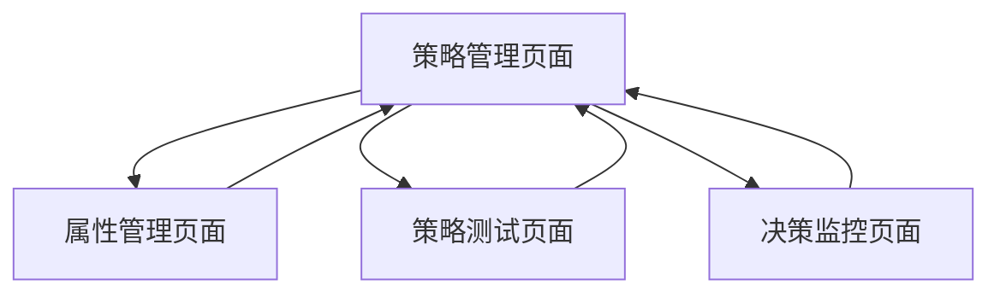
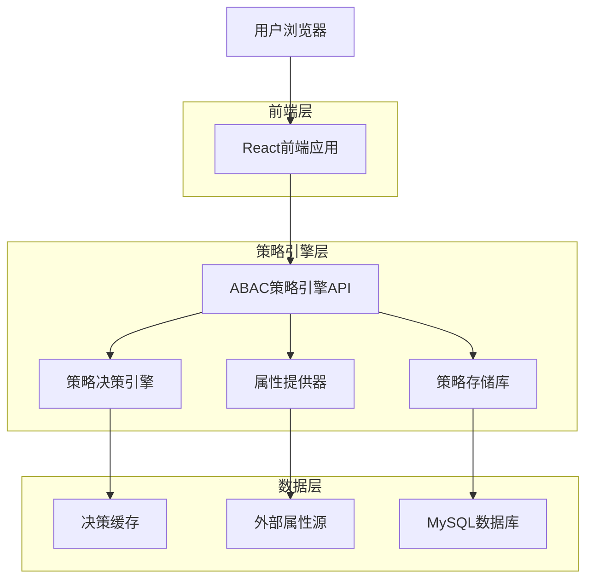
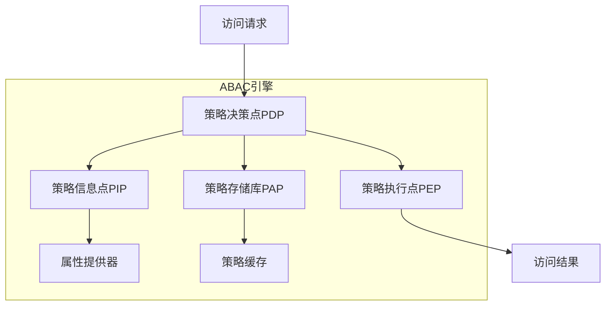
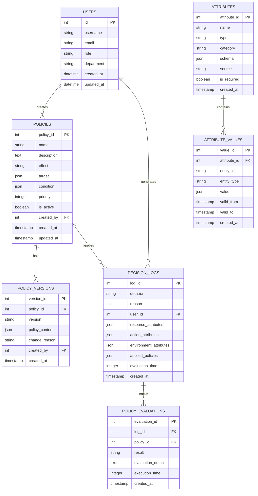

# ABAC策略引擎完善技术设计文档

## 1. 产品概述

本模块实现基于属性的访问控制(ABAC)策略引擎，支持复杂的动态权限决策和上下文感知访问控制，为医疗数据管理平台提供精细化的权限管理能力。

## 2. 核心功能

### 2.1 用户角色

| 角色   | 注册方式           | 核心权限                                                       |
| ------ | ------------------ | -------------------------------------------------------------- |
| 管理员 | 系统管理员分配     | 可创建、修改、删除所有策略规则，管理用户权限，查看所有审计日志 |
| 医生   | 医院系统集成       | 可访问患者数据，创建和修改医疗记录，查看相关策略执行结果       |
| 患者   | 邮箱注册或医院分配 | 只能查看自己的数据访问日志，无策略管理权限                     |

### 2.2 功能模块

本系统包含以下核心页面：

1. **策略管理页面**: 策略创建、编辑、测试、部署
2. **属性管理页面**: 用户属性、资源属性、环境属性配置
3. **决策监控页面**: 实时决策日志、性能监控、异常告警
4. **策略测试页面**: 策略模拟测试、场景验证、结果分析

### 2.3 页面详情

| 页面名称     | 模块名称   | 功能描述                           |
| ------------ | ---------- | ---------------------------------- |
| 策略管理页面 | 策略编辑器 | 可视化策略编辑、语法检查、版本管理 |
| 策略管理页面 | 策略部署   | 策略发布、回滚、灰度发布           |
| 属性管理页面 | 属性定义   | 定义用户、资源、环境属性类型       |
| 属性管理页面 | 属性映射   | 配置属性来源、同步规则             |
| 决策监控页面 | 实时日志   | 显示访问决策过程、结果统计         |
| 决策监控页面 | 性能监控   | 决策延迟、吞吐量、错误率监控       |
| 策略测试页面 | 场景模拟   | 模拟各种访问场景、测试策略效果     |
| 策略测试页面 | 结果分析   | 分析测试结果、优化建议             |

## 3. 核心流程

### 安全管理员流程

1. 登录系统 → 策略管理页面 → 创建新策略 → 策略测试 → 部署策略
2. 属性管理页面 → 定义新属性 → 配置属性来源 → 测试属性获取
3. 决策监控页面 → 查看决策日志 → 分析异常情况 → 优化策略

### 医生流程

1. 访问患者记录 → 系统自动进行ABAC决策 → 根据结果允许或拒绝访问
2. 申请特殊权限 → 填写申请理由 → 等待审批 → 获得临时访问权限

### 审计员流程

1. 登录系统 → 决策监控页面 → 查看访问日志 → 生成审计报告
2. 分析访问模式 → 发现异常行为 → 报告安全事件



## 4. 用户界面设计

### 4.1 设计风格

- **主色调**: #7C3AED (策略紫), #F8FAFC (背景灰)
- **辅助色**: #10B981 (允许绿), #EF4444 (拒绝红), #F59E0B (警告橙), #6366F1
  (信息蓝)
- **按钮样式**: 圆角8px，渐变效果，状态指示
- **字体**: Inter 14px (正文), Inter 16px (标题), Monaco 12px (策略代码)
- **布局风格**: 分栏式设计，策略编辑器，属性面板
- **图标风格**: Heroicons线性图标，安全主题图标

### 4.2 页面设计概览

| 页面名称     | 模块名称   | UI元素                                   |
| ------------ | ---------- | ---------------------------------------- |
| 策略管理页面 | 策略编辑器 | 代码编辑器、语法高亮、自动补全、错误提示 |
| 属性管理页面 | 属性定义   | 表单组件、类型选择器、验证规则设置       |
| 决策监控页面 | 实时日志   | 日志流、过滤器、搜索框、时间选择器       |
| 策略测试页面 | 场景模拟   | 参数输入框、测试按钮、结果展示面板       |

### 4.3 响应式设计

- **桌面优先**: 1200px+宽屏布局，多面板设计
- **移动适配**: 768px以下单面板布局，简化操作
- **策略编辑**: 专门的代码编辑界面，支持全屏模式

## 5. 技术架构

### 5.1 架构设计



### 5.2 技术描述

- **前端**: React@18 + TypeScript + Monaco Editor + TailwindCSS
- **后端**: Express@4 + TypeScript + XACML引擎
- **策略语言**: JSON-based策略语言 + XACML支持
- **缓存**: Redis + 内存缓存
- **数据库**: MySQL

### 5.3 路由定义

| 路由        | 用途                           |
| ----------- | ------------------------------ |
| /policies   | 策略管理页面，策略的CRUD操作   |
| /attributes | 属性管理页面，属性定义和配置   |
| /decisions  | 决策监控页面，实时决策日志查看 |
| /test       | 策略测试页面，策略模拟和验证   |
| /audit      | 审计报告页面，合规性分析       |

### 5.4 API定义

#### 4.1 核心API

**策略决策接口**

```
POST /api/v1/abac/evaluate
```

请求: | 参数名称 | 参数类型 | 是否必需 | 描述 |
|----------|----------|----------|------| | subject | object | true
| 主体属性(用户信息) | | resource | object | true | 资源属性(被访问资源) | |
action | object | true | 动作属性(操作类型) | | environment | object | true
| 环境属性(上下文信息) |

响应: | 参数名称 | 参数类型 | 描述 | |----------|----------|------| | decision |
string | 决策结果(PERMIT/DENY/INDETERMINATE) | | reason | string | 决策原因 | |
appliedPolicies | array | 应用的策略列表 | | evaluationTime | number
| 评估耗时(ms) |

示例:

```json
{
  "subject": {
    "userId": "doctor123",
    "role": "doctor",
    "department": "cardiology",
    "certifications": ["MD", "FACC"],
    "securityClearance": "level2"
  },
  "resource": {
    "resourceId": "patient456",
    "resourceType": "medical_record",
    "classification": "confidential",
    "patientId": "patient456",
    "createdBy": "doctor789"
  },
  "action": {
    "operation": "read",
    "method": "READ"
  },
  "environment": {
    "time": "2024-01-15T10:30:00Z",
    "location": "hospital_network",
    "ipAddress": "192.168.1.100",
    "deviceType": "workstation",
    "emergencyMode": false
  }
}
```

**策略管理接口**

```
POST /api/v1/policies
GET /api/v1/policies
PUT /api/v1/policies/{id}
DELETE /api/v1/policies/{id}
```

**策略创建请求**: | 参数名称 | 参数类型 | 是否必需 | 描述 |
|----------|----------|----------|------| | name | string | true | 策略名称 | |
description | string | true | 策略描述 | | effect | string | true
| 策略效果(PERMIT/DENY) | | condition | object | true | 策略条件 | | priority |
number | false | 策略优先级 | | isActive | boolean | false | 是否激活 |

**属性管理接口**

```
POST /api/v1/attributes
GET /api/v1/attributes
PUT /api/v1/attributes/{id}
```

**策略测试接口**

```
POST /api/v1/policies/test
```

### 5.5 策略语言定义

#### 策略结构

```typescript
interface ABACPolicy {
  policyId: string;
  name: string;
  description: string;
  version: string;
  effect: 'PERMIT' | 'DENY';
  target: PolicyTarget;
  condition: PolicyCondition;
  priority: number;
  isActive: boolean;
  createdAt: Date;
  updatedAt: Date;
}

interface PolicyTarget {
  subjects?: AttributeMatch[];
  resources?: AttributeMatch[];
  actions?: AttributeMatch[];
  environments?: AttributeMatch[];
}

interface PolicyCondition {
  operator: 'and' | 'or' | 'not';
  conditions?: PolicyCondition[];
  expression?: AttributeExpression;
}

interface AttributeExpression {
  operator:
    | 'equals'
    | 'notEquals'
    | 'in'
    | 'notIn'
    | 'greaterThan'
    | 'lessThan'
    | 'contains'
    | 'matches';
  attribute: string;
  value: any;
}
```

#### 策略示例

```json
{
  "policyId": "emergency-access-policy",
  "name": "紧急访问策略",
  "description": "紧急情况下医生可访问任何患者记录",
  "version": "1.0",
  "effect": "PERMIT",
  "target": {
    "subjects": [
      {
        "attribute": "role",
        "operator": "equals",
        "value": "doctor"
      }
    ],
    "resources": [
      {
        "attribute": "resourceType",
        "operator": "equals",
        "value": "medical_record"
      }
    ]
  },
  "condition": {
    "operator": "and",
    "conditions": [
      {
        "expression": {
          "operator": "equals",
          "attribute": "environment.emergencyMode",
          "value": true
        }
      },
      {
        "expression": {
          "operator": "lessThan",
          "attribute": "environment.time",
          "value": "emergency.endTime"
        }
      }
    ]
  },
  "priority": 100,
  "isActive": true
}
```

### 5.6 服务器架构图



### 5.7 数据模型

#### 6.1 数据模型定义



#### 6.2 数据定义语言

**用户表 (users)**

```sql
-- 创建用户表
CREATE TABLE users (
    id INT AUTO_INCREMENT PRIMARY KEY,
    username VARCHAR(50) UNIQUE NOT NULL,
    email VARCHAR(100) UNIQUE NOT NULL,
    password_hash VARCHAR(255) NOT NULL,
    role ENUM('doctor', 'administrator', 'patient') NOT NULL DEFAULT 'patient',
    department VARCHAR(100),
    full_name VARCHAR(100) NOT NULL,
    phone VARCHAR(20),
    is_active BOOLEAN DEFAULT TRUE,
    created_at TIMESTAMP DEFAULT CURRENT_TIMESTAMP,
    updated_at TIMESTAMP DEFAULT CURRENT_TIMESTAMP ON UPDATE CURRENT_TIMESTAMP
);

-- 创建索引
CREATE INDEX idx_users_role ON users(role);
CREATE INDEX idx_users_department ON users(department);
CREATE INDEX idx_users_email ON users(email);
```

**策略表 (policies)**

```sql
CREATE TABLE policies (
    policy_id INT AUTO_INCREMENT PRIMARY KEY,
    name VARCHAR(255) NOT NULL UNIQUE,
    description TEXT,
    effect ENUM('PERMIT', 'DENY') NOT NULL,
    target JSON NOT NULL,
    condition JSON,
    priority INTEGER DEFAULT 0,
    is_active BOOLEAN DEFAULT true,
    created_by INT NOT NULL,
    created_at TIMESTAMP DEFAULT CURRENT_TIMESTAMP,
    updated_at TIMESTAMP DEFAULT CURRENT_TIMESTAMP ON UPDATE CURRENT_TIMESTAMP,
    FOREIGN KEY (created_by) REFERENCES users(id) ON DELETE CASCADE
);

-- 创建索引
CREATE INDEX idx_policies_name ON policies(name);
CREATE INDEX idx_policies_priority ON policies(priority DESC);
CREATE INDEX idx_policies_is_active ON policies(is_active);
CREATE INDEX idx_policies_effect ON policies(effect);
```

**策略版本表 (policy_versions)**

```sql
CREATE TABLE policy_versions (
    version_id INT AUTO_INCREMENT PRIMARY KEY,
    policy_id INT NOT NULL,
    version VARCHAR(20) NOT NULL,
    policy_content JSON NOT NULL,
    change_reason TEXT,
    created_by INT NOT NULL,
    created_at TIMESTAMP DEFAULT CURRENT_TIMESTAMP,
    FOREIGN KEY (policy_id) REFERENCES policies(policy_id) ON DELETE CASCADE,
    FOREIGN KEY (created_by) REFERENCES users(id) ON DELETE CASCADE,
    UNIQUE(policy_id, version)
);

-- 创建索引
CREATE INDEX idx_policy_versions_policy_id ON policy_versions(policy_id);
CREATE INDEX idx_policy_versions_created_at ON policy_versions(created_at DESC);
```

**属性定义表 (attributes)**

```sql
CREATE TABLE attributes (
    attribute_id INT AUTO_INCREMENT PRIMARY KEY,
    name VARCHAR(100) NOT NULL UNIQUE,
    type VARCHAR(50) NOT NULL, -- string, number, boolean, array, object
    category VARCHAR(50) NOT NULL, -- subject, resource, action, environment
    schema JSON, -- JSON Schema for validation
    source VARCHAR(100), -- database, ldap, api, static
    is_required BOOLEAN DEFAULT false,
    description TEXT,
    created_at TIMESTAMP DEFAULT CURRENT_TIMESTAMP,
    updated_at TIMESTAMP DEFAULT CURRENT_TIMESTAMP ON UPDATE CURRENT_TIMESTAMP
);

-- 创建索引
CREATE INDEX idx_attributes_name ON attributes(name);
CREATE INDEX idx_attributes_category ON attributes(category);
CREATE INDEX idx_attributes_type ON attributes(type);
```

**属性值表 (attribute_values)**

```sql
CREATE TABLE attribute_values (
    value_id INT AUTO_INCREMENT PRIMARY KEY,
    attribute_id INT NOT NULL,
    entity_id VARCHAR(100) NOT NULL, -- user_id, resource_id, etc.
    entity_type VARCHAR(50) NOT NULL, -- user, resource, etc.
    value JSON NOT NULL,
    valid_from TIMESTAMP DEFAULT CURRENT_TIMESTAMP,
    valid_to TIMESTAMP NULL,
    created_at TIMESTAMP DEFAULT CURRENT_TIMESTAMP,
    FOREIGN KEY (attribute_id) REFERENCES attributes(attribute_id) ON DELETE CASCADE
);

-- 创建索引
CREATE INDEX idx_attribute_values_entity ON attribute_values(entity_id, entity_type);
CREATE INDEX idx_attribute_values_attribute_id ON attribute_values(attribute_id);
CREATE INDEX idx_attribute_values_valid_period ON attribute_values(valid_from, valid_to);
```

**决策日志表 (decision_logs)**

```sql
CREATE TABLE decision_logs (
    log_id INT AUTO_INCREMENT PRIMARY KEY,
    decision ENUM('PERMIT', 'DENY', 'INDETERMINATE') NOT NULL,
    reason TEXT,
    user_id INT NOT NULL,
    resource_attributes JSON NOT NULL,
    action_attributes JSON NOT NULL,
    environment_attributes JSON NOT NULL,
    applied_policies JSON,
    evaluation_time INTEGER, -- milliseconds
    request_id VARCHAR(100),
    ip_address VARCHAR(45), -- IPv4/IPv6
    created_at TIMESTAMP DEFAULT CURRENT_TIMESTAMP,
    FOREIGN KEY (user_id) REFERENCES users(id) ON DELETE CASCADE
);

-- 创建索引
CREATE INDEX idx_decision_logs_decision ON decision_logs(decision);
CREATE INDEX idx_decision_logs_user_id ON decision_logs(user_id);
CREATE INDEX idx_decision_logs_created_at ON decision_logs(created_at DESC);
CREATE INDEX idx_decision_logs_request_id ON decision_logs(request_id);
```

**策略评估详情表 (policy_evaluations)**

```sql
CREATE TABLE policy_evaluations (
    evaluation_id INT AUTO_INCREMENT PRIMARY KEY,
    log_id INT NOT NULL,
    policy_id INT NOT NULL,
    result ENUM('APPLICABLE', 'NOT_APPLICABLE', 'ERROR') NOT NULL,
    evaluation_details JSON,
    execution_time INTEGER, -- microseconds
    created_at TIMESTAMP DEFAULT CURRENT_TIMESTAMP,
    FOREIGN KEY (log_id) REFERENCES decision_logs(log_id) ON DELETE CASCADE,
    FOREIGN KEY (policy_id) REFERENCES policies(policy_id) ON DELETE CASCADE
);

-- 创建索引
CREATE INDEX idx_policy_evaluations_log_id ON policy_evaluations(log_id);
CREATE INDEX idx_policy_evaluations_policy_id ON policy_evaluations(policy_id);
CREATE INDEX idx_policy_evaluations_result ON policy_evaluations(result);
```

**初始化数据**

```sql
-- 插入初始用户
INSERT INTO users (username, email, password_hash, role, department, full_name) VALUES
('admin', 'admin@hospital.com', '$2b$12$hash_here', 'administrator', 'IT部门', '系统管理员'),
('dr_zhang', 'zhang@hospital.com', '$2b$12$hash_here', 'doctor', '放射科', '张医生'),
('patient001', 'patient@email.com', '$2b$12$hash_here', 'patient', NULL, '患者张三');

-- 插入基础属性定义
INSERT INTO attributes (name, type, category, description) VALUES
('userId', 'string', 'subject', '用户唯一标识'),
('role', 'string', 'subject', '用户角色'),
('department', 'string', 'subject', '所属科室'),
('resourceType', 'string', 'resource', '资源类型'),
('classification', 'string', 'resource', '资源分类级别'),
('operation', 'string', 'action', '操作类型'),
('time', 'string', 'environment', '访问时间'),
('location', 'string', 'environment', '访问位置');

-- 插入示例策略
INSERT INTO policies (name, description, effect, target, condition, priority, created_by) VALUES
('医生访问患者记录', '医生可以访问自己科室的患者记录', 'PERMIT',
 '{"subjects": [{"attribute": "role", "operator": "equals", "value": "doctor"}]}',
 '{"operator": "equals", "attribute": "subject.department", "value": "resource.department"}',
 10, 1),
('患者数据访问权限', '患者只能访问自己的数据', 'PERMIT',
 '{"subjects": [{"attribute": "role", "operator": "equals", "value": "patient"}]}',
 '{"operator": "equals", "attribute": "subject.user_id", "value": "resource.patient_id"}',
 5, 1),
('管理员全权限', '管理员可以访问所有数据', 'PERMIT',
 '{"subjects": [{"attribute": "role", "operator": "equals", "value": "administrator"}]}',
 NULL, 100, 1);
```

## 6. 实现步骤

### 阶段1: 核心引擎开发 (2天)

1. 实现策略决策引擎核心逻辑
2. 开发属性提供器和属性解析
3. 创建策略存储和缓存机制
4. 实现决策日志记录

### 阶段2: 策略管理功能 (1天)

1. 开发策略CRUD API
2. 实现策略版本管理
3. 添加策略验证和测试功能
4. 创建策略部署机制

### 阶段3: 属性管理系统 (1天)

1. 实现属性定义和管理
2. 开发属性值存储和查询
3. 添加属性同步机制
4. 实现属性验证功能

### 阶段4: 前端界面开发 (1天)

1. 创建策略编辑器组件
2. 实现属性管理界面
3. 开发决策监控面板
4. 添加策略测试工具

### 阶段5: 性能优化和集成 (0.5天)

1. 优化决策性能和缓存策略
2. 集成到现有系统
3. 添加监控和告警
4. 进行压力测试

## 7. 风险评估

### 高风险项

- **策略复杂性**: 复杂的策略条件可能导致性能问题
- **决策准确性**: 错误的策略可能导致安全漏洞或访问拒绝

### 中风险项

- **属性同步**: 外部属性源的同步可能存在延迟或失败
- **性能扩展**: 大量并发决策请求的性能表现

### 低风险项

- **用户界面**: 策略编辑和管理界面的易用性
- **日志存储**: 决策日志的存储和查询性能

### 风险缓解措施

1. **策略验证**: 实现策略语法检查和逻辑验证
2. **性能监控**: 实时监控决策性能和响应时间
3. **缓存策略**: 使用多级缓存提高决策性能
4. **回滚机制**: 支持策略快速回滚和版本切换

## 8. 性能指标

- **决策延迟**: 平均决策时间<50ms
- **决策吞吐量**: 支持1000次/秒决策请求
- **策略数量**: 支持10000+活跃策略
- **属性查询**: 属性查询延迟<10ms
- **缓存命中率**: 策略缓存命中率>90%

## 9. 监控和日志

- **决策监控**: 实时监控决策结果分布、延迟统计
- **策略监控**: 监控策略执行频率、性能影响
- **属性监控**: 监控属性查询性能、同步状态
- **安全审计**: 记录所有策略变更、决策过程
- **性能分析**: 分析决策瓶颈、优
