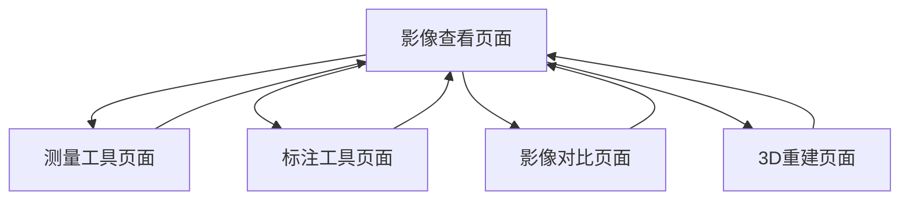
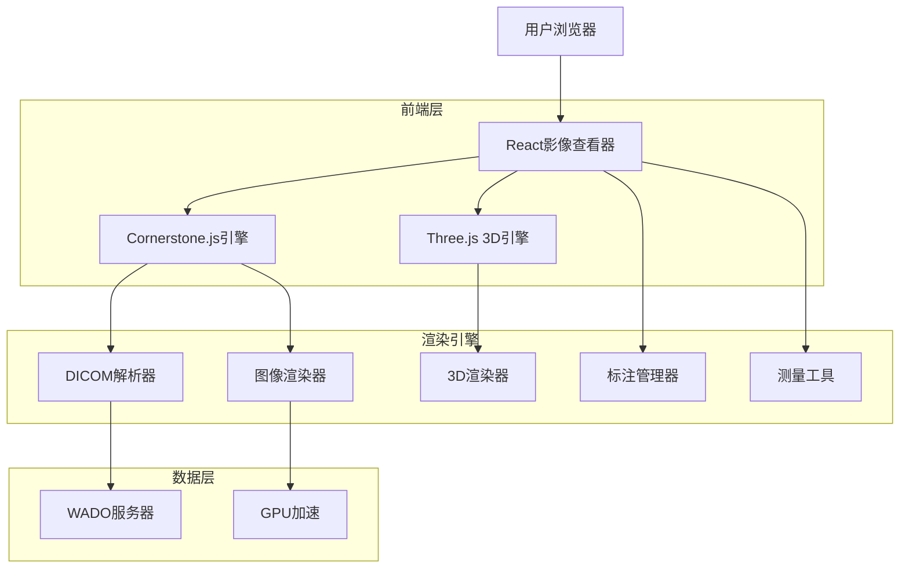
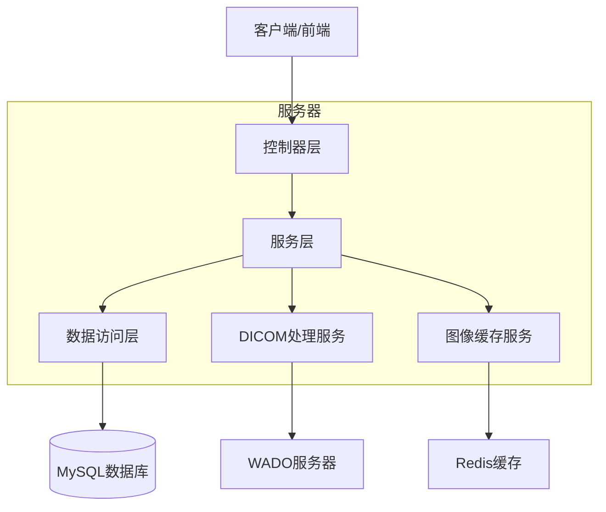
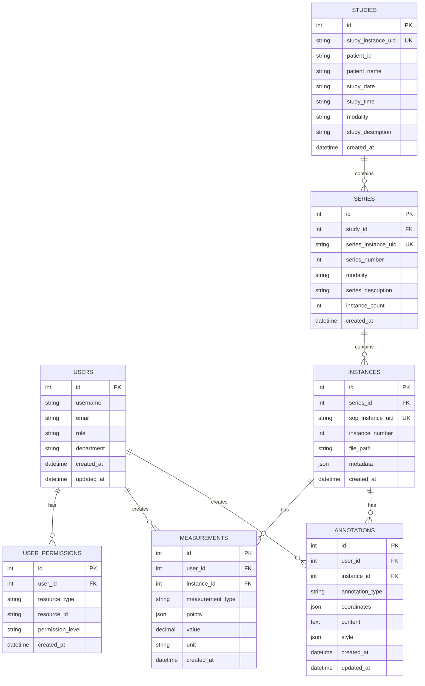

# 前端医学影像查看器技术设计文档

## 1. 产品概述

本模块实现专业的医学影像查看组件，支持DICOM图像的显示、操作和分析工具，为医疗数据管理平台提供专业的医学影像处理和查看能力。

## 2. 核心功能

### 2.1 用户角色

| 角色        | 注册方式       | 核心权限                     |
| ----------- | -------------- | ---------------------------- |
| 放射科医生  | 医院系统集成   | 可查看、分析、标注所有影像   |
| 临床医生    | 医院系统集成   | 可查看相关患者影像，基础测量 |
| 影像技师    | 设备操作员注册 | 可上传、预处理影像，质量检查 |
| 学生/实习生 | 教学账号分配   | 可查看教学影像，学习标注     |

### 2.2 功能模块

本系统包含以下核心页面：

1. **影像查看页面**: DICOM显示、窗宽窗位调节、缩放平移
2. **测量工具页面**: 距离测量、角度测量、面积计算
3. **标注工具页面**: 文字标注、图形标注、ROI绘制
4. **影像对比页面**: 多影像对比、时间序列对比
5. **3D重建页面**: MPR重建、3D渲染、体绘制

### 2.3 页面详情

| 页面名称     | 模块名称    | 功能描述                          |
| ------------ | ----------- | --------------------------------- |
| 影像查看页面 | DICOM渲染器 | 高性能DICOM图像渲染、窗宽窗位调节 |
| 影像查看页面 | 导航控制    | 序列导航、图像缩放、平移、旋转    |
| 测量工具页面 | 测量工具栏  | 距离、角度、面积、体积测量工具    |
| 测量工具页面 | 测量结果    | 测量数据显示、导出、历史记录      |
| 标注工具页面 | 标注编辑器  | 文字、箭头、矩形、圆形、自由绘制  |
| 标注工具页面 | 标注管理    | 标注列表、显示控制、权限管理      |
| 影像对比页面 | 对比视图    | 并排对比、叠加对比、差值对比      |
| 影像对比页面 | 同步控制    | 窗宽窗位同步、缩放同步、滚动同步  |
| 3D重建页面   | MPR视图     | 轴位、冠状位、矢状位重建          |
| 3D重建页面   | 3D渲染      | 体绘制、表面渲染、最大密度投影    |

## 3. 核心流程

### 放射科医生流程

1. 登录系统 → 选择患者影像 → 影像查看页面 → 调节窗宽窗位
2. 测量工具页面 → 进行各种测量 → 记录测量结果 → 生成报告
3. 标注工具页面 → 添加诊断标注 → 保存标注信息
4. 3D重建页面 → 进行3D分析 → 多平面重建

### 临床医生流程

1. 登录系统 → 查看患者影像 → 基础查看和测量
2. 影像对比页面 → 对比不同时期影像 → 观察病变变化
3. 查看放射科医生标注 → 理解诊断结果

### 影像技师流程

1. 上传DICOM文件 → 质量检查 → 预处理优化
2. 影像查看页面 → 检查图像质量 → 标记问题影像



## 4. 用户界面设计

### 4.1 设计风格

- **主色调**: #1F2937 (深灰背景), #374151 (工具栏灰)
- **辅助色**: #3B82F6 (选中蓝), #10B981 (测量绿), #F59E0B (警告橙), #EF4444
  (错误红)
- **按钮样式**: 扁平化设计，圆角4px，图标+文字
- **字体**: Inter 12px (工具栏), Inter 14px (测量值), Monaco 10px (坐标)
- **布局风格**: 全屏沉浸式设计，可隐藏工具栏，专业医学界面
- **图标风格**: 医学专用图标，线性风格，高对比度

### 4.2 页面设计概览

| 页面名称     | 模块名称    | UI元素                               |
| ------------ | ----------- | ------------------------------------ |
| 影像查看页面 | DICOM渲染器 | Canvas画布、窗宽窗位滑块、缩放控制器 |
| 测量工具页面 | 测量工具栏  | 工具按钮、测量结果面板、单位选择器   |
| 标注工具页面 | 标注编辑器  | 绘图工具、颜色选择器、文字输入框     |
| 影像对比页面 | 对比视图    | 分屏显示、同步控制开关、对比模式选择 |
| 3D重建页面   | 3D渲染      | 3D视口、渲染参数面板、视角控制器     |

### 4.3 响应式设计

- **桌面优先**: 1920px+专业显示器优化，多显示器支持
- **平板适配**: 1024px平板横屏模式，触摸手势支持
- **移动查看**: 768px以下基础查看功能，简化工具栏

## 5. 技术架构

### 5.1 架构设计



### 5.2 技术描述

- **前端**: React@18 + TypeScript + TailwindCSS
- **DICOM处理**: Cornerstone.js + cornerstoneWADOImageLoader
- **3D渲染**: Three.js + VTK.js
- **图像处理**: fabric.js (标注) + OpenCV.js (图像处理)
- **性能优化**: Web Workers + WebGL + GPU加速

### 5.3 路由定义

| 路由                              | 用途                             |
| --------------------------------- | -------------------------------- |
| /viewer/:studyId                  | 影像查看页面，显示指定检查的影像 |
| /viewer/:studyId/series/:seriesId | 序列查看页面，显示特定序列       |
| /viewer/compare                   | 影像对比页面，多影像对比功能     |
| /viewer/3d/:studyId               | 3D重建页面，3D影像分析           |
| /viewer/measurements              | 测量管理页面，测量结果管理       |

### 5.4 API定义

#### 4.1 核心API

**DICOM影像获取**

```
GET /api/v1/dicom/studies/{studyId}/series/{seriesId}/instances/{instanceId}
```

请求参数: | 参数名称 | 参数类型 | 是否必需 | 描述 |
|----------|----------|----------|------| | studyId | string | true | 检查ID | |
seriesId | string | true | 序列ID | | instanceId | string | true | 实例ID | |
frame | number | false | 帧号(多帧图像) |

响应: | 参数名称 | 参数类型 | 描述 | |----------|----------|------| | imageData
| ArrayBuffer | DICOM图像数据 | | metadata | object | 图像元数据 | |
transferSyntax | string | 传输语法 |

**影像元数据获取**

```
GET /api/v1/dicom/studies/{studyId}/metadata
```

响应: | 参数名称 | 参数类型 | 描述 | |----------|----------|------| |
studyMetadata | object | 检查元数据 | | seriesList | array | 序列列表 | |
instanceCount | number | 实例总数 |

示例:

```json
{
  "studyMetadata": {
    "studyInstanceUID": "1.2.3.4.5",
    "studyDate": "20240115",
    "studyTime": "143000",
    "modality": "CT",
    "patientName": "张三",
    "patientID": "P123456"
  },
  "seriesList": [
    {
      "seriesInstanceUID": "1.2.3.4.5.1",
      "seriesNumber": 1,
      "modality": "CT",
      "seriesDescription": "胸部CT平扫",
      "instanceCount": 120
    }
  ]
}
```

**标注保存接口**

```
POST /api/v1/annotations
```

请求参数: | 参数名称 | 参数类型 | 是否必需 | 描述 |
|----------|----------|----------|------| | studyId | string | true | 检查ID | |
seriesId | string | true | 序列ID | | instanceId | string | true | 实例ID | |
annotationType | string | true | 标注类型(text/arrow/rectangle/circle) | |
coordinates | object | true | 标注坐标信息 | | content | string | false
| 标注文本内容 | | style | object | false | 标注样式信息 |

响应: | 参数名称 | 参数类型 | 描述 | |----------|----------|------| |
annotationId | string | 标注ID | | status | boolean | 保存状态 |

示例:

```json
{
  "studyId": "1.2.3.4.5",
  "seriesId": "1.2.3.4.5.1",
  "instanceId": "1.2.3.4.5.1.1",
  "annotationType": "text",
  "coordinates": {
    "x": 100,
    "y": 150,
    "width": 200,
    "height": 50
  },
  "content": "疑似病变区域",
  "style": {
    "color": "#FF0000",
    "fontSize": 14
  }
}
```

**测量数据保存**

```
POST /api/v1/measurements
```

请求参数: | 参数名称 | 参数类型 | 是否必需 | 描述 |
|----------|----------|----------|------| | studyId | string | true | 检查ID | |
seriesId | string | true | 序列ID | | instanceId | string | true | 实例ID | |
measurementType | string | true | 测量类型(distance/angle/area/volume) | |
points | array | true | 测量点坐标 | | value | number | true | 测量值 | | unit |
string | true | 测量单位 |

响应: | 参数名称 | 参数类型 | 描述 | |----------|----------|------| |
measurementId | string | 测量ID | | status | boolean | 保存状态 |

## 6. 服务器架构图



## 7. 数据模型

### 7.1 数据模型定义



### 7.2 数据定义语言

**用户表 (users)**

```sql
-- 创建用户表
CREATE TABLE users (
    id INT AUTO_INCREMENT PRIMARY KEY,
    username VARCHAR(50) UNIQUE NOT NULL,
    email VARCHAR(100) UNIQUE NOT NULL,
    password_hash VARCHAR(255) NOT NULL,
    role ENUM('doctor', 'administrator', 'patient') NOT NULL DEFAULT 'patient',
    department VARCHAR(100),
    full_name VARCHAR(100) NOT NULL,
    phone VARCHAR(20),
    is_active BOOLEAN DEFAULT TRUE,
    created_at TIMESTAMP DEFAULT CURRENT_TIMESTAMP,
    updated_at TIMESTAMP DEFAULT CURRENT_TIMESTAMP ON UPDATE CURRENT_TIMESTAMP
);

-- 创建索引
CREATE INDEX idx_users_role ON users(role);
CREATE INDEX idx_users_department ON users(department);
CREATE INDEX idx_users_email ON users(email);
```

**检查表 (studies)**

```sql
-- 创建检查表
CREATE TABLE studies (
    id INT AUTO_INCREMENT PRIMARY KEY,
    study_instance_uid VARCHAR(255) UNIQUE NOT NULL,
    patient_id VARCHAR(50) NOT NULL,
    patient_name VARCHAR(100) NOT NULL,
    study_date DATE NOT NULL,
    study_time TIME,
    modality VARCHAR(10) NOT NULL,
    study_description TEXT,
    referring_physician VARCHAR(100),
    created_at TIMESTAMP DEFAULT CURRENT_TIMESTAMP,
    updated_at TIMESTAMP DEFAULT CURRENT_TIMESTAMP ON UPDATE CURRENT_TIMESTAMP
);

-- 创建索引
CREATE INDEX idx_studies_patient_id ON studies(patient_id);
CREATE INDEX idx_studies_study_date ON studies(study_date);
CREATE INDEX idx_studies_modality ON studies(modality);
```

**序列表 (series)**

```sql
-- 创建序列表
CREATE TABLE series (
    id INT AUTO_INCREMENT PRIMARY KEY,
    study_id INT NOT NULL,
    series_instance_uid VARCHAR(255) UNIQUE NOT NULL,
    series_number INT NOT NULL,
    modality VARCHAR(10) NOT NULL,
    series_description TEXT,
    instance_count INT DEFAULT 0,
    created_at TIMESTAMP DEFAULT CURRENT_TIMESTAMP,
    FOREIGN KEY (study_id) REFERENCES studies(id) ON DELETE CASCADE
);

-- 创建索引
CREATE INDEX idx_series_study_id ON series(study_id);
CREATE INDEX idx_series_series_number ON series(series_number);
```

**实例表 (instances)**

```sql
-- 创建实例表
CREATE TABLE instances (
    id INT AUTO_INCREMENT PRIMARY KEY,
    series_id INT NOT NULL,
    sop_instance_uid VARCHAR(255) UNIQUE NOT NULL,
    instance_number INT NOT NULL,
    file_path VARCHAR(500) NOT NULL,
    file_size BIGINT,
    metadata JSON,
    created_at TIMESTAMP DEFAULT CURRENT_TIMESTAMP,
    FOREIGN KEY (series_id) REFERENCES series(id) ON DELETE CASCADE
);

-- 创建索引
CREATE INDEX idx_instances_series_id ON instances(series_id);
CREATE INDEX idx_instances_instance_number ON instances(instance_number);
```

**标注表 (annotations)**

```sql
-- 创建标注表
CREATE TABLE annotations (
    id INT AUTO_INCREMENT PRIMARY KEY,
    user_id INT NOT NULL,
    instance_id INT NOT NULL,
    annotation_type ENUM('text', 'arrow', 'rectangle', 'circle', 'freehand') NOT NULL,
    coordinates JSON NOT NULL,
    content TEXT,
    style JSON,
    is_visible BOOLEAN DEFAULT TRUE,
    created_at TIMESTAMP DEFAULT CURRENT_TIMESTAMP,
    updated_at TIMESTAMP DEFAULT CURRENT_TIMESTAMP ON UPDATE CURRENT_TIMESTAMP,
    FOREIGN KEY (user_id) REFERENCES users(id) ON DELETE CASCADE,
    FOREIGN KEY (instance_id) REFERENCES instances(id) ON DELETE CASCADE
);

-- 创建索引
CREATE INDEX idx_annotations_user_id ON annotations(user_id);
CREATE INDEX idx_annotations_instance_id ON annotations(instance_id);
CREATE INDEX idx_annotations_created_at ON annotations(created_at);
```

**测量表 (measurements)**

```sql
-- 创建测量表
CREATE TABLE measurements (
    id INT AUTO_INCREMENT PRIMARY KEY,
    user_id INT NOT NULL,
    instance_id INT NOT NULL,
    measurement_type ENUM('distance', 'angle', 'area', 'volume') NOT NULL,
    points JSON NOT NULL,
    value DECIMAL(10,3) NOT NULL,
    unit VARCHAR(10) NOT NULL,
    description TEXT,
    created_at TIMESTAMP DEFAULT CURRENT_TIMESTAMP,
    FOREIGN KEY (user_id) REFERENCES users(id) ON DELETE CASCADE,
    FOREIGN KEY (instance_id) REFERENCES instances(id) ON DELETE CASCADE
);

-- 创建索引
CREATE INDEX idx_measurements_user_id ON measurements(user_id);
CREATE INDEX idx_measurements_instance_id ON measurements(instance_id);
CREATE INDEX idx_measurements_type ON measurements(measurement_type);
```

**用户权限表 (user_permissions)**

```sql
-- 创建用户权限表
CREATE TABLE user_permissions (
    id INT AUTO_INCREMENT PRIMARY KEY,
    user_id INT NOT NULL,
    resource_type ENUM('study', 'series', 'instance', 'patient') NOT NULL,
    resource_id VARCHAR(255) NOT NULL,
    permission_level ENUM('read', 'write', 'admin') NOT NULL DEFAULT 'read',
    granted_by INT,
    granted_at TIMESTAMP DEFAULT CURRENT_TIMESTAMP,
    expires_at TIMESTAMP NULL,
    FOREIGN KEY (user_id) REFERENCES users(id) ON DELETE CASCADE,
    FOREIGN KEY (granted_by) REFERENCES users(id) ON DELETE SET NULL
);

-- 创建索引
CREATE INDEX idx_permissions_user_id ON user_permissions(user_id);
CREATE INDEX idx_permissions_resource ON user_permissions(resource_type, resource_id);
CREATE INDEX idx_permissions_level ON user_permissions(permission_level);
```

**初始数据**

```sql
-- 插入默认管理员用户
INSERT INTO users (username, email, password_hash, role, department, full_name) VALUES
('admin', 'admin@hospital.com', '$2b$12$hash_here', 'administrator', 'IT部门', '系统管理员'),
('dr_zhang', 'zhang@hospital.com', '$2b$12$hash_here', 'doctor', '放射科', '张医生'),
('patient001', 'patient@email.com', '$2b$12$hash_here', 'patient', NULL, '患者张三');

-- 插入示例检查数据
INSERT INTO studies (study_instance_uid, patient_id, patient_name, study_date, modality, study_description) VALUES
('1.2.840.113619.2.1.1.1', 'P001', '张三', '2024-01-15', 'CT', '胸部CT检查'),
('1.2.840.113619.2.1.1.2', 'P002', '李四', '2024-01-16', 'MR', '头部MRI检查');
```

## 8. 实施步骤

### 阶段1: 基础架构搭建 (1-2周)

1. 搭建React + TypeScript开发环境
2. 集成Cornerstone.js DICOM渲染引擎
3. 实现基础的DICOM图像显示功能
4. 搭建MySQL数据库和基础API

### 阶段2: 核心功能开发 (3-4周)

1. 实现窗宽窗位调节功能
2. 开发图像缩放、平移、旋转控制
3. 实现序列导航和多帧图像支持
4. 开发基础测量工具(距离、角度)

### 阶段3: 高级功能开发 (3-4周)

1. 实现标注工具和标注管理
2. 开发影像对比功能
3. 集成Three.js实现3D重建
4. 实现MPR多平面重建

### 阶段4: 性能优化和测试 (2-3周)

1. 实现WebGL GPU加速
2. 优化大图像加载性能
3. 实现Web Workers后台处理
4. 进行全面功能测试和性能测试

## 9. 风险评估

### 高风险

- **DICOM兼容性**: 不同厂商设备的DICOM格式差异可能导致解析失败
- **性能瓶颈**: 大尺寸医学影像可能导致浏览器内存溢出
- **3D渲染复杂度**: 复杂的3D重建算法可能影响实时性能

### 中风险

- **浏览器兼容性**: 不同浏览器对WebGL支持程度不同
- **网络传输**: 大文件传输可能影响用户体验
- **标注数据同步**: 多用户同时标注可能产生冲突

### 低风险

- **UI响应性**: 复杂界面可能在低端设备上性能不佳
- **用户学习成本**: 专业医学界面需要培训

## 10. 性能指标

### 关键性能指标

- **图像加载时间**: < 2秒 (512x512 DICOM图像)
- **窗宽窗位响应**: < 100ms
- **3D重建时间**: < 10秒 (256层CT数据)
- **标注保存延迟**: < 500ms
- **多图像对比**: 支持同时显示4个视口

### 系统性能要求

- **内存使用**: < 2GB (处理大型数据集)
- **CPU使用率**: < 80% (正常操作)
- **GPU使用率**: < 70% (3D渲染)
- **网络带宽**: 建议 > 10Mbps

## 11. 监控和日志

### 性能监控

- 图像加载时间统计
- 渲染帧率监控
- 内存使用量跟踪
- 用户操作响应时间

### 错误日志

- DICOM解析错误记录
- WebGL渲染错误捕获
- 网络请求失败日志
- 用户操作异常记录

### 用户行为分析

- 功能使用频率统计
- 用户操作路径分析
- 性能瓶颈识别
- 用户反馈收集
