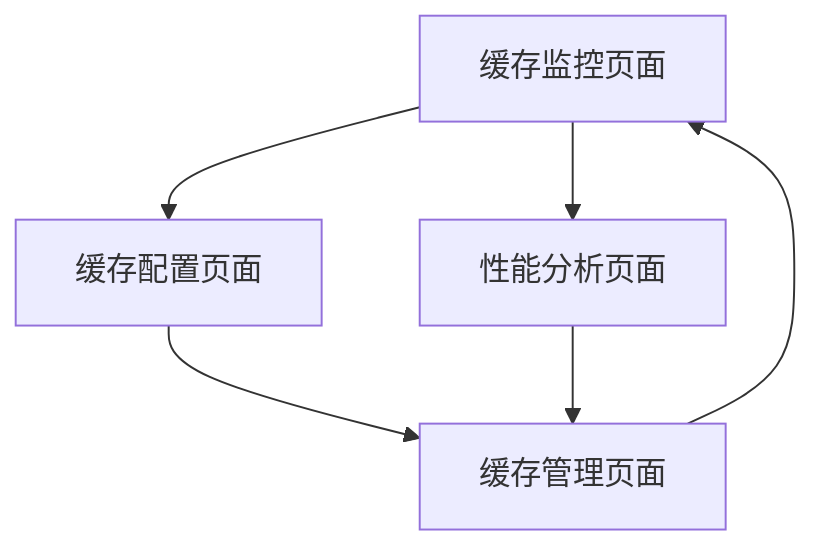
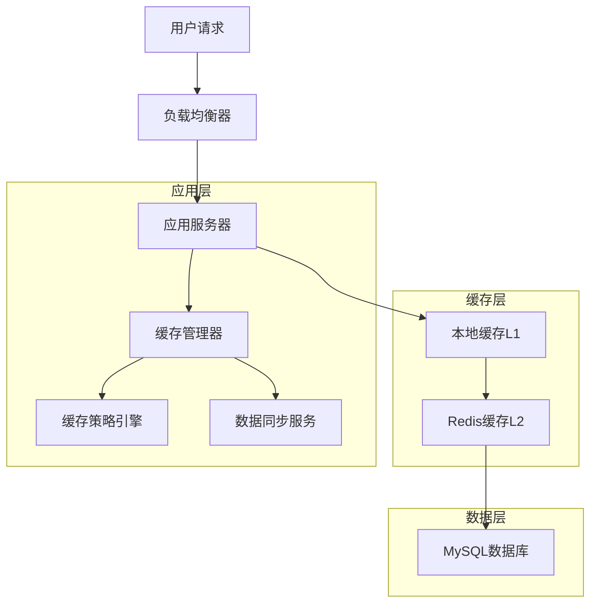
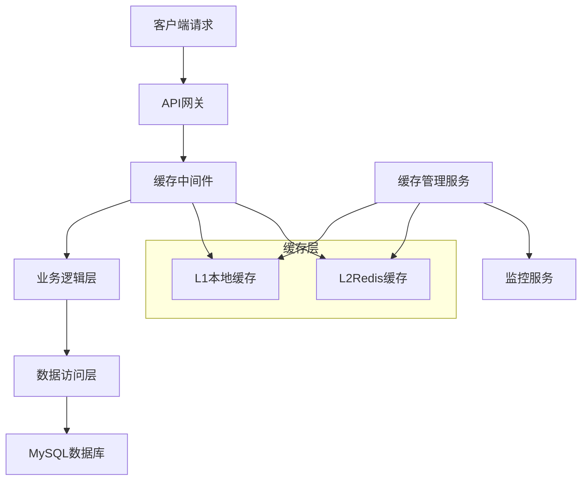
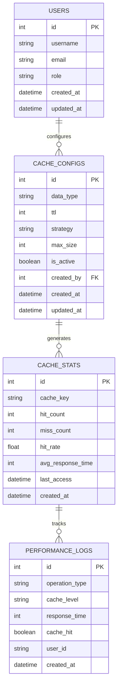

# 性能缓存优化技术设计文档

## 1. 产品概述

本模块实现多层缓存架构，通过Redis分布式缓存、本地内存缓存和数据库查询优化，显著提升医疗数据管理平台的响应性能和并发处理能力。

## 2. 核心功能

### 2.1 用户角色

| 角色   | 注册方式           | 核心权限                                   |
| ------ | ------------------ | ------------------------------------------ |
| 管理员 | 系统管理员分配     | 可配置缓存策略，监控缓存性能，清理缓存数据 |
| 医生   | 医院系统集成       | 享受缓存加速的数据访问，查看个人缓存统计   |
| 患者   | 邮箱注册或医院分配 | 享受缓存加速的数据访问，无缓存管理权限     |

### 2.2 功能模块

本系统包含以下核心页面：

1. **缓存监控页面**: 缓存命中率、性能指标、实时监控
2. **缓存配置页面**: 缓存策略配置、TTL设置、清理规则
3. **性能分析页面**: 响应时间分析、热点数据统计、优化建议
4. **缓存管理页面**: 手动缓存清理、预热操作、数据同步

### 2.3 页面详情

| 页面名称     | 模块名称 | 功能描述                             |
| ------------ | -------- | ------------------------------------ |
| 缓存监控页面 | 实时监控 | 显示缓存命中率、内存使用率、QPS统计  |
| 缓存监控页面 | 性能图表 | 响应时间趋势、缓存效果对比图表       |
| 缓存配置页面 | 策略配置 | 设置不同数据类型的缓存策略和过期时间 |
| 缓存配置页面 | 规则管理 | 配置缓存更新规则、失效策略           |
| 性能分析页面 | 热点分析 | 分析访问频率高的数据，优化缓存策略   |
| 性能分析页面 | 瓶颈诊断 | 识别性能瓶颈，提供优化建议           |
| 缓存管理页面 | 手动操作 | 手动清理、预热、刷新特定缓存         |
| 缓存管理页面 | 数据同步 | 确保缓存与数据库数据一致性           |

## 3. 核心流程

### 管理员流程

1. 登录系统 → 缓存监控页面 → 查看性能指标 → 调整缓存策略
2. 缓存配置页面 → 设置TTL → 配置清理规则 → 保存配置
3. 性能分析页面 → 分析热点数据 → 优化缓存策略 → 监控效果

### 医生流程

1. 访问患者数据 → 系统自动检查缓存 → 缓存命中返回数据 / 缓存未命中查询数据库
2. 查看个人缓存统计 → 了解数据访问模式

### 患者流程

1. 访问个人数据 → 享受缓存加速的响应速度
2. 查看医疗记录 → 系统透明处理缓存逻辑



## 4. 用户界面设计

### 4.1 设计风格

- **主色调**: #3B82F6 (性能蓝), #F8FAFC (背景灰)
- **辅助色**: #10B981 (正常绿), #EF4444 (警告红), #F59E0B (注意橙), #8B5CF6
  (缓存紫)
- **按钮样式**: 圆角6px，渐变效果，状态指示
- **字体**: Inter 14px (正文), Inter 16px (标题), JetBrains Mono 12px (数据展示)
- **布局风格**: 仪表板设计，图表展示，实时数据
- **图标风格**: Heroicons线性图标，性能监控主题

### 4.2 页面设计概览

| 页面名称     | 模块名称 | UI元素                               |
| ------------ | -------- | ------------------------------------ |
| 缓存监控页面 | 实时监控 | 仪表盘、进度条、实时数字、状态指示灯 |
| 缓存配置页面 | 策略配置 | 表单组件、滑块、开关、下拉选择器     |
| 性能分析页面 | 热点分析 | 图表组件、表格、筛选器、排序功能     |
| 缓存管理页面 | 手动操作 | 按钮组、确认对话框、进度指示器       |

### 4.3 响应式设计

- **桌面优先**: 1200px+宽屏布局，多面板仪表板
- **移动适配**: 768px以下单列布局，简化图表
- **实时更新**: WebSocket连接，自动刷新数据

## 5. 技术架构

### 5.1 架构设计



### 5.2 技术描述

- **前端**: React@18 + TypeScript + Chart.js + TailwindCSS
- **后端**: Express@4 + TypeScript + Node-cache + ioredis
- **缓存**: Redis Cluster + 本地内存缓存
- **监控**: Prometheus + Grafana
- **数据库**: MySQL

### 5.3 路由定义

| 路由            | 用途                             |
| --------------- | -------------------------------- |
| /cache/monitor  | 缓存监控页面，实时性能指标展示   |
| /cache/config   | 缓存配置页面，策略和规则设置     |
| /cache/analysis | 性能分析页面，数据分析和优化建议 |
| /cache/manage   | 缓存管理页面，手动操作和数据同步 |

### 5.4 API定义

#### 4.1 核心API

**缓存统计接口**

```
GET /api/v1/cache/stats
```

响应: | 参数名称 | 参数类型 | 描述 | |----------|----------|------| | hitRate |
number | 缓存命中率(%) | | memoryUsage | object | 内存使用情况 | | qps | number
| 每秒查询数 | | avgResponseTime | number | 平均响应时间(ms) |

示例:

```json
{
  "hitRate": 85.6,
  "memoryUsage": {
    "used": "2.1GB",
    "total": "4GB",
    "percentage": 52.5
  },
  "qps": 1250,
  "avgResponseTime": 45,
  "hotKeys": [
    {
      "key": "patient:12345",
      "hits": 1500,
      "lastAccess": "2024-01-15T10:30:00Z"
    }
  ]
}
```

**缓存配置接口**

```
POST /api/v1/cache/config
GET /api/v1/cache/config
PUT /api/v1/cache/config/{type}
```

**缓存配置请求**: | 参数名称 | 参数类型 | 是否必需 | 描述 |
|----------|----------|----------|------| | dataType | string | true
| 数据类型(patient, medical_record, image) | | ttl | number | true
| 过期时间(秒) | | maxSize | number | false | 最大缓存大小 | | strategy | string
| true | 缓存策略(LRU, LFU, FIFO) |

**缓存操作接口**

```
DELETE /api/v1/cache/clear
POST /api/v1/cache/warm
POST /api/v1/cache/sync
```

**性能分析接口**

```
GET /api/v1/cache/analysis/hotkeys
GET /api/v1/cache/analysis/performance
```

### 5.5 缓存策略定义

#### 缓存层级

```typescript
interface CacheConfig {
  level1: {
    type: 'memory';
    maxSize: number;
    ttl: number;
    strategy: 'LRU' | 'LFU';
  };
  level2: {
    type: 'redis';
    cluster: boolean;
    ttl: number;
    maxMemory: string;
  };
}

interface CacheStrategy {
  dataType: string;
  readThrough: boolean;
  writeThrough: boolean;
  writeBehind: boolean;
  refreshAhead: boolean;
  ttl: number;
  maxSize?: number;
}
```

#### 缓存策略示例

```json
{
  "patientData": {
    "readThrough": true,
    "writeThrough": false,
    "writeBehind": true,
    "refreshAhead": true,
    "ttl": 3600,
    "maxSize": 10000
  },
  "medicalImages": {
    "readThrough": true,
    "writeThrough": false,
    "writeBehind": false,
    "refreshAhead": false,
    "ttl": 7200,
    "maxSize": 1000
  }
}
```

### 5.6 服务器架构图



### 5.7 数据模型

#### 6.1 数据模型定义



#### 6.2 数据定义语言

**用户表 (users)**

```sql
-- 创建用户表
CREATE TABLE users (
    id INT AUTO_INCREMENT PRIMARY KEY,
    username VARCHAR(50) UNIQUE NOT NULL,
    email VARCHAR(100) UNIQUE NOT NULL,
    password_hash VARCHAR(255) NOT NULL,
    role ENUM('doctor', 'administrator', 'patient') NOT NULL DEFAULT 'patient',
    department VARCHAR(100),
    full_name VARCHAR(100) NOT NULL,
    phone VARCHAR(20),
    is_active BOOLEAN DEFAULT TRUE,
    created_at TIMESTAMP DEFAULT CURRENT_TIMESTAMP,
    updated_at TIMESTAMP DEFAULT CURRENT_TIMESTAMP ON UPDATE CURRENT_TIMESTAMP
);

-- 创建索引
CREATE INDEX idx_users_role ON users(role);
CREATE INDEX idx_users_department ON users(department);
```

**缓存配置表 (cache_configs)**

```sql
CREATE TABLE cache_configs (
    id INT AUTO_INCREMENT PRIMARY KEY,
    data_type VARCHAR(50) NOT NULL,
    ttl INT NOT NULL DEFAULT 3600,
    strategy ENUM('LRU', 'LFU', 'FIFO') DEFAULT 'LRU',
    max_size INT DEFAULT 10000,
    is_active BOOLEAN DEFAULT TRUE,
    created_by INT NOT NULL,
    created_at TIMESTAMP DEFAULT CURRENT_TIMESTAMP,
    updated_at TIMESTAMP DEFAULT CURRENT_TIMESTAMP ON UPDATE CURRENT_TIMESTAMP,
    FOREIGN KEY (created_by) REFERENCES users(id) ON DELETE CASCADE,
    UNIQUE KEY unique_data_type (data_type)
);

-- 创建索引
CREATE INDEX idx_cache_configs_data_type ON cache_configs(data_type);
CREATE INDEX idx_cache_configs_is_active ON cache_configs(is_active);
```

**缓存统计表 (cache_stats)**

```sql
CREATE TABLE cache_stats (
    id INT AUTO_INCREMENT PRIMARY KEY,
    cache_key VARCHAR(255) NOT NULL,
    hit_count INT DEFAULT 0,
    miss_count INT DEFAULT 0,
    hit_rate DECIMAL(5,2) GENERATED ALWAYS AS (
        CASE
            WHEN (hit_count + miss_count) = 0 THEN 0
            ELSE (hit_count * 100.0 / (hit_count + miss_count))
        END
    ) STORED,
    avg_response_time INT DEFAULT 0,
    last_access TIMESTAMP DEFAULT CURRENT_TIMESTAMP,
    created_at TIMESTAMP DEFAULT CURRENT_TIMESTAMP,
    updated_at TIMESTAMP DEFAULT CURRENT_TIMESTAMP ON UPDATE CURRENT_TIMESTAMP
);

-- 创建索引
CREATE INDEX idx_cache_stats_cache_key ON cache_stats(cache_key);
CREATE INDEX idx_cache_stats_hit_rate ON cache_stats(hit_rate DESC);
CREATE INDEX idx_cache_stats_last_access ON cache_stats(last_access DESC);
```

**性能日志表 (performance_logs)**

```sql
CREATE TABLE performance_logs (
    id INT AUTO_INCREMENT PRIMARY KEY,
    operation_type VARCHAR(50) NOT NULL,
    cache_level ENUM('L1', 'L2', 'DB') NOT NULL,
    response_time INT NOT NULL,
    cache_hit BOOLEAN NOT NULL,
    user_id INT,
    request_path VARCHAR(255),
    ip_address VARCHAR(45),
    created_at TIMESTAMP DEFAULT CURRENT_TIMESTAMP,
    FOREIGN KEY (user_id) REFERENCES users(id) ON DELETE SET NULL
);

-- 创建索引
CREATE INDEX idx_performance_logs_operation_type ON performance_logs(operation_type);
CREATE INDEX idx_performance_logs_cache_level ON performance_logs(cache_level);
CREATE INDEX idx_performance_logs_response_time ON performance_logs(response_time);
CREATE INDEX idx_performance_logs_created_at ON performance_logs(created_at DESC);
CREATE INDEX idx_performance_logs_user_id ON performance_logs(user_id);
```

**初始化数据**

```sql
-- 插入初始用户
INSERT INTO users (username, email, password_hash, role, department, full_name) VALUES
('admin', 'admin@hospital.com', '$2b$12$hash_here', 'administrator', 'IT部门', '系统管理员'),
('dr_zhang', 'zhang@hospital.com', '$2b$12$hash_here', 'doctor', '放射科', '张医生'),
('patient001', 'patient@email.com', '$2b$12$hash_here', 'patient', NULL, '患者张三');

-- 插入默认缓存配置
INSERT INTO cache_configs (data_type, ttl, strategy, max_size, created_by) VALUES
('patient_data', 3600, 'LRU', 10000, 1),
('medical_records', 7200, 'LFU', 5000, 1),
('medical_images', 14400, 'LRU', 1000, 1),
('lab_results', 1800, 'FIFO', 20000, 1),
('user_sessions', 1800, 'LRU', 50000, 1);
```

## 6. 实现步骤

### 阶段1: 缓存基础架构 (2天)

1. 搭建Redis集群环境
2. 实现本地内存缓存组件
3. 开发缓存中间件和拦截器
4. 创建缓存配置管理

### 阶段2: 缓存策略引擎 (1天)

1. 实现多级缓存逻辑
2. 开发缓存更新和失效机制
3. 添加缓存预热功能
4. 实现数据一致性保证

### 阶段3: 监控和分析 (1天)

1. 开发性能监控组件
2. 实现缓存统计收集
3. 创建热点数据分析
4. 添加性能报告生成

### 阶段4: 前端界面开发 (1天)

1. 创建缓存监控仪表板
2. 实现配置管理界面
3. 开发性能分析图表
4. 添加缓存管理工具

### 阶段5: 优化和集成 (0.5天)

1. 性能调优和压力测试
2. 集成到现有系统
3. 添加告警和通知
4. 文档和培训

## 7. 风险评估

### 高风险项

- **数据一致性**: 缓存与数据库数据不一致的风险
- **内存溢出**: 缓存数据过多导致内存不足

### 中风险项

- **缓存穿透**: 大量无效请求绕过缓存直接访问数据库
- **缓存雪崩**: 大量缓存同时失效导致数据库压力激增

### 低风险项

- **配置错误**: 缓存策略配置不当影响性能
- **监控延迟**: 性能监控数据更新不及时

### 风险缓解措施

1. **一致性保证**: 实现写入时更新缓存，定期同步检查
2. **内存管理**: 设置合理的缓存大小限制和清理策略
3. **穿透防护**: 使用布隆过滤器和空值缓存
4. **雪崩预防**: 设置随机过期时间，实现缓存预热

## 8. 性能指标

- **缓存命中率**: 目标>85%
- **响应时间**: 缓存命中<10ms，数据库查询<100ms
- **并发处理**: 支持10000+并发请求
- **内存使用**: Redis内存使用率<80%
- **数据一致性**: 99.9%数据一致性保证

## 9. 监控和日志

- **性能监控**: 实时监控缓存命中率、响应时间、内存使用
- **业务监控**: 监控热点数据访问、用户行为模式
- **系统监控**: 监控Redis集群状态、网络延迟
- **告警机制**: 缓存命中率低、内存使用过高、响应时间异常告警
- **日志记录**: 记录缓存操作、性能数据、异常情况
