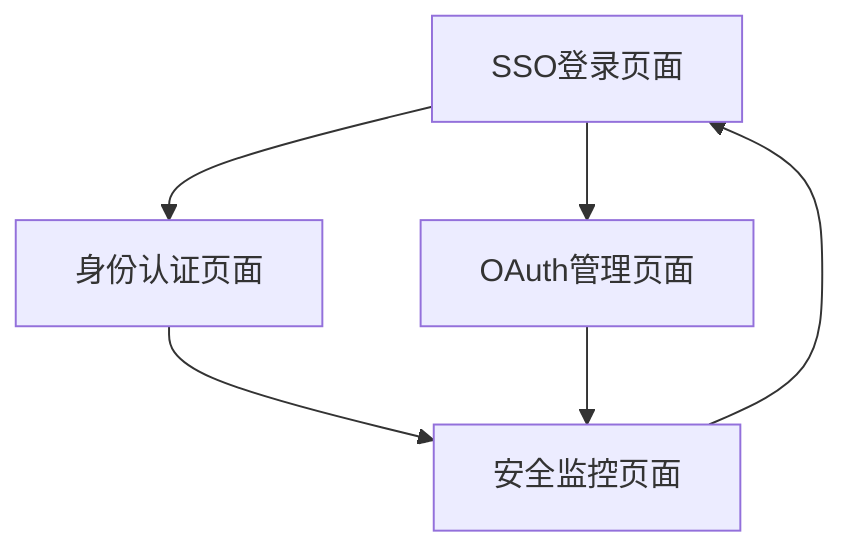
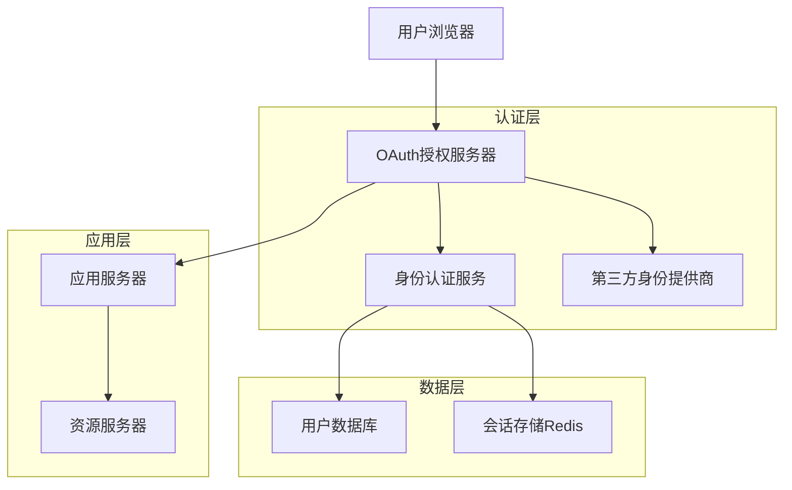
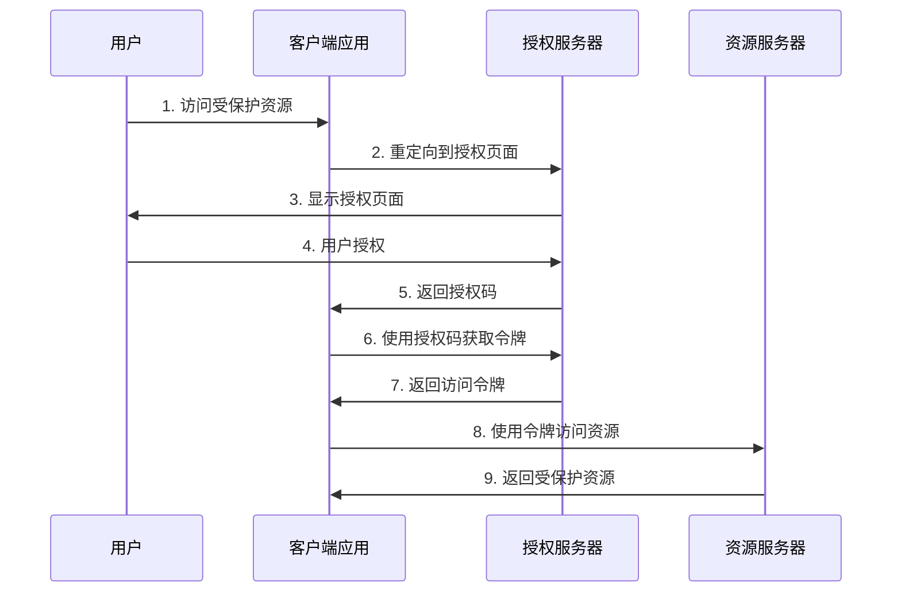
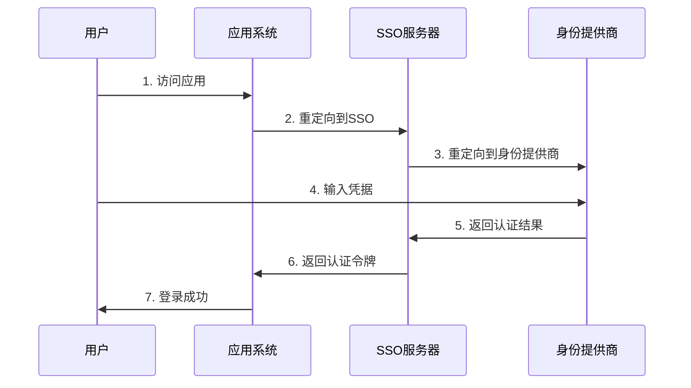
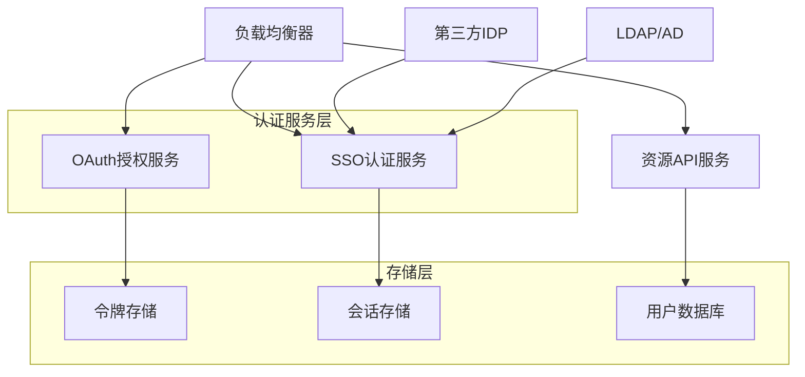
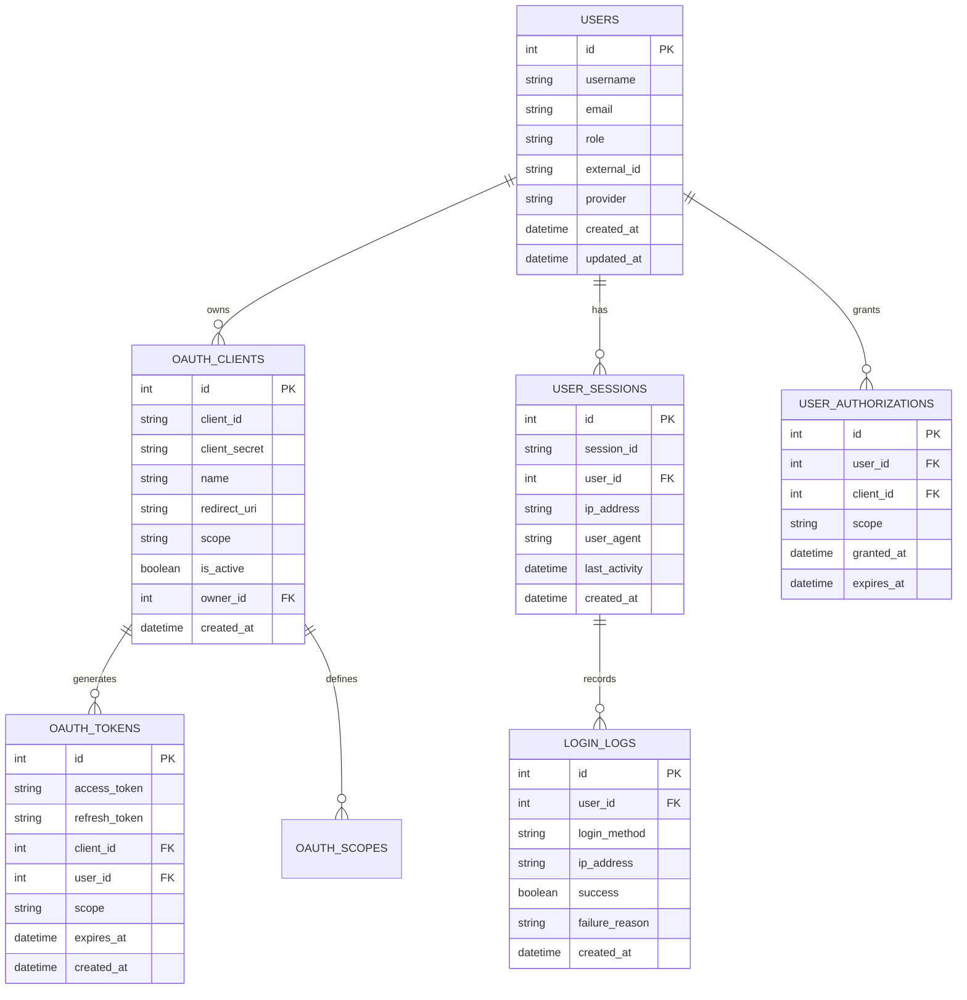

# OAuth 2.0/SSO集成技术设计文档

## 1. 产品概述

本模块实现OAuth
2.0标准和单点登录(SSO)功能，支持与医院现有身份认证系统集成，提供安全、便捷的统一身份认证服务。

## 2. 核心功能

### 2.1 用户角色

| 角色   | 注册方式               | 核心权限                                     |
| ------ | ---------------------- | -------------------------------------------- |
| 管理员 | 系统管理员分配         | 可配置OAuth应用，管理SSO集成，查看认证日志   |
| 医生   | SSO自动同步或OAuth授权 | 可使用SSO登录，管理授权应用，查看登录历史    |
| 患者   | 邮箱注册或第三方OAuth  | 可使用第三方登录，管理授权权限，查看账户安全 |

### 2.2 功能模块

本系统包含以下核心页面：

1. **SSO登录页面**: 统一登录入口，第三方登录选项
2. **OAuth管理页面**: 应用注册、授权管理、权限配置
3. **身份认证页面**: 用户认证、权限验证、会话管理
4. **安全监控页面**: 登录日志、异常检测、安全审计

### 2.3 页面详情

| 页面名称      | 模块名称   | 功能描述                             |
| ------------- | ---------- | ------------------------------------ |
| SSO登录页面   | 统一登录   | 支持多种登录方式，自动跳转，会话保持 |
| SSO登录页面   | 第三方集成 | 微信、支付宝、Google等第三方登录     |
| OAuth管理页面 | 应用注册   | OAuth应用创建、配置、密钥管理        |
| OAuth管理页面 | 授权管理   | 用户授权列表、权限范围、撤销授权     |
| 身份认证页面  | 用户验证   | 多因素认证、身份验证、权限检查       |
| 身份认证页面  | 会话管理   | 会话创建、续期、销毁、并发控制       |
| 安全监控页面  | 登录监控   | 实时登录状态、异常登录检测           |
| 安全监控页面  | 审计日志   | 认证日志、操作记录、安全事件         |

## 3. 核心流程

### 管理员流程

1. 登录系统 → OAuth管理页面 → 创建OAuth应用 → 配置权限范围
2. 安全监控页面 → 查看认证日志 → 分析异常行为 → 调整安全策略
3. SSO配置 → 集成第三方身份提供商 → 测试SSO流程

### 医生流程

1. 访问系统 → SSO登录页面 → 选择医院SSO → 自动登录成功
2. OAuth管理页面 → 查看已授权应用 → 管理授权权限
3. 安全设置 → 启用多因素认证 → 查看登录历史

### 患者流程

1. 访问系统 → 选择第三方登录 → 授权确认 → 登录成功
2. 账户设置 → 绑定多个登录方式 → 管理授权应用
3. 安全中心 → 查看登录记录 → 设置安全选项



## 4. 用户界面设计

### 4.1 设计风格

- **主色调**: #4F46E5 (认证紫), #F8FAFC (背景灰)
- **辅助色**: #10B981 (成功绿), #EF4444 (错误红), #F59E0B (警告橙), #6366F1
  (链接蓝)
- **按钮样式**: 圆角8px，渐变效果，品牌色彩
- **字体**: Inter 14px (正文), Inter 18px (标题), SF Mono 12px (代码)
- **布局风格**: 居中卡片设计，简洁登录界面
- **图标风格**: Heroicons线性图标，品牌Logo集成

### 4.2 页面设计概览

| 页面名称      | 模块名称 | UI元素                                   |
| ------------- | -------- | ---------------------------------------- |
| SSO登录页面   | 统一登录 | 登录表单、第三方按钮、品牌Logo、安全提示 |
| OAuth管理页面 | 应用注册 | 表单组件、密钥显示、权限选择器、状态指示 |
| 身份认证页面  | 用户验证 | 验证码输入、生物识别、安全问题、进度指示 |
| 安全监控页面  | 登录监控 | 数据表格、筛选器、状态标签、时间选择器   |

### 4.3 响应式设计

- **移动优先**: 适配手机端登录体验
- **桌面增强**: 1200px+宽屏多列布局
- **触摸优化**: 大按钮设计，手势支持

## 5. 技术架构

### 5.1 架构设计



### 5.2 技术描述

- **前端**: React@18 + TypeScript + React Router + TailwindCSS
- **后端**: Express@4 + TypeScript + Passport.js + OAuth2-server
- **认证**: JWT + OAuth 2.0 + SAML 2.0
- **会话**: Redis + Express-session
- **数据库**: MySQL

### 5.3 路由定义

| 路由           | 用途                          |
| -------------- | ----------------------------- |
| /auth/login    | SSO登录页面，统一登录入口     |
| /auth/oauth    | OAuth管理页面，应用和授权管理 |
| /auth/verify   | 身份认证页面，多因素认证      |
| /auth/security | 安全监控页面，日志和审计      |
| /auth/callback | OAuth回调处理，第三方登录回调 |

### 5.4 API定义

#### 4.1 OAuth 2.0 API

**授权码获取**

```
GET /oauth/authorize
```

请求参数: | 参数名称 | 参数类型 | 是否必需 | 描述 |
|----------|----------|----------|------| | response_type | string | true
| 固定值"code" | | client_id | string | true | 客户端ID | | redirect_uri |
string | true | 回调地址 | | scope | string | false | 权限范围 | | state |
string | false | 状态参数 |

**访问令牌获取**

```
POST /oauth/token
```

请求: | 参数名称 | 参数类型 | 是否必需 | 描述 |
|----------|----------|----------|------| | grant_type | string | true
| 授权类型 | | code | string | true | 授权码 | | client_id | string | true
| 客户端ID | | client_secret | string | true | 客户端密钥 | | redirect_uri |
string | true | 回调地址 |

响应: | 参数名称 | 参数类型 | 描述 | |----------|----------|------| |
access_token | string | 访问令牌 | | token_type | string | 令牌类型 | |
expires_in | number | 过期时间(秒) | | refresh_token | string | 刷新令牌 | |
scope | string | 权限范围 |

示例:

```json
{
  "access_token": "eyJhbGciOiJIUzI1NiIsInR5cCI6IkpXVCJ9...",
  "token_type": "Bearer",
  "expires_in": 3600,
  "refresh_token": "def50200...",
  "scope": "read write"
}
```

**用户信息获取**

```
GET /oauth/userinfo
Authorization: Bearer {access_token}
```

**SSO登录接口**

```
POST /auth/sso/login
GET /auth/sso/metadata
POST /auth/sso/callback
```

**第三方登录接口**

```
GET /auth/oauth/{provider}
GET /auth/oauth/{provider}/callback
```

### 5.5 OAuth 2.0流程定义

#### 授权码流程



#### SSO流程



### 5.6 服务器架构图



### 5.7 数据模型

#### 6.1 数据模型定义



#### 6.2 数据定义语言

**用户表 (users)**

```sql
-- 创建用户表
CREATE TABLE users (
    id INT AUTO_INCREMENT PRIMARY KEY,
    username VARCHAR(50) UNIQUE NOT NULL,
    email VARCHAR(100) UNIQUE NOT NULL,
    password_hash VARCHAR(255),
    role ENUM('doctor', 'administrator', 'patient') NOT NULL DEFAULT 'patient',
    department VARCHAR(100),
    full_name VARCHAR(100) NOT NULL,
    phone VARCHAR(20),
    external_id VARCHAR(100), -- 外部系统用户ID
    provider VARCHAR(50), -- 身份提供商(local, google, wechat, hospital_sso)
    is_active BOOLEAN DEFAULT TRUE,
    email_verified BOOLEAN DEFAULT FALSE,
    two_factor_enabled BOOLEAN DEFAULT FALSE,
    created_at TIMESTAMP DEFAULT CURRENT_TIMESTAMP,
    updated_at TIMESTAMP DEFAULT CURRENT_TIMESTAMP ON UPDATE CURRENT_TIMESTAMP
);

-- 创建索引
CREATE INDEX idx_users_email ON users(email);
CREATE INDEX idx_users_external_id ON users(external_id, provider);
CREATE INDEX idx_users_role ON users(role);
```

**OAuth客户端表 (oauth_clients)**

```sql
CREATE TABLE oauth_clients (
    id INT AUTO_INCREMENT PRIMARY KEY,
    client_id VARCHAR(80) UNIQUE NOT NULL,
    client_secret VARCHAR(80) NOT NULL,
    name VARCHAR(100) NOT NULL,
    description TEXT,
    redirect_uri TEXT NOT NULL,
    scope VARCHAR(255) DEFAULT 'read',
    grant_types VARCHAR(255) DEFAULT 'authorization_code',
    is_active BOOLEAN DEFAULT TRUE,
    owner_id INT NOT NULL,
    created_at TIMESTAMP DEFAULT CURRENT_TIMESTAMP,
    updated_at TIMESTAMP DEFAULT CURRENT_TIMESTAMP ON UPDATE CURRENT_TIMESTAMP,
    FOREIGN KEY (owner_id) REFERENCES users(id) ON DELETE CASCADE
);

-- 创建索引
CREATE INDEX idx_oauth_clients_client_id ON oauth_clients(client_id);
CREATE INDEX idx_oauth_clients_owner_id ON oauth_clients(owner_id);
```

**OAuth令牌表 (oauth_tokens)**

```sql
CREATE TABLE oauth_tokens (
    id INT AUTO_INCREMENT PRIMARY KEY,
    access_token VARCHAR(255) UNIQUE NOT NULL,
    refresh_token VARCHAR(255) UNIQUE,
    client_id INT NOT NULL,
    user_id INT NOT NULL,
    scope VARCHAR(255),
    expires_at TIMESTAMP NOT NULL,
    created_at TIMESTAMP DEFAULT CURRENT_TIMESTAMP,
    FOREIGN KEY (client_id) REFERENCES oauth_clients(id) ON DELETE CASCADE,
    FOREIGN KEY (user_id) REFERENCES users(id) ON DELETE CASCADE
);

-- 创建索引
CREATE INDEX idx_oauth_tokens_access_token ON oauth_tokens(access_token);
CREATE INDEX idx_oauth_tokens_refresh_token ON oauth_tokens(refresh_token);
CREATE INDEX idx_oauth_tokens_expires_at ON oauth_tokens(expires_at);
CREATE INDEX idx_oauth_tokens_user_id ON oauth_tokens(user_id);
```

**用户会话表 (user_sessions)**

```sql
CREATE TABLE user_sessions (
    id INT AUTO_INCREMENT PRIMARY KEY,
    session_id VARCHAR(128) UNIQUE NOT NULL,
    user_id INT NOT NULL,
    ip_address VARCHAR(45) NOT NULL,
    user_agent TEXT,
    last_activity TIMESTAMP DEFAULT CURRENT_TIMESTAMP,
    expires_at TIMESTAMP NOT NULL,
    created_at TIMESTAMP DEFAULT CURRENT_TIMESTAMP,
    FOREIGN KEY (user_id) REFERENCES users(id) ON DELETE CASCADE
);

-- 创建索引
CREATE INDEX idx_user_sessions_session_id ON user_sessions(session_id);
CREATE INDEX idx_user_sessions_user_id ON user_sessions(user_id);
CREATE INDEX idx_user_sessions_expires_at ON user_sessions(expires_at);
```

**用户授权表 (user_authorizations)**

```sql
CREATE TABLE user_authorizations (
    id INT AUTO_INCREMENT PRIMARY KEY,
    user_id INT NOT NULL,
    client_id INT NOT NULL,
    scope VARCHAR(255) NOT NULL,
    granted_at TIMESTAMP DEFAULT CURRENT_TIMESTAMP,
    expires_at TIMESTAMP,
    is_active BOOLEAN DEFAULT TRUE,
    FOREIGN KEY (user_id) REFERENCES users(id) ON DELETE CASCADE,
    FOREIGN KEY (client_id) REFERENCES oauth_clients(id) ON DELETE CASCADE,
    UNIQUE KEY unique_user_client (user_id, client_id)
);

-- 创建索引
CREATE INDEX idx_user_authorizations_user_id ON user_authorizations(user_id);
CREATE INDEX idx_user_authorizations_client_id ON user_authorizations(client_id);
```

**登录日志表 (login_logs)**

```sql
CREATE TABLE login_logs (
    id INT AUTO_INCREMENT PRIMARY KEY,
    user_id INT,
    username VARCHAR(100),
    login_method ENUM('password', 'oauth', 'sso', 'two_factor') NOT NULL,
    provider VARCHAR(50), -- google, wechat, hospital_sso等
    ip_address VARCHAR(45) NOT NULL,
    user_agent TEXT,
    success BOOLEAN NOT NULL,
    failure_reason VARCHAR(255),
    session_id VARCHAR(128),
    created_at TIMESTAMP DEFAULT CURRENT_TIMESTAMP,
    FOREIGN KEY (user_id) REFERENCES users(id) ON DELETE SET NULL
);

-- 创建索引
CREATE INDEX idx_login_logs_user_id ON login_logs(user_id);
CREATE INDEX idx_login_logs_success ON login_logs(success);
CREATE INDEX idx_login_logs_created_at ON login_logs(created_at DESC);
CREATE INDEX idx_login_logs_ip_address ON login_logs(ip_address);
```

**初始化数据**

```sql
-- 插入初始用户
INSERT INTO users (username, email, password_hash, role, department, full_name, provider) VALUES
('admin', 'admin@hospital.com', '$2b$12$hash_here', 'administrator', 'IT部门', '系统管理员', 'local'),
('dr_zhang', 'zhang@hospital.com', '$2b$12$hash_here', 'doctor', '放射科', '张医生', 'hospital_sso'),
('patient001', 'patient@email.com', '$2b$12$hash_here', 'patient', NULL, '患者张三', 'local');

-- 插入默认OAuth客户端
INSERT INTO oauth_clients (client_id, client_secret, name, description, redirect_uri, scope, owner_id) VALUES
('hospital_web_app', 'secret_key_here', '医院Web应用', '医院管理系统Web端', 'https://hospital.com/auth/callback', 'read write', 1),
('mobile_app', 'mobile_secret_here', '移动端应用', '医院管理系统移动端', 'https://app.hospital.com/callback', 'read', 1),
('third_party_api', 'api_secret_here', '第三方API', '外部系统API访问', 'https://external.com/callback', 'read', 1);
```

## 6. 实现步骤

### 阶段1: OAuth 2.0基础架构 (2天)

1. 搭建OAuth 2.0授权服务器
2. 实现授权码和令牌管理
3. 开发客户端注册和管理
4. 创建权限范围控制

### 阶段2: SSO集成开发 (1.5天)

1. 实现SAML 2.0协议支持
2. 开发第三方身份提供商集成
3. 添加会话管理和单点登出
4. 实现用户属性映射

### 阶段3: 安全增强功能 (1天)

1. 开发多因素认证
2. 实现异常登录检测
3. 添加安全审计日志
4. 创建风险评估机制

### 阶段4: 前端界面开发 (1天)

1. 创建统一登录界面
2. 实现OAuth管理面板
3. 开发安全监控页面
4. 添加用户授权管理

### 阶段5: 测试和优化 (0.5天)

1. 安全性测试和漏洞扫描
2. 性能优化和负载测试
3. 集成测试和兼容性验证
4. 文档完善和部署指南

## 7. 风险评估

### 高风险项

- **安全漏洞**: OAuth实现不当可能导致授权绕过
- **令牌泄露**: 访问令牌被恶意获取和滥用

### 中风险项

- **会话劫持**: 用户会话被恶意劫持
- **CSRF攻击**: 跨站请求伪造攻击

### 低风险项

- **配置错误**: OAuth客户端配置不当
- **兼容性问题**: 第三方系统集成兼容性

### 风险缓解措施

1. **安全编码**: 严格按照OAuth 2.0安全最佳实践
2. **令牌管理**: 短期令牌、定期轮换、安全存储
3. **会话保护**: HTTPS传输、安全Cookie、CSRF防护
4. **监控告警**: 异常登录检测、安全事件告警

## 8. 性能指标

- **认证响应时间**: <500ms
- **令牌生成速度**: >1000次/秒
- **并发登录支持**: 10000+用户
- **会话管理**: 支持100万+活跃会话
- **安全性**: 99.9%安全事件检测率

## 9. 监控和日志

- **认证监控**: 实时监控登录成功率、失败原因分析
- **安全监控**: 异常登录检测、多地登录告警
- **性能监控**: 认证服务响应时间、令牌生成性能
- **审计日志**: 完整的认证和授权操作记录
- **合规报告**: 定期生成安全合规报告
