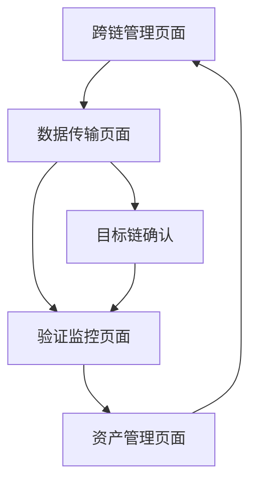
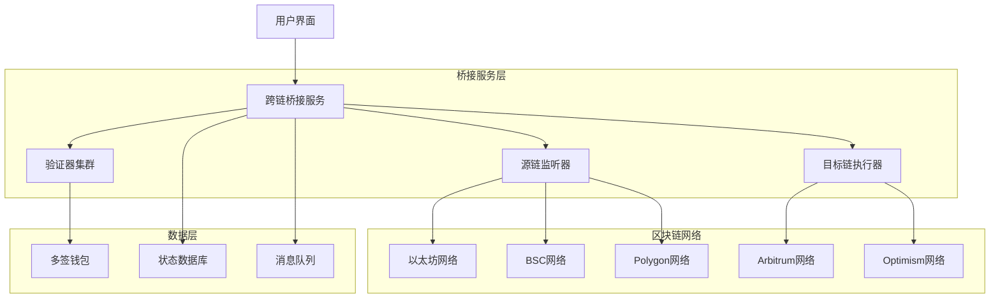
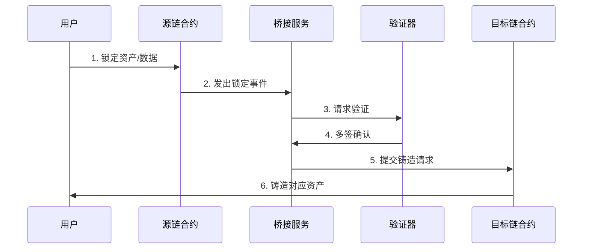
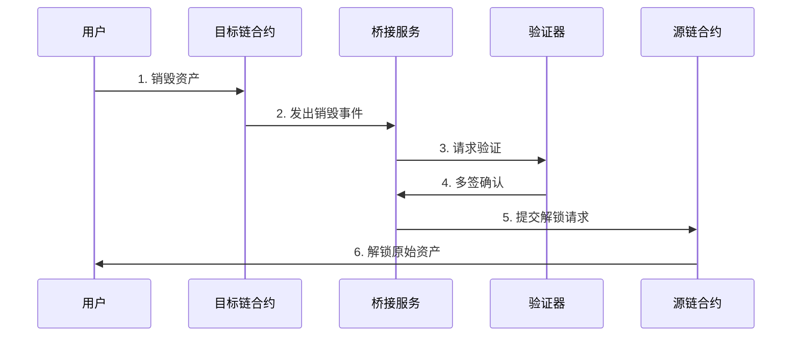
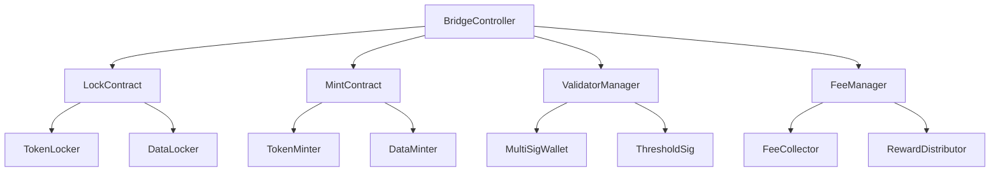
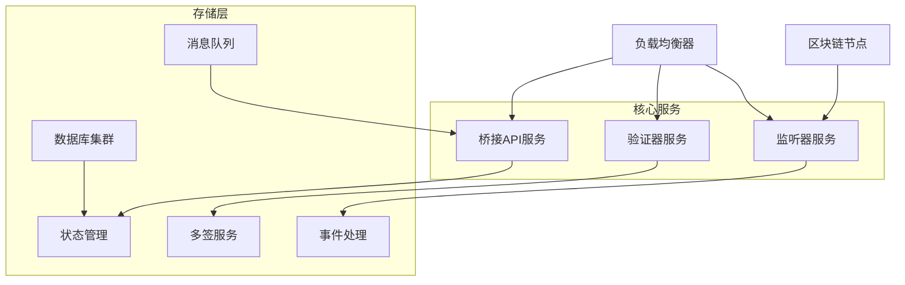
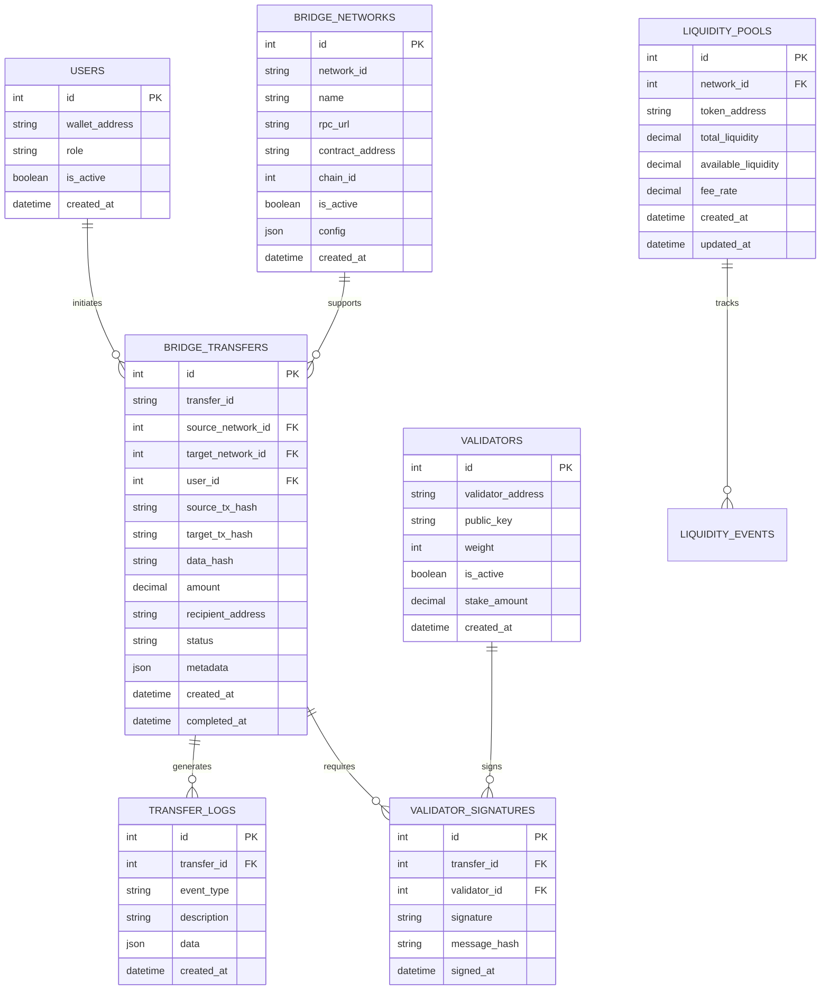

# 跨链桥接功能技术设计文档

## 1. 产品概述

本模块实现区块链跨链桥接功能，支持医疗数据在不同区块链网络间的安全传输和验证，确保数据完整性和可追溯性。

## 2. 核心功能

### 2.1 用户角色

| 角色   | 注册方式       | 核心权限                                         |
| ------ | -------------- | ------------------------------------------------ |
| 管理员 | 系统管理员分配 | 可配置跨链网络，管理桥接规则，监控跨链交易       |
| 医生   | 医院认证注册   | 可发起跨链数据传输，查看传输状态，验证数据完整性 |
| 患者   | 身份验证注册   | 可授权数据跨链传输，查看传输记录，管理数据权限   |

### 2.2 功能模块

本系统包含以下核心页面：

1. **跨链管理页面**: 网络配置、桥接规则、节点管理
2. **数据传输页面**: 跨链发起、状态监控、结果确认
3. **验证监控页面**: 交易验证、共识状态、安全检查
4. **资产管理页面**: 代币桥接、流动性管理、手续费设置

### 2.3 页面详情

| 页面名称     | 模块名称   | 功能描述                          |
| ------------ | ---------- | --------------------------------- |
| 跨链管理页面 | 网络配置   | 支持链配置、RPC节点管理、合约部署 |
| 跨链管理页面 | 桥接规则   | 传输规则设置、验证策略、安全参数  |
| 数据传输页面 | 跨链发起   | 数据打包、目标链选择、手续费计算  |
| 数据传输页面 | 状态监控   | 实时状态跟踪、进度显示、异常处理  |
| 验证监控页面 | 交易验证   | 多签验证、共识确认、最终性检查    |
| 验证监控页面 | 安全检查   | 恶意交易检测、重放攻击防护        |
| 资产管理页面 | 代币桥接   | 代币锁定/铸造、流动性池管理       |
| 资产管理页面 | 手续费管理 | 费率设置、收益分配、成本优化      |

## 3. 核心流程

### 管理员流程

1. 登录系统 → 跨链管理页面 → 配置支持链网络 → 部署桥接合约
2. 验证监控页面 → 监控跨链交易 → 处理异常情况 → 调整安全参数
3. 资产管理页面 → 管理流动性池 → 设置手续费率

### 医生流程

1. 数据传输页面 → 选择医疗数据 → 选择目标链 → 发起跨链传输
2. 验证监控页面 → 跟踪传输状态 → 确认数据到达 → 验证数据完整性
3. 跨链管理页面 → 查看传输历史 → 分析传输效率

### 患者流程

1. 数据传输页面 → 授权数据传输 → 选择共享范围 → 确认跨链操作
2. 验证监控页面 → 查看传输记录 → 验证数据状态
3. 资产管理页面 → 管理数据访问权限 → 查看收益分配



## 4. 用户界面设计

### 4.1 设计风格

- **主色调**: #1E40AF (区块链蓝), #F8FAFC (背景灰)
- **辅助色**: #10B981 (成功绿), #EF4444 (错误红), #F59E0B (警告橙), #8B5CF6
  (紫色)
- **按钮样式**: 圆角6px，渐变效果，科技感设计
- **字体**: Inter 14px (正文), Inter 18px (标题), SF Mono 12px (哈希值)
- **布局风格**: 网格布局，实时数据面板
- **图标风格**: 区块链主题图标，网络拓扑图

### 4.2 页面设计概览

| 页面名称     | 模块名称 | UI元素                                   |
| ------------ | -------- | ---------------------------------------- |
| 跨链管理页面 | 网络配置 | 网络卡片、状态指示器、配置表单、连接测试 |
| 数据传输页面 | 跨链发起 | 数据选择器、链选择器、进度条、确认按钮   |
| 验证监控页面 | 交易验证 | 交易列表、状态标签、验证进度、详情弹窗   |
| 资产管理页面 | 代币桥接 | 余额显示、转账表单、历史记录、流动性图表 |

### 4.3 响应式设计

- **桌面优先**: 1200px+多面板布局
- **移动适配**: 768px以下单列布局
- **实时更新**: WebSocket数据推送

## 5. 技术架构

### 5.1 架构设计



### 5.2 技术描述

- **前端**: React@18 + TypeScript + Web3.js + Ethers.js
- **后端**: Node.js + Express + TypeScript + Web3 Provider
- **区块链**: Solidity + Hardhat + OpenZeppelin
- **验证**: 多签钱包 + 阈值签名 + MPC
- **数据库**: MySQL + Redis

### 5.3 路由定义

| 路由             | 用途                             |
| ---------------- | -------------------------------- |
| /bridge/manage   | 跨链管理页面，网络和规则配置     |
| /bridge/transfer | 数据传输页面，发起和监控传输     |
| /bridge/verify   | 验证监控页面，交易验证和安全检查 |
| /bridge/assets   | 资产管理页面，代币和流动性管理   |
| /bridge/history  | 历史记录页面，传输历史和统计     |

### 5.4 API定义

#### 4.1 跨链传输API

**发起跨链传输**

```
POST /api/bridge/transfer
```

请求: | 参数名称 | 参数类型 | 是否必需 | 描述 |
|----------|----------|----------|------| | sourceChain | string | true
| 源链网络ID | | targetChain | string | true | 目标链网络ID | | dataHash |
string | true | 数据哈希值 | | amount | string | false | 传输金额 | | recipient
| string | true | 接收地址 | | metadata | object | false | 附加元数据 |

响应: | 参数名称 | 参数类型 | 描述 | |----------|----------|------| | transferId
| string | 传输唯一ID | | txHash | string | 源链交易哈希 | | status | string
| 传输状态 | | estimatedTime | number | 预计完成时间(分钟) |

示例:

```json
{
  "sourceChain": "ethereum",
  "targetChain": "polygon",
  "dataHash": "0x1234567890abcdef...",
  "amount": "100",
  "recipient": "0xabcdef1234567890...",
  "metadata": {
    "patientId": "P001",
    "dataType": "medical_record"
  }
}
```

**查询传输状态**

```
GET /api/bridge/transfer/{transferId}
```

响应: | 参数名称 | 参数类型 | 描述 | |----------|----------|------| | transferId
| string | 传输ID | | status | string | 当前状态 | | sourceChain | string
| 源链信息 | | targetChain | string | 目标链信息 | | progress | object
| 进度详情 | | transactions | array | 相关交易列表 |

**验证器签名**

```
POST /api/bridge/validate
GET /api/bridge/validators
```

**网络配置管理**

```
GET /api/bridge/networks
POST /api/bridge/networks
PUT /api/bridge/networks/{networkId}
```

**流动性管理**

```
GET /api/bridge/liquidity
POST /api/bridge/liquidity/add
POST /api/bridge/liquidity/remove
```

### 5.5 跨链协议定义

#### Lock-Mint模式



#### Burn-Unlock模式



### 5.6 智能合约架构



### 5.7 服务器架构图



### 5.8 数据模型

#### 6.1 数据模型定义



#### 6.2 数据定义语言

**用户表 (users)**

```sql
-- 创建用户表
CREATE TABLE users (
    id INT AUTO_INCREMENT PRIMARY KEY,
    wallet_address VARCHAR(42) UNIQUE NOT NULL,
    username VARCHAR(50),
    email VARCHAR(100),
    role ENUM('doctor', 'administrator', 'patient') NOT NULL DEFAULT 'patient',
    is_active BOOLEAN DEFAULT TRUE,
    nonce VARCHAR(32), -- 用于钱包签名验证
    created_at TIMESTAMP DEFAULT CURRENT_TIMESTAMP,
    updated_at TIMESTAMP DEFAULT CURRENT_TIMESTAMP ON UPDATE CURRENT_TIMESTAMP
);

-- 创建索引
CREATE INDEX idx_users_wallet_address ON users(wallet_address);
CREATE INDEX idx_users_role ON users(role);
```

**桥接网络表 (bridge_networks)**

```sql
CREATE TABLE bridge_networks (
    id INT AUTO_INCREMENT PRIMARY KEY,
    network_id VARCHAR(50) UNIQUE NOT NULL,
    name VARCHAR(100) NOT NULL,
    rpc_url VARCHAR(255) NOT NULL,
    contract_address VARCHAR(42) NOT NULL,
    chain_id INT NOT NULL,
    block_confirmations INT DEFAULT 12,
    is_active BOOLEAN DEFAULT TRUE,
    config JSON, -- 网络特定配置
    created_at TIMESTAMP DEFAULT CURRENT_TIMESTAMP,
    updated_at TIMESTAMP DEFAULT CURRENT_TIMESTAMP ON UPDATE CURRENT_TIMESTAMP
);

-- 创建索引
CREATE INDEX idx_bridge_networks_network_id ON bridge_networks(network_id);
CREATE INDEX idx_bridge_networks_chain_id ON bridge_networks(chain_id);
```

**跨链传输表 (bridge_transfers)**

```sql
CREATE TABLE bridge_transfers (
    id INT AUTO_INCREMENT PRIMARY KEY,
    transfer_id VARCHAR(66) UNIQUE NOT NULL, -- 0x + 64字符
    source_network_id INT NOT NULL,
    target_network_id INT NOT NULL,
    user_id INT NOT NULL,
    source_tx_hash VARCHAR(66),
    target_tx_hash VARCHAR(66),
    data_hash VARCHAR(66) NOT NULL,
    amount DECIMAL(36, 18) DEFAULT 0,
    recipient_address VARCHAR(42) NOT NULL,
    status ENUM('pending', 'confirmed', 'validated', 'completed', 'failed') DEFAULT 'pending',
    fee_amount DECIMAL(36, 18) DEFAULT 0,
    metadata JSON,
    created_at TIMESTAMP DEFAULT CURRENT_TIMESTAMP,
    completed_at TIMESTAMP NULL,
    FOREIGN KEY (source_network_id) REFERENCES bridge_networks(id),
    FOREIGN KEY (target_network_id) REFERENCES bridge_networks(id),
    FOREIGN KEY (user_id) REFERENCES users(id)
);

-- 创建索引
CREATE INDEX idx_bridge_transfers_transfer_id ON bridge_transfers(transfer_id);
CREATE INDEX idx_bridge_transfers_user_id ON bridge_transfers(user_id);
CREATE INDEX idx_bridge_transfers_status ON bridge_transfers(status);
CREATE INDEX idx_bridge_transfers_created_at ON bridge_transfers(created_at DESC);
CREATE INDEX idx_bridge_transfers_source_tx_hash ON bridge_transfers(source_tx_hash);
```

**验证器表 (validators)**

```sql
CREATE TABLE validators (
    id INT AUTO_INCREMENT PRIMARY KEY,
    validator_address VARCHAR(42) UNIQUE NOT NULL,
    public_key VARCHAR(130) NOT NULL, -- 压缩公钥
    weight INT DEFAULT 1,
    is_active BOOLEAN DEFAULT TRUE,
    stake_amount DECIMAL(36, 18) DEFAULT 0,
    reputation_score DECIMAL(5, 2) DEFAULT 100.00,
    last_activity TIMESTAMP DEFAULT CURRENT_TIMESTAMP,
    created_at TIMESTAMP DEFAULT CURRENT_TIMESTAMP
);

-- 创建索引
CREATE INDEX idx_validators_validator_address ON validators(validator_address);
CREATE INDEX idx_validators_is_active ON validators(is_active);
```

**验证器签名表 (validator_signatures)**

```sql
CREATE TABLE validator_signatures (
    id INT AUTO_INCREMENT PRIMARY KEY,
    transfer_id INT NOT NULL,
    validator_id INT NOT NULL,
    signature VARCHAR(132) NOT NULL, -- r + s + v
    message_hash VARCHAR(66) NOT NULL,
    signed_at TIMESTAMP DEFAULT CURRENT_TIMESTAMP,
    FOREIGN KEY (transfer_id) REFERENCES bridge_transfers(id) ON DELETE CASCADE,
    FOREIGN KEY (validator_id) REFERENCES validators(id),
    UNIQUE KEY unique_transfer_validator (transfer_id, validator_id)
);

-- 创建索引
CREATE INDEX idx_validator_signatures_transfer_id ON validator_signatures(transfer_id);
CREATE INDEX idx_validator_signatures_validator_id ON validator_signatures(validator_id);
```

**传输日志表 (transfer_logs)**

```sql
CREATE TABLE transfer_logs (
    id INT AUTO_INCREMENT PRIMARY KEY,
    transfer_id INT NOT NULL,
    event_type ENUM('initiated', 'confirmed', 'validated', 'completed', 'failed', 'retry') NOT NULL,
    description TEXT,
    tx_hash VARCHAR(66),
    block_number BIGINT,
    gas_used BIGINT,
    data JSON,
    created_at TIMESTAMP DEFAULT CURRENT_TIMESTAMP,
    FOREIGN KEY (transfer_id) REFERENCES bridge_transfers(id) ON DELETE CASCADE
);

-- 创建索引
CREATE INDEX idx_transfer_logs_transfer_id ON transfer_logs(transfer_id);
CREATE INDEX idx_transfer_logs_event_type ON transfer_logs(event_type);
CREATE INDEX idx_transfer_logs_created_at ON transfer_logs(created_at DESC);
```

**流动性池表 (liquidity_pools)**

```sql
CREATE TABLE liquidity_pools (
    id INT AUTO_INCREMENT PRIMARY KEY,
    network_id INT NOT NULL,
    token_address VARCHAR(42) NOT NULL,
    token_symbol VARCHAR(20) NOT NULL,
    total_liquidity DECIMAL(36, 18) DEFAULT 0,
    available_liquidity DECIMAL(36, 18) DEFAULT 0,
    fee_rate DECIMAL(5, 4) DEFAULT 0.0030, -- 0.3%
    min_transfer_amount DECIMAL(36, 18) DEFAULT 0,
    max_transfer_amount DECIMAL(36, 18) DEFAULT 0,
    is_active BOOLEAN DEFAULT TRUE,
    created_at TIMESTAMP DEFAULT CURRENT_TIMESTAMP,
    updated_at TIMESTAMP DEFAULT CURRENT_TIMESTAMP ON UPDATE CURRENT_TIMESTAMP,
    FOREIGN KEY (network_id) REFERENCES bridge_networks(id),
    UNIQUE KEY unique_network_token (network_id, token_address)
);

-- 创建索引
CREATE INDEX idx_liquidity_pools_network_id ON liquidity_pools(network_id);
CREATE INDEX idx_liquidity_pools_token_address ON liquidity_pools(token_address);
```

**初始化数据**

```sql
-- 插入支持的区块链网络
INSERT INTO bridge_networks (network_id, name, rpc_url, contract_address, chain_id, block_confirmations) VALUES
('ethereum', 'Ethereum Mainnet', 'https://mainnet.infura.io/v3/YOUR_KEY', '0x1234567890123456789012345678901234567890', 1, 12),
('polygon', 'Polygon Mainnet', 'https://polygon-rpc.com', '0x2345678901234567890123456789012345678901', 137, 20),
('bsc', 'Binance Smart Chain', 'https://bsc-dataseed.binance.org', '0x3456789012345678901234567890123456789012', 56, 15),
('arbitrum', 'Arbitrum One', 'https://arb1.arbitrum.io/rpc', '0x4567890123456789012345678901234567890123', 42161, 1),
('optimism', 'Optimism Mainnet', 'https://mainnet.optimism.io', '0x5678901234567890123456789012345678901234', 10, 1);

-- 插入验证器
INSERT INTO validators (validator_address, public_key, weight, stake_amount) VALUES
('0xValidator1Address...', '0x04PublicKey1...', 1, 1000.0),
('0xValidator2Address...', '0x04PublicKey2...', 1, 1000.0),
('0xValidator3Address...', '0x04PublicKey3...', 1, 1000.0),
('0xValidator4Address...', '0x04PublicKey4...', 1, 1000.0),
('0xValidator5Address...', '0x04PublicKey5...', 1, 1000.0);

-- 插入流动性池
INSERT INTO liquidity_pools (network_id, token_address, token_symbol, total_liquidity, available_liquidity, min_transfer_amount, max_transfer_amount) VALUES
(1, '0xA0b86a33E6441E6C7D3E4C7C5C6C8C8C8C8C8C8C', 'USDC', 1000000.0, 800000.0, 10.0, 100000.0),
(2, '0xB1c97a44F7552E7D4E5D8D9D6D7D8D9D8D9D8D9D', 'USDC', 500000.0, 400000.0, 10.0, 50000.0),
(3, '0xC2d08b55G8663F8E5F9E0E1E2E3E4E5E6E7E8E9E', 'USDT', 800000.0, 600000.0, 10.0, 80000.0);
```

## 6. 实现步骤

### 阶段1: 智能合约开发 (3天)

1. 开发桥接核心合约
2. 实现锁定/铸造机制
3. 添加多签验证逻辑
4. 部署到测试网络

### 阶段2: 验证器服务 (2天)

1. 开发验证器节点
2. 实现多签名协议
3. 添加共识机制
4. 创建监控和告警

### 阶段3: 桥接服务开发 (2天)

1. 开发事件监听器
2. 实现状态管理
3. 添加交易处理逻辑
4. 创建API接口

### 阶段4: 前端界面开发 (1.5天)

1. 创建跨链管理界面
2. 实现传输监控页面
3. 开发资产管理功能
4. 添加实时状态更新

### 阶段5: 安全测试和优化 (1.5天)

1. 安全审计和漏洞测试
2. 性能优化和压力测试
3. 集成测试和兼容性验证
4. 主网部署准备

## 7. 风险评估

### 高风险项

- **智能合约漏洞**: 可能导致资金损失
- **验证器作恶**: 恶意验证器攻击桥接

### 中风险项

- **网络拥堵**: 影响跨链传输速度
- **流动性不足**: 大额传输失败

### 低风险项

- **配置错误**: 网络参数配置不当
- **兼容性问题**: 不同链的兼容性

### 风险缓解措施

1. **安全审计**: 第三方安全公司审计
2. **多签机制**: 多个验证器共同验证
3. **流动性管理**: 动态调整流动性池
4. **监控告警**: 实时监控异常交易

## 8. 性能指标

- **传输速度**: 平均5-15分钟完成
- **成功率**: >99.5%
- **手续费**: <1%传输金额
- **支持网络**: 5+主流区块链
- **并发处理**: 1000+笔/小时

## 9. 监控和日志

- **交易监控**: 实时跟踪跨链交易状态
- **验证器监控**: 监控验证器活跃度和性能
- **流动性监控**: 监控各池子流动性状况
- **安全监控**: 检测异常交易和攻击行为
- **性能监控**: 监控系统响应时间和吞吐量
