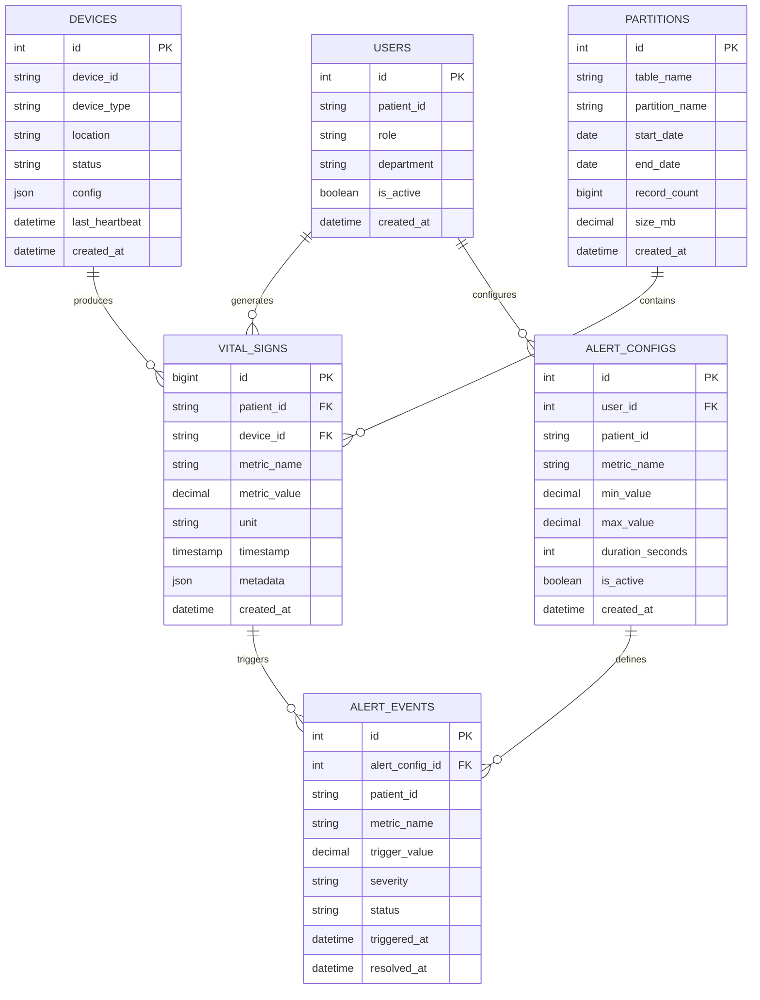

# TimescaleDB时间序列技术设计文档

## 1. 产品概述

本模块实现基于MySQL的时间序列数据存储和分析功能，专门处理医疗监护设备产生的大量时间序列数据，如生命体征、监护数据等，提供高效的数据写入、查询和分析能力。

## 2. 核心功能

### 2.1 用户角色

| 角色   | 注册方式       | 核心权限                                                   |
| ------ | -------------- | ---------------------------------------------------------- |
| 管理员 | 系统管理员分配 | 可配置时间序列表，管理数据分区，监控系统性能，查看所有数据 |
| 医生   | 医院认证注册   | 可查看患者监护数据，分析生命体征趋势，导出报告数据         |
| 患者   | 身份验证注册   | 可查看自己的监护数据，查看历史趋势，设置数据共享权限       |

### 2.2 功能模块

本系统包含以下核心页面：

1. **数据采集页面**: 设备接入、数据验证、实时写入
2. **监控分析页面**: 实时监控、趋势分析、异常检测
3. **查询管理页面**: 历史查询、数据导出、报表生成
4. **系统管理页面**: 分区管理、性能监控、存储优化

### 2.3 页面详情

| 页面名称     | 模块名称 | 功能描述                                     |
| ------------ | -------- | -------------------------------------------- |
| 数据采集页面 | 设备接入 | 支持多种医疗设备协议，数据格式验证，批量写入 |
| 数据采集页面 | 实时写入 | 高频数据写入，数据压缩，异常处理             |
| 监控分析页面 | 实时监控 | 生命体征实时显示，阈值告警，趋势预测         |
| 监控分析页面 | 趋势分析 | 历史数据分析，统计图表，异常检测             |
| 查询管理页面 | 历史查询 | 时间范围查询，条件筛选，聚合统计             |
| 查询管理页面 | 数据导出 | 多格式导出，批量下载，报表生成               |
| 系统管理页面 | 分区管理 | 自动分区创建，历史数据归档，存储优化         |
| 系统管理页面 | 性能监控 | 写入性能监控，查询性能分析，资源使用统计     |

## 3. 核心流程

### 管理员流程

1. 登录系统 → 系统管理页面 → 配置时间序列表 → 设置分区策略
2. 数据采集页面 → 配置设备接入 → 监控数据写入性能
3. 系统管理页面 → 查看系统性能 → 优化存储配置 → 管理历史数据

### 医生流程

1. 监控分析页面 → 选择患者 → 查看实时生命体征 → 分析异常数据
2. 查询管理页面 → 查询历史数据 → 生成趋势报告 → 导出分析结果
3. 监控分析页面 → 设置告警阈值 → 接收异常通知

### 患者流程

1. 监控分析页面 → 查看个人监护数据 → 了解健康趋势
2. 查询管理页面 → 查看历史记录 → 下载个人报告
3. 系统管理页面 → 设置数据共享权限 → 管理隐私设置


## 4. 用户界面设计

### 4.1 设计风格

- **主色调**: #059669 (医疗绿), #F8FAFC (背景灰)
- **辅助色**: #DC2626 (告警红), #2563EB (信息蓝), #F59E0B (警告橙), #7C3AED
  (紫色)
- **按钮样式**: 圆角4px，医疗主题设计
- **字体**: Inter 14px (正文), Inter 16px (标题), SF Mono 12px (数据)
- **布局风格**: 仪表板布局，实时数据面板
- **图标风格**: 医疗设备图标，生命体征符号

### 4.2 页面设计概览

| 页面名称     | 模块名称 | UI元素                                     |
| ------------ | -------- | ------------------------------------------ |
| 数据采集页面 | 设备接入 | 设备列表、连接状态、配置表单、数据预览     |
| 监控分析页面 | 实时监控 | 生命体征图表、告警面板、趋势曲线、数据表格 |
| 查询管理页面 | 历史查询 | 时间选择器、筛选器、结果表格、导出按钮     |
| 系统管理页面 | 分区管理 | 分区列表、存储统计、性能图表、配置面板     |

### 4.3 响应式设计

- **桌面优先**: 1200px+多面板仪表板
- **移动适配**: 768px以下单列布局
- **实时更新**: WebSocket推送数据更新

## 5. 技术架构

### 5.1 架构设计


### 5.2 技术描述

- **前端**: React@18 + TypeScript + Chart.js + Socket.io-client
- **后端**: Node.js + Express + TypeScript + Socket.io
- **数据库**: MySQL 8.0 + 分区表 + 索引优化
- **缓存**: Redis + 时间窗口缓存
- **消息队列**: Redis Streams + Bull Queue

### 5.3 路由定义

| 路由                | 用途                             |
| ------------------- | -------------------------------- |
| /timeseries/collect | 数据采集页面，设备管理和数据写入 |
| /timeseries/monitor | 监控分析页面，实时监控和趋势分析 |
| /timeseries/query   | 查询管理页面，历史查询和数据导出 |
| /timeseries/admin   | 系统管理页面，分区和性能管理     |
| /timeseries/alerts  | 告警管理页面，告警配置和通知     |

### 5.4 API定义

#### 4.1 时间序列数据API

**批量写入时间序列数据**

```
POST /api/timeseries/batch
```

请求: | 参数名称 | 参数类型 | 是否必需 | 描述 |
|----------|----------|----------|------| | deviceId | string | true | 设备ID |
| patientId | string | true | 患者ID | | metrics | array | true | 指标数据数组 |
| timestamp | number | true | 时间戳(毫秒) |

响应: | 参数名称 | 参数类型 | 描述 | |----------|----------|------| | success |
boolean | 写入是否成功 | | inserted | number | 成功插入记录数 | | failed |
number | 失败记录数 | | errors | array | 错误详情 |

示例:

```json
{
  "deviceId": "MONITOR_001",
  "patientId": "P001",
  "metrics": [
    {
      "name": "heart_rate",
      "value": 72,
      "unit": "bpm",
      "timestamp": 1703123456789
    },
    {
      "name": "blood_pressure_systolic",
      "value": 120,
      "unit": "mmHg",
      "timestamp": 1703123456789
    }
  ]
}
```

**查询时间序列数据**

```
GET /api/timeseries/query
```

请求参数: | 参数名称 | 参数类型 | 是否必需 | 描述 |
|----------|----------|----------|------| | patientId | string | true | 患者ID |
| metrics | string | false | 指标名称(逗号分隔) | | startTime | number | true
| 开始时间戳 | | endTime | number | true | 结束时间戳 | | interval | string |
false | 聚合间隔(1m,5m,1h,1d) | | aggregation | string | false
| 聚合函数(avg,min,max,sum) |

**实时数据流**

```
WebSocket /ws/timeseries/realtime
```

**数据聚合分析**

```
POST /api/timeseries/aggregate
GET /api/timeseries/statistics
```

**告警配置管理**

```
GET /api/timeseries/alerts
POST /api/timeseries/alerts
PUT /api/timeseries/alerts/{alertId}
```

### 5.5 MySQL时间序列优化策略

#### 分区策略

```sql
-- 按时间范围分区(每月一个分区)
CREATE TABLE vital_signs (
    id BIGINT AUTO_INCREMENT,
    patient_id VARCHAR(50) NOT NULL,
    device_id VARCHAR(50) NOT NULL,
    metric_name VARCHAR(50) NOT NULL,
    metric_value DECIMAL(10,3) NOT NULL,
    unit VARCHAR(20),
    timestamp TIMESTAMP(3) NOT NULL,
    created_at TIMESTAMP DEFAULT CURRENT_TIMESTAMP,
    PRIMARY KEY (id, timestamp),
    INDEX idx_patient_metric_time (patient_id, metric_name, timestamp),
    INDEX idx_device_time (device_id, timestamp)
) PARTITION BY RANGE (UNIX_TIMESTAMP(timestamp)) (
    PARTITION p202401 VALUES LESS THAN (UNIX_TIMESTAMP('2024-02-01')),
    PARTITION p202402 VALUES LESS THAN (UNIX_TIMESTAMP('2024-03-01')),
    PARTITION p202403 VALUES LESS THAN (UNIX_TIMESTAMP('2024-04-01')),
    PARTITION p_future VALUES LESS THAN MAXVALUE
);
```

#### 索引优化

```sql
-- 复合索引优化查询性能
CREATE INDEX idx_patient_metric_time_value ON vital_signs
(patient_id, metric_name, timestamp, metric_value);

-- 覆盖索引减少回表
CREATE INDEX idx_device_time_covering ON vital_signs
(device_id, timestamp) INCLUDE (metric_name, metric_value, unit);
```

### 5.6 服务器架构图


### 5.7 数据模型

#### 6.1 数据模型定义



#### 6.2 数据定义语言

**用户表 (users)**

```sql
-- 创建用户表
CREATE TABLE users (
    id INT AUTO_INCREMENT PRIMARY KEY,
    patient_id VARCHAR(50) UNIQUE,
    username VARCHAR(50) UNIQUE NOT NULL,
    email VARCHAR(100) UNIQUE NOT NULL,
    role ENUM('doctor', 'administrator', 'patient') NOT NULL DEFAULT 'patient',
    department VARCHAR(100),
    full_name VARCHAR(100) NOT NULL,
    is_active BOOLEAN DEFAULT TRUE,
    created_at TIMESTAMP DEFAULT CURRENT_TIMESTAMP,
    updated_at TIMESTAMP DEFAULT CURRENT_TIMESTAMP ON UPDATE CURRENT_TIMESTAMP
);

-- 创建索引
CREATE INDEX idx_users_patient_id ON users(patient_id);
CREATE INDEX idx_users_role ON users(role);
```

**设备表 (devices)**

```sql
CREATE TABLE devices (
    id INT AUTO_INCREMENT PRIMARY KEY,
    device_id VARCHAR(50) UNIQUE NOT NULL,
    device_type ENUM('monitor', 'ventilator', 'ecg', 'pulse_oximeter', 'blood_pressure') NOT NULL,
    device_name VARCHAR(100) NOT NULL,
    location VARCHAR(100),
    status ENUM('online', 'offline', 'maintenance', 'error') DEFAULT 'offline',
    config JSON,
    last_heartbeat TIMESTAMP NULL,
    created_at TIMESTAMP DEFAULT CURRENT_TIMESTAMP,
    updated_at TIMESTAMP DEFAULT CURRENT_TIMESTAMP ON UPDATE CURRENT_TIMESTAMP
);

-- 创建索引
CREATE INDEX idx_devices_device_id ON devices(device_id);
CREATE INDEX idx_devices_status ON devices(status);
CREATE INDEX idx_devices_type ON devices(device_type);
```

**生命体征表 (vital_signs) - 分区表**

```sql
CREATE TABLE vital_signs (
    id BIGINT AUTO_INCREMENT,
    patient_id VARCHAR(50) NOT NULL,
    device_id VARCHAR(50) NOT NULL,
    metric_name VARCHAR(50) NOT NULL,
    metric_value DECIMAL(12,3) NOT NULL,
    unit VARCHAR(20),
    quality_score TINYINT DEFAULT 100, -- 数据质量评分
    timestamp TIMESTAMP(3) NOT NULL,
    metadata JSON,
    created_at TIMESTAMP DEFAULT CURRENT_TIMESTAMP,
    PRIMARY KEY (id, timestamp),
    INDEX idx_patient_metric_time (patient_id, metric_name, timestamp),
    INDEX idx_device_time (device_id, timestamp),
    INDEX idx_metric_time_value (metric_name, timestamp, metric_value),
    FOREIGN KEY (patient_id) REFERENCES users(patient_id),
    FOREIGN KEY (device_id) REFERENCES devices(device_id)
) PARTITION BY RANGE (UNIX_TIMESTAMP(timestamp)) (
    PARTITION p202401 VALUES LESS THAN (UNIX_TIMESTAMP('2024-02-01')),
    PARTITION p202402 VALUES LESS THAN (UNIX_TIMESTAMP('2024-03-01')),
    PARTITION p202403 VALUES LESS THAN (UNIX_TIMESTAMP('2024-04-01')),
    PARTITION p202404 VALUES LESS THAN (UNIX_TIMESTAMP('2024-05-01')),
    PARTITION p202405 VALUES LESS THAN (UNIX_TIMESTAMP('2024-06-01')),
    PARTITION p202406 VALUES LESS THAN (UNIX_TIMESTAMP('2024-07-01')),
    PARTITION p_future VALUES LESS THAN MAXVALUE
);
```

**告警配置表 (alert_configs)**

```sql
CREATE TABLE alert_configs (
    id INT AUTO_INCREMENT PRIMARY KEY,
    user_id INT NOT NULL,
    patient_id VARCHAR(50) NOT NULL,
    metric_name VARCHAR(50) NOT NULL,
    min_value DECIMAL(12,3),
    max_value DECIMAL(12,3),
    duration_seconds INT DEFAULT 60, -- 持续时间阈值
    severity ENUM('low', 'medium', 'high', 'critical') DEFAULT 'medium',
    notification_methods JSON, -- ['email', 'sms', 'push']
    is_active BOOLEAN DEFAULT TRUE,
    created_at TIMESTAMP DEFAULT CURRENT_TIMESTAMP,
    updated_at TIMESTAMP DEFAULT CURRENT_TIMESTAMP ON UPDATE CURRENT_TIMESTAMP,
    FOREIGN KEY (user_id) REFERENCES users(id),
    FOREIGN KEY (patient_id) REFERENCES users(patient_id),
    UNIQUE KEY unique_user_patient_metric (user_id, patient_id, metric_name)
);

-- 创建索引
CREATE INDEX idx_alert_configs_patient_id ON alert_configs(patient_id);
CREATE INDEX idx_alert_configs_metric_name ON alert_configs(metric_name);
CREATE INDEX idx_alert_configs_is_active ON alert_configs(is_active);
```

**告警事件表 (alert_events)**

```sql
CREATE TABLE alert_events (
    id INT AUTO_INCREMENT PRIMARY KEY,
    alert_config_id INT NOT NULL,
    patient_id VARCHAR(50) NOT NULL,
    metric_name VARCHAR(50) NOT NULL,
    trigger_value DECIMAL(12,3) NOT NULL,
    threshold_value DECIMAL(12,3) NOT NULL,
    severity ENUM('low', 'medium', 'high', 'critical') NOT NULL,
    status ENUM('active', 'acknowledged', 'resolved') DEFAULT 'active',
    message TEXT,
    triggered_at TIMESTAMP DEFAULT CURRENT_TIMESTAMP,
    acknowledged_at TIMESTAMP NULL,
    acknowledged_by INT NULL,
    resolved_at TIMESTAMP NULL,
    FOREIGN KEY (alert_config_id) REFERENCES alert_configs(id),
    FOREIGN KEY (patient_id) REFERENCES users(patient_id),
    FOREIGN KEY (acknowledged_by) REFERENCES users(id)
);

-- 创建索引
CREATE INDEX idx_alert_events_patient_id ON alert_events(patient_id);
CREATE INDEX idx_alert_events_status ON alert_events(status);
CREATE INDEX idx_alert_events_triggered_at ON alert_events(triggered_at DESC);
CREATE INDEX idx_alert_events_severity ON alert_events(severity);
```

**分区管理表 (partitions)**

```sql
CREATE TABLE partitions (
    id INT AUTO_INCREMENT PRIMARY KEY,
    table_name VARCHAR(64) NOT NULL,
    partition_name VARCHAR(64) NOT NULL,
    start_date DATE NOT NULL,
    end_date DATE NOT NULL,
    record_count BIGINT DEFAULT 0,
    size_mb DECIMAL(10,2) DEFAULT 0,
    status ENUM('active', 'archived', 'dropped') DEFAULT 'active',
    created_at TIMESTAMP DEFAULT CURRENT_TIMESTAMP,
    updated_at TIMESTAMP DEFAULT CURRENT_TIMESTAMP ON UPDATE CURRENT_TIMESTAMP,
    UNIQUE KEY unique_table_partition (table_name, partition_name)
);

-- 创建索引
CREATE INDEX idx_partitions_table_name ON partitions(table_name);
CREATE INDEX idx_partitions_status ON partitions(status);
CREATE INDEX idx_partitions_end_date ON partitions(end_date);
```

**数据聚合表 (vital_signs_hourly) - 小时级聚合**

```sql
CREATE TABLE vital_signs_hourly (
    id BIGINT AUTO_INCREMENT PRIMARY KEY,
    patient_id VARCHAR(50) NOT NULL,
    metric_name VARCHAR(50) NOT NULL,
    hour_timestamp TIMESTAMP NOT NULL,
    avg_value DECIMAL(12,3),
    min_value DECIMAL(12,3),
    max_value DECIMAL(12,3),
    count_records INT,
    std_deviation DECIMAL(12,3),
    created_at TIMESTAMP DEFAULT CURRENT_TIMESTAMP,
    INDEX idx_patient_metric_hour (patient_id, metric_name, hour_timestamp),
    FOREIGN KEY (patient_id) REFERENCES users(patient_id)
) PARTITION BY RANGE (UNIX_TIMESTAMP(hour_timestamp)) (
    PARTITION p202401 VALUES LESS THAN (UNIX_TIMESTAMP('2024-02-01')),
    PARTITION p202402 VALUES LESS THAN (UNIX_TIMESTAMP('2024-03-01')),
    PARTITION p202403 VALUES LESS THAN (UNIX_TIMESTAMP('2024-04-01')),
    PARTITION p_future VALUES LESS THAN MAXVALUE
);
```

**初始化数据**

```sql
-- 插入初始用户
INSERT INTO users (patient_id, username, email, role, department, full_name) VALUES
('P001', 'admin', 'admin@hospital.com', 'administrator', 'IT部门', '系统管理员'),
('P002', 'dr_zhang', 'zhang@hospital.com', 'doctor', '心内科', '张医生'),
('P003', 'patient001', 'patient001@email.com', 'patient', NULL, '患者张三'),
('P004', 'patient002', 'patient002@email.com', 'patient', NULL, '患者李四');

-- 插入医疗设备
INSERT INTO devices (device_id, device_type, device_name, location, status) VALUES
('MONITOR_001', 'monitor', '飞利浦监护仪MP70', 'ICU-001', 'online'),
('ECG_001', 'ecg', '心电图机GE MAC 2000', 'CCU-001', 'online'),
('BP_001', 'blood_pressure', '血压计欧姆龙HEM-7080IC', '内科-001', 'online'),
('PULSE_001', 'pulse_oximeter', '血氧仪迈瑞PM-60', 'ICU-002', 'online');

-- 插入告警配置
INSERT INTO alert_configs (user_id, patient_id, metric_name, min_value, max_value, severity, notification_methods) VALUES
(2, 'P003', 'heart_rate', 60, 100, 'medium', '["email", "push"]'),
(2, 'P003', 'blood_pressure_systolic', 90, 140, 'high', '["email", "sms", "push"]'),
(2, 'P003', 'oxygen_saturation', 95, NULL, 'critical', '["email", "sms", "push"]'),
(2, 'P004', 'heart_rate', 50, 120, 'medium', '["email"]');

-- 插入分区信息
INSERT INTO partitions (table_name, partition_name, start_date, end_date) VALUES
('vital_signs', 'p202401', '2024-01-01', '2024-01-31'),
('vital_signs', 'p202402', '2024-02-01', '2024-02-29'),
('vital_signs', 'p202403', '2024-03-01', '2024-03-31'),
('vital_signs_hourly', 'p202401', '2024-01-01', '2024-01-31'),
('vital_signs_hourly', 'p202402', '2024-02-01', '2024-02-29');
```

## 6. 实现步骤

### 阶段1: 数据库架构设计 (2天)

1. 设计时间序列表结构
2. 实现分区策略和索引优化
3. 创建聚合表和视图
4. 配置数据库性能参数

### 阶段2: 数据采集服务 (2天)

1. 开发设备接入API
2. 实现批量数据写入
3. 添加数据验证和清洗
4. 创建消息队列处理

### 阶段3: 查询分析服务 (2天)

1. 开发时间序列查询API
2. 实现数据聚合和统计
3. 添加实时数据推送
4. 创建缓存优化策略

### 阶段4: 前端界面开发 (1.5天)

1. 创建实时监控界面
2. 实现历史数据查询
3. 开发数据可视化图表
4. 添加告警管理功能

### 阶段5: 系统优化和测试 (1.5天)

1. 性能测试和调优
2. 分区管理自动化
3. 监控和告警配置
4. 数据归档策略实施

## 7. 风险评估

### 高风险项

- **数据丢失**: 高频写入可能导致数据丢失
- **性能瓶颈**: 大量并发查询影响系统性能

### 中风险项

- **存储空间**: 时间序列数据快速增长
- **查询超时**: 复杂聚合查询耗时过长

### 低风险项

- **分区管理**: 自动分区创建失败
- **数据质量**: 设备数据异常或缺失

### 风险缓解措施

1. **数据备份**: 实时备份和异地容灾
2. **性能监控**: 实时监控数据库性能指标
3. **存储优化**: 数据压缩和历史数据归档
4. **查询优化**: 索引优化和查询缓存

## 8. 性能指标

- **写入性能**: >10,000条记录/秒
- **查询响应**: <500ms (简单查询), <2s (复杂聚合)
- **存储效率**: 数据压缩率>60%
- **可用性**: 99.9%系统可用性
- **数据保留**: 原始数据保留1年，聚合数据保留5年

## 9. 监控和日志

- **写入监控**: 实时监控数据写入速率和成功率
- **查询监控**: 监控查询性能和慢查询
- **存储监控**: 监控磁盘使用率和分区状态
- **告警监控**: 监控告警触发和处理情况
- **系统监控**: 监控CPU、内存、网络等系统资源
