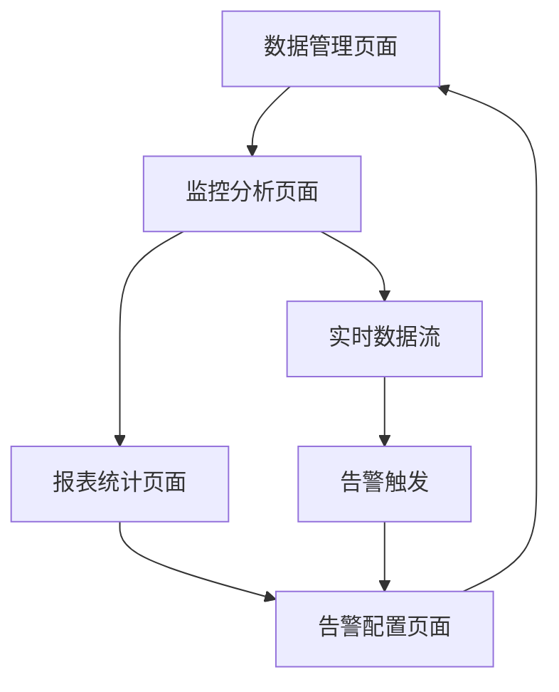
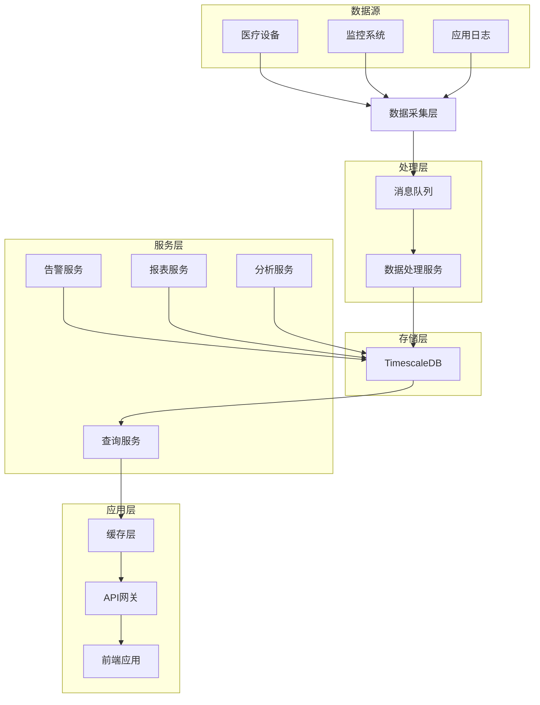
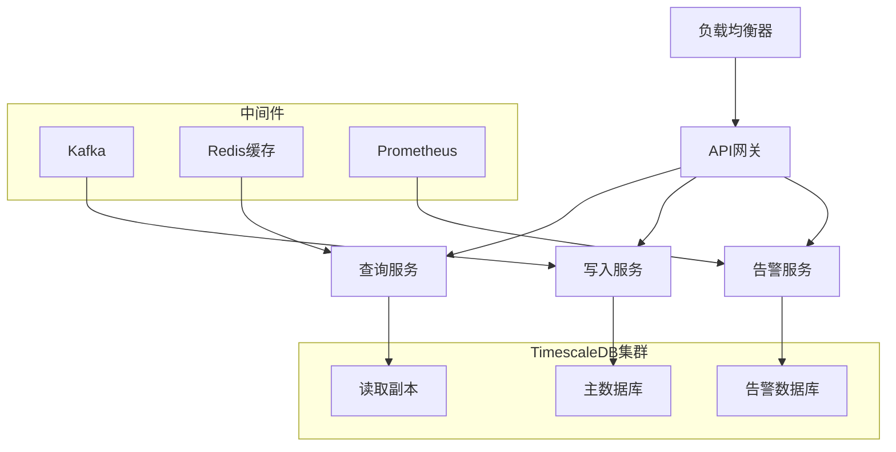

# TimescaleDB时间序列技术设计文档

## 1. 产品概述

本模块基于TimescaleDB实现高性能时间序列数据存储和分析，专门处理医疗设备监控数据、患者生命体征、系统性能指标等时序数据。

## 2. 核心功能

### 2.1 用户角色

| 角色   | 注册方式       | 核心权限                                         |
| ------ | -------------- | ------------------------------------------------ |
| 管理员 | 系统管理员分配 | 可配置时序数据库，管理数据保留策略，监控系统性能 |
| 医生   | 医院认证注册   | 可查询患者时序数据，生成趋势报告，设置监控告警   |
| 患者   | 身份验证注册   | 可查看个人健康数据趋势，导出历史记录             |

### 2.2 功能模块

本系统包含以下核心页面：

1. **数据管理页面**: 时序表管理、数据导入、保留策略
2. **监控分析页面**: 实时监控、趋势分析、异常检测
3. **报表统计页面**: 数据报表、统计图表、导出功能
4. **告警配置页面**: 阈值设置、告警规则、通知管理

### 2.3 页面详情

| 页面名称     | 模块名称   | 功能描述                         |
| ------------ | ---------- | -------------------------------- |
| 数据管理页面 | 时序表管理 | 创建超表、分区管理、索引优化     |
| 数据管理页面 | 数据导入   | 批量导入、实时写入、数据验证     |
| 监控分析页面 | 实时监控   | 实时数据展示、动态图表、状态监控 |
| 监控分析页面 | 趋势分析   | 历史趋势、预测分析、对比分析     |
| 报表统计页面 | 数据报表   | 定制报表、定时生成、格式导出     |
| 报表统计页面 | 统计图表   | 多维图表、交互分析、钻取功能     |
| 告警配置页面 | 阈值设置   | 动态阈值、多级告警、智能调整     |
| 告警配置页面 | 通知管理   | 告警通知、升级策略、静默规则     |

## 3. 核心流程

### 管理员流程

1. 登录系统 → 数据管理页面 → 创建时序表 → 配置保留策略
2. 监控分析页面 → 查看系统性能 → 优化查询性能 → 调整分区策略
3. 告警配置页面 → 设置系统告警 → 配置通知规则

### 医生流程

1. 监控分析页面 → 选择患者 → 查看实时数据 → 分析健康趋势
2. 报表统计页面 → 生成患者报告 → 导出数据 → 制定治疗方案
3. 告警配置页面 → 设置患者监控告警 → 配置紧急通知

### 患者流程

1. 监控分析页面 → 查看个人数据 → 了解健康状况
2. 报表统计页面 → 查看历史趋势 → 导出健康报告
3. 告警配置页面 → 设置个人提醒 → 管理通知偏好



## 4. 用户界面设计

### 4.1 设计风格

- **主色调**: #0F766E (时序绿), #F8FAFC (背景灰)
- **辅助色**: #10B981 (成功绿), #EF4444 (告警红), #F59E0B (警告橙), #3B82F6
  (信息蓝)
- **按钮样式**: 圆角4px，简洁设计，数据导向
- **字体**: Inter 14px (正文), Inter 16px (标题), SF Mono 12px (数值)
- **布局风格**: 仪表板布局，多图表展示
- **图标风格**: 数据分析图标，时间轴元素

### 4.2 页面设计概览

| 页面名称     | 模块名称   | UI元素                                     |
| ------------ | ---------- | ------------------------------------------ |
| 数据管理页面 | 时序表管理 | 表格列表、创建表单、分区视图、性能指标     |
| 监控分析页面 | 实时监控   | 时序图表、数值面板、状态指示器、时间选择器 |
| 报表统计页面 | 数据报表   | 报表模板、参数配置、预览窗口、导出按钮     |
| 告警配置页面 | 阈值设置   | 阈值滑块、规则编辑器、测试按钮、历史记录   |

### 4.3 响应式设计

- **桌面优先**: 1200px+多面板仪表板
- **移动适配**: 768px以下垂直布局
- **图表自适应**: 响应式图表和数据表格

## 5. 技术架构

### 5.1 架构设计



### 5.2 技术描述

- **前端**: React@18 + TypeScript + Chart.js + D3.js
- **后端**: Node.js + Express + TypeScript
- **数据库**: TimescaleDB (PostgreSQL扩展) + Redis
- **消息队列**: Apache Kafka + Redis Streams
- **监控**: Prometheus + Grafana

### 5.3 路由定义

| 路由                  | 用途                             |
| --------------------- | -------------------------------- |
| /timeseries/manage    | 数据管理页面，时序表和数据管理   |
| /timeseries/monitor   | 监控分析页面，实时监控和趋势分析 |
| /timeseries/reports   | 报表统计页面，数据报表和图表     |
| /timeseries/alerts    | 告警配置页面，告警规则和通知     |
| /timeseries/dashboard | 仪表板页面，综合数据展示         |

### 5.4 API定义

#### 4.1 时序数据API

**写入时序数据**

```
POST /api/timeseries/data
```

请求: | 参数名称 | 参数类型 | 是否必需 | 描述 |
|----------|----------|----------|------| | table | string | true | 时序表名 | |
timestamp | string | true | 时间戳(ISO 8601) | | metrics | object | true
| 指标数据 | | tags | object | false | 标签数据 |

响应: | 参数名称 | 参数类型 | 描述 | |----------|----------|------| | success |
boolean | 写入状态 | | rowsAffected | number | 影响行数 | | timestamp | string
| 服务器时间戳 |

示例:

```json
{
  "table": "patient_vitals",
  "timestamp": "2024-01-15T10:30:00Z",
  "metrics": {
    "heart_rate": 72,
    "blood_pressure_systolic": 120,
    "blood_pressure_diastolic": 80,
    "temperature": 36.5
  },
  "tags": {
    "patient_id": "P001",
    "device_id": "DEV001",
    "location": "ICU"
  }
}
```

**查询时序数据**

```
GET /api/timeseries/data
```

请求参数: | 参数名称 | 参数类型 | 是否必需 | 描述 |
|----------|----------|----------|------| | table | string | true | 时序表名 | |
start_time | string | true | 开始时间 | | end_time | string | true | 结束时间 |
| metrics | string | false | 指标列表(逗号分隔) | | tags | string | false
| 标签过滤条件 | | interval | string | false | 聚合间隔 | | aggregation | string
| false | 聚合函数 |

**批量写入数据**

```
POST /api/timeseries/batch
```

**数据聚合查询**

```
GET /api/timeseries/aggregate
```

**创建超表**

```
POST /api/timeseries/hypertable
```

**告警规则管理**

```
GET /api/timeseries/alerts
POST /api/timeseries/alerts
PUT /api/timeseries/alerts/{alertId}
DELETE /api/timeseries/alerts/{alertId}
```

### 5.5 TimescaleDB优化策略

#### 分区策略

```sql
-- 按时间自动分区(每天一个分区)
SELECT create_hypertable('patient_vitals', 'timestamp',
    chunk_time_interval => INTERVAL '1 day');

-- 按空间和时间分区
SELECT create_hypertable('device_metrics', 'timestamp',
    'device_id', 4, chunk_time_interval => INTERVAL '1 hour');
```

#### 压缩策略

```sql
-- 启用压缩(7天后压缩)
ALTER TABLE patient_vitals SET (
    timescaledb.compress,
    timescaledb.compress_segmentby = 'patient_id',
    timescaledb.compress_orderby = 'timestamp DESC'
);

-- 添加压缩策略
SELECT add_compression_policy('patient_vitals', INTERVAL '7 days');
```

#### 保留策略

```sql
-- 数据保留策略(1年后删除)
SELECT add_retention_policy('patient_vitals', INTERVAL '1 year');

-- 连续聚合
CREATE MATERIALIZED VIEW patient_vitals_hourly
WITH (timescaledb.continuous) AS
SELECT
    time_bucket('1 hour', timestamp) AS hour,
    patient_id,
    AVG(heart_rate) as avg_heart_rate,
    MAX(heart_rate) as max_heart_rate,
    MIN(heart_rate) as min_heart_rate
FROM patient_vitals
GROUP BY hour, patient_id;
```

### 5.6 服务器架构图



### 5.7 数据模型

#### 6.1 数据模型定义

```mermaid
erDiagram
    USERS ||--o{ PATIENT_VITALS : monitors
    USERS ||--o{ DEVICE_METRICS : owns
    USERS ||--o{ ALERT_RULES : creates
    ALERT_RULES ||--o{ ALERT_EVENTS : triggers
    HYPERTABLES ||--o{ PATIENT_VITALS : contains
    HYPERTABLES ||--o{ DEVICE_METRICS : contains

    USERS {
        int id PK
        string username
        string role
        datetime created_at
    }

    HYPERTABLES {
        string table_name PK
        string time_column
        string space_column
        interval
```
