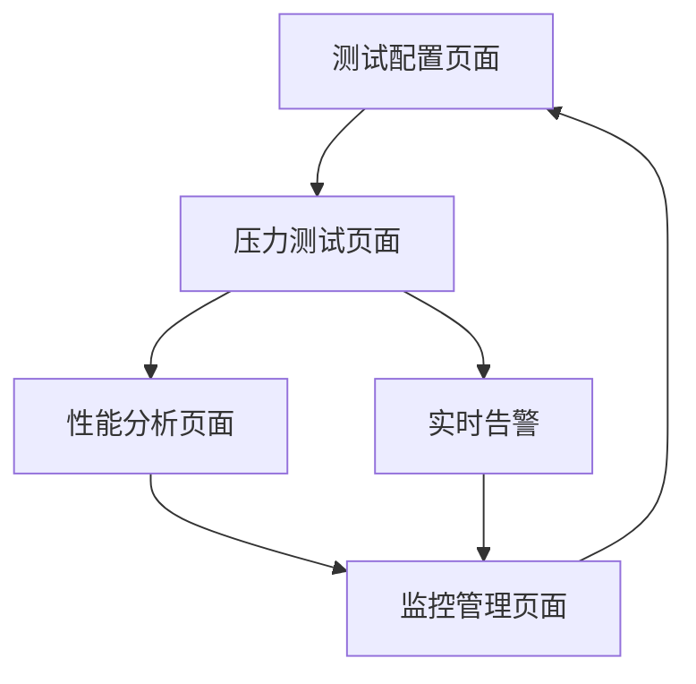
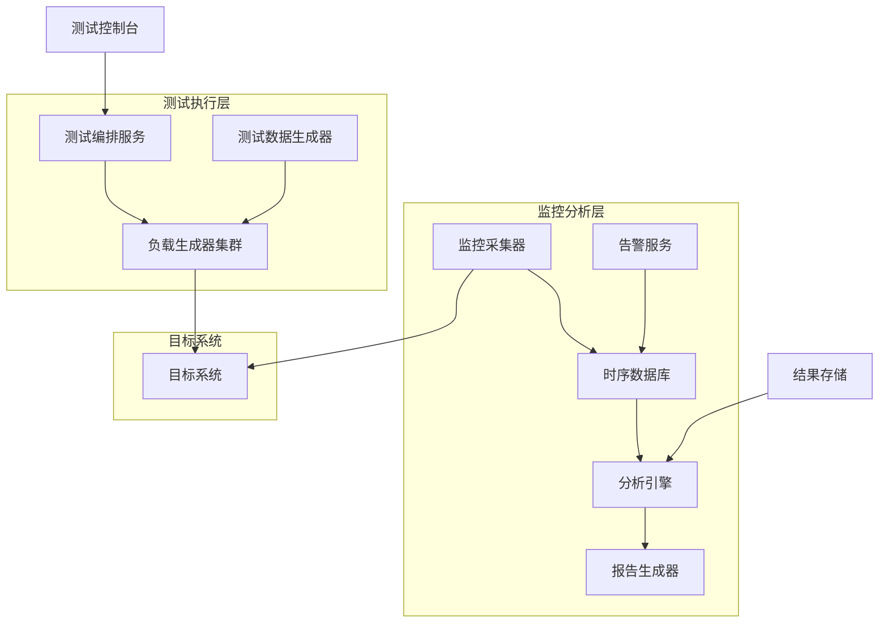
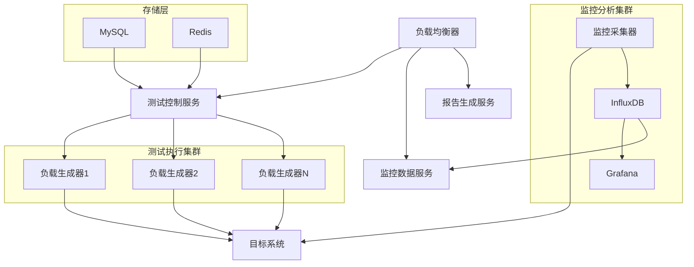
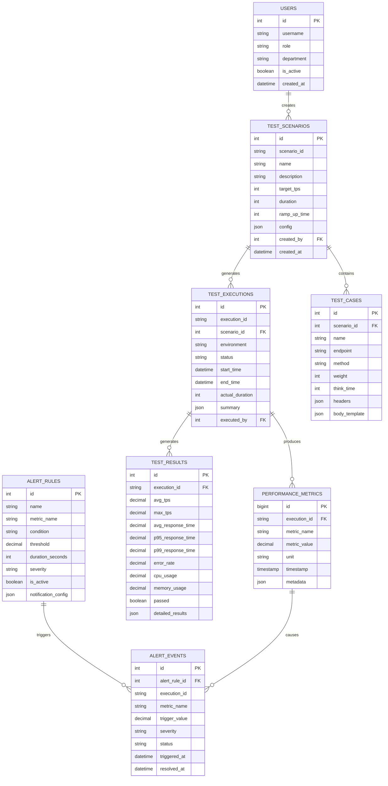

# 1000TPS性能验证设计文档

## 1. 产品概述

本模块实现系统1000TPS(每秒事务数)性能验证框架，通过全面的压力测试、性能监控和自动化验证，确保医疗数据管理系统在高并发场景下的稳定性和可靠性。

## 2. 核心功能

### 2.1 用户角色

| 角色   | 注册方式       | 核心权限                                       |
| ------ | -------------- | ---------------------------------------------- |
| 管理员 | 系统管理员分配 | 可配置测试场景，管理测试环境，查看所有性能报告 |
| 医生   | 医院认证注册   | 可查看系统性能状态，了解响应时间，参与性能反馈 |
| 患者   | 身份验证注册   | 可查看个人操作响应时间，了解系统可用性状态     |

### 2.2 功能模块

本系统包含以下核心页面：

1. **测试配置页面**: 场景配置、参数设置、环境管理
2. **压力测试页面**: 测试执行、实时监控、结果展示
3. **性能分析页面**: 数据分析、趋势图表、瓶颈识别
4. **监控管理页面**: 系统监控、告警配置、资源管理

### 2.3 页面详情

| 页面名称     | 模块名称 | 功能描述                                 |
| ------------ | -------- | ---------------------------------------- |
| 测试配置页面 | 场景配置 | 创建测试场景，设置并发数，配置测试数据   |
| 测试配置页面 | 环境管理 | 测试环境部署，数据库配置，服务器资源分配 |
| 压力测试页面 | 测试执行 | 启动压力测试，实时监控进度，动态调整参数 |
| 压力测试页面 | 实时监控 | TPS监控，响应时间统计，错误率分析        |
| 性能分析页面 | 数据分析 | 性能数据分析，瓶颈识别，优化建议         |
| 性能分析页面 | 报告生成 | 自动生成测试报告，性能对比，趋势分析     |
| 监控管理页面 | 系统监控 | CPU、内存、网络监控，数据库性能监控      |
| 监控管理页面 | 告警配置 | 性能阈值设置，告警规则配置，通知管理     |

## 3. 核心流程

### 管理员流程

1. 登录系统 → 测试配置页面 → 创建测试场景 → 配置测试参数
2. 压力测试页面 → 启动性能测试 → 监控测试进度 → 分析测试结果
3. 监控管理页面 → 配置系统监控 → 设置告警阈值 → 管理测试环境

### 医生流程

1. 性能分析页面 → 查看系统性能状态 → 了解响应时间趋势
2. 监控管理页面 → 查看系统可用性 → 了解性能影响
3. 测试配置页面 → 提交性能反馈 → 参与性能优化讨论

### 患者流程

1. 性能分析页面 → 查看个人操作响应时间 → 了解系统状态
2. 监控管理页面 → 查看系统可用性公告
3. 测试配置页面 → 提交使用体验反馈



## 4. 用户界面设计

### 4.1 设计风格

- **主色调**: #1E40AF (性能蓝), #F8FAFC (背景灰)
- **辅助色**: #DC2626 (错误红), #059669 (成功绿), #F59E0B (警告橙), #7C3AED
  (紫色)
- **按钮样式**: 圆角6px，科技感设计，状态指示
- **字体**: Inter 14px (正文), Inter 16px (标题), SF Mono 12px (数据)
- **布局风格**: 仪表板布局，实时数据面板
- **图标风格**: 性能监控图标，图表符号

### 4.2 页面设计概览

| 页面名称     | 模块名称 | UI元素                                 |
| ------------ | -------- | -------------------------------------- |
| 测试配置页面 | 场景配置 | 配置表单、参数滑块、场景模板、预览面板 |
| 压力测试页面 | 测试执行 | 控制按钮、进度条、实时图表、状态指示器 |
| 性能分析页面 | 数据分析 | 性能图表、数据表格、对比视图、导出按钮 |
| 监控管理页面 | 系统监控 | 监控面板、告警列表、资源图表、配置界面 |

### 4.3 响应式设计

- **桌面优先**: 1200px+多面板仪表板
- **移动适配**: 768px以下单列布局
- **实时更新**: WebSocket推送性能数据

## 5. 技术架构

### 5.1 架构设计



### 5.2 技术描述

- **前端**: React@18 + TypeScript + Chart.js + Socket.io-client
- **后端**: Node.js + Express + TypeScript + Socket.io
- **负载测试**: Artillery.js + K6 + JMeter + 自定义负载生成器
- **监控**: Prometheus + Grafana + InfluxDB
- **数据库**: MySQL + Redis + InfluxDB

### 5.3 路由定义

| 路由                  | 用途                         |
| --------------------- | ---------------------------- |
| /performance/config   | 测试配置页面，场景和参数配置 |
| /performance/test     | 压力测试页面，测试执行和监控 |
| /performance/analysis | 性能分析页面，数据分析和报告 |
| /performance/monitor  | 监控管理页面，系统监控和告警 |
| /performance/reports  | 报告管理页面，历史报告和对比 |

### 5.4 API定义

#### 4.1 测试配置API

**创建测试场景**

```
POST /api/performance/scenarios
```

请求: | 参数名称 | 参数类型 | 是否必需 | 描述 |
|----------|----------|----------|------| | name | string | true
| 测试场景名称 | | description | string | false | 场景描述 | | targetTPS |
number | true | 目标TPS | | duration | number | true | 测试持续时间(秒) | |
rampUpTime | number | true | 压力上升时间(秒) | | testCases | array | true
| 测试用例配置 |

响应: | 参数名称 | 参数类型 | 描述 | |----------|----------|------| | scenarioId
| string | 场景唯一ID | | status | string | 创建状态 | | estimatedDuration |
number | 预计执行时间 |

示例:

```json
{
  "name": "医疗数据高并发测试",
  "description": "验证1000TPS下的系统稳定性",
  "targetTPS": 1000,
  "duration": 300,
  "rampUpTime": 60,
  "testCases": [
    {
      "name": "患者数据查询",
      "weight": 40,
      "endpoint": "/api/patients/{id}",
      "method": "GET"
    },
    {
      "name": "医疗记录创建",
      "weight": 30,
      "endpoint": "/api/medical-records",
      "method": "POST"
    },
    {
      "name": "时间序列数据写入",
      "weight": 30,
      "endpoint": "/api/timeseries/batch",
      "method": "POST"
    }
  ]
}
```

**启动性能测试**

```
POST /api/performance/tests/start
```

请求: | 参数名称 | 参数类型 | 是否必需 | 描述 |
|----------|----------|----------|------| | scenarioId | string | true
| 测试场景ID | | environment | string | true | 测试环境 | | concurrency | number
| false | 并发数覆盖 | | dataSet | string | false | 测试数据集 |

**获取测试状态**

```
GET /api/performance/tests/{testId}/status
```

**实时性能数据**

```
WebSocket /ws/performance/realtime
```

**停止测试**

```
POST /api/performance/tests/{testId}/stop
```

#### 4.2 性能监控API

**获取性能指标**

```
GET /api/performance/metrics
```

请求参数: | 参数名称 | 参数类型 | 是否必需 | 描述 |
|----------|----------|----------|------| | testId | string | false | 测试ID | |
startTime | number | true | 开始时间戳 | | endTime | number | true
| 结束时间戳 | | metrics | string | false | 指标名称(逗号分隔) | | interval |
string | false | 聚合间隔 |

**生成性能报告**

```
POST /api/performance/reports/generate
GET /api/performance/reports/{reportId}
```

**配置告警规则**

```
GET /api/performance/alerts
POST /api/performance/alerts
PUT /api/performance/alerts/{alertId}
```

### 5.5 测试场景定义

#### 基准测试场景

```yaml
# 基准性能测试
baseline_test:
  name: '基准性能测试'
  target_tps: 100
  duration: 180
  ramp_up: 30
  test_cases:
    - name: '用户登录'
      weight: 20
      endpoint: '/api/auth/login'
      method: 'POST'
    - name: '患者查询'
      weight: 50
      endpoint: '/api/patients/search'
      method: 'GET'
    - name: '数据更新'
      weight: 30
      endpoint: '/api/patients/{id}'
      method: 'PUT'
```

#### 1000TPS压力测试场景

```yaml
# 1000TPS压力测试
stress_test_1000tps:
  name: '1000TPS压力测试'
  target_tps: 1000
  duration: 600
  ramp_up: 120
  test_cases:
    - name: '患者数据查询'
      weight: 35
      endpoint: '/api/patients/{id}'
      method: 'GET'
      think_time: 100
    - name: '医疗记录查询'
      weight: 25
      endpoint: '/api/medical-records'
      method: 'GET'
      think_time: 150
    - name: '时间序列数据写入'
      weight: 20
      endpoint: '/api/timeseries/batch'
      method: 'POST'
      think_time: 50
    - name: '文件上传'
      weight: 10
      endpoint: '/api/files/upload'
      method: 'POST'
      think_time: 200
    - name: '数据更新'
      weight: 10
      endpoint: '/api/patients/{id}'
      method: 'PUT'
      think_time: 100
```

### 5.6 监控指标定义

#### 核心性能指标

```yaml
performance_metrics:
  # 吞吐量指标
  throughput:
    - tps: '每秒事务数'
    - rps: '每秒请求数'
    - data_throughput: '数据吞吐量(MB/s)'

  # 响应时间指标
  response_time:
    - avg_response_time: '平均响应时间'
    - p50_response_time: '50%响应时间'
    - p95_response_time: '95%响应时间'
    - p99_response_time: '99%响应时间'
    - max_response_time: '最大响应时间'

  # 错误率指标
  error_rate:
    - error_rate: '总错误率'
    - http_4xx_rate: '4xx错误率'
    - http_5xx_rate: '5xx错误率'
    - timeout_rate: '超时错误率'

  # 系统资源指标
  system_resources:
    - cpu_usage: 'CPU使用率'
    - memory_usage: '内存使用率'
    - disk_io: '磁盘IO'
    - network_io: '网络IO'
    - db_connections: '数据库连接数'
```

### 5.7 服务器架构图



### 5.8 数据模型

#### 6.1 数据模型定义



#### 6.2 数据定义语言

**用户表 (users)**

```sql
-- 创建用户表
CREATE TABLE users (
    id INT AUTO_INCREMENT PRIMARY KEY,
    username VARCHAR(50) UNIQUE NOT NULL,
    email VARCHAR(100) UNIQUE NOT NULL,
    role ENUM('doctor', 'administrator', 'patient') NOT NULL DEFAULT 'patient',
    department VARCHAR(100),
    full_name VARCHAR(100) NOT NULL,
    is_active BOOLEAN DEFAULT TRUE,
    created_at TIMESTAMP DEFAULT CURRENT_TIMESTAMP,
    updated_at TIMESTAMP DEFAULT CURRENT_TIMESTAMP ON UPDATE CURRENT_TIMESTAMP
);

-- 创建索引
CREATE INDEX idx_users_username ON users(username);
CREATE INDEX idx_users_role ON users(role);
```

**测试场景表 (test_scenarios)**

```sql
CREATE TABLE test_scenarios (
    id INT AUTO_INCREMENT PRIMARY KEY,
    scenario_id VARCHAR(50) UNIQUE NOT NULL,
    name VARCHAR(200) NOT NULL,
    description TEXT,
    target_tps INT NOT NULL,
    duration INT NOT NULL, -- 秒
    ramp_up_time INT DEFAULT 0,
    max_concurrent_users INT DEFAULT 1000,
    config JSON, -- 详细配置
    is_active BOOLEAN DEFAULT TRUE,
    created_by INT NOT NULL,
    created_at TIMESTAMP DEFAULT CURRENT_TIMESTAMP,
    updated_at TIMESTAMP DEFAULT CURRENT_TIMESTAMP ON UPDATE CURRENT_TIMESTAMP,
    FOREIGN KEY (created_by) REFERENCES users(id)
);

-- 创建索引
CREATE INDEX idx_test_scenarios_scenario_id ON test_scenarios(scenario_id);
CREATE INDEX idx_test_scenarios_created_by ON test_scenarios(created_by);
CREATE INDEX idx_test_scenarios_target_tps ON test_scenarios(target_tps);
```

**测试用例表 (test_cases)**

```sql
CREATE TABLE test_cases (
    id INT AUTO_INCREMENT PRIMARY KEY,
    scenario_id INT NOT NULL,
    name VARCHAR(200) NOT NULL,
    endpoint VARCHAR(500) NOT NULL,
    method ENUM('GET', 'POST', 'PUT', 'DELETE', 'PATCH') NOT NULL,
    weight INT DEFAULT 1, -- 权重百分比
    think_time INT DEFAULT 0, -- 思考时间(毫秒)
    timeout INT DEFAULT 30000, -- 超时时间(毫秒)
    headers JSON,
    body_template JSON,
    validation_rules JSON,
    is_active BOOLEAN DEFAULT TRUE,
    created_at TIMESTAMP DEFAULT CURRENT_TIMESTAMP,
    FOREIGN KEY (scenario_id) REFERENCES test_scenarios(id) ON DELETE CASCADE
);

-- 创建索引
CREATE INDEX idx_test_cases_scenario_id ON test_cases(scenario_id);
CREATE INDEX idx_test_cases_method ON test_cases(method);
```

**测试执行表 (test_executions)**

```sql
CREATE TABLE test_executions (
    id INT AUTO_INCREMENT PRIMARY KEY,
    execution_id VARCHAR(50) UNIQUE NOT NULL,
    scenario_id INT NOT NULL,
    environment VARCHAR(50) NOT NULL,
    status ENUM('pending', 'running', 'completed', 'failed', 'cancelled') DEFAULT 'pending',
    start_time TIMESTAMP NULL,
    end_time TIMESTAMP NULL,
    actual_duration INT, -- 实际执行时间(秒)
    concurrent_users INT,
    total_requests BIGINT DEFAULT 0,
    successful_requests BIGINT DEFAULT 0,
    failed_requests BIGINT DEFAULT 0,
    summary JSON, -- 执行摘要
    executed_by INT NOT NULL,
    created_at TIMESTAMP DEFAULT CURRENT_TIMESTAMP,
    FOREIGN KEY (scenario_id) REFERENCES test_scenarios(id),
    FOREIGN KEY (executed_by) REFERENCES users(id)
);

-- 创建索引
CREATE INDEX idx_test_executions_execution_id ON test_executions(execution_id);
CREATE INDEX idx_test_executions_scenario_id ON test_executions(scenario_id);
CREATE INDEX idx_test_executions_status ON test_executions(status);
CREATE INDEX idx_test_executions_start_time ON test_executions(start_time DESC);
```

**性能指标表 (performance_metrics) - 分区表**

```sql
CREATE TABLE performance_metrics (
    id BIGINT AUTO_INCREMENT,
    execution_id VARCHAR(50) NOT NULL,
    metric_name VARCHAR(100) NOT NULL,
    metric_value DECIMAL(15,6) NOT NULL,
    unit VARCHAR(20),
    timestamp TIMESTAMP(3) NOT NULL,
    metadata JSON,
    created_at TIMESTAMP DEFAULT CURRENT_TIMESTAMP,
    PRIMARY KEY (id, timestamp),
    INDEX idx_execution_metric_time (execution_id, metric_name, timestamp),
    INDEX idx_metric_time (metric_name, timestamp),
    FOREIGN KEY (execution_id) REFERENCES test_executions(execution_id)
) PARTITION BY RANGE (UNIX_TIMESTAMP(timestamp)) (
    PARTITION p202401 VALUES LESS THAN (UNIX_TIMESTAMP('2024-02-01')),
    PARTITION p202402 VALUES LESS THAN (UNIX_TIMESTAMP('2024-03-01')),
    PARTITION p202403 VALUES LESS THAN (UNIX_TIMESTAMP('2024-04-01')),
    PARTITION p_future VALUES LESS THAN MAXVALUE
);
```

**测试结果表 (test_results)**

```sql
CREATE TABLE test_results (
    id INT AUTO_INCREMENT PRIMARY KEY,
    execution_id VARCHAR(50) UNIQUE NOT NULL,
    avg_tps DECIMAL(10,2),
    max_tps DECIMAL(10,2),
    min_tps DECIMAL(10,2),
    avg_response_time DECIMAL(10,2), -- 毫秒
    p50_response_time DECIMAL(10,2),
    p95_response_time DECIMAL(10,2),
    p99_response_time DECIMAL(10,2),
    max_response_time DECIMAL(10,2),
    error_rate DECIMAL(5,4), -- 错误率百分比
    timeout_rate DECIMAL(5,4),
    avg_cpu_usage DECIMAL(5,2),
    max_cpu_usage DECIMAL(5,2),
    avg_memory_usage DECIMAL(5,2),
    max_memory_usage DECIMAL(5,2),
    avg_db_connections INT,
    max_db_connections INT,
    passed BOOLEAN DEFAULT FALSE,
    score DECIMAL(5,2), -- 综合评分
    detailed_results JSON,
    created_at TIMESTAMP DEFAULT CURRENT_TIMESTAMP,
    FOREIGN KEY (execution_id) REFERENCES test_executions(execution_id)
);

-- 创建索引
CREATE INDEX idx_test_results_execution_id ON test_results(execution_id);
CREATE INDEX idx_test_results_avg_tps ON test_results(avg_tps DESC);
CREATE INDEX idx_test_results_passed ON test_results(passed);
CREATE INDEX idx_test_results_score ON test_results(score DESC);
```

**告警规则表 (alert_rules)**

```sql
CREATE TABLE alert_rules (
    id INT AUTO_INCREMENT PRIMARY KEY,
    name VARCHAR(200) NOT NULL,
    description TEXT,
    metric_name VARCHAR(100) NOT NULL,
    condition ENUM('>', '<', '>=', '<=', '=', '!=') NOT NULL,
    threshold DECIMAL(15,6) NOT NULL,
    duration_seconds INT DEFAULT 60,
    severity ENUM('low', 'medium', 'high', 'critical') DEFAULT 'medium',
    notification_config JSON, -- 通知配置
    is_active BOOLEAN DEFAULT TRUE,
    created_by INT NOT NULL,
    created_at TIMESTAMP DEFAULT CURRENT_TIMESTAMP,
    updated_at TIMESTAMP DEFAULT CURRENT_TIMESTAMP ON UPDATE CURRENT_TIMESTAMP,
    FOREIGN KEY (created_by) REFERENCES users(id)
);

-- 创建索引
CREATE INDEX idx_alert_rules_metric_name ON alert_rules(metric_name);
CREATE INDEX idx_alert_rules_is_active ON alert_rules(is_active);
```

**告警事件表 (alert_events)**

```sql
CREATE TABLE alert_events (
    id INT AUTO_INCREMENT PRIMARY KEY,
    alert_rule_id INT NOT NULL,
    execution_id VARCHAR(50),
    metric_name VARCHAR(100) NOT NULL,
    trigger_value DECIMAL(15,6) NOT NULL,
    threshold_value DECIMAL(15,6) NOT NULL,
    severity ENUM('low', 'medium', 'high', 'critical') NOT NULL,
    status ENUM('active', 'acknowledged', 'resolved') DEFAULT 'active',
    message TEXT,
    triggered_at TIMESTAMP DEFAULT CURRENT_TIMESTAMP,
    acknowledged_at TIMESTAMP NULL,
    acknowledged_by INT NULL,
    resolved_at TIMESTAMP NULL,
    FOREIGN KEY (alert_rule_id) REFERENCES alert_rules(id),
    FOREIGN KEY (execution_id) REFERENCES test_executions(execution_id),
    FOREIGN KEY (acknowledged_by) REFERENCES users(id)
);

-- 创建索引
CREATE INDEX idx_alert_events_alert_rule_id ON alert_events(alert_rule_id);
CREATE INDEX idx_alert_events_execution_id ON alert_events(execution_id);
CREATE INDEX idx_alert_events_status ON alert_events(status);
CREATE INDEX idx_alert_events_triggered_at ON alert_events(triggered_at DESC);
```

**初始化数据**

```sql
-- 插入初始用户
INSERT INTO users (username, email, role, department, full_name) VALUES
('admin', 'admin@hospital.com', 'administrator', 'IT部门', '系统管理员'),
('dr_zhang', 'zhang@hospital.com', 'doctor', '心内科', '张医生'),
('patient001', 'patient001@email.com', 'patient', NULL, '患者张三');

-- 插入测试场景
INSERT INTO test_scenarios (scenario_id, name, description, target_tps, duration, ramp_up_time, created_by) VALUES
('baseline_100', '基准性能测试', '100TPS基准性能测试', 100, 300, 60, 1),
('stress_500', '中等压力测试', '500TPS压力测试', 500, 600, 120, 1),
('stress_1000', '高压力测试', '1000TPS高压力测试', 1000, 600, 180, 1),
('spike_2000', '峰值测试', '2000TPS峰值测试', 2000, 300, 60, 1);

-- 插入测试用例
INSERT INTO test_cases (scenario_id, name, endpoint, method, weight, think_time) VALUES
(1, '用户登录', '/api/auth/login', 'POST', 20, 100),
(1, '患者查询', '/api/patients/search', 'GET', 50, 150),
(1, '数据更新', '/api/patients/{id}', 'PUT', 30, 200),
(3, '患者数据查询', '/api/patients/{id}', 'GET', 35, 100),
(3, '医疗记录查询', '/api/medical-records', 'GET', 25, 150),
(3, '时间序列数据写入', '/api/timeseries/batch', 'POST', 20, 50),
(3, '文件上传', '/api/files/upload', 'POST', 10, 200),
(3, '数据更新', '/api/patients/{id}', 'PUT', 10, 100);

-- 插入告警规则
INSERT INTO alert_rules (name, metric_name, condition, threshold, severity, created_by) VALUES
('TPS过低告警', 'avg_tps', '<', 900, 'high', 1),
('响应时间过长', 'avg_response_time', '>', 1000, 'medium', 1),
('错误率过高', 'error_rate', '>', 0.05, 'critical', 1),
('CPU使用率过高', 'cpu_usage', '>', 80, 'high', 1),
('内存使用率过高', 'memory_usage', '>', 85, 'high', 1);
```

## 6. 实现步骤

### 阶段1: 测试框架搭建 (3天)

1. 搭建负载测试环境
2. 开发测试编排服务
3. 实现负载生成器集群
4. 配置监控数据采集

### 阶段2: 测试场景开发 (2天)

1. 设计测试场景和用例
2. 开发测试数据生成器
3. 实现测试配置管理
4. 创建测试执行引擎

### 阶段3: 监控分析系统 (2天)

1. 集成性能监控工具
2. 开发实时数据分析
3. 实现告警和通知
4. 创建性能报告生成

### 阶段4: 前端界面开发 (1.5天)

1. 创建测试配置界面
2. 实现实时监控面板
3. 开发性能分析页面
4. 添加报告管理功能

### 阶段5: 集成测试和优化 (1.5天)

1. 端到端测试验证
2. 性能调优和优化
3. 自动化测试脚本
4. 文档和培训材料

## 7. 风险评估

### 高风险项

- **测试环境稳定性**: 测试环境不稳定影响结果准确性
- **目标系统过载**: 高压力测试可能导致系统崩溃

### 中风险项

- **网络瓶颈**: 网络带宽限制影响测试结果
- **数据一致性**: 测试数据污染生产环境

### 低风险项

- **监控数据丢失**: 监控系统故障导致数据缺失
- **测试脚本错误**: 测试脚本bug影响测试准确性

### 风险缓解措施

1. **环境隔离**: 独立的测试环境和数据
2. **渐进式测试**: 逐步增加压力避免系统过载
3. **实时监控**: 全面监控测试过程和系统状态
4. **自动恢复**: 自动检测和恢复机制

## 8. 性能指标

- **目标TPS**: 1000事务/秒
- **响应时间**: P95 < 500ms, P99 < 1000ms
- **错误率**: < 0.1%
- **系统资源**: CPU < 80%, 内存 < 85%
- **测试覆盖**: 覆盖90%+核心业务场景

## 9. 监控和日志

- **性能监控**: 实时监控TPS、响应时间、错误率
- **系统监控**: 监控CPU、内存、网络、磁盘使用
- **应用监控**: 监控数据库连接、缓存命中率
- **测试监控**: 监控测试执行状态和进度
- **告警通知**: 及时通知性能异常和系统故障
