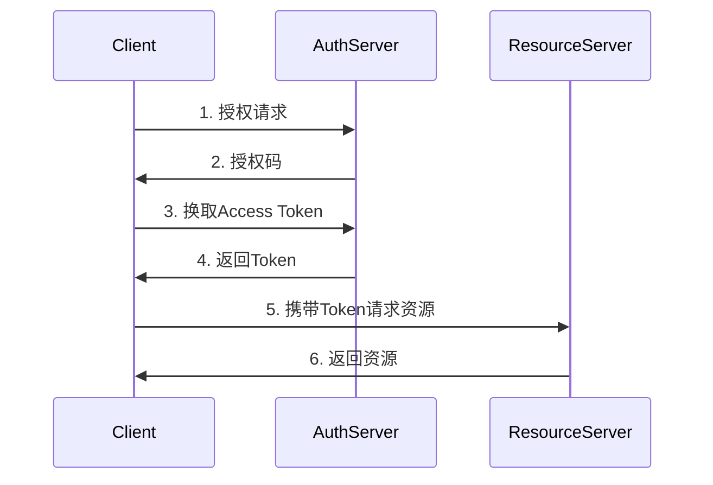

# API接口规范文档

## 1. 概述

本文档详细描述了区块链电子病历共享系统的RESTful API接口规范，包括认证机制、请求响应格式、错误处理、版本控制等内容。

### 1.1 设计原则

* **RESTful架构**：遵循REST设计原则

* **统一响应格式**：标准化的JSON响应结构

* **安全认证**：JWT Token + OAuth 2.0

* **版本控制**：URL路径版本控制

* **幂等性**：确保接口操作的幂等性

### 1.2 基础信息

* **Base URL**: `https://api.medical-blockchain.com/v1`

* **协议**: HTTPS

* **数据格式**: JSON

* **字符编码**: UTF-8

## 2. 认证机制

### 2.1 JWT Token认证

```typescript
// 请求头格式
interface AuthHeaders {
  'Authorization': `Bearer ${string}`;
  'Content-Type': 'application/json';
  'X-API-Version': 'v1';
}

// Token结构
interface JWTPayload {
  sub: string;        // 用户ID
  role: UserRole;     // 用户角色
  iat: number;        // 签发时间
  exp: number;        // 过期时间
  permissions: string[]; // 权限列表
}
```

### 2.2 OAuth 2.0流程



## 3. 统一响应格式

### 3.1 成功响应

```typescript
interface SuccessResponse<T> {
  success: true;
  data: T;
  message?: string;
  timestamp: string;
  requestId: string;
}

// 示例
{
  "success": true,
  "data": {
    "id": "123e4567-e89b-12d3-a456-426614174000",
    "title": "体检报告",
    "status": "approved"
  },
  "message": "获取成功",
  "timestamp": "2024-01-15T10:30:00Z",
  "requestId": "req_123456789"
}
```

### 3.2 错误响应

```typescript
interface ErrorResponse {
  success: false;
  error: {
    code: string;
    message: string;
    details?: any;
  };
  timestamp: string;
  requestId: string;
}

// 示例
{
  "success": false,
  "error": {
    "code": "RECORD_NOT_FOUND",
    "message": "医疗记录不存在",
    "details": {
      "recordId": "invalid-id"
    }
  },
  "timestamp": "2024-01-15T10:30:00Z",
  "requestId": "req_123456789"
}
```

## 4. 用户认证接口

### 4.1 用户登录

```http
POST /auth/login
Content-Type: application/json

{
  "email": "doctor@hospital.com",
  "password": "securePassword123",
  "deviceInfo": {
    "userAgent": "Mozilla/5.0...",
    "ipAddress": "192.168.1.100"
  }
}
```

**响应示例**:

```json
{
  "success": true,
  "data": {
    "accessToken": "eyJhbGciOiJIUzI1NiIsInR5cCI6IkpXVCJ9...",
    "refreshToken": "rt_1234567890abcdef",
    "expiresIn": 3600,
    "user": {
      "id": "user_123",
      "email": "doctor@hospital.com",
      "role": "doctor",
      "profile": {
        "name": "张医生",
        "specialization": "心内科"
      }
    }
  }
}
```

### 4.2 刷新Token

```http
POST /auth/refresh
Content-Type: application/json

{
  "refreshToken": "rt_1234567890abcdef"
}
```

### 4.3 用户注册

```http
POST /auth/register
Content-Type: application/json

{
  "email": "patient@email.com",
  "password": "securePassword123",
  "role": "patient",
  "profile": {
    "firstName": "李",
    "lastName": "患者",
    "phone": "+86-13800138000",
    "dateOfBirth": "1990-01-01"
  }
}
```

## 5. 医疗记录接口

### 5.1 获取医疗记录列表

```http
GET /medical-records?page=1&limit=20&type=diagnosis&status=approved
Authorization: Bearer {token}
```

**查询参数**:

| 参数        | 类型     | 必填 | 描述        |
| --------- | ------ | -- | --------- |
| page      | number | 否  | 页码，默认1    |
| limit     | number | 否  | 每页数量，默认20 |
| type      | string | 否  | 记录类型      |
| status    | string | 否  | 记录状态      |
| patientId | string | 否  | 患者ID      |
| startDate | string | 否  | 开始日期      |
| endDate   | string | 否  | 结束日期      |

**响应示例**:

```json
{
  "success": true,
  "data": {
    "records": [
      {
        "id": "record_123",
        "title": "心电图检查",
        "type": "diagnosis",
        "status": "approved",
        "patient": {
          "id": "patient_456",
          "name": "李患者"
        },
        "doctor": {
          "id": "doctor_789",
          "name": "张医生"
        },
        "createdAt": "2024-01-15T10:30:00Z",
        "blockchainHash": "0x1234567890abcdef"
      }
    ],
    "pagination": {
      "page": 1,
      "limit": 20,
      "total": 150,
      "totalPages": 8
    }
  }
}
```

### 5.2 获取单个医疗记录

```http
GET /medical-records/{recordId}
Authorization: Bearer {token}
```

**响应示例**:

```json
{
  "success": true,
  "data": {
    "id": "record_123",
    "title": "心电图检查报告",
    "description": "患者心电图检查结果正常",
    "type": "diagnosis",
    "status": "approved",
    "diagnosis": {
      "primary": "正常心电图",
      "secondary": [],
      "icd10Codes": ["Z01.818"]
    },
    "treatment": {
      "recommendations": ["定期复查"],
      "medications": []
    },
    "attachments": [
      {
        "id": "att_123",
        "name": "心电图.pdf",
        "type": "application/pdf",
        "size": 1024000,
        "ipfsHash": "QmXoYpizjW3WknFiJnKLwHCnL72vedxjQkDDP1mXWo6uco"
      }
    ],
    "patient": {
      "id": "patient_456",
      "name": "李患者",
      "age": 34,
      "gender": "male"
    },
    "doctor": {
      "id": "doctor_789",
      "name": "张医生",
      "specialization": "心内科",
      "license": "MD123456"
    },
    "blockchainHash": "0x1234567890abcdef",
    "ipfsHash": "QmYwAPJzv5CZsnA625s3Xf2nemtYgPpHdWEz79ojWnPbdG",
    "createdAt": "2024-01-15T10:30:00Z",
    "updatedAt": "2024-01-15T10:30:00Z"
  }
}
```

### 5.3 创建医疗记录

```http
POST /medical-records
Authorization: Bearer {token}
Content-Type: application/json

{
  "title": "血常规检查",
  "description": "患者血常规检查结果",
  "type": "lab_result",
  "patientId": "patient_456",
  "diagnosis": {
    "primary": "血常规正常",
    "findings": {
      "wbc": "6.5",
      "rbc": "4.2",
      "hgb": "140"
    }
  },
  "attachments": [
    {
      "name": "血常规报告.pdf",
      "type": "application/pdf",
      "content": "base64EncodedContent"
    }
  ]
}
```

### 5.4 更新医疗记录

```http
PUT /medical-records/{recordId}
Authorization: Bearer {token}
Content-Type: application/json

{
  "title": "血常规检查（已更新）",
  "status": "approved",
  "diagnosis": {
    "primary": "血常规正常",
    "notes": "复查结果良好"
  }
}
```

## 6. 权限管理接口

### 6.1 授权访问

```http
POST /permissions/grant
Authorization: Bearer {token}
Content-Type: application/json

{
  "recordId": "record_123",
  "grantedTo": "doctor_456",
  "permissionType": "read",
  "expiresAt": "2024-12-31T23:59:59Z",
  "reason": "会诊需要"
}
```

### 6.2 撤销权限

```http
DELETE /permissions/{permissionId}
Authorization: Bearer {token}
```

### 6.3 查询权限

```http
GET /permissions?recordId=record_123&userId=doctor_456
Authorization: Bearer {token}
```

## 7. 文件管理接口

### 7.1 文件上传

```http
POST /files/upload
Authorization: Bearer {token}
Content-Type: multipart/form-data

--boundary
Content-Disposition: form-data; name="file"; filename="report.pdf"
Content-Type: application/pdf

[文件内容]
--boundary
Content-Disposition: form-data; name="metadata"

{
  "recordId": "record_123",
  "category": "lab_result",
  "description": "血常规报告"
}
--boundary--
```

**响应示例**:

```json
{
  "success": true,
  "data": {
    "fileId": "file_123",
    "name": "report.pdf",
    "size": 1024000,
    "type": "application/pdf",
    "ipfsHash": "QmXoYpizjW3WknFiJnKLwHCnL72vedxjQkDDP1mXWo6uco",
    "url": "/files/download/file_123",
    "uploadedAt": "2024-01-15T10:30:00Z"
  }
}
```

### 7.2 文件下载

```http
GET /files/download/{fileId}
Authorization: Bearer {token}
```

### 7.3 文件删除

```http
DELETE /files/{fileId}
Authorization: Bearer {token}
```

## 8. 区块链接口

### 8.1 提交到区块链

```http
POST /blockchain/submit
Authorization: Bearer {token}
Content-Type: application/json

{
  "recordId": "record_123",
  "operation": "create",
  "metadata": {
    "patientId": "patient_456",
    "doctorId": "doctor_789",
    "timestamp": "2024-01-15T10:30:00Z"
  }
}
```

### 8.2 验证区块链记录

```http
GET /blockchain/verify/{blockchainHash}
Authorization: Bearer {token}
```

**响应示例**:

```json
{
  "success": true,
  "data": {
    "isValid": true,
    "blockNumber": 12345,
    "transactionHash": "0x1234567890abcdef",
    "timestamp": "2024-01-15T10:30:00Z",
    "confirmations": 6
  }
}
```

## 9. 搜索接口

### 9.1 全文搜索

```http
GET /search?q=心电图&type=medical_record&page=1&limit=10
Authorization: Bearer {token}
```

**查询参数**:

| 参数      | 类型     | 必填 | 描述    |
| ------- | ------ | -- | ----- |
| q       | string | 是  | 搜索关键词 |
| type    | string | 否  | 搜索类型  |
| filters | object | 否  | 过滤条件  |
| sort    | string | 否  | 排序方式  |

### 9.2 高级搜索

```http
POST /search/advanced
Authorization: Bearer {token}
Content-Type: application/json

{
  "query": {
    "bool": {
      "must": [
        {"match": {"title": "心电图"}},
        {"range": {"createdAt": {"gte": "2024-01-01"}}}
      ],
      "filter": [
        {"term": {"type": "diagnosis"}},
        {"term": {"status": "approved"}}
      ]
    }
  },
  "sort": [{"createdAt": {"order": "desc"}}],
  "from": 0,
  "size": 20
}
```

## 10. 错误码定义

### 10.1 通用错误码

| 错误码              | HTTP状态码 | 描述      |
| ---------------- | ------- | ------- |
| SUCCESS          | 200     | 请求成功    |
| INVALID\_REQUEST | 400     | 请求参数错误  |
| UNAUTHORIZED     | 401     | 未授权访问   |
| FORBIDDEN        | 403     | 权限不足    |
| NOT\_FOUND       | 404     | 资源不存在   |
| CONFLICT         | 409     | 资源冲突    |
| INTERNAL\_ERROR  | 500     | 服务器内部错误 |

### 10.2 业务错误码

| 错误码                  | 描述       |
| -------------------- | -------- |
| USER\_NOT\_FOUND     | 用户不存在    |
| INVALID\_CREDENTIALS | 用户名或密码错误 |
| TOKEN\_EXPIRED       | Token已过期 |
| RECORD\_NOT\_FOUND   | 医疗记录不存在  |
| PERMISSION\_DENIED   | 权限不足     |
| FILE\_TOO\_LARGE     | 文件过大     |
| BLOCKCHAIN\_ERROR    | 区块链操作失败  |
| IPFS\_ERROR          | IPFS存储失败 |

## 11. 限流策略

### 11.1 API限流规则

| 用户类型 | 每分钟请求数 | 每小时请求数 |
| ---- | ------ | ------ |
| 患者   | 60     | 1000   |
| 医生   | 120    | 5000   |
| 管理员  | 300    | 10000  |
| 系统   | 无限制    | 无限制    |

### 11.2 限流响应

```json
{
  "success": false,
  "error": {
    "code": "RATE_LIMIT_EXCEEDED",
    "message": "请求频率超限，请稍后重试",
    "details": {
      "limit": 60,
      "remaining": 0,
      "resetTime": "2024-01-15T10:31:00Z"
    }
  }
}
```

## 12. 版本控制

### 12.1 版本策略

* **URL版本控制**: `/v1/`, `/v2/`

* **向后兼容**: 保持至少2个版本的兼容性

* **废弃通知**: 提前3个月通知API废弃

### 12.2 版本迁移

```http
# 旧版本（即将废弃）
GET /v1/medical-records

# 新版本
GET /v2/medical-records

# 响应头包含版本信息
X-API-Version: v2
X-Deprecated-Version: v1
X-Sunset-Date: 2024-06-01
```

本文档将根据API发展需要持续更新和完善。
