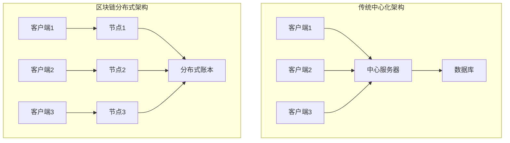
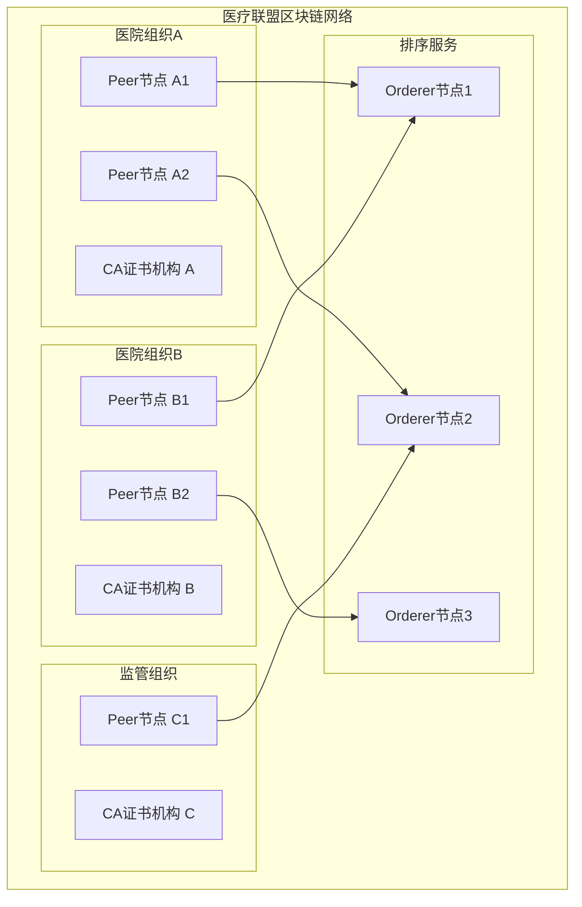

# 区块链集成技术文档

## 1. 区块链技术概述

### 1.1 技术选型

本系统采用\*\*Hyperledger Fabric 2.4+\*\*作为核心区块链平台，主要考虑因素：

* **企业级特性**: 支持权限管理和隐私保护

* **高性能**: 支持高TPS和低延迟

* **模块化架构**: 可插拔的共识机制和加密算法

* **智能合约**: 支持Go、Node.js等多种语言

* **生态成熟**: 丰富的工具链和社区支持

### 1.2 架构优势



**核心优势**:

* **去中心化**: 消除单点故障风险

* **不可篡改**: 密码学保证数据完整性

* **透明性**: 所有交易可追溯验证

* **共识机制**: 多方参与的信任建立

## 2. Hyperledger Fabric网络架构

### 2.1 网络拓扑设计

#### 2.1.1 组织结构



#### 2.1.2 通道配置

```yaml
# 医疗记录通道配置
Channels:
  medical-records:
    Organizations:
      - HospitalA
      - HospitalB
      - Regulator
    Policies:
      Readers: "OR('HospitalA.member', 'HospitalB.member', 'Regulator.member')"
      Writers: "OR('HospitalA.member', 'HospitalB.member')"
      Admins: "OR('HospitalA.admin', 'HospitalB.admin', 'Regulator.admin')"
    
  access-control:
    Organizations:
      - HospitalA
      - HospitalB
    Policies:
      Readers: "OR('HospitalA.member', 'HospitalB.member')"
      Writers: "OR('HospitalA.member', 'HospitalB.member')"
```

### 2.2 节点配置

#### 2.2.1 Peer节点配置

```yaml
# peer配置文件
version: '3.7'
services:
  peer0.hospitala.emr.com:
    image: hyperledger/fabric-peer:2.4
    environment:
      - CORE_PEER_ID=peer0.hospitala.emr.com
      - CORE_PEER_ADDRESS=peer0.hospitala.emr.com:7051
      - CORE_PEER_LISTENADDRESS=0.0.0.0:7051
      - CORE_PEER_CHAINCODEADDRESS=peer0.hospitala.emr.com:7052
      - CORE_PEER_CHAINCODELISTENADDRESS=0.0.0.0:7052
      - CORE_PEER_GOSSIP_BOOTSTRAP=peer1.hospitala.emr.com:8051
      - CORE_PEER_GOSSIP_EXTERNALENDPOINT=peer0.hospitala.emr.com:7051
      - CORE_PEER_LOCALMSPID=HospitalAMSP
      - CORE_VM_ENDPOINT=unix:///host/var/run/docker.sock
      - CORE_VM_DOCKER_HOSTCONFIG_NETWORKMODE=emr_network
      - FABRIC_LOGGING_SPEC=INFO
      - CORE_PEER_TLS_ENABLED=true
      - CORE_PEER_PROFILE_ENABLED=true
      - CORE_PEER_TLS_CERT_FILE=/etc/hyperledger/fabric/tls/server.crt
      - CORE_PEER_TLS_KEY_FILE=/etc/hyperledger/fabric/tls/server.key
      - CORE_PEER_TLS_ROOTCERT_FILE=/etc/hyperledger/fabric/tls/ca.crt
      - CORE_PEER_MSPCONFIGPATH=/etc/hyperledger/fabric/msp
    volumes:
      - /var/run/:/host/var/run/
      - ./crypto-config/peerOrganizations/hospitala.emr.com/peers/peer0.hospitala.emr.com/msp:/etc/hyperledger/fabric/msp
      - ./crypto-config/peerOrganizations/hospitala.emr.com/peers/peer0.hospitala.emr.com/tls:/etc/hyperledger/fabric/tls
      - peer0.hospitala.emr.com:/var/hyperledger/production
    ports:
      - 7051:7051
    networks:
      - emr_network
```

#### 2.2.2 Orderer节点配置

```yaml
# orderer配置文件
orderer.emr.com:
  image: hyperledger/fabric-orderer:2.4
  environment:
    - FABRIC_LOGGING_SPEC=INFO
    - ORDERER_GENERAL_LISTENADDRESS=0.0.0.0
    - ORDERER_GENERAL_LISTENPORT=7050
    - ORDERER_GENERAL_GENESISMETHOD=file
    - ORDERER_GENERAL_GENESISFILE=/var/hyperledger/orderer/orderer.genesis.block
    - ORDERER_GENERAL_LOCALMSPID=OrdererMSP
    - ORDERER_GENERAL_LOCALMSPDIR=/var/hyperledger/orderer/msp
    - ORDERER_OPERATIONS_LISTENADDRESS=0.0.0.0:17050
    - ORDERER_GENERAL_TLS_ENABLED=true
    - ORDERER_GENERAL_TLS_PRIVATEKEY=/var/hyperledger/orderer/tls/server.key
    - ORDERER_GENERAL_TLS_CERTIFICATE=/var/hyperledger/orderer/tls/server.crt
    - ORDERER_GENERAL_TLS_ROOTCAS=[/var/hyperledger/orderer/tls/ca.crt]
    - ORDERER_KAFKA_TOPIC_REPLICATIONFACTOR=1
    - ORDERER_KAFKA_VERBOSE=true
    - ORDERER_GENERAL_CLUSTER_CLIENTCERTIFICATE=/var/hyperledger/orderer/tls/server.crt
    - ORDERER_GENERAL_CLUSTER_CLIENTPRIVATEKEY=/var/hyperledger/orderer/tls/server.key
    - ORDERER_GENERAL_CLUSTER_ROOTCAS=[/var/hyperledger/orderer/tls/ca.crt]
  working_dir: /opt/gopath/src/github.com/hyperledger/fabric
  command: orderer
  volumes:
    - ./channel-artifacts/genesis.block:/var/hyperledger/orderer/orderer.genesis.block
    - ./crypto-config/ordererOrganizations/emr.com/orderers/orderer.emr.com/msp:/var/hyperledger/orderer/msp
    - ./crypto-config/ordererOrganizations/emr.com/orderers/orderer.emr.com/tls/:/var/hyperledger/orderer/tls
    - orderer.emr.com:/var/hyperledger/production/orderer
  ports:
    - 7050:7050
    - 17050:17050
```

## 3. 智能合约开发

### 3.1 合约架构设计

#### 3.1.1 合约结构

```go
package main

import (
    "encoding/json"
    "fmt"
    "time"
    
    "github.com/hyperledger/fabric-contract-api-go/contractapi"
)

// MedicalRecordContract 医疗记录智能合约
type MedicalRecordContract struct {
    contractapi.Contract
}

// MedicalRecord 医疗记录结构
type MedicalRecord struct {
    ID              string    `json:"id"`
    PatientID       string    `json:"patientId"`
    DoctorID        string    `json:"doctorId"`
    HospitalID      string    `json:"hospitalId"`
    RecordType      string    `json:"recordType"`
    IPFSHash        string    `json:"ipfsHash"`
    EncryptionKey   string    `json:"encryptionKey"`
    Timestamp       time.Time `json:"timestamp"`
    Status          string    `json:"status"`
    Permissions     []string  `json:"permissions"`
    Signature       string    `json:"signature"`
}

// AccessPermission 访问权限结构
type AccessPermission struct {
    ID             string    `json:"id"`
    RecordID       string    `json:"recordId"`
    UserID         string    `json:"userId"`
    PermissionType string    `json:"permissionType"`
    GrantedBy      string    `json:"grantedBy"`
    GrantedAt      time.Time `json:"grantedAt"`
    ExpiresAt      time.Time `json:"expiresAt"`
    Status         string    `json:"status"`
}

// AuditLog 审计日志结构
type AuditLog struct {
    ID        string    `json:"id"`
    RecordID  string    `json:"recordId"`
    UserID    string    `json:"userId"`
    Action    string    `json:"action"`
    Timestamp time.Time `json:"timestamp"`
    IPAddress string    `json:"ipAddress"`
    UserAgent string    `json:"userAgent"`
}
```

#### 3.1.2 核心合约方法

```go
// CreateMedicalRecord 创建医疗记录
func (c *MedicalRecordContract) CreateMedicalRecord(
    ctx contractapi.TransactionContextInterface,
    id string,
    patientID string,
    doctorID string,
    hospitalID string,
    recordType string,
    ipfsHash string,
    encryptionKey string,
) error {
    // 验证调用者权限
    err := c.validateCaller(ctx, doctorID)
    if err != nil {
        return fmt.Errorf("权限验证失败: %v", err)
    }
    
    // 检查记录是否已存在
    exists, err := c.RecordExists(ctx, id)
    if err != nil {
        return err
    }
    if exists {
        return fmt.Errorf("医疗记录 %s 已存在", id)
    }
    
    // 创建医疗记录
    record := MedicalRecord{
        ID:            id,
        PatientID:     patientID,
        DoctorID:      doctorID,
        HospitalID:    hospitalID,
        RecordType:    recordType,
        IPFSHash:      ipfsHash,
        EncryptionKey: encryptionKey,
        Timestamp:     time.Now(),
        Status:        "active",
        Permissions:   []string{patientID, doctorID},
    }
    
    // 生成数字签名
    record.Signature, err = c.generateSignature(ctx, record)
    if err != nil {
        return fmt.Errorf("签名生成失败: %v", err)
    }
    
    recordJSON, err := json.Marshal(record)
    if err != nil {
        return err
    }
    
    // 存储到区块链
    err = ctx.GetStub().PutState(id, recordJSON)
    if err != nil {
        return fmt.Errorf("存储失败: %v", err)
    }
    
    // 记录审计日志
    err = c.createAuditLog(ctx, id, doctorID, "CREATE")
    if err != nil {
        return fmt.Errorf("审计日志记录失败: %v", err)
    }
    
    // 触发事件
    err = ctx.GetStub().SetEvent("MedicalRecordCreated", recordJSON)
    if err != nil {
        return fmt.Errorf("事件触发失败: %v", err)
    }
    
    return nil
}

// GrantAccess 授予访问权限
func (c *MedicalRecordContract) GrantAccess(
    ctx contractapi.TransactionContextInterface,
    recordID string,
    userID string,
    permissionType string,
    expiryDuration int, // 小时
) error {
    // 获取医疗记录
    record, err := c.GetMedicalRecord(ctx, recordID)
    if err != nil {
        return err
    }
    
    // 验证授权者权限（只有患者或记录创建者可以授权）
    callerID, err := c.getCallerID(ctx)
    if err != nil {
        return err
    }
    
    if callerID != record.PatientID && callerID != record.DoctorID {
        return fmt.Errorf("无权限授予访问权限")
    }
    
    // 创建访问权限
    permissionID := fmt.Sprintf("%s-%s-%d", recordID, userID, time.Now().Unix())
    permission := AccessPermission{
        ID:             permissionID,
        RecordID:       recordID,
        UserID:         userID,
        PermissionType: permissionType,
        GrantedBy:      callerID,
        GrantedAt:      time.Now(),
        ExpiresAt:      time.Now().Add(time.Duration(expiryDuration) * time.Hour),
        Status:         "active",
    }
    
    permissionJSON, err := json.Marshal(permission)
    if err != nil {
        return err
    }
    
    // 存储权限
    err = ctx.GetStub().PutState(permissionID, permissionJSON)
    if err != nil {
        return fmt.Errorf("权限存储失败: %v", err)
    }
    
    // 记录审计日志
    err = c.createAuditLog(ctx, recordID, callerID, "GRANT_ACCESS")
    if err != nil {
        return fmt.Errorf("审计日志记录失败: %v", err)
    }
    
    return nil
}

// ValidateAccess 验证访问权限
func (c *MedicalRecordContract) ValidateAccess(
    ctx contractapi.TransactionContextInterface,
    recordID string,
    userID string,
    action string,
) (bool, error) {
    // 获取医疗记录
    record, err := c.GetMedicalRecord(ctx, recordID)
    if err != nil {
        return false, err
    }
    
    // 检查是否为记录所有者
    if userID == record.PatientID || userID == record.DoctorID {
        return true, nil
    }
    
    // 查询用户权限
    queryString := fmt.Sprintf(`{
        "selector": {
            "recordId": "%s",
            "userId": "%s",
            "status": "active"
        }
    }`, recordID, userID)
    
    resultsIterator, err := ctx.GetStub().GetQueryResult(queryString)
    if err != nil {
        return false, err
    }
    defer resultsIterator.Close()
    
    for resultsIterator.HasNext() {
        queryResponse, err := resultsIterator.Next()
        if err != nil {
            return false, err
        }
        
        var permission AccessPermission
        err = json.Unmarshal(queryResponse.Value, &permission)
        if err != nil {
            return false, err
        }
        
        // 检查权限是否过期
        if time.Now().Before(permission.ExpiresAt) {
            // 检查权限类型是否匹配
            if c.isActionAllowed(action, permission.PermissionType) {
                return true, nil
            }
        }
    }
    
    return false, nil
}
```

### 3.2 权限管理合约

#### 3.2.1 基于角色的访问控制

```go
// Role 角色定义
type Role struct {
    ID          string   `json:"id"`
    Name        string   `json:"name"`
    Permissions []string `json:"permissions"`
    Description string   `json:"description"`
}

// UserRole 用户角色关联
type UserRole struct {
    UserID     string    `json:"userId"`
    RoleID     string    `json:"roleId"`
    AssignedBy string    `json:"assignedBy"`
    AssignedAt time.Time `json:"assignedAt"`
    ExpiresAt  time.Time `json:"expiresAt"`
}

// CreateRole 创建角色
func (c *MedicalRecordContract) CreateRole(
    ctx contractapi.TransactionContextInterface,
    roleID string,
    name string,
    permissions []string,
    description string,
) error {
    // 验证管理员权限
    err := c.validateAdminAccess(ctx)
    if err != nil {
        return err
    }
    
    role := Role{
        ID:          roleID,
        Name:        name,
        Permissions: permissions,
        Description: description,
    }
    
    roleJSON, err := json.Marshal(role)
    if err != nil {
        return err
    }
    
    return ctx.GetStub().PutState(fmt.Sprintf("ROLE_%s", roleID), roleJSON)
}

// AssignRole 分配角色
func (c *MedicalRecordContract) AssignRole(
    ctx contractapi.TransactionContextInterface,
    userID string,
    roleID string,
    expiryDuration int,
) error {
    callerID, err := c.getCallerID(ctx)
    if err != nil {
        return err
    }
    
    // 验证角色分配权限
    hasPermission, err := c.hasPermission(ctx, callerID, "ASSIGN_ROLE")
    if err != nil {
        return err
    }
    if !hasPermission {
        return fmt.Errorf("无权限分配角色")
    }
    
    userRole := UserRole{
        UserID:     userID,
        RoleID:     roleID,
        AssignedBy: callerID,
        AssignedAt: time.Now(),
        ExpiresAt:  time.Now().Add(time.Duration(expiryDuration) * time.Hour),
    }
    
    userRoleJSON, err := json.Marshal(userRole)
    if err != nil {
        return err
    }
    
    key := fmt.Sprintf("USER_ROLE_%s_%s", userID, roleID)
    return ctx.GetStub().PutState(key, userRoleJSON)
}
```

### 3.3 事件处理机制

#### 3.3.1 事件定义

```go
// Event 事件结构
type Event struct {
    Type      string                 `json:"type"`
    Timestamp time.Time              `json:"timestamp"`
    Data      map[string]interface{} `json:"data"`
}

// 事件类型常量
const (
    EventMedicalRecordCreated = "MedicalRecordCreated"
    EventAccessGranted        = "AccessGranted"
    EventAccessRevoked        = "AccessRevoked"
    EventRecordAccessed       = "RecordAccessed"
    EventRecordUpdated        = "RecordUpdated"
)

// EmitEvent 触发事件
func (c *MedicalRecordContract) EmitEvent(
    ctx contractapi.TransactionContextInterface,
    eventType string,
    data map[string]interface{},
) error {
    event := Event{
        Type:      eventType,
        Timestamp: time.Now(),
        Data:      data,
    }
    
    eventJSON, err := json.Marshal(event)
    if err != nil {
        return err
    }
    
    return ctx.GetStub().SetEvent(eventType, eventJSON)
}
```

## 4. 区块链服务集成

### 4.1 Fabric SDK集成

#### 4.1.1 连接配置

```typescript
// blockchain/config.ts
import { Gateway, Wallets, X509Identity } from 'fabric-network';
import * as FabricCAServices from 'fabric-ca-client';
import * as fs from 'fs';
import * as path from 'path';

export interface BlockchainConfig {
  channelName: string;
  chaincodeName: string;
  mspId: string;
  walletPath: string;
  connectionProfile: any;
}

export class FabricConnection {
  private gateway: Gateway;
  private config: BlockchainConfig;
  
  constructor(config: BlockchainConfig) {
    this.config = config;
    this.gateway = new Gateway();
  }
  
  async connect(userId: string): Promise<void> {
    try {
      // 加载钱包
      const wallet = await Wallets.newFileSystemWallet(this.config.walletPath);
      
      // 检查用户身份
      const identity = await wallet.get(userId);
      if (!identity) {
        throw new Error(`用户 ${userId} 的身份不存在`);
      }
      
      // 连接网关
      await this.gateway.connect(this.config.connectionProfile, {
        wallet,
        identity: userId,
        discovery: { enabled: true, asLocalhost: true }
      });
      
      console.log(`成功连接到Fabric网络，用户: ${userId}`);
    } catch (error) {
      console.error('连接Fabric网络失败:', error);
      throw error;
    }
  }
  
  async disconnect(): Promise<void> {
    this.gateway.disconnect();
  }
  
  getNetwork() {
    return this.gateway.getNetwork(this.config.channelName);
  }
  
  getContract() {
    const network = this.getNetwork();
    return network.getContract(this.config.chaincodeName);
  }
}
```

#### 4.1.2 区块链服务实现

```typescript
// services/BlockchainService.ts
import { FabricConnection, BlockchainConfig } from '../blockchain/config';
import { MedicalRecord, AccessPermission } from '../types/MedicalRecord';

export class BlockchainService {
  private connection: FabricConnection;
  private isConnected: boolean = false;
  
  constructor(config: BlockchainConfig) {
    this.connection = new FabricConnection(config);
  }
  
  async initialize(userId: string): Promise<void> {
    if (!this.isConnected) {
      await this.connection.connect(userId);
      this.isConnected = true;
    }
  }
  
  async createMedicalRecord(
    record: Omit<MedicalRecord, 'timestamp' | 'signature'>
  ): Promise<string> {
    try {
      const contract = this.connection.getContract();
      
      const result = await contract.submitTransaction(
        'CreateMedicalRecord',
        record.id,
        record.patientId,
        record.doctorId,
        record.hospitalId,
        record.recordType,
        record.ipfsHash,
        record.encryptionKey
      );
      
      return result.toString();
    } catch (error) {
      console.error('创建医疗记录失败:', error);
      throw new Error(`区块链交易失败: ${error.message}`);
    }
  }
  
  async getMedicalRecord(recordId: string): Promise<MedicalRecord> {
    try {
      const contract = this.connection.getContract();
      
      const result = await contract.evaluateTransaction(
        'GetMedicalRecord',
        recordId
      );
      
      return JSON.parse(result.toString());
    } catch (error) {
      console.error('获取医疗记录失败:', error);
      throw new Error(`查询失败: ${error.message}`);
    }
  }
  
  async grantAccess(
    recordId: string,
    userId: string,
    permissionType: string,
    expiryHours: number
  ): Promise<void> {
    try {
      const contract = this.connection.getContract();
      
      await contract.submitTransaction(
        'GrantAccess',
        recordId,
        userId,
        permissionType,
        expiryHours.toString()
      );
    } catch (error) {
      console.error('授予访问权限失败:', error);
      throw new Error(`权限授予失败: ${error.message}`);
    }
  }
  
  async validateAccess(
    recordId: string,
    userId: string,
    action: string
  ): Promise<boolean> {
    try {
      const contract = this.connection.getContract();
      
      const result = await contract.evaluateTransaction(
        'ValidateAccess',
        recordId,
        userId,
        action
      );
      
      return result.toString() === 'true';
    } catch (error) {
      console.error('验证访问权限失败:', error);
      return false;
    }
  }
  
  async getRecordHistory(recordId: string): Promise<any[]> {
    try {
      const contract = this.connection.getContract();
      
      const result = await contract.evaluateTransaction(
        'GetRecordHistory',
        recordId
      );
      
      return JSON.parse(result.toString());
    } catch (error) {
      console.error('获取记录历史失败:', error);
      throw new Error(`历史查询失败: ${error.message}`);
    }
  }
}
```

### 4.2 事件监听服务

#### 4.2.1 事件监听器

```typescript
// services/EventListenerService.ts
import { Contract, ContractEvent } from 'fabric-network';
import { EventEmitter } from 'events';

export class EventListenerService extends EventEmitter {
  private contract: Contract;
  private listeners: Map<string, any> = new Map();
  
  constructor(contract: Contract) {
    super();
    this.contract = contract;
  }
  
  async startListening(): Promise<void> {
    try {
      // 监听医疗记录创建事件
      const recordCreatedListener = await this.contract.addContractListener(
        'MedicalRecordCreated',
        (event: ContractEvent) => {
          this.handleRecordCreated(event);
        }
      );
      this.listeners.set('MedicalRecordCreated', recordCreatedListener);
      
      // 监听访问权限授予事件
      const accessGrantedListener = await this.contract.addContractListener(
        'AccessGranted',
        (event: ContractEvent) => {
          this.handleAccessGranted(event);
        }
      );
      this.listeners.set('AccessGranted', accessGrantedListener);
      
      // 监听记录访问事件
      const recordAccessedListener = await this.contract.addContractListener(
        'RecordAccessed',
        (event: ContractEvent) => {
          this.handleRecordAccessed(event);
        }
      );
      this.listeners.set('RecordAccessed', recordAccessedListener);
      
      console.log('区块链事件监听器启动成功');
    } catch (error) {
      console.error('启动事件监听器失败:', error);
      throw error;
    }
  }
  
  async stopListening(): Promise<void> {
    for (const [eventName, listener] of this.listeners) {
      this.contract.removeContractListener(listener);
      console.log(`停止监听事件: ${eventName}`);
    }
    this.listeners.clear();
  }
  
  private handleRecordCreated(event: ContractEvent): void {
    try {
      const eventData = JSON.parse(event.payload.toString());
      console.log('医疗记录创建事件:', eventData);
      
      // 触发应用层事件
      this.emit('recordCreated', {
        recordId: eventData.id,
        patientId: eventData.patientId,
        doctorId: eventData.doctorId,
        timestamp: eventData.timestamp
      });
      
      // 可以在这里添加其他业务逻辑，如发送通知等
    } catch (error) {
      console.error('处理记录创建事件失败:', error);
    }
  }
  
  private handleAccessGranted(event: ContractEvent): void {
    try {
      const eventData = JSON.parse(event.payload.toString());
      console.log('访问权限授予事件:', eventData);
      
      this.emit('accessGranted', {
        recordId: eventData.recordId,
        userId: eventData.userId,
        permissionType: eventData.permissionType,
        grantedBy: eventData.grantedBy
      });
    } catch (error) {
      console.error('处理权限授予事件失败:', error);
    }
  }
  
  private handleRecordAccessed(event: ContractEvent): void {
    try {
      const eventData = JSON.parse(event.payload.toString());
      console.log('记录访问事件:', eventData);
      
      this.emit('recordAccessed', {
        recordId: eventData.recordId,
        userId: eventData.userId,
        action: eventData.action,
        timestamp: eventData.timestamp
      });
    } catch (error) {
      console.error('处理记录访问事件失败:', error);
    }
  }
}
```

## 5. 性能优化

### 5.1 交易优化

#### 5.1.1 批量交易处理

```typescript
// 批量提交交易
export class BatchTransactionService {
  private pendingTransactions: any[] = [];
  private batchSize: number = 10;
  private batchTimeout: number = 5000; // 5秒
  private timer: NodeJS.Timeout | null = null;
  
  constructor(private blockchainService: BlockchainService) {}
  
  async addTransaction(transaction: any): Promise<void> {
    this.pendingTransactions.push(transaction);
    
    if (this.pendingTransactions.length >= this.batchSize) {
      await this.processBatch();
    } else if (!this.timer) {
      this.timer = setTimeout(() => {
        this.processBatch();
      }, this.batchTimeout);
    }
  }
  
  private async processBatch(): Promise<void> {
    if (this.pendingTransactions.length === 0) return;
    
    const batch = this.pendingTransactions.splice(0, this.batchSize);
    
    try {
      // 并行处理批量交易
      const promises = batch.map(tx => this.processTransaction(tx));
      await Promise.all(promises);
      
      console.log(`成功处理 ${batch.length} 个交易`);
    } catch (error) {
      console.error('批量交易处理失败:', error);
      // 重新加入队列或记录失败
    }
    
    if (this.timer) {
      clearTimeout(this.timer);
      this.timer = null;
    }
  }
  
  private async processTransaction(transaction: any): Promise<void> {
    // 根据交易类型处理
    switch (transaction.type) {
      case 'CREATE_RECORD':
        await this.blockchainService.createMedicalRecord(transaction.data);
        break;
      case 'GRANT_ACCESS':
        await this.blockchainService.grantAccess(
          transaction.data.recordId,
          transaction.data.userId,
          transaction.data.permissionType,
          transaction.data.expiryHours
        );
        break;
      default:
        throw new Error(`未知交易类型: ${transaction.type}`);
    }
  }
}
```

### 5.2 查询优化

#### 5.2.1 索引优化

```go
// 创建复合索引
func (c *MedicalRecordContract) CreateIndexes(ctx contractapi.TransactionContextInterface) error {
    // 患者ID索引
    patientIndexKey, err := ctx.GetStub().CreateCompositeKey("patient~id", []string{"patient", "id"})
    if err != nil {
        return err
    }
    
    // 医生ID索引
    doctorIndexKey, err := ctx.GetStub().CreateCompositeKey("doctor~id", []string{"doctor", "id"})
    if err != nil {
        return err
    }
    
    // 时间范围索引
    timeIndexKey, err := ctx.GetStub().CreateCompositeKey("time~range", []string{"time", "range"})
    if err != nil {
        return err
    }
    
    // 存储索引
    err = ctx.GetStub().PutState(patientIndexKey, []byte{0x00})
    if err != nil {
        return err
    }
    
    return nil
}

// 使用索引查询
func (c *MedicalRecordContract) GetRecordsByPatient(
    ctx contractapi.TransactionContextInterface,
    patientID string,
) ([]*MedicalRecord, error) {
    // 使用复合键查询
    resultsIterator, err := ctx.GetStub().GetStateByPartialCompositeKey(
        "patient~id",
        []string{patientID},
    )
    if err != nil {
        return nil, err
    }
    defer resultsIterator.Close()
    
    var records []*MedicalRecord
    for resultsIterator.HasNext() {
        responseRange, err := resultsIterator.Next()
        if err != nil {
            return nil, err
        }
        
        var record MedicalRecord
        err = json.Unmarshal(responseRange.Value, &record)
        if err != nil {
            return nil, err
        }
        
        records = append(records, &record)
    }
    
    return records, nil
}
```

## 6. 安全机制

### 6.1 身份认证

#### 6.1.1 证书管理

```typescript
// 证书管理服务
export class CertificateService {
  private caClient: FabricCAServices;
  
  constructor(caUrl: string, caName: string) {
    this.caClient = new FabricCAServices(caUrl, {
      trustedRoots: [],
      verify: false
    }, caName);
  }
  
  async enrollUser(
    enrollmentID: string,
    enrollmentSecret: string,
    mspId: string
  ): Promise<X509Identity> {
    try {
      // 注册用户
      const enrollment = await this.caClient.enroll({
        enrollmentID,
        enrollmentSecret
      });
      
      // 创建身份
      const identity: X509Identity = {
        credentials: {
          certificate: enrollment.certificate,
          privateKey: enrollment.key.toBytes()
        },
        mspId,
        type: 'X.509'
      };
      
      return identity;
    } catch (error) {
      console.error('用户注册失败:', error);
      throw error;
    }
  }
  
  async registerUser(
    adminIdentity: X509Identity,
    userId: string,
    userRole: string,
    affiliation: string
  ): Promise<string> {
    try {
      // 创建用户上下文
      const adminUser = {
        name: 'admin',
        mspid: adminIdentity.mspId,
        roles: null,
        affiliation: '',
        enrollmentSecret: '',
        enrollment: {
          signingIdentity: '',
          identity: {
            certificate: adminIdentity.credentials.certificate
          }
        }
      };
      
      // 注册新用户
      const secret = await this.caClient.register({
        enrollmentID: userId,
        role: userRole,
        affiliation: affiliation,
        maxEnrollments: -1
      }, adminUser);
      
      return secret;
    } catch (error) {
      console.error('用户注册失败:', error);
      throw error;
    }
  }
}
```

### 6.2 数据加密

#### 6.2.1 端到端加密

```typescript
// 加密服务
export class EncryptionService {
  private algorithm = 'aes-256-gcm';
  
  // 生成密钥
  generateKey(): Buffer {
    return crypto.randomBytes(32);
  }
  
  // 加密数据
  encrypt(data: string, key: Buffer): EncryptedData {
    const iv = crypto.randomBytes(16);
    const cipher = crypto.createCipher(this.algorithm, key);
    cipher.setAAD(Buffer.from('medical-record'));
    
    let encrypted = cipher.update(data, 'utf8', 'hex');
    encrypted += cipher.final('hex');
    
    const authTag = cipher.getAuthTag();
    
    return {
      encrypted,
      iv: iv.toString('hex'),
      authTag: authTag.toString('hex')
    };
  }
  
  // 解密数据
  decrypt(encryptedData: EncryptedData, key: Buffer): string {
    const decipher = crypto.createDecipher(this.algorithm, key);
    decipher.setAAD(Buffer.from('medical-record'));
    decipher.setAuthTag(Buffer.from(encryptedData.authTag, 'hex'));
    
    let decrypted = decipher.update(encryptedData.encrypted, 'hex', 'utf8');
    decrypted += decipher.final('utf8');
    
    return decrypted;
  }
}

interface EncryptedData {
  encrypted: string;
  iv: string;
  authTag: string;
}
```

## 7. 监控与运维

### 7.1 网络监控

#### 7.1.1 节点健康检查

```typescript
// 网络监控服务
export class NetworkMonitorService {
  private peers: string[];
  private orderers: string[];
  private checkInterval: number = 30000; // 30秒
  
  constructor(peers: string[], orderers: string[]) {
    this.peers = peers;
    this.orderers = orderers;
  }
  
  startMonitoring(): void {
    setInterval(async () => {
      await this.checkNetworkHealth();
    }, this.checkInterval);
  }
  
  private async checkNetworkHealth(): Promise<void> {
    // 检查Peer节点
    for (const peer of this.peers) {
      try {
        const health = await this.checkPeerHealth(peer);
        console.log(`Peer ${peer} 健康状态:`, health);
      } catch (error) {
        console.error(`Peer ${peer} 健康检查失败:`, error);
      }
    }
    
    // 检查Orderer节点
    for (const orderer of this.orderers) {
      try {
        const health = await this.checkOrdererHealth(orderer);
        console.log(`Orderer ${orderer} 健康状态:`, health);
      } catch (error) {
        console.error(`Orderer ${orderer} 健康检查失败:`, error);
      }
    }
  }
  
  private async checkPeerHealth(peerUrl: string): Promise<any> {
    // 实现Peer节点健康检查逻辑
    const response = await fetch(`${peerUrl}/healthz`);
    return response.json();
  }
  
  private async checkOrdererHealth(ordererUrl: string): Promise<any> {
    // 实现Orderer节点健康检查逻辑
    const response = await fetch(`${ordererUrl}/healthz`);
    return response.json();
  }
}
```

### 7.2 性能监控

#### 7.2.1 交易性能统计

```typescript
// 性能监控服务
export class PerformanceMonitorService {
  private transactionMetrics: Map<string, TransactionMetric[]> = new Map();
  
  recordTransaction(
    transactionType: string,
    startTime: number,
    endTime: number,
    success: boolean
  ): void {
    const metric: TransactionMetric = {
      type: transactionType,
      duration: endTime - startTime,
      timestamp: new Date(),
      success
    };
    
    if (!this.transactionMetrics.has(transactionType)) {
      this.transactionMetrics.set(transactionType, []);
    }
    
    this.transactionMetrics.get(transactionType)!.push(metric);
  }
  
  getPerformanceReport(): PerformanceReport {
    const report: PerformanceReport = {
      totalTransactions: 0,
      successRate: 0,
      averageLatency: 0,
      transactionTypes: {}
    };
    
    let totalDuration = 0;
    let successCount = 0;
    
    for (const [type, metrics] of this.transactionMetrics) {
      const typeMetrics = {
        count: metrics.length,
        successCount: metrics.filter(m => m.success).length,
        averageLatency: metrics.reduce((sum, m) => sum + m.duration, 0) / metrics.length,
        minLatency: Math.min(...metrics.map(m => m.duration)),
        maxLatency: Math.max(...metrics.map(m => m.duration))
      };
      
      report.transactionTypes[type] = typeMetrics;
      report.totalTransactions += typeMetrics.count;
      successCount += typeMetrics.successCount;
      totalDuration += metrics.reduce((sum, m) => sum + m.duration, 0);
    }
    
    report.successRate = successCount / report.totalTransactions;
    report.averageLatency = totalDuration / report.totalTransactions;
    
    return report;
  }
}

interface TransactionMetric {
  type: string;
  duration: number;
  timestamp: Date;
  success: boolean;
}

interface PerformanceReport {
  totalTransactions: number;
  successRate: number;
  averageLatency: number;
  transactionTypes: { [key: string]: any };
}
```

***

*本文档版本: v1.0*\
*最后更新: 2024年1月*\
*文档维护: 区块链技术团队*
