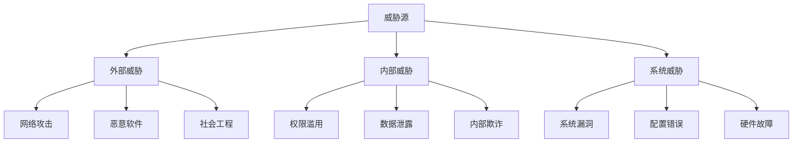

# 安全框架文档

## 1. 安全架构概述

### 1.1 安全设计原则

本系统遵循**纵深防御**（Defense in Depth）安全策略，构建多层安全防护体系：

- **零信任架构**: 不信任任何用户或设备，持续验证
- **最小权限原则**: 用户仅获得完成任务所需的最小权限
- **数据分类保护**: 根据数据敏感性实施分级保护
- **端到端加密**: 数据在传输和存储过程中全程加密
- **审计追踪**: 所有操作均可审计和追溯
- **合规优先**: 严格遵循HIPAA、GDPR等法规要求

### 1.2 威胁模型分析

#### 1.2.1 威胁分类



#### 1.2.2 风险评估矩阵

| 威胁类型 | 可能性 | 影响程度 | 风险等级 | 缓解措施 |
|---------|--------|----------|----------|----------|
| 数据泄露 | 中 | 高 | 高 | 端到端加密、访问控制 |
| 身份冒用 | 中 | 高 | 高 | 多因子认证、生物识别 |
| 拒绝服务攻击 | 高 | 中 | 高 | DDoS防护、负载均衡 |
| 内部威胁 | 低 | 高 | 中 | 权限管理、行为监控 |
| 系统漏洞 | 中 | 中 | 中 | 定期更新、安全扫描 |

## 2. 身份认证与访问控制

### 2.1 多因子认证（MFA）

#### 2.1.1 认证因子

```typescript
// 认证因子枚举
enum AuthenticationFactor {
  KNOWLEDGE = 'knowledge',    // 知识因子（密码、PIN）
  POSSESSION = 'possession',  // 持有因子（手机、令牌）
  INHERENCE = 'inherence'     // 固有因子（生物特征）
}

// 多因子认证配置
interface MFAConfig {
  requiredFactors: AuthenticationFactor[];
  optionalFactors: AuthenticationFactor[];
  timeoutMinutes: number;
  maxAttempts: number;
}

// MFA服务实现
export class MFAService {
  private config: MFAConfig;
  private pendingSessions: Map<string, MFASession> = new Map();
  
  constructor(config: MFAConfig) {
    this.config = config;
  }
  
  async initiateMFA(userId: string, primaryCredentials: any): Promise<MFASession> {
    // 验证主要凭据
    const isValid = await this.validatePrimaryCredentials(userId, primaryCredentials);
    if (!isValid) {
      throw new Error('主要凭据验证失败');
    }
    
    // 创建MFA会话
    const sessionId = this.generateSessionId();
    const session: MFASession = {
      id: sessionId,
      userId,
      completedFactors: [AuthenticationFactor.KNOWLEDGE],
      requiredFactors: this.config.requiredFactors,
      createdAt: new Date(),
      expiresAt: new Date(Date.now() + this.config.timeoutMinutes * 60000)
    };
    
    this.pendingSessions.set(sessionId, session);
    return session;
  }
  
  async verifyFactor(
    sessionId: string,
    factor: AuthenticationFactor,
    proof: any
  ): Promise<MFAResult> {
    const session = this.pendingSessions.get(sessionId);
    if (!session || session.expiresAt < new Date()) {
      throw new Error('MFA会话无效或已过期');
    }
    
    let isValid = false;
    
    switch (factor) {
      case AuthenticationFactor.POSSESSION:
        isValid = await this.verifyPossessionFactor(session.userId, proof);
        break;
      case AuthenticationFactor.INHERENCE:
        isValid = await this.verifyInherenceFactor(session.userId, proof);
        break;
      default:
        throw new Error(`不支持的认证因子: ${factor}`);
    }
    
    if (isValid) {
      session.completedFactors.push(factor);
      
      // 检查是否完成所有必需因子
      const isComplete = this.config.requiredFactors.every(
        f => session.completedFactors.includes(f)
      );
      
      if (isComplete) {
        this.pendingSessions.delete(sessionId);
        return {
          success: true,
          complete: true,
          token: await this.generateAuthToken(session.userId)
        };
      }
    }
    
    return {
      success: isValid,
      complete: false,
      remainingFactors: this.config.requiredFactors.filter(
        f => !session.completedFactors.includes(f)
      )
    };
  }
  
  private async verifyPossessionFactor(userId: string, proof: any): Promise<boolean> {
    // 验证SMS验证码或TOTP令牌
    if (proof.type === 'sms') {
      return await this.verifySMSCode(userId, proof.code);
    } else if (proof.type === 'totp') {
      return await this.verifyTOTPCode(userId, proof.code);
    }
    return false;
  }
  
  private async verifyInherenceFactor(userId: string, proof: any): Promise<boolean> {
    // 验证生物特征
    if (proof.type === 'fingerprint') {
      return await this.verifyFingerprint(userId, proof.data);
    } else if (proof.type === 'face') {
      return await this.verifyFaceRecognition(userId, proof.data);
    }
    return false;
  }
}

interface MFASession {
  id: string;
  userId: string;
  completedFactors: AuthenticationFactor[];
  requiredFactors: AuthenticationFactor[];
  createdAt: Date;
  expiresAt: Date;
}

interface MFAResult {
  success: boolean;
  complete: boolean;
  token?: string;
  remainingFactors?: AuthenticationFactor[];
}
```

#### 2.1.2 生物识别认证

```typescript
// 生物识别服务
export class BiometricAuthService {
  private fingerprintMatcher: FingerprintMatcher;
  private faceRecognizer: FaceRecognizer;
  
  constructor() {
    this.fingerprintMatcher = new FingerprintMatcher();
    this.faceRecognizer = new FaceRecognizer();
  }
  
  async enrollFingerprint(userId: string, fingerprintData: Buffer): Promise<void> {
    try {
      // 提取指纹特征
      const features = await this.fingerprintMatcher.extractFeatures(fingerprintData);
      
      // 加密存储特征模板
      const encryptedFeatures = await this.encryptBiometricTemplate(features);
      
      // 存储到安全数据库
      await this.storeBiometricTemplate(userId, 'fingerprint', encryptedFeatures);
      
      console.log(`用户 ${userId} 指纹注册成功`);
    } catch (error) {
      console.error('指纹注册失败:', error);
      throw new Error('指纹注册失败');
    }
  }
  
  async verifyFingerprint(userId: string, fingerprintData: Buffer): Promise<boolean> {
    try {
      // 获取存储的特征模板
      const encryptedTemplate = await this.getBiometricTemplate(userId, 'fingerprint');
      if (!encryptedTemplate) {
        return false;
      }
      
      // 解密特征模板
      const storedFeatures = await this.decryptBiometricTemplate(encryptedTemplate);
      
      // 提取当前指纹特征
      const currentFeatures = await this.fingerprintMatcher.extractFeatures(fingerprintData);
      
      // 特征匹配
      const matchScore = await this.fingerprintMatcher.match(storedFeatures, currentFeatures);
      
      // 匹配阈值检查
      const threshold = 0.8; // 80%匹配度
      return matchScore >= threshold;
    } catch (error) {
      console.error('指纹验证失败:', error);
      return false;
    }
  }
  
  async enrollFace(userId: string, faceImageData: Buffer): Promise<void> {
    try {
      // 人脸检测和特征提取
      const faceFeatures = await this.faceRecognizer.extractFeatures(faceImageData);
      
      // 质量检查
      const quality = await this.faceRecognizer.assessQuality(faceImageData);
      if (quality < 0.7) {
        throw new Error('人脸图像质量不符合要求');
      }
      
      // 加密存储
      const encryptedFeatures = await this.encryptBiometricTemplate(faceFeatures);
      await this.storeBiometricTemplate(userId, 'face', encryptedFeatures);
      
      console.log(`用户 ${userId} 人脸注册成功`);
    } catch (error) {
      console.error('人脸注册失败:', error);
      throw error;
    }
  }
  
  private async encryptBiometricTemplate(template: any): Promise<string> {
    // 使用专用密钥加密生物特征模板
    const key = await this.getBiometricEncryptionKey();
    return this.encrypt(JSON.stringify(template), key);
  }
}
```

### 2.2 基于角色的访问控制（RBAC）

#### 2.2.1 权限模型设计

```typescript
// 权限系统核心接口
interface Permission {
  id: string;
  name: string;
  resource: string;
  action: string;
  conditions?: AccessCondition[];
}

interface Role {
  id: string;
  name: string;
  description: string;
  permissions: Permission[];
  inheritsFrom?: string[]; // 角色继承
}

interface User {
  id: string;
  email: string;
  roles: string[];
  attributes: UserAttribute[];
}

interface AccessCondition {
  type: 'time' | 'location' | 'device' | 'context';
  operator: 'equals' | 'in' | 'between' | 'matches';
  value: any;
}

// RBAC服务实现
export class RBACService {
  private roleHierarchy: Map<string, Role> = new Map();
  private userRoles: Map<string, string[]> = new Map();
  
  constructor() {
    this.initializeDefaultRoles();
  }
  
  private initializeDefaultRoles(): void {
    // 定义系统默认角色
    const roles: Role[] = [
      {
        id: 'patient',
        name: '患者',
        description: '医疗记录的所有者',
        permissions: [
          {
            id: 'view_own_records',
            name: '查看自己的医疗记录',
            resource: 'medical_record',
            action: 'read',
            conditions: [{
              type: 'context',
              operator: 'equals',
              value: { owner: 'self' }
            }]
          },
          {
            id: 'grant_access',
            name: '授予访问权限',
            resource: 'medical_record',
            action: 'grant',
            conditions: [{
              type: 'context',
              operator: 'equals',
              value: { owner: 'self' }
            }]
          }
        ]
      },
      {
        id: 'doctor',
        name: '医生',
        description: '医疗服务提供者',
        permissions: [
          {
            id: 'create_records',
            name: '创建医疗记录',
            resource: 'medical_record',
            action: 'create'
          },
          {
            id: 'view_assigned_records',
            name: '查看分配的医疗记录',
            resource: 'medical_record',
            action: 'read',
            conditions: [{
              type: 'context',
              operator: 'equals',
              value: { assigned: true }
            }]
          }
        ]
      },
      {
        id: 'nurse',
        name: '护士',
        description: '护理人员',
        inheritsFrom: ['doctor'],
        permissions: [
          {
            id: 'update_vital_signs',
            name: '更新生命体征',
            resource: 'medical_record',
            action: 'update',
            conditions: [{
              type: 'context',
              operator: 'in',
              value: { recordType: ['vital_signs', 'nursing_notes'] }
            }]
          }
        ]
      },
      {
        id: 'admin',
        name: '系统管理员',
        description: '系统管理员',
        permissions: [
          {
            id: 'manage_users',
            name: '用户管理',
            resource: 'user',
            action: '*'
          },
          {
            id: 'manage_system',
            name: '系