# 系统架构设计文档

## 1. 架构概述

### 1.1 架构设计原则

本系统遵循以下核心架构设计原则：

- **分层解耦**: 采用分层架构模式，各层职责明确，降低耦合度
- **微服务化**: 业务功能模块化，支持独立部署和扩展
- **高可用性**: 无单点故障，支持故障自动恢复
- **可扩展性**: 水平扩展能力，支持业务增长
- **安全优先**: 多层安全防护，数据全程加密
- **性能优化**: 多级缓存，异步处理，负载均衡

### 1.2 架构模式

系统采用**分层架构 + 微服务架构**的混合模式：

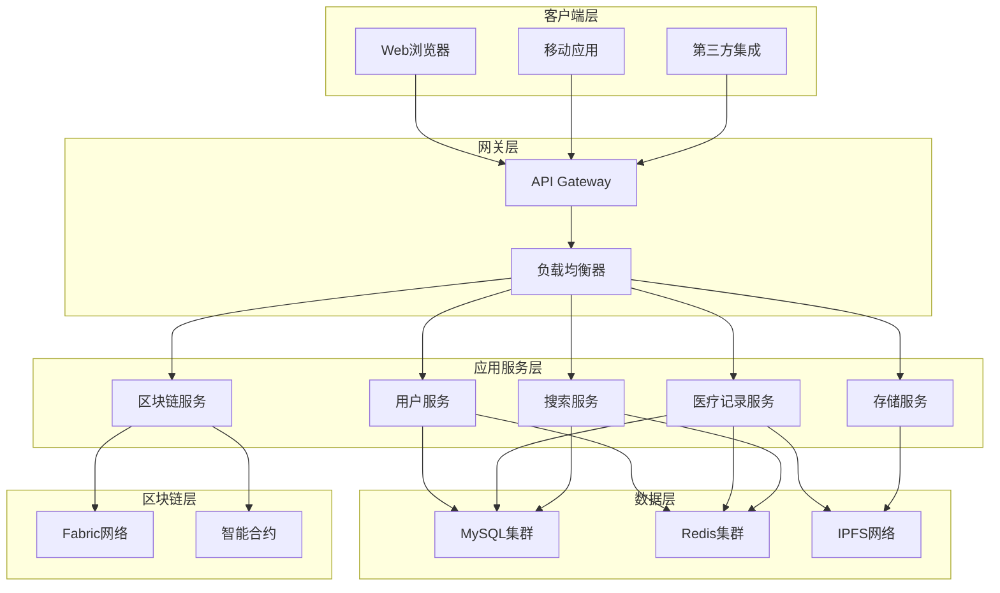

## 2. 系统组件架构

### 2.1 前端架构

#### 2.1.1 组件层次结构

```
src/
├── components/           # 可复用组件
│   ├── Auth/            # 认证相关组件
│   ├── MedicalRecords/  # 医疗记录组件
│   ├── Admin/           # 管理员组件
│   ├── AIDiagnosis/     # AI诊断组件
│   └── ui/              # 基础UI组件
├── pages/               # 页面组件
├── hooks/               # 自定义Hooks
├── contexts/            # React Context
├── services/            # API服务层
├── utils/               # 工具函数
└── types/               # TypeScript类型定义
```

#### 2.1.2 状态管理架构

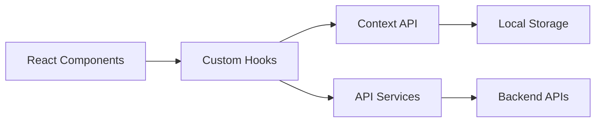

#### 2.1.3 路由架构

- **公共路由**: 登录、注册、首页
- **认证路由**: 需要登录的页面
- **角色路由**: 基于用户角色的页面访问控制
- **懒加载**: 代码分割和按需加载

### 2.2 后端架构

#### 2.2.1 服务层架构

```
backend-app/src/
├── controllers/         # 控制器层
├── services/           # 业务逻辑层
│   ├── UserService.ts
│   ├── MedicalRecordService.ts
│   ├── BlockchainService.ts
│   ├── IPFSService.ts
│   ├── CacheService.ts
│   └── EncryptedSearchService.ts
├── models/             # 数据模型层
├── routes/             # 路由层
├── middleware/         # 中间件
├── utils/              # 工具函数
├── types/              # 类型定义
└── config/             # 配置管理
```

#### 2.2.2 服务间通信

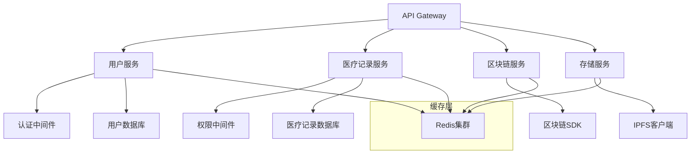

#### 2.2.3 数据访问层

- **ORM层**: 使用TypeORM进行对象关系映射
- **连接池**: 数据库连接池管理
- **事务管理**: 分布式事务处理
- **读写分离**: 主从数据库架构

### 2.3 区块链架构

#### 2.3.1 Hyperledger Fabric网络架构

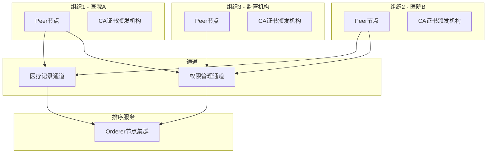

#### 2.3.2 智能合约架构

```go
// 合约结构
type MedicalRecordContract struct {
    contractapi.Contract
}

// 核心数据结构
type MedicalRecord struct {
    ID          string    `json:"id"`
    PatientID   string    `json:"patientId"`
    DoctorID    string    `json:"doctorId"`
    IPFSHash    string    `json:"ipfsHash"`
    Timestamp   time.Time `json:"timestamp"`
    Permissions []string  `json:"permissions"`
}

type AccessPermission struct {
    RecordID    string    `json:"recordId"`
    UserID      string    `json:"userId"`
    Permission  string    `json:"permission"`
    ExpiryTime  time.Time `json:"expiryTime"`
}
```

### 2.4 存储架构

#### 2.4.1 分层存储策略

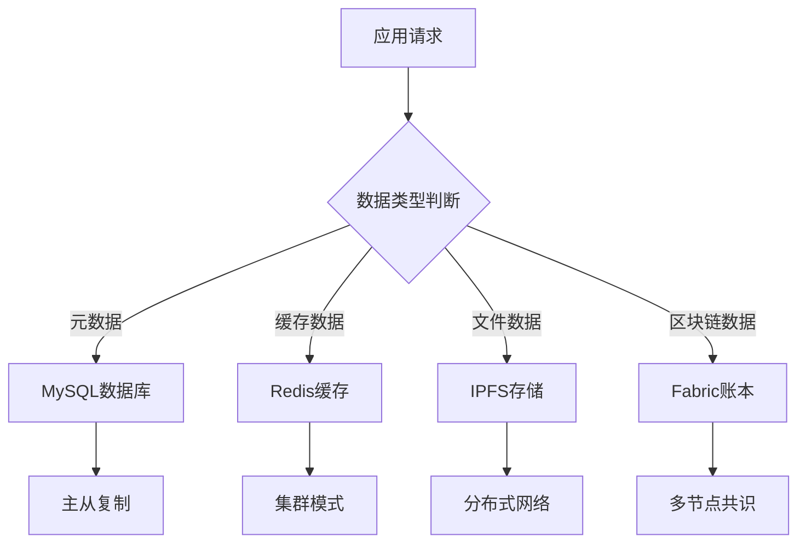

#### 2.4.2 IPFS存储架构

- **文件分片**: 大文件自动分片存储
- **内容寻址**: 基于哈希的内容定位
- **冗余备份**: 多节点数据冗余
- **访问优化**: DHT路由和就近访问

## 3. 安全架构

### 3.1 多层安全防护

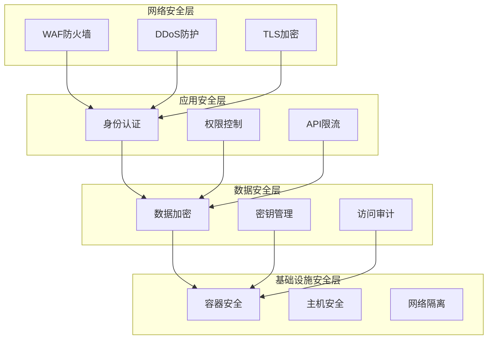

### 3.2 加密架构

#### 3.2.1 密钥管理体系

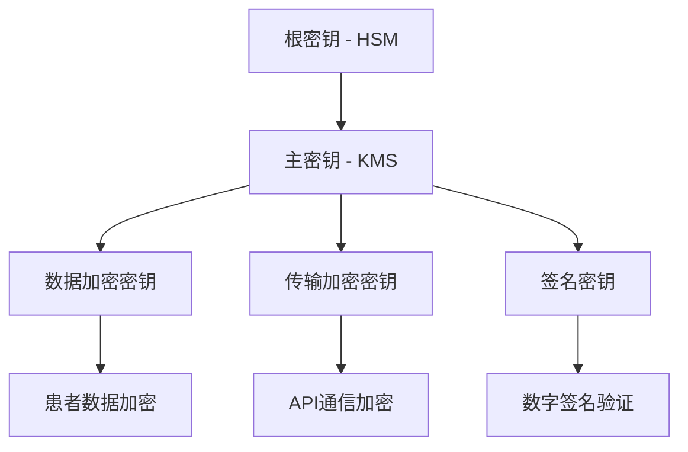

#### 3.2.2 加密算法选择

- **对称加密**: AES-256-GCM (数据加密)
- **非对称加密**: RSA-4096 (密钥交换)
- **哈希算法**: SHA-256 (数据完整性)
- **数字签名**: ECDSA P-256 (身份验证)

### 3.3 访问控制架构

#### 3.3.1 RBAC权限模型

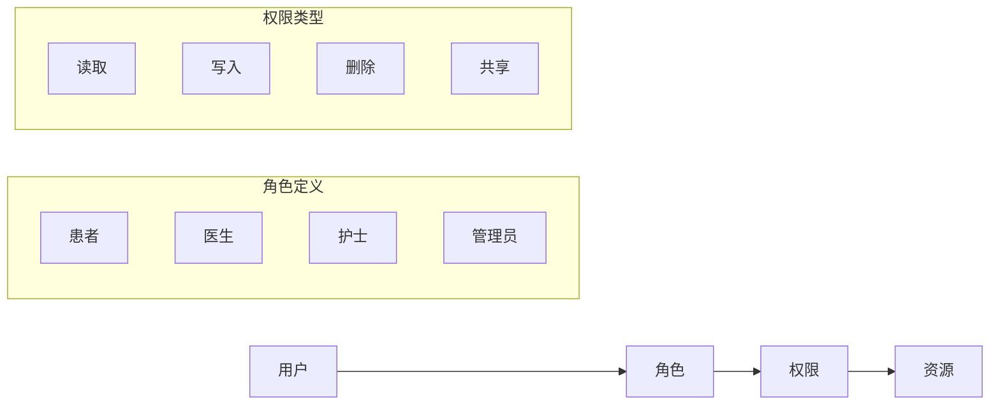

#### 3.3.2 动态权限控制

- **基于时间**: 权限有效期控制
- **基于位置**: 地理位置访问限制
- **基于设备**: 设备指纹验证
- **基于行为**: 异常行为检测

## 4. 性能架构

### 4.1 缓存架构

#### 4.1.1 多级缓存策略

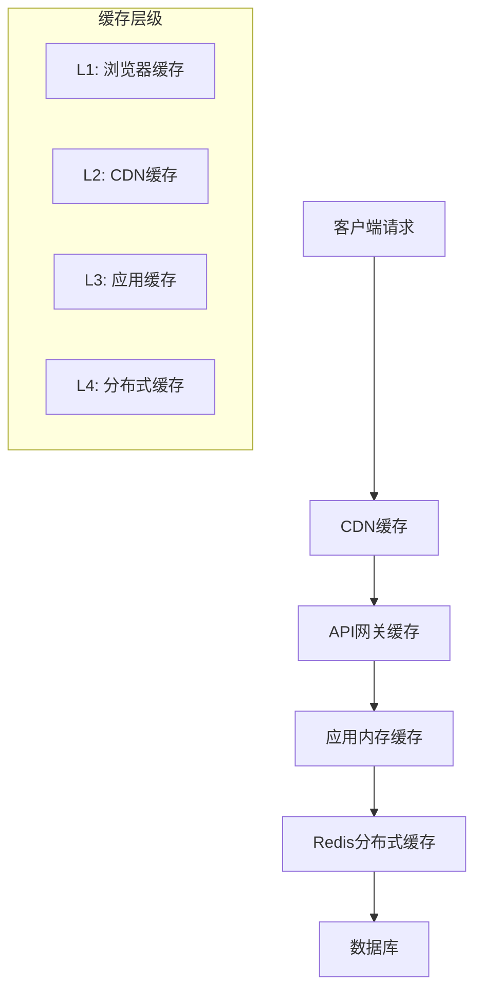

#### 4.1.2 缓存策略

- **Cache-Aside**: 应用程序管理缓存
- **Write-Through**: 同步写入缓存和数据库
- **Write-Behind**: 异步写入数据库
- **Refresh-Ahead**: 预测性缓存刷新

### 4.2 负载均衡架构

#### 4.2.1 多层负载均衡

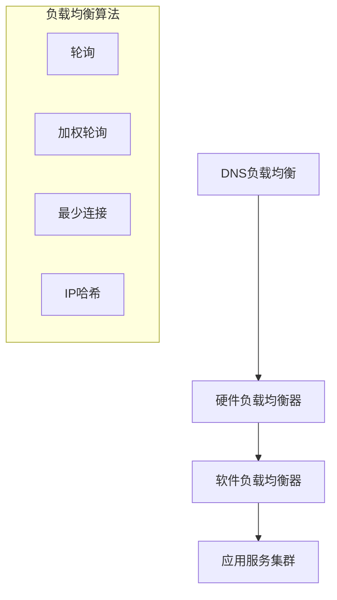

#### 4.2.2 服务发现

- **服务注册**: 自动服务注册
- **健康检查**: 定期健康状态检测
- **故障转移**: 自动故障节点剔除
- **动态配置**: 运行时配置更新

### 4.3 异步处理架构

#### 4.3.1 消息队列架构

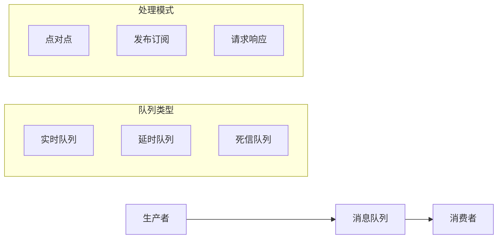

#### 4.3.2 事件驱动架构

- **事件总线**: 统一事件分发
- **事件溯源**: 事件历史记录
- **CQRS**: 命令查询职责分离
- **Saga模式**: 分布式事务管理

## 5. 监控与运维架构

### 5.1 监控体系

#### 5.1.1 全链路监控

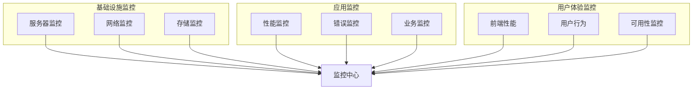

#### 5.1.2 指标体系

- **系统指标**: CPU、内存、磁盘、网络
- **应用指标**: QPS、响应时间、错误率
- **业务指标**: 用户活跃度、交易量
- **安全指标**: 攻击检测、异常访问

### 5.2 日志架构

#### 5.2.1 日志收集流程

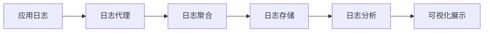

#### 5.2.2 日志分类

- **访问日志**: HTTP请求记录
- **应用日志**: 业务逻辑日志
- **错误日志**: 异常和错误信息
- **审计日志**: 安全相关操作

### 5.3 部署架构

#### 5.3.1 容器化部署

```yaml
# Docker Compose架构示例
version: '3.8'
services:
  frontend:
    image: emr-frontend:latest
    ports:
      - "3000:3000"
    
  backend:
    image: emr-backend:latest
    ports:
      - "8000:8000"
    depends_on:
      - mysql
      - redis
    
  mysql:
    image: mysql:8.0
    environment:
      MYSQL_ROOT_PASSWORD: password
    
  redis:
    image: redis:7-alpine
    
  ipfs:
    image: ipfs/go-ipfs:latest
```

#### 5.3.2 Kubernetes部署

```yaml
apiVersion: apps/v1
kind: Deployment
metadata:
  name: emr-backend
spec:
  replicas: 3
  selector:
    matchLabels:
      app: emr-backend
  template:
    metadata:
      labels:
        app: emr-backend
    spec:
      containers:
      - name: backend
        image: emr-backend:latest
        ports:
        - containerPort: 8000
        resources:
          requests:
            memory: "256Mi"
            cpu: "250m"
          limits:
            memory: "512Mi"
            cpu: "500m"
```

## 6. 数据架构

### 6.1 数据模型设计

#### 6.1.1 核心实体关系

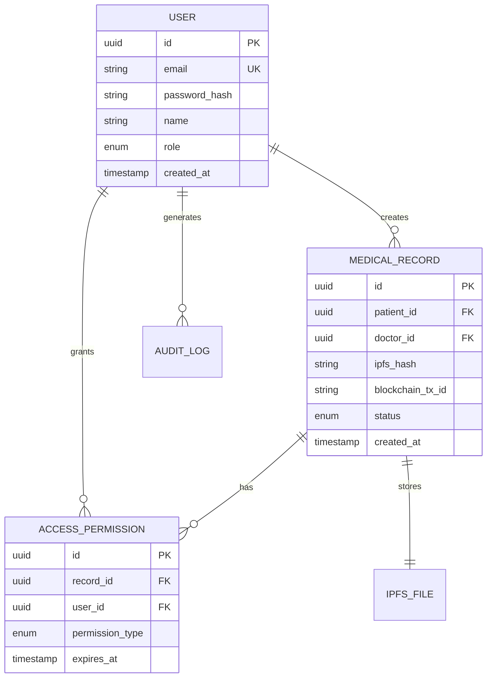

#### 6.1.2 数据分片策略

- **水平分片**: 按用户ID或时间分片
- **垂直分片**: 按业务模块分离
- **读写分离**: 主库写入，从库读取
- **冷热分离**: 历史数据归档

### 6.2 数据流架构

#### 6.2.1 数据流向

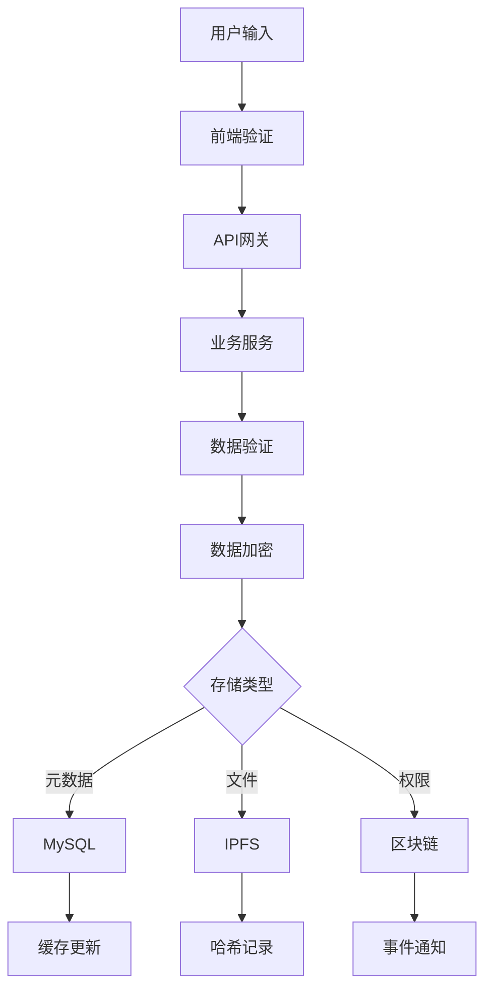

#### 6.2.2 数据同步

- **实时同步**: 关键数据实时同步
- **批量同步**: 非关键数据批量处理
- **增量同步**: 只同步变更数据
- **冲突解决**: 数据冲突自动解决

## 7. 扩展性设计

### 7.1 水平扩展

#### 7.1.1 无状态设计

- **服务无状态**: 所有服务设计为无状态
- **会话外置**: 会话数据存储在Redis
- **配置外置**: 配置信息统一管理
- **日志外置**: 日志统一收集处理

#### 7.1.2 自动扩缩容

```yaml
apiVersion: autoscaling/v2
kind: HorizontalPodAutoscaler
metadata:
  name: emr-backend-hpa
spec:
  scaleTargetRef:
    apiVersion: apps/v1
    kind: Deployment
    name: emr-backend
  minReplicas: 2
  maxReplicas: 10
  metrics:
  - type: Resource
    resource:
      name: cpu
      target:
        type: Utilization
        averageUtilization: 70
```

### 7.2 模块化设计

#### 7.2.1 插件架构

- **核心框架**: 提供基础功能
- **插件接口**: 标准化插件接口
- **动态加载**: 运行时插件加载
- **版本管理**: 插件版本兼容性

#### 7.2.2 API版本管理

- **版本策略**: 语义化版本控制
- **向后兼容**: 保持API向后兼容
- **废弃管理**: 渐进式API废弃
- **文档同步**: API文档自动生成

## 8. 容灾与备份

### 8.1 容灾架构

#### 8.1.1 多地域部署

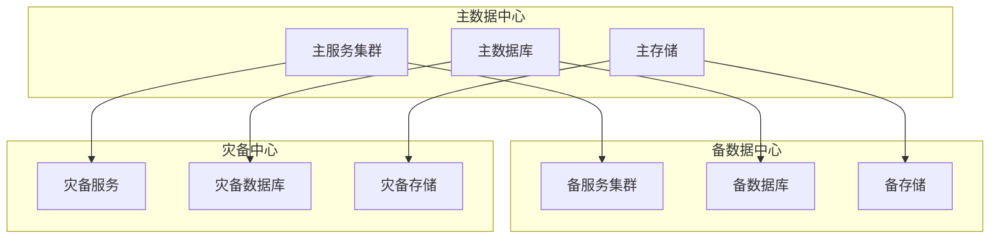

#### 8.1.2 故障恢复

- **自动故障检测**: 实时健康检查
- **快速故障转移**: 秒级故障切换
- **数据一致性**: 保证数据完整性
- **服务降级**: 核心功能优先保障

### 8.2 备份策略

#### 8.2.1 分层备份

- **实时备份**: 关键数据实时备份
- **增量备份**: 每日增量备份
- **全量备份**: 每周全量备份
- **长期归档**: 历史数据长期保存

#### 8.2.2 恢复测试

- **定期演练**: 月度恢复演练
- **自动化测试**: 备份有效性验证
- **RTO/RPO**: 恢复时间和数据丢失目标
- **文档更新**: 恢复流程文档维护

---

*本文档版本: v1.0*  
*最后更新: 2024年1月*  
*文档维护: 系统架构团队*