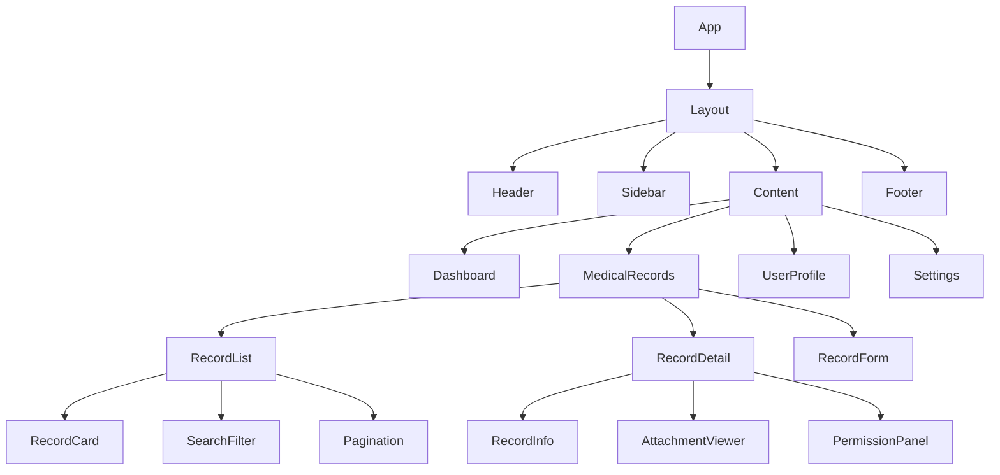

# 前端组件架构文档

## 1. 概述

本文档详细描述了区块链电子病历共享系统前端应用的组件架构设计，包括技术栈选择、组件层次结构、状态管理、路由设计等内容。

### 1.1 技术栈

* **框架**: React 18 + TypeScript

* **构建工具**: Vite 4.x

* **状态管理**: Redux Toolkit + RTK Query

* **路由**: React Router v6

* **UI组件库**: Ant Design 5.x

* **样式方案**: Tailwind CSS + CSS Modules

* **图表库**: ECharts + Apache ECharts for React

* **文件上传**: react-dropzone

* **表单处理**: React Hook Form + Yup

### 1.2 架构原则

* **组件化开发**: 高内聚、低耦合的组件设计

* **类型安全**: 全面的TypeScript类型定义

* **响应式设计**: 移动端优先的自适应布局

* **性能优化**: 代码分割、懒加载、缓存策略

* **可维护性**: 清晰的目录结构和命名规范

## 2. 项目结构

```
src/
├── components/           # 通用组件
│   ├── common/          # 基础组件
│   ├── forms/           # 表单组件
│   ├── charts/          # 图表组件
│   └── layout/          # 布局组件
├── pages/               # 页面组件
│   ├── auth/           # 认证相关页面
│   ├── dashboard/      # 仪表板页面
│   ├── records/        # 医疗记录页面
│   └── profile/        # 用户资料页面
├── hooks/               # 自定义Hooks
├── store/               # Redux状态管理
│   ├── slices/         # Redux切片
│   └── api/            # RTK Query API
├── utils/               # 工具函数
├── types/               # TypeScript类型定义
├── constants/           # 常量定义
├── styles/              # 全局样式
└── assets/              # 静态资源
```

## 3. 核心组件架构

### 3.1 组件层次结构



### 3.2 Layout组件

```typescript
// src/components/layout/Layout.tsx
import React from 'react';
import { Layout as AntLayout } from 'antd';
import { Outlet } from 'react-router-dom';
import Header from './Header';
import Sidebar from './Sidebar';
import Footer from './Footer';
import { useAppSelector } from '@/hooks/redux';

const { Content } = AntLayout;

interface LayoutProps {
  children?: React.ReactNode;
}

const Layout: React.FC<LayoutProps> = () => {
  const { collapsed } = useAppSelector(state => state.ui);
  const { user } = useAppSelector(state => state.auth);

  return (
    <AntLayout className="min-h-screen">
      <Header />
      <AntLayout>
        {user && <Sidebar collapsed={collapsed} />}
        <AntLayout className="ml-0 lg:ml-64">
          <Content className="p-6 bg-gray-50">
            <Outlet />
          </Content>
          <Footer />
        </AntLayout>
      </AntLayout>
    </AntLayout>
  );
};

export default Layout;
```

### 3.3 Header组件

```typescript
// src/components/layout/Header.tsx
import React from 'react';
import { Layout, Button, Dropdown, Avatar, Badge, Space } from 'antd';
import {
  MenuFoldOutlined,
  MenuUnfoldOutlined,
  BellOutlined,
  UserOutlined,
  LogoutOutlined,
  SettingOutlined
} from '@ant-design/icons';
import { useAppDispatch, useAppSelector } from '@/hooks/redux';
import { toggleSidebar } from '@/store/slices/uiSlice';
import { logout } from '@/store/slices/authSlice';
import { useNavigate } from 'react-router-dom';

const { Header: AntHeader } = Layout;

const Header: React.FC = () => {
  const dispatch = useAppDispatch();
  const navigate = useNavigate();
  const { collapsed } = useAppSelector(state => state.ui);
  const { user } = useAppSelector(state => state.auth);
  const { unreadCount } = useAppSelector(state => state.notifications);

  const handleLogout = () => {
    dispatch(logout());
    navigate('/login');
  };

  const userMenuItems = [
    {
      key: 'profile',
      icon: <UserOutlined />,
      label: '个人资料',
      onClick: () => navigate('/profile')
    },
    {
      key: 'settings',
      icon: <SettingOutlined />,
      label: '系统设置',
      onClick: () => navigate('/settings')
    },
    {
      type: 'divider' as const
    },
    {
      key: 'logout',
      icon: <LogoutOutlined />,
      label: '退出登录',
      onClick: handleLogout
    }
  ];

  return (
    <AntHeader className="bg-white shadow-sm px-6 flex items-center justify-between">
      <div className="flex items-center">
        <Button
          type="text"
          icon={collapsed ? <MenuUnfoldOutlined /> : <MenuFoldOutlined />}
          onClick={() => dispatch(toggleSidebar())}
          className="mr-4"
        />
        <h1 className="text-xl font-semibold text-gray-800">
          区块链电子病历系统
        </h1>
      </div>
      
      <Space size="middle">
        <Badge count={unreadCount} size="small">
          <Button
            type="text"
            icon={<BellOutlined />}
            onClick={() => navigate('/notifications')}
          />
        </Badge>
        
        {user && (
          <Dropdown menu={{ items: userMenuItems }} placement="bottomRight">
            <div className="flex items-center cursor-pointer hover:bg-gray-50 px-2 py-1 rounded">
              <Avatar
                size="small"
                src={user.avatar}
                icon={<UserOutlined />}
                className="mr-2"
              />
              <span className="text-gray-700">{user.name}</span>
            </div>
          </Dropdown>
        )}
      </Space>
    </AntHeader>
  );
};

export default Header;
```

### 3.4 Sidebar组件

```typescript
// src/components/layout/Sidebar.tsx
import React from 'react';
import { Layout, Menu } from 'antd';
import {
  DashboardOutlined,
  FileTextOutlined,
  UserOutlined,
  TeamOutlined,
  SettingOutlined,
  BarChartOutlined
} from '@ant-design/icons';
import { useNavigate, useLocation } from 'react-router-dom';
import { useAppSelector } from '@/hooks/redux';
import type { MenuProps } from 'antd';

const { Sider } = Layout;

interface SidebarProps {
  collapsed: boolean;
}

type MenuItem = Required<MenuProps>['items'][number];

const Sidebar: React.FC<SidebarProps> = ({ collapsed }) => {
  const navigate = useNavigate();
  const location = useLocation();
  const { user } = useAppSelector(state => state.auth);

  const getMenuItems = (): MenuItem[] => {
    const baseItems: MenuItem[] = [
      {
        key: '/dashboard',
        icon: <DashboardOutlined />,
        label: '仪表板'
      },
      {
        key: '/records',
        icon: <FileTextOutlined />,
        label: '医疗记录',
        children: [
          {
            key: '/records/list',
            label: '记录列表'
          },
          {
            key: '/records/create',
            label: '创建记录'
          }
        ]
      },
      {
        key: '/profile',
        icon: <UserOutlined />,
        label: '个人资料'
      }
    ];

    // 根据用户角色添加特定菜单项
    if (user?.role === 'doctor' || user?.role === 'admin') {
      baseItems.push({
        key: '/patients',
        icon: <TeamOutlined />,
        label: '患者管理'
      });
    }

    if (user?.role === 'admin') {
      baseItems.push(
        {
          key: '/analytics',
          icon: <BarChartOutlined />,
          label: '数据分析'
        },
        {
          key: '/settings',
          icon: <SettingOutlined />,
          label: '系统设置'
        }
      );
    }

    return baseItems;
  };

  const handleMenuClick: MenuProps['onClick'] = ({ key }) => {
    navigate(key);
  };

  return (
    <Sider
      trigger={null}
      collapsible
      collapsed={collapsed}
      className="fixed left-0 top-16 h-[calc(100vh-64px)] z-10"
      width={256}
    >
      <Menu
        theme="dark"
        mode="inline"
        selectedKeys={[location.pathname]}
        items={getMenuItems()}
        onClick={handleMenuClick}
        className="h-full border-r-0"
      />
    </Sider>
  );
};

export default Sidebar;
```

## 4. 页面组件

### 4.1 Dashboard页面

```typescript
// src/pages/dashboard/Dashboard.tsx
import React from 'react';
import { Row, Col, Card, Statistic, Progress } from 'antd';
import {
  FileTextOutlined,
  UserOutlined,
  CheckCircleOutlined,
  ClockCircleOutlined
} from '@ant-design/icons';
import { useGetDashboardStatsQuery } from '@/store/api/dashboardApi';
import RecordChart from '@/components/charts/RecordChart';
import RecentRecords from '@/components/dashboard/RecentRecords';
import QuickActions from '@/components/dashboard/QuickActions';

const Dashboard: React.FC = () => {
  const { data: stats, isLoading } = useGetDashboardStatsQuery();

  return (
    <div className="space-y-6">
      {/* 统计卡片 */}
      <Row gutter={[16, 16]}>
        <Col xs={24} sm={12} lg={6}>
          <Card>
            <Statistic
              title="总记录数"
              value={stats?.totalRecords || 0}
              prefix={<FileTextOutlined />}
              loading={isLoading}
            />
          </Card>
        </Col>
        <Col xs={24} sm={12} lg={6}>
          <Card>
            <Statistic
              title="患者数量"
              value={stats?.totalPatients || 0}
              prefix={<UserOutlined />}
              loading={isLoading}
            />
          </Card>
        </Col>
        <Col xs={24} sm={12} lg={6}>
          <Card>
            <Statistic
              title="已审核"
              value={stats?.approvedRecords || 0}
              prefix={<CheckCircleOutlined />}
              loading={isLoading}
            />
          </Card>
        </Col>
        <Col xs={24} sm={12} lg={6}>
          <Card>
            <Statistic
              title="待审核"
              value={stats?.pendingRecords || 0}
              prefix={<ClockCircleOutlined />}
              loading={isLoading}
            />
          </Card>
        </Col>
      </Row>

      {/* 图表和进度 */}
      <Row gutter={[16, 16]}>
        <Col xs={24} lg={16}>
          <Card title="记录趋势" className="h-96">
            <RecordChart data={stats?.chartData} />
          </Card>
        </Col>
        <Col xs={24} lg={8}>
          <Card title="系统状态" className="h-96">
            <div className="space-y-4">
              <div>
                <div className="flex justify-between mb-2">
                  <span>存储使用率</span>
                  <span>{stats?.storageUsage || 0}%</span>
                </div>
                <Progress percent={stats?.storageUsage || 0} />
              </div>
              <div>
                <div className="flex justify-between mb-2">
                  <span>区块链同步</span>
                  <span>{stats?.blockchainSync || 0}%</span>
                </div>
                <Progress percent={stats?.blockchainSync || 0} status="active" />
              </div>
              <div>
                <div className="flex justify-between mb-2">
                  <span>IPFS连接</span>
                  <span>{stats?.ipfsStatus ? '正常' : '异常'}</span>
                </div>
                <Progress 
                  percent={stats?.ipfsStatus ? 100 : 0} 
                  status={stats?.ipfsStatus ? 'success' : 'exception'}
                />
              </div>
            </div>
          </Card>
        </Col>
      </Row>

      {/* 最近记录和快捷操作 */}
      <Row gutter={[16, 16]}>
        <Col xs={24} lg={16}>
          <RecentRecords />
        </Col>
        <Col xs={24} lg={8}>
          <QuickActions />
        </Col>
      </Row>
    </div>
  );
};

export default Dashboard;
```

### 4.2 医疗记录列表页面

```typescript
// src/pages/records/RecordList.tsx
import React, { useState } from 'react';
import {
  Card,
  Table,
  Button,
  Input,
  Select,
  DatePicker,
  Space,
  Tag,
  Tooltip,
  Modal
} from 'antd';
import {
  PlusOutlined,
  SearchOutlined,
  EyeOutlined,
  EditOutlined,
  ShareAltOutlined
} from '@ant-design/icons';
import { useNavigate } from 'react-router-dom';
import { useGetMedicalRecordsQuery } from '@/store/api/recordsApi';
import type { ColumnsType } from 'antd/es/table';
import type { MedicalRecord } from '@/types/medical';
import RecordStatusTag from '@/components/common/RecordStatusTag';
import ShareRecordModal from '@/components/modals/ShareRecordModal';

const { Search } = Input;
const { RangePicker } = DatePicker;
const { Option } = Select;

const RecordList: React.FC = () => {
  const navigate = useNavigate();
  const [filters, setFilters] = useState({
    search: '',
    type: '',
    status: '',
    dateRange: null as any
  });
  const [shareModalVisible, setShareModalVisible] = useState(false);
  const [selectedRecord, setSelectedRecord] = useState<MedicalRecord | null>(null);

  const { data, isLoading, refetch } = useGetMedicalRecordsQuery({
    page: 1,
    limit: 20,
    ...filters
  });

  const columns: ColumnsType<MedicalRecord> = [
    {
      title: '标题',
      dataIndex: 'title',
      key: 'title',
      render: (text, record) => (
        <Button
          type="link"
          onClick={() => navigate(`/records/${record.id}`)}
          className="p-0 h-auto"
        >
          {text}
        </Button>
      )
    },
    {
      title: '类型',
      dataIndex: 'type',
      key: 'type',
      render: (type) => (
        <Tag color="blue">{getRecordTypeLabel(type)}</Tag>
      )
    },
    {
      title: '患者',
      dataIndex: ['patient', 'name'],
      key: 'patient'
    },
    {
      title: '医生',
      dataIndex: ['doctor', 'name'],
      key: 'doctor'
    },
    {
      title: '状态',
      dataIndex: 'status',
      key: 'status',
      render: (status) => <RecordStatusTag status={status} />
    },
    {
      title: '创建时间',
      dataIndex: 'createdAt',
      key: 'createdAt',
      render: (date) => new Date(date).toLocaleDateString()
    },
    {
      title: '操作',
      key: 'actions',
      render: (_, record) => (
        <Space>
          <Tooltip title="查看详情">
            <Button
              type="text"
              icon={<EyeOutlined />}
              onClick={() => navigate(`/records/${record.id}`)}
            />
          </Tooltip>
          <Tooltip title="编辑">
            <Button
              type="text"
              icon={<EditOutlined />}
              onClick={() => navigate(`/records/${record.id}/edit`)}
            />
          </Tooltip>
          <Tooltip title="分享">
            <Button
              type="text"
              icon={<ShareAltOutlined />}
              onClick={() => {
                setSelectedRecord(record);
                setShareModalVisible(true);
              }}
            />
          </Tooltip>
        </Space>
      )
    }
  ];

  const getRecordTypeLabel = (type: string) => {
    const typeMap: Record<string, string> = {
      consultation: '门诊',
      diagnosis: '诊断',
      treatment: '治疗',
      prescription: '处方',
      lab_result: '检验',
      imaging: '影像',
      surgery: '手术'
    };
    return typeMap[type] || type;
  };

  return (
    <div className="space-y-4">
      {/* 搜索和过滤 */}
      <Card>
        <div className="grid grid-cols-1 md:grid-cols-4 gap-4 mb-4">
          <Search
            placeholder="搜索记录标题或描述"
            value={filters.search}
            onChange={(e) => setFilters({ ...filters, search: e.target.value })}
            onSearch={() => refetch()}
          />
          <Select
            placeholder="选择记录类型"
            value={filters.type}
            onChange={(value) => setFilters({ ...filters, type: value })}
            allowClear
          >
            <Option value="consultation">门诊</Option>
            <Option value="diagnosis">诊断</Option>
            <Option value="treatment">治疗</Option>
            <Option value="prescription">处方</Option>
            <Option value="lab_result">检验</Option>
            <Option value="imaging">影像</Option>
            <Option value="surgery">手术</Option>
          </Select>
          <Select
            placeholder="选择状态"
            value={filters.status}
            onChange={(value) => setFilters({ ...filters, status: value })}
            allowClear
          >
            <Option value="draft">草稿</Option>
            <Option value="pending">待审核</Option>
            <Option value="approved">已审核</Option>
            <Option value="archived">已归档</Option>
          </Select>
          <RangePicker
            value={filters.dateRange}
            onChange={(dates) => setFilters({ ...filters, dateRange: dates })}
            placeholder={['开始日期', '结束日期']}
          />
        </div>
        <div className="flex justify-between">
          <Button
            type="primary"
            icon={<PlusOutlined />}
            onClick={() => navigate('/records/create')}
          >
            创建记录
          </Button>
          <Button
            icon={<SearchOutlined />}
            onClick={() => refetch()}
          >
            搜索
          </Button>
        </div>
      </Card>

      {/* 记录表格 */}
      <Card>
        <Table
          columns={columns}
          dataSource={data?.records}
          loading={isLoading}
          rowKey="id"
          pagination={{
            current: data?.pagination.page,
            pageSize: data?.pagination.limit,
            total: data?.pagination.total,
            showSizeChanger: true,
            showQuickJumper: true,
            showTotal: (total, range) => 
              `第 ${range[0]}-${range[1]} 条，共 ${total} 条记录`
          }}
        />
      </Card>

      {/* 分享记录模态框 */}
      <ShareRecordModal
        visible={shareModalVisible}
        record={selectedRecord}
        onCancel={() => {
          setShareModalVisible(false);
          setSelectedRecord(null);
        }}
        onSuccess={() => {
          setShareModalVisible(false);
          setSelectedRecord(null);
          refetch();
        }}
      />
    </div>
  );
};

export default RecordList;
```

## 5. 状态管理

### 5.1 Redux Store配置

```typescript
// src/store/index.ts
import { configureStore } from '@reduxjs/toolkit';
import { setupListeners } from '@reduxjs/toolkit/query';
import authSlice from './slices/authSlice';
import uiSlice from './slices/uiSlice';
import notificationSlice from './slices/notificationSlice';
import { authApi } from './api/authApi';
import { recordsApi } from './api/recordsApi';
import { dashboardApi } from './api/dashboardApi';

export const store = configureStore({
  reducer: {
    auth: authSlice,
    ui: uiSlice,
    notifications: notificationSlice,
    [authApi.reducerPath]: authApi.reducer,
    [recordsApi.reducerPath]: recordsApi.reducer,
    [dashboardApi.reducerPath]: dashboardApi.reducer
  },
  middleware: (getDefaultMiddleware) =>
    getDefaultMiddleware({
      serializableCheck: {
        ignoredActions: ['persist/PERSIST', 'persist/REHYDRATE']
      }
    })
      .concat(authApi.middleware)
      .concat(recordsApi.middleware)
      .concat(dashboardApi.middleware)
});

setupListeners(store.dispatch);

export type RootState = ReturnType<typeof store.getState>;
export type AppDispatch = typeof store.dispatch;
```

### 5.2 认证状态切片

```typescript
// src/store/slices/authSlice.ts
import { createSlice, PayloadAction } from '@reduxjs/toolkit';
import type { User } from '@/types/user';

interface AuthState {
  user: User | null;
  token: string | null;
  isAuthenticated: boolean;
  loading: boolean;
}

const initialState: AuthState = {
  user: null,
  token: localStorage.getItem('token'),
  isAuthenticated: false,
  loading: false
};

const authSlice = createSlice({
  name: 'auth',
  initialState,
  reducers: {
    loginStart: (state) => {
      state.loading = true;
    },
    loginSuccess: (state, action: PayloadAction<{ user: User; token: string }>) => {
      state.user = action.payload.user;
      state.token = action.payload.token;
      state.isAuthenticated = true;
      state.loading = false;
      localStorage.setItem('token', action.payload.token);
    },
    loginFailure: (state) => {
      state.user = null;
      state.token = null;
      state.isAuthenticated = false;
      state.loading = false;
      localStorage.removeItem('token');
    },
    logout: (state) => {
      state.user = null;
      state.token = null;
      state.isAuthenticated = false;
      state.loading = false;
      localStorage.removeItem('token');
    },
    updateUser: (state, action: PayloadAction<Partial<User>>) => {
      if (state.user) {
        state.user = { ...state.user, ...action.payload };
      }
    }
  }
});

export const {
  loginStart,
  loginSuccess,
  loginFailure,
  logout,
  updateUser
} = authSlice.actions;

export default authSlice.reducer;
```

## 6. 自定义Hooks

### 6.1 认证Hook

```typescript
// src/hooks/useAuth.ts
import { useAppSelector, useAppDispatch } from './redux';
import { loginSuccess, loginFailure, logout } from '@/store/slices/authSlice';
import { useLoginMutation, useRefreshTokenMutation } from '@/store/api/authApi';
import { useCallback, useEffect } from 'react';

export const useAuth = () => {
  const dispatch = useAppDispatch();
  const { user, token, isAuthenticated, loading } = useAppSelector(state => state.auth);
  const [loginMutation] = useLoginMutation();
  const [refreshTokenMutation] = useRefreshTokenMutation();

  const login = useCallback(async (credentials: { email: string; password: string }) => {
    try {
      const result = await loginMutation(credentials).unwrap();
      dispatch(loginSuccess({
        user: result.user,
        token: result.accessToken
      }));
      return result;
    } catch (error) {
      dispatch(loginFailure());
      throw error;
    }
  }, [loginMutation, dispatch]);

  const refreshToken = useCallback(async () => {
    try {
      const result = await refreshTokenMutation().unwrap();
      dispatch(loginSuccess({
        user: result.user,
        token: result.accessToken
      }));
      return result;
    } catch (error) {
      dispatch(logout());
      throw error;
    }
  }, [refreshTokenMutation, dispatch]);

  const logoutUser = useCallback(() => {
    dispatch(logout());
  }, [dispatch]);

  // 自动刷新token
  useEffect(() => {
    if (token && isAuthenticated) {
      const tokenPayload = JSON.parse(atob(token.split('.')[1]));
      const expirationTime = tokenPayload.exp * 1000;
      const currentTime = Date.now();
      const timeUntilExpiration = expirationTime - currentTime;

      if (timeUntilExpiration > 0) {
        const refreshTime = Math.max(timeUntilExpiration - 5 * 60 * 1000, 0); // 提前5分钟刷新
        const timeoutId = setTimeout(() => {
          refreshToken().catch(() => {
            logoutUser();
          });
        }, refreshTime);

        return () => clearTimeout(timeoutId);
      } else {
        logoutUser();
      }
    }
  }, [token, isAuthenticated, refreshToken, logoutUser]);

  return {
    user,
    token,
    isAuthenticated,
    loading,
    login,
    logout: logoutUser,
    refreshToken
  };
};
```

### 6.2 权限Hook

```typescript
// src/hooks/usePermissions.ts
import { useAppSelector } from './redux';
import { useMemo } from 'react';
import type { UserRole } from '@/types/user';

interface Permission {
  resource: string;
  action: string;
}

const ROLE_PERMISSIONS: Record<UserRole, Permission[]> = {
  patient: [
    { resource: 'medical_record', action: 'read_own' },
    { resource: 'medical_record', action: 'share_own' },
    { resource: 'profile', action: 'read_own' },
    { resource: 'profile', action: 'update_own' }
  ],
  doctor: [
    { resource: 'medical_record', action: 'read' },
    { resource: 'medical_record', action: 'create' },
    { resource: 'medical_record', action: 'update' },
    { resource: 'medical_record', action: 'share' },
    { resource: 'patient', action: 'read' },
    { resource: 'profile', action: 'read_own' },
    { resource: 'profile', action: 'update_own' }
  ],
  nurse: [
    { resource: 'medical_record', action: 'read' },
    { resource: 'medical_record', action: 'create' },
    { resource: 'patient', action: 'read' },
    { resource: 'profile', action: 'read_own' },
    { resource: 'profile', action: 'update_own' }
  ],
  admin: [
    { resource: '*', action: '*' }
  ],
  researcher: [
    { resource: 'medical_record', action: 'read_anonymized' },
    { resource: 'analytics', action: 'read' },
    { resource: 'profile', action: 'read_own' },
    { resource: 'profile', action: 'update_own' }
  ]
};

export const usePermissions = () => {
  const { user } = useAppSelector(state => state.auth);

  const permissions = useMemo(() => {
    if (!user) return [];
    return ROLE_PERMISSIONS[user.role] || [];
  }, [user]);

  const hasPermission = (resource: string, action: string): boolean => {
    if (!user) return false;
    
    return permissions.some(permission => 
      (permission.resource === '*' || permission.resource === resource) &&
      (permission.action === '*' || permission.action === action)
    );
  };

  const canReadMedicalRecord = (recordOwnerId?: string): boolean => {
    if (!user) return false;
    
    if (hasPermission('medical_record', 'read')) return true;
    if (hasPermission('medical_record', 'read_own') && recordOwnerId === user.id) return true;
    
    return false;
  };

  const canCreateMedicalRecord = (): boolean => {
    return hasPermission('medical_record', 'create');
  };

  const canUpdateMedicalRecord = (recordOwnerId?: string): boolean => {
    if (!user) return false;
    
    if (hasPermission('medical_record', 'update')) return true;
    if (hasPermission('medical_record', 'update_own') && recordOwnerId === user.id) return true;
    
    return false;
  };

  return {
    permissions,
    hasPermission,
    canReadMedicalRecord,
    canCreateMedicalRecord,
    canUpdateMedicalRecord
  };
};
```

## 7. 性能优化

### 7.1 代码分割

```typescript
// src/routes/index.tsx
import { lazy, Suspense } from 'react';
import { Routes, Route } from 'react-router-dom';
import { Spin } from 'antd';
import Layout from '@/components/layout/Layout';
import ProtectedRoute from '@/components/auth/ProtectedRoute';

// 懒加载页面组件
const Dashboard = lazy(() => import('@/pages/dashboard/Dashboard'));
const RecordList = lazy(() => import('@/pages/records/RecordList'));
const RecordDetail = lazy(() => import('@/pages/records/RecordDetail'));
const RecordForm = lazy(() => import('@/pages/records/RecordForm'));
const Profile = lazy(() => import('@/pages/profile/Profile'));
const Login = lazy(() => import('@/pages/auth/Login'));

const AppRoutes = () => {
  return (
    <Suspense fallback={<Spin size="large" className="flex justify-center items-center h-screen" />}>
      <Routes>
        <Route path="/login" element={<Login />} />
        <Route path="/" element={<Layout />}>
          <Route index element={<ProtectedRoute><Dashboard /></ProtectedRoute>} />
          <Route path="dashboard" element={<ProtectedRoute><Dashboard /></ProtectedRoute>} />
          <Route path="records">
            <Route index element={<ProtectedRoute><RecordList /></ProtectedRoute>} />
            <Route path="list" element={<ProtectedRoute><RecordList /></ProtectedRoute>} />
            <Route path="create" element={<ProtectedRoute><RecordForm /></ProtectedRoute>} />
            <Route path=":id" element={<ProtectedRoute><RecordDetail /></ProtectedRoute>} />
            <Route path=":id/edit" element={<ProtectedRoute><RecordForm /></ProtectedRoute>} />
          </Route>
          <Route path="profile" element={<ProtectedRoute><Profile /></ProtectedRoute>} />
        </Route>
      </Routes>
    </Suspense>
  );
};

export default AppRoutes;
```

### 7.2 组件优化

```typescript
// src/components/common/OptimizedTable.tsx
import React, { memo, useMemo, useCallback } from 'react';
import { Table, TableProps } from 'antd';
import { FixedSizeList as List } from 'react-window';

interface OptimizedTableProps<T> extends TableProps<T> {
  virtualScroll?: boolean;
  itemHeight?: number;
}

const OptimizedTable = memo(<T extends Record<string, any>>(
  props: OptimizedTableProps<T>
) => {
  const { virtualScroll = false, itemHeight = 54, ...tableProps } = props;

  const memoizedColumns = useMemo(() => {
    return tableProps.columns?.map(col => ({
      ...col,
      render: col.render ? memo(col.render) : undefined
    }));
  }, [tableProps.columns]);

  const handleRowClick = useCallback((record: T, index: number) => {
    tableProps.onRow?.(record, index)?.onClick?.({
      preventDefault: () => {},
      stopPropagation: () => {}
    } as any);
  }, [tableProps.onRow]);

  if (virtualScroll && tableProps.dataSource && tableProps.dataSource.length > 100) {
    return (
      <div className="virtual-table">
        <List
          height={400}
          itemCount={tableProps.dataSource.length}
          itemSize={itemHeight}
          itemData={tableProps.dataSource}
        >
          {({ index, style, data }) => (
            <div style={style} onClick={() => handleRowClick(data[index], index)}>
              {/* 渲染行内容 */}
            </div>
          )}
        </List>
      </div>
    );
  }

  return (
    <Table
      {...tableProps}
      columns={memoizedColumns}
      scroll={{ y: 400, ...tableProps.scroll }}
    />
  );
});

OptimizedTable.displayName = 'OptimizedTable';

export default OptimizedTable;
```

## 8. 测试策略

### 8.1 单元测试

```typescript
// src/components/__tests__/Header.test.tsx
import { render, screen, fireEvent } from '@testing-library/react';
import { Provider } from 'react-redux';
import { BrowserRouter } from 'react-router-dom';
import { configureStore } from '@reduxjs/toolkit';
import Header from '../layout/Header';
import authSlice from '@/store/slices/authSlice';
import uiSlice from '@/store/slices/uiSlice';

const createMockStore = (initialState = {}) => {
  return configureStore({
    reducer: {
      auth: authSlice,
      ui: uiSlice,
      notifications: (state = { unreadCount: 0 }) => state
    },
    preloadedState: initialState
  });
};

const renderWithProviders = (component: React.ReactElement, initialState = {}) => {
  const store = createMockStore(initialState);
  return render(
    <Provider store={store}>
      <BrowserRouter>
        {component}
      </BrowserRouter>
    </Provider>
  );
};

describe('Header Component', () => {
  const mockUser = {
    id: '1',
    name: '测试用户',
    email: 'test@example.com',
    role: 'doctor' as const,
    avatar: null
  };

  it('renders correctly when user is logged in', () => {
    renderWithProviders(<Header />, {
      auth: {
        user: mockUser,
        isAuthenticated: true,
        token: 'mock-token',
        loading: false
      },
      ui: { collapsed: false }
    });

    expect(screen.getByText('区块链电子病历系统')).toBeInTheDocument();
    expect(screen.getByText('测试用户')).toBeInTheDocument();
  });

  it('toggles sidebar when menu button is clicked', () => {
    const store = createMockStore({
      auth: {
        user: mockUser,
        isAuthenticated: true,
        token: 'mock-token',
        loading: false
      },
      ui: { collapsed: false }
    });

    render(
      <Provider store={store}>
        <BrowserRouter>
          <Header />
        </BrowserRouter>
      </Provider>
    );

    const menuButton = screen.getByRole('button', { name: /fold/i });
    fireEvent.click(menuButton);

    // 验证状态变化
    expect(store.getState().ui.collapsed).toBe(true);
  });
});
```

### 8.2 集成测试

```typescript
// src/pages/__tests__/Dashboard.integration.test.tsx
import { render, screen, waitFor } from '@testing-library/react';
import { rest } from 'msw';
import { setupServer } from 'msw/node';
import { Provider } from 'react-redux';
import { store } from '@/store';
import Dashboard from '../dashboard/Dashboard';

const server = setupServer(
  rest.get('/api/dashboard/stats', (req, res, ctx) => {
    return res(
      ctx.json({
        success: true,
        data: {
          totalRecords: 150,
          totalPatients: 45,
          approvedRecords: 120,
          pendingRecords: 30,
          storageUsage: 65,
          blockchainSync: 98,
          ipfsStatus: true,
          chartData: [
            { date: '2024-01-01', count: 10 },
            { date: '2024-01-02', count: 15 }
          ]
        }
      })
    );
  })
);

beforeAll(() => server.listen());
afterEach(() => server.resetHandlers());
afterAll(() => server.close());

describe('Dashboard Integration', () => {
  it('loads and displays dashboard data', async () => {
    render(
      <Provider store={store}>
        <Dashboard />
      </Provider>
    );

    // 等待数据加载
    await waitFor(() => {
      expect(screen.getByText('150')).toBeInTheDocument(); // 总记录数
      expect(screen.getByText('45')).toBeInTheDocument();  // 患者数量
      expect(screen.getByText('120')).toBeInTheDocument(); // 已审核
      expect(screen.getByText('30')).toBeInTheDocument();  // 待审核
    });

    // 验证进度条
    expect(screen.getByText('65%')).toBeInTheDocument(); // 存储使用率
    expect(screen.getByText('98%')).toBeInTheDocument(); // 区块链同步
    expect(screen.getByText('正常')).toBeInTheDocument(); // IPFS状态
  });
});
```

本文档将根据前端架构发展需要持续更新和完善。
