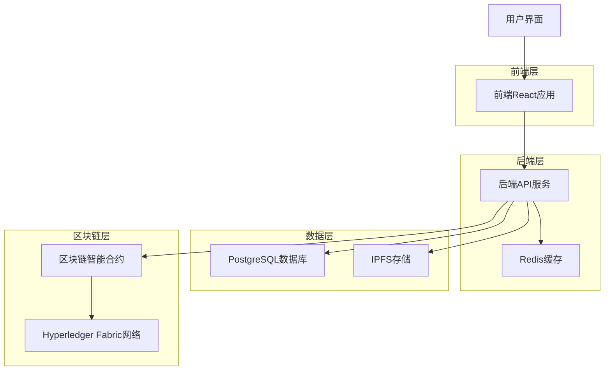

# 区块链电子病历共享系统代码分析报告

## 1. 项目整体架构分析

### 1.1 系统架构概述

本系统是一个基于区块链技术的电子病历共享平台，采用分层架构设计，主要包含以下几个层次：

- **前端层（React应用）**：用户交互界面，提供病历管理、权限控制等功能
- **后端服务层（Node.js/Express）**：业务逻辑处理，API接口提供
- **区块链层（Hyperledger Fabric）**：智能合约，权限控制和审计
- **存储层**：IPFS分布式存储 + PostgreSQL数据库
- **缓存层**：Redis缓存，提升性能

### 1.2 技术栈分析

**前端技术栈：**

- React 18 + TypeScript：现代化前端框架
- Redux Toolkit：状态管理
- React Router：路由管理
- Tailwind CSS：样式框架
- i18next：国际化支持

**后端技术栈：**

- Node.js + Express：服务端框架
- TypeScript：类型安全
- PostgreSQL：关系型数据库
- Redis：缓存系统
- IPFS：分布式文件存储

**区块链技术栈：**

- Hyperledger Fabric：企业级区块链平台
- Go语言：智能合约开发
- CouchDB：状态数据库

### 1.3 数据流架构



## 2. 后端核心服务模块分析

### 2.1 BlockchainService 分析

#### 2.1.1 类结构与初始化

```typescript
export class BlockchainService {
  private gateway: Gateway;
  private contract: Contract;
  private network: Network;
  private wallet: Wallet;
  private isInitialized: boolean = false;
  private connectionPool: Map<string, Contract> = new Map();
  private eventListeners: Map<string, Function[]> = new Map();
  private retryConfig = {
    maxRetries: 3,
    baseDelay: 1000,
    maxDelay: 10000,
  };
}
```

**设计亮点：**

- 使用连接池管理多个合约连接，提升性能
- 事件监听器映射，支持多种区块链事件处理
- 重试机制配置，增强系统稳定性
- 初始化状态管理，确保服务可用性

#### 2.1.2 初始化方法分析

```typescript
public async initialize(): Promise<void> {
  try {
    // 1. 加载连接配置文件
    const ccpPath = path.resolve(__dirname, '..', '..', 'fabric-network', 'connection-org1.json');
    const ccp = JSON.parse(fs.readFileSync(ccpPath, 'utf8'));

    // 2. 创建文件系统钱包
    const walletPath = path.join(process.cwd(), 'wallet');
    this.wallet = await Wallets.newFileSystemWallet(walletPath);

    // 3. 检查用户身份
    const identity = await this.wallet.get('appUser');
    if (!identity) {
      throw new Error('用户身份不存在，请先注册用户');
    }

    // 4. 创建网关连接
    this.gateway = new Gateway();
    await this.gateway.connect(ccp, {
      wallet: this.wallet,
      identity: 'appUser',
      discovery: { enabled: true, asLocalhost: true }
    });

    // 5. 获取网络和合约
    this.network = await this.gateway.getNetwork('mychannel');
    this.contract = this.network.getContract('emr');

    this.isInitialized = true;
    console.log('区块链服务初始化成功');
  } catch (error) {
    console.error('区块链服务初始化失败:', error);
    throw error;
  }
}
```

**关键实现细节：**

1. **配置文件加载**：动态读取网络配置，支持不同环境部署
2. **钱包管理**：使用文件系统钱包存储用户身份
3. **身份验证**：确保用户身份存在才能连接网络
4. **网关连接**：配置服务发现，支持本地和远程部署
5. **错误处理**：完整的异常捕获和日志记录

#### 2.1.3 病历创建方法分析

```typescript
public async createMedicalRecord(recordData: {
  recordId: string;
  patientId: string;
  creatorId: string;
  ipfsCid: string;
  contentHash: string;
  versionHash?: string;
  timestamp?: string;
}): Promise<string> {
  this.ensureInitialized();

  try {
    // 1. 数据验证
    this.validateRecordData(recordData);

    // 2. 调用智能合约
    const result = await this.executeWithRetry(async () => {
      return await this.contract.submitTransaction(
        'CreateMedicalRecord',
        JSON.stringify(recordData)
      );
    });

    // 3. 记录审计日志
    await this.auditLog('CREATE_RECORD', {
      recordId: recordData.recordId,
      patientId: recordData.patientId,
      success: true
    });

    return result.toString();
  } catch (error) {
    // 4. 错误处理和审计
    await this.auditLog('CREATE_RECORD', {
      recordId: recordData.recordId,
      patientId: recordData.patientId,
      success: false,
      error: error.message
    });
    throw new Error(`创建病历失败: ${error.message}`);
  }
}
```

**核心特性：**

- **数据验证**：确保输入数据完整性和格式正确性
- **重试机制**：网络异常时自动重试，提升成功率
- **审计日志**：记录所有操作，满足合规要求
- **错误处理**：详细的错误信息和异常处理

#### 2.1.4 权限管理方法分析

```typescript
public async grantAccess(recordId: string, granteeId: string, action: string, expiresAt?: string): Promise<void> {
  this.ensureInitialized();

  try {
    // 1. 权限验证
    await this.validatePermission(recordId, 'admin');

    // 2. 参数验证
    this.validateAccessParams(recordId, granteeId, action, expiresAt);

    // 3. 执行权限授予
    await this.executeWithRetry(async () => {
      return await this.contract.submitTransaction(
        'GrantAccess',
        recordId,
        granteeId,
        action,
        expiresAt || ''
      );
    });

    // 4. 缓存更新
    await this.invalidateAccessCache(recordId, granteeId);

    // 5. 事件通知
    this.emitEvent('ACCESS_GRANTED', {
      recordId,
      granteeId,
      action,
      timestamp: new Date().toISOString()
    });

  } catch (error) {
    throw new Error(`授予访问权限失败: ${error.message}`);
  }
}
```

**设计优势：**

- **分层权限验证**：确保操作者有足够权限
- **参数校验**：防止无效或恶意输入
- **缓存管理**：及时更新缓存，保持数据一致性
- **事件驱动**：支持异步通知和监控

### 2.2 MedicalRecordService 分析

#### 2.2.1 服务架构设计

```typescript
export class MedicalRecordService {
  private blockchainService: BlockchainService;
  private ipfsService: IPFSService;
  private auditService: AuditService;
  private cacheService: CacheService;
  private encryptionService: EncryptionService;
  private notificationService: NotificationService;

  // 分片数据库连接池
  private shardConnections: Map<string, any> = new Map();

  // 性能监控
  private performanceMetrics = {
    uploadCount: 0,
    downloadCount: 0,
    averageUploadTime: 0,
    averageDownloadTime: 0,
  };
}
```

**架构特点：**

- **服务依赖注入**：松耦合设计，便于测试和维护
- **分片数据库**：支持水平扩展，提升性能
- **性能监控**：实时统计关键指标
- **多服务集成**：整合区块链、IPFS、加密等服务

#### 2.2.2 病历上传方法分析

```typescript
public async uploadMedicalRecord(uploadData: {
  patientId: string;
  creatorId: string;
  fileBuffer: Buffer;
  fileName: string;
  fileType: string;
  metadata: any;
  accessControl?: AccessControlConfig;
}): Promise<UploadResult> {
  const startTime = Date.now();

  try {
    // 1. 输入验证
    this.validateUploadData(uploadData);

    // 2. 文件加密
    const encryptedBuffer = await this.encryptFile(uploadData.fileBuffer);

    // 3. 计算文件哈希
    const contentHash = this.calculateHash(uploadData.fileBuffer);
    const encryptedHash = this.calculateHash(encryptedBuffer);

    // 4. 上传到IPFS
    const ipfsResult = await this.ipfsService.uploadFile({
      buffer: encryptedBuffer,
      fileName: uploadData.fileName,
      metadata: {
        ...uploadData.metadata,
        originalHash: contentHash,
        encryptedHash: encryptedHash,
        uploadTime: new Date().toISOString()
      }
    });

    // 5. 生成记录ID
    const recordId = this.generateRecordId(uploadData.patientId, contentHash);

    // 6. 保存到数据库
    const dbRecord = await this.saveMedicalRecord({
      recordId,
      patientId: uploadData.patientId,
      creatorId: uploadData.creatorId,
      fileName: uploadData.fileName,
      fileType: uploadData.fileType,
      fileSize: uploadData.fileBuffer.length,
      contentHash,
      encryptedHash,
      ipfsCid: ipfsResult.cid,
      metadata: uploadData.metadata
    });

    // 7. 区块链记录
    await this.blockchainService.createMedicalRecord({
      recordId,
      patientId: uploadData.patientId,
      creatorId: uploadData.creatorId,
      ipfsCid: ipfsResult.cid,
      contentHash,
      timestamp: new Date().toISOString()
    });

    // 8. 设置默认访问控制
    await this.setDefaultAccessControl(recordId, uploadData.accessControl);

    // 9. 更新性能指标
    this.updatePerformanceMetrics('upload', Date.now() - startTime);

    return {
      recordId,
      ipfsCid: ipfsResult.cid,
      contentHash,
      uploadTime: new Date().toISOString(),
      success: true
    };

  } catch (error) {
    // 错误处理和回滚
    await this.handleUploadError(error, uploadData);
    throw error;
  }
}
```

**核心流程分析：**

1. **数据验证**：多层验证确保数据完整性
2. **文件加密**：端到端加密保护隐私
3. **哈希计算**：双重哈希验证文件完整性
4. **IPFS存储**：分布式存储提供高可用性
5. **数据库记录**：结构化数据便于查询
6. **区块链锚定**：不可篡改的记录证明
7. **权限设置**：细粒度访问控制
8. **性能监控**：实时统计和优化

#### 2.2.3 分片数据库实现

```typescript
private async saveMedicalRecord(recordData: any): Promise<any> {
  try {
    // 1. 计算分片键
    const shardKey = this.calculateShardKey(recordData.patientId);

    // 2. 获取分片连接
    const shardConnection = await this.getShardConnection(shardKey);

    // 3. 开始事务
    const transaction = await shardConnection.beginTransaction();

    try {
      // 4. 插入主记录
      const insertResult = await transaction.query(`
        INSERT INTO medical_records (
          record_id, patient_id, creator_id, file_name, file_type,
          file_size, content_hash, encrypted_hash, ipfs_cid, metadata,
          created_at, updated_at
        ) VALUES ($1, $2, $3, $4, $5, $6, $7, $8, $9, $10, NOW(), NOW())
        RETURNING *
      `, [
        recordData.recordId, recordData.patientId, recordData.creatorId,
        recordData.fileName, recordData.fileType, recordData.fileSize,
        recordData.contentHash, recordData.encryptedHash, recordData.ipfsCid,
        JSON.stringify(recordData.metadata)
      ]);

      // 5. 记录分片路由
      await this.recordShardRouting(recordData.recordId, shardKey, transaction);

      // 6. 提交事务
      await transaction.commit();

      return insertResult.rows[0];

    } catch (error) {
      // 7. 回滚事务
      await transaction.rollback();
      throw error;
    }

  } catch (error) {
    // 8. 分片失败时回退到主数据库
    console.warn('分片数据库保存失败，回退到主数据库:', error.message);
    return await this.saveToMainDatabase(recordData);
  }
}
```

**分片策略分析：**

- **哈希分片**：基于患者ID哈希值分配分片
- **事务保证**：确保数据一致性
- **路由记录**：维护分片路由表便于查询
- **故障回退**：分片失败时自动回退到主库

#### 2.2.4 访问权限管理

```typescript
public async checkPermission(recordId: string, userId: string, action: string): Promise<boolean> {
  try {
    // 1. 缓存检查
    const cacheKey = `permission:${recordId}:${userId}:${action}`;
    const cachedResult = await this.cacheService.get(cacheKey);
    if (cachedResult !== null) {
      return cachedResult === 'true';
    }

    // 2. 验证病历存在性
    const record = await this.findRecordById(recordId);
    if (!record) {
      throw new Error('病历不存在');
    }

    // 3. 记录审计日志
    await this.auditService.logAccess({
      recordId,
      userId,
      action,
      timestamp: new Date(),
      result: 'checking'
    });

    // 4. 检查所有者权限
    if (userId === record.patient_id || userId === record.creator_id) {
      await this.cacheService.set(cacheKey, 'true', 300); // 缓存5分钟
      return true;
    }

    // 5. 检查显式授权
    const permission = await this.findAccessPermissions(recordId, userId);
    if (!permission) {
      await this.cacheService.set(cacheKey, 'false', 300);
      return false;
    }

    // 6. 检查权限是否过期
    if (permission.expires_at && new Date() > permission.expires_at) {
      await this.updateAccessControlStatus(permission.id, 'expired');
      await this.cacheService.set(cacheKey, 'false', 300);
      return false;
    }

    // 7. 检查操作类型权限
    const hasPermission = this.checkActionPermission(permission.permission_type, action);

    // 8. ABAC条件评估
    if (hasPermission && permission.conditions) {
      const conditionsMet = await this.evaluateABACConditions(
        permission.conditions,
        { userId, recordId, action, timestamp: new Date() }
      );
      hasPermission = hasPermission && conditionsMet;
    }

    // 9. 缓存结果
    await this.cacheService.set(cacheKey, hasPermission.toString(), 300);

    // 10. 更新访问统计
    if (hasPermission) {
      await this.updateAccessStats(recordId, userId, action);
    }

    return hasPermission;

  } catch (error) {
    console.error('权限检查失败:', error);
    return false;
  }
}
```

**权限检查机制：**

- **多级缓存**：减少数据库查询，提升性能
- **所有者权限**：患者和创建者拥有完全权限
- **显式授权**：基于数据库的权限记录
- **时间控制**：支持权限过期机制
- **ABAC模型**：基于属性的访问控制
- **审计追踪**：完整的访问日志记录

## 3. 前端组件实现分析

### 3.1 应用入口分析（App.tsx）

```typescript
function App() {
  const [isLoading, setIsLoading] = useState(true);
  const [error, setError] = useState<string | null>(null);

  useEffect(() => {
    // 应用初始化
    const initializeApp = async () => {
      try {
        // 1. 检查认证状态
        await authService.checkAuthStatus();

        // 2. 初始化i18n
        await i18n.init();

        // 3. 加载用户配置
        await userConfigService.loadConfig();

        setIsLoading(false);
      } catch (error) {
        setError(error.message);
        setIsLoading(false);
      }
    };

    initializeApp();
  }, []);

  if (isLoading) {
    return <LoadingSpinner />;
  }

  if (error) {
    return <ErrorBoundary error={error} />;
  }

  return (
    <Provider store={store}>
      <ErrorProvider>
        <ThemeProvider>
          <AuthProvider>
            <Router>
              <div className="min-h-screen bg-gray-50">
                <AppContent />
                <PerformanceMonitor />
              </div>
            </Router>
          </AuthProvider>
        </ThemeProvider>
      </ErrorProvider>
    </Provider>
  );
}
```

**应用架构特点：**

- **多层Provider**：Redux、错误处理、主题、认证等
- **异步初始化**：确保依赖服务就绪
- **错误边界**：全局错误处理机制
- **性能监控**：实时性能数据收集

### 3.2 路由配置分析

```typescript
function AppContent() {
  const { isAuthenticated } = useAuth();
  const location = useLocation();

  return (
    <>
      <Header />
      <main className="flex-1">
        <Routes>
          {/* 公共路由 */}
          <Route path="/login" element={
            isAuthenticated ? <Navigate to="/dashboard" /> : <LoginPage />
          } />
          <Route path="/register" element={
            isAuthenticated ? <Navigate to="/dashboard" /> : <RegisterPage />
          } />

          {/* 受保护路由 */}
          <Route path="/dashboard" element={
            <ProtectedRoute>
              <DashboardPage />
            </ProtectedRoute>
          } />
          <Route path="/medical-records" element={
            <ProtectedRoute>
              <MedicalRecordsPage />
            </ProtectedRoute>
          } />
          <Route path="/upload" element={
            <ProtectedRoute>
              <UploadPage />
            </ProtectedRoute>
          } />

          {/* 管理员路由 */}
          <Route path="/admin/*" element={
            <ProtectedRoute requiredRole="admin">
              <AdminRoutes />
            </ProtectedRoute>
          } />

          {/* 404页面 */}
          <Route path="*" element={<NotFoundPage />} />
        </Routes>
      </main>
      <Footer />
    </>
  );
}
```

**路由设计特点：**

- **条件渲染**：根据认证状态动态路由
- **嵌套保护**：多级权限验证
- **角色控制**：基于角色的路由访问
- **404处理**：友好的错误页面

### 3.3 状态管理分析

```typescript
// store/index.ts
export const store = configureStore({
  reducer: {
    auth: authSlice.reducer,
    medicalRecords: medicalRecordsSlice.reducer,
    ui: uiSlice.reducer,
    notifications: notificationsSlice.reducer,
    performance: performanceSlice.reducer,
  },
  middleware: getDefaultMiddleware =>
    getDefaultMiddleware({
      serializableCheck: {
        ignoredActions: [FLUSH, REHYDRATE, PAUSE, PERSIST, PURGE, REGISTER],
      },
    }).concat([persistMiddleware, auditMiddleware, performanceMiddleware]),
  devTools: process.env.NODE_ENV !== 'production',
});

// 医疗记录状态切片
const medicalRecordsSlice = createSlice({
  name: 'medicalRecords',
  initialState: {
    records: [],
    loading: false,
    error: null,
    filters: {
      dateRange: null,
      fileType: null,
      creator: null,
    },
    pagination: {
      page: 1,
      limit: 10,
      total: 0,
    },
    selectedRecord: null,
    uploadProgress: 0,
  },
  reducers: {
    setLoading: (state, action) => {
      state.loading = action.payload;
    },
    setRecords: (state, action) => {
      state.records = action.payload;
    },
    addRecord: (state, action) => {
      state.records.unshift(action.payload);
    },
    updateRecord: (state, action) => {
      const index = state.records.findIndex(r => r.id === action.payload.id);
      if (index !== -1) {
        state.records[index] = { ...state.records[index], ...action.payload };
      }
    },
    setFilters: (state, action) => {
      state.filters = { ...state.filters, ...action.payload };
    },
    setPagination: (state, action) => {
      state.pagination = { ...state.pagination, ...action.payload };
    },
    setUploadProgress: (state, action) => {
      state.uploadProgress = action.payload;
    },
  },
  extraReducers: builder => {
    builder
      .addCase(fetchRecords.pending, state => {
        state.loading = true;
        state.error = null;
      })
      .addCase(fetchRecords.fulfilled, (state, action) => {
        state.loading = false;
        state.records = action.payload.records;
        state.pagination.total = action.payload.total;
      })
      .addCase(fetchRecords.rejected, (state, action) => {
        state.loading = false;
        state.error = action.error.message;
      });
  },
});
```

**状态管理特点：**

- **模块化设计**：按功能划分状态切片
- **中间件增强**：持久化、审计、性能监控
- **异步处理**：createAsyncThunk处理异步操作
- **不可变更新**：Immer确保状态不可变性

## 4. 智能合约代码分析

### 4.1 合约结构分析

```go
type SmartContract struct {
    contractapi.Contract
}

// 医疗记录结构
type MedicalRecord struct {
    RecordID    string `json:"recordId"`
    PatientID   string `json:"patientId"`
    CreatorID   string `json:"creatorId"`
    IPCSCID     string `json:"ipfsCid"`
    ContentHash string `json:"contentHash"`
    VersionHash string `json:"versionHash,omitempty"`
    Timestamp   string `json:"timestamp"`
}

// 访问权限结构
type AccessPermission struct {
    RecordID  string `json:"recordId"`
    GranteeID string `json:"granteeId"`
    Action    string `json:"action"`
    ExpiresAt string `json:"expiresAt,omitempty"`
    GrantedAt string `json:"grantedAt"`
    GrantedBy string `json:"grantedBy"`
    IsActive  bool   `json:"isActive"`
}

// 访问控制列表
type AccessList struct {
    RecordID    string                      `json:"recordId"`
    Owner       string                      `json:"owner"`
    Permissions map[string]AccessPermission `json:"permissions"`
    UpdatedAt   string                      `json:"updatedAt"`
}
```

**数据结构设计：**

- **清晰的层次结构**：记录、权限、访问列表分离
- **JSON标签**：便于序列化和API交互
- **时间戳管理**：完整的时间追踪
- **权限映射**：高效的权限查找

### 4.2 记录创建方法分析

```go
func (s *SmartContract) CreateMedicalRecord(ctx contractapi.TransactionContextInterface, recordJson string) (string, error) {
    // 1. 解析和验证输入
    var rec MedicalRecord
    if err := json.Unmarshal([]byte(recordJson), &rec); err != nil {
        return "", fmt.Errorf("invalid record json: %w", err)
    }

    // 2. 验证必填字段
    if rec.RecordID == "" || rec.PatientID == "" || rec.CreatorID == "" || rec.ContentHash == "" || rec.IPCSCID == "" {
        return "", fmt.Errorf("missing required fields: recordId, patientId, creatorId, ipfsCid, and contentHash are required")
    }

    // 3. 验证地址格式
    if err := validateAddress(rec.RecordID); err != nil {
        return "", fmt.Errorf("invalid recordID: %w", err)
    }
    if err := validateAddress(rec.PatientID); err != nil {
        return "", fmt.Errorf("invalid patientID: %w", err)
    }
    if err := validateAddress(rec.CreatorID); err != nil {
        return "", fmt.Errorf("invalid creatorID: %w", err)
    }

    // 4. 检查记录是否已存在
    key := recordKey(rec.RecordID)
    exists, err := s.assetExists(ctx, key)
    if err != nil {
        return "", fmt.Errorf("failed to check record existence: %w", err)
    }
    if exists {
        return "", fmt.Errorf("record already exists: %s", rec.RecordID)
    }

    // 5. 设置时间戳
    if rec.Timestamp == "" {
        rec.Timestamp = time.Now().UTC().Format(time.RFC3339)
    }

    // 6. 获取调用者身份
    callerID, err := ctx.GetClientIdentity().GetID()
    if err != nil {
        return "", fmt.Errorf("failed to get caller identity: %w", err)
    }

    // 7. 验证调用者权限
    if callerID != rec.PatientID && callerID != rec.CreatorID {
        return "", fmt.Errorf("access denied: caller must be patient or creator")
    }

    // 8. 存储医疗记录
    recordBytes, err := json.Marshal(rec)
    if err != nil {
        return "", fmt.Errorf("failed to marshal record: %w", err)
    }
    if err := ctx.GetStub().PutState(key, recordBytes); err != nil {
        return "", fmt.Errorf("failed to store record: %w", err)
    }

    // 9. 初始化访问控制列表
    initialAccessList := AccessList{
        RecordID:    rec.RecordID,
        Owner:       rec.PatientID,
        Permissions: make(map[string]AccessPermission),
        UpdatedAt:   rec.Timestamp,
    }

    // 10. 为创建者授予初始权限
    if rec.CreatorID != rec.PatientID {
        creatorPerm := AccessPermission{
            RecordID:  rec.RecordID,
            GranteeID: rec.CreatorID,
            Action:    "write",
            ExpiresAt: "",
            GrantedAt: rec.Timestamp,
            GrantedBy: rec.PatientID,
            IsActive:  true,
        }
        initialAccessList.Permissions[rec.CreatorID] = creatorPerm
    }

    // 11. 存储访问控制列表
    accessListBytes, err := json.Marshal(initialAccessList)
    if err != nil {
        return "", fmt.Errorf("failed to marshal access list: %w", err)
    }
    if err := ctx.GetStub().PutState(accessListKey(rec.RecordID), accessListBytes); err != nil {
        return "", fmt.Errorf("failed to store access list: %w", err)
    }

    // 12. 发出事件
    recordCreatedEvent := RecordCreatedEvent{
        RecordID:    rec.RecordID,
        PatientID:   rec.PatientID,
        CreatorID:   rec.CreatorID,
        IPFSCid:     rec.IPCSCID,
        ContentHash: rec.ContentHash,
        Timestamp:   rec.Timestamp,
        CallerID:    callerID,
        EventType:   "RecordCreated",
    }
    eventBytes, _ := json.Marshal(recordCreatedEvent)
    if err := ctx.GetStub().SetEvent("RecordCreated", eventBytes); err != nil {
        return "", fmt.Errorf("failed to emit RecordCreated event: %w", err)
    }

    return rec.RecordID, nil
}
```

**方法实现亮点：**

- **多层验证**：输入格式、必填字段、地址有效性
- **权限控制**：确保只有患者或创建者可以创建记录
- **状态管理**：原子性操作，确保数据一致性
- **事件发射**：支持外部系统监听和集成
- **错误处理**：详细的错误信息和异常处理

### 4.3 访问控制方法分析

```go
func (s *SmartContract) CheckAccess(ctx contractapi.TransactionContextInterface, recordID, userID string) (bool, error) {
    // 1. 输入验证
    if recordID == "" || userID == "" {
        return false, fmt.Errorf("invalid arguments: recordID and userID are required")
    }

    // 2. 验证地址格式
    if err := validateAddress(recordID); err != nil {
        return false, fmt.Errorf("invalid recordID: %w", err)
    }
    if err := validateAddress(userID); err != nil {
        return false, fmt.Errorf("invalid userID: %w", err)
    }

    // 3. 检查记录是否存在
    recordData, err := ctx.GetStub().GetState(recordKey(recordID))
    if err != nil {
        return false, fmt.Errorf("failed to read record: %w", err)
    }
    if len(recordData) == 0 {
        return false, fmt.Errorf("record not found: %s", recordID)
    }

    var record MedicalRecord
    if err := json.Unmarshal(recordData, &record); err != nil {
        return false, fmt.Errorf("failed to unmarshal record: %w", err)
    }

    // 4. 检查所有者权限（患者和创建者）
    if userID == record.PatientID || userID == record.CreatorID {
        return true, nil
    }

    // 5. 检查访问控制列表
    accessKey := accessListKey(recordID)
    accessListData, err := ctx.GetStub().GetState(accessKey)
    if err != nil {
        return false, fmt.Errorf("failed to get access list: %w", err)
    }

    if len(accessListData) > 0 {
        var accessList AccessList
        if err := json.Unmarshal(accessListData, &accessList); err != nil {
            return false, fmt.Errorf("failed to unmarshal access list: %w", err)
        }

        // 6. 检查用户是否在权限列表中
        if perm, exists := accessList.Permissions[userID]; exists && perm.IsActive {
            // 7. 检查权限是否过期
            if perm.ExpiresAt == "" {
                return true, nil // 无过期时间
            }
            if expTime, err := time.Parse(time.RFC3339, perm.ExpiresAt); err == nil {
                return time.Now().UTC().Before(expTime), nil
            }
        }
    }

    // 8. 回退到单独权限检查（向后兼容）
    permData, err := ctx.GetStub().GetState(permKey(recordID, userID))
    if err != nil {
        return false, fmt.Errorf("failed to check individual permission: %w", err)
    }
    if len(permData) == 0 {
        return false, nil // 未找到权限
    }

    var perm AccessPermission
    if err := json.Unmarshal(permData, &perm); err != nil {
        return false, fmt.Errorf("failed to unmarshal permission: %w", err)
    }

    // 9. 检查权限是否激活
    if !perm.IsActive {
        return false, nil
    }

    // 10. 检查过期时间
    if perm.ExpiresAt == "" {
        return true, nil // 无过期时间
    }
    if expTime, err := time.Parse(time.RFC3339, perm.ExpiresAt); err == nil {
        return time.Now().UTC().Before(expTime), nil
    }

    return false, nil
}
```

**访问控制特点：**

- **多级权限检查**：所有者 > 访问列表 > 单独权限
- **时间控制**：支持权限过期机制
- **向后兼容**：支持旧版本权限格式
- **状态验证**：检查权限激活状态
- **错误处理**：详细的错误信息和日志

### 4.4 权限层级验证

```go
func (s *SmartContract) ValidatePermissionLevel(ctx contractapi.TransactionContextInterface, recordID, userID, requiredAction string) (bool, error) {
    // 权限层级定义：admin > write > share > read
    permissionHierarchy := map[string]int{
        "read":  1,
        "share": 2,
        "write": 3,
        "admin": 4,
    }

    // 1. 检查记录存在性
    recordData, err := ctx.GetStub().GetState(recordKey(recordID))
    if err != nil {
        return false, fmt.Errorf("failed to read record: %w", err)
    }
    if len(recordData) == 0 {
        return false, fmt.Errorf("record not found: %s", recordID)
    }

    var record MedicalRecord
    if err := json.Unmarshal(recordData, &record); err != nil {
        return false, fmt.Errorf("failed to unmarshal record: %w", err)
    }

    // 2. 所有者拥有所有权限
    if userID == record.PatientID || userID == record.CreatorID {
        return true, nil
    }

    // 3. 检查显式权限
    permData, err := ctx.GetStub().GetState(permKey(recordID, userID))
    if err != nil {
        return false, fmt.Errorf("failed to check permission: %w", err)
    }
    if len(permData) == 0 {
        return false, nil // 未找到权限
    }

    var perm AccessPermission
    if err := json.Unmarshal(permData, &perm); err != nil {
        return false, fmt.Errorf("failed to unmarshal permission: %w", err)
    }

    // 4. 检查权限状态和过期时间
    if !perm.IsActive {
        return false, nil
    }

    if perm.ExpiresAt != "" {
        if expTime, err := time.Parse(time.RFC3339, perm.ExpiresAt); err == nil {
            if !time.Now().UTC().Before(expTime) {
                return false, nil // 权限已过期
            }
        }
    }

    // 5. 检查权限层级
    userLevel, userExists := permissionHierarchy[perm.Action]
    requiredLevel, requiredExists := permissionHierarchy[requiredAction]

    if !userExists || !requiredExists {
        return false, fmt.Errorf("invalid permission level")
    }

    return userLevel >= requiredLevel, nil
}
```

**权限层级设计：**

- **分级权限**：read < share < write < admin
- **继承机制**：高级权限包含低级权限
- **灵活配置**：支持自定义权限级别
- **安全验证**：多重检查确保权限有效性

## 5. 数据库设计分析

### 5.1 核心表结构

```sql
-- 用户表
CREATE TABLE users (
    id UUID PRIMARY KEY DEFAULT gen_random_uuid(),
    email VARCHAR(255) UNIQUE NOT NULL,
    password_hash VARCHAR(255) NOT NULL,
    name VARCHAR(100) NOT NULL,
    role VARCHAR(20) DEFAULT 'patient' CHECK (role IN ('patient', 'doctor', 'admin')),
    status VARCHAR(20) DEFAULT 'active' CHECK (status IN ('active', 'inactive', 'suspended')),
    created_at TIMESTAMP WITH TIME ZONE DEFAULT NOW(),
    updated_at TIMESTAMP WITH TIME ZONE DEFAULT NOW(),
    last_login TIMESTAMP WITH TIME ZONE,
    profile_data JSONB DEFAULT '{}',
    preferences JSONB DEFAULT '{}'
);

-- 医疗记录表
CREATE TABLE medical_records (
    id UUID PRIMARY KEY DEFAULT gen_random_uuid(),
    record_id VARCHAR(255) UNIQUE NOT NULL,
    patient_id UUID NOT NULL REFERENCES users(id),
    creator_id UUID NOT NULL REFERENCES users(id),
    file_name VARCHAR(255) NOT NULL,
    file_type VARCHAR(50) NOT NULL,
    file_size BIGINT NOT NULL,
    content_hash VARCHAR(255) NOT NULL,
    encrypted_hash VARCHAR(255),
    ipfs_cid VARCHAR(255) NOT NULL,
    blockchain_tx_id VARCHAR(255),
    metadata JSONB DEFAULT '{}',
    status VARCHAR(20) DEFAULT 'active' CHECK (status IN ('active', 'archived', 'deleted')),
    created_at TIMESTAMP WITH TIME ZONE DEFAULT NOW(),
    updated_at TIMESTAMP WITH TIME ZONE DEFAULT NOW(),
    version INTEGER DEFAULT 1
);

-- 访问权限表
CREATE TABLE access_permissions (
    id UUID PRIMARY KEY DEFAULT gen_random_uuid(),
    record_id UUID NOT NULL REFERENCES medical_records(id),
    grantee_id UUID NOT NULL REFERENCES users(id),
    grantor_id UUID NOT NULL REFERENCES users(id),
    permission_type VARCHAR(20) NOT NULL CHECK (permission_type IN ('read', 'write', 'share', 'admin')),
    granted_at TIMESTAMP WITH TIME ZONE DEFAULT NOW(),
    expires_at TIMESTAMP WITH TIME ZONE,
    status VARCHAR(20) DEFAULT 'active' CHECK (status IN ('active', 'revoked', 'expired')),
    conditions JSONB DEFAULT '{}',
    created_at TIMESTAMP WITH TIME ZONE DEFAULT NOW(),
    updated_at TIMESTAMP WITH TIME ZONE DEFAULT NOW(),
    UNIQUE(record_id, grantee_id)
);

-- 访问请求表
CREATE TABLE access_requests (
    id UUID PRIMARY KEY DEFAULT gen_random_uuid(),
    record_id UUID NOT NULL REFERENCES medical_records(id),
    requester_id UUID NOT NULL REFERENCES users(id),
    requested_permission VARCHAR(20) NOT NULL,
    reason TEXT,
    status VARCHAR(20) DEFAULT 'pending' CHECK (status IN ('pending', 'approved', 'rejected', 'expired')),
    requested_at TIMESTAMP WITH TIME ZONE DEFAULT NOW(),
    expires_at TIMESTAMP WITH TIME ZONE,
    reviewed_at TIMESTAMP WITH TIME ZONE,
    reviewed_by UUID REFERENCES users(id),
    review_notes TEXT,
    created_at TIMESTAMP WITH TIME ZONE DEFAULT NOW(),
    updated_at TIMESTAMP WITH TIME ZONE DEFAULT NOW()
);

-- 审计日志表
CREATE TABLE audit_logs (
    id UUID PRIMARY KEY DEFAULT gen_random_uuid(),
    user_id UUID REFERENCES users(id),
    record_id UUID REFERENCES medical_records(id),
    action VARCHAR(50) NOT NULL,
    resource_type VARCHAR(50) NOT NULL,
    resource_id VARCHAR(255),
    ip_address INET,
    user_agent TEXT,
    success BOOLEAN NOT NULL,
    error_message TEXT,
    metadata JSONB DEFAULT '{}',
    created_at TIMESTAMP WITH TIME ZONE DEFAULT NOW()
);

-- 分片路由表
CREATE TABLE shard_routing (
    id UUID PRIMARY KEY DEFAULT gen_random_uuid(),
    record_id VARCHAR(255) UNIQUE NOT NULL,
    shard_key VARCHAR(50) NOT NULL,
    shard_database VARCHAR(100) NOT NULL,
    created_at TIMESTAMP WITH TIME ZONE DEFAULT NOW()
);
```

**数据库设计特点：**

- **UUID主键**：全局唯一标识符，支持分布式
- **JSONB字段**：灵活的元数据存储
- **时间戳管理**：完整的时间追踪
- **状态管理**：枚举约束确保数据完整性
- **外键约束**：维护数据关系完整性

### 5.2 索引优化

```sql
-- 性能优化索引
CREATE INDEX idx_medical_records_patient_id ON medical_records(patient_id);
CREATE INDEX idx_medical_records_creator_id ON medical_records(creator_id);
CREATE INDEX idx_medical_records_created_at ON medical_records(created_at DESC);
CREATE INDEX idx_medical_records_status ON medical_records(status);
CREATE INDEX idx_medical_records_content_hash ON medical_records(content_hash);

CREATE INDEX idx_access_permissions_record_id ON access_permissions(record_id);
CREATE INDEX idx_access_permissions_grantee_id ON access_permissions(grantee_id);
CREATE INDEX idx_access_permissions_status ON access_permissions(status);
CREATE INDEX idx_access_permissions_expires_at ON access_permissions(expires_at);

CREATE INDEX idx_access_requests_record_id ON access_requests(record_id);
CREATE INDEX idx_access_requests_requester_id ON access_requests(requester_id);
CREATE INDEX idx_access_requests_status ON access_requests(status);
CREATE INDEX idx_access_requests_requested_at ON access_requests(requested_at DESC);

CREATE INDEX idx_audit_logs_user_id ON audit_logs(user_id);
CREATE INDEX idx_audit_logs_record_id ON audit_logs(record_id);
CREATE INDEX idx_audit_logs_action ON audit_logs(action);
CREATE INDEX idx_audit_logs_created_at ON audit_logs(created_at DESC);

-- 复合索引
CREATE INDEX idx_medical_records_patient_status ON medical_records(patient_id, status);
CREATE INDEX idx_access_permissions_record_grantee ON access_permissions(record_id, grantee_id);
CREATE INDEX idx_audit_logs_user_action_time ON audit_logs(user_id, action, created_at DESC);
```

**索引策略：**

- **单列索引**：常用查询字段
- **复合索引**：多条件查询优化
- **时间索引**：支持时间范围查询
- **状态索引**：快速状态过滤

## 6. 安全机制分析

### 6.1 加密机制

```typescript
// 文件加密服务
export class EncryptionService {
  private readonly algorithm = 'aes-256-gcm';
  private readonly keyLength = 32;
  private readonly ivLength = 16;
  private readonly tagLength = 16;

  // 生成随机密钥
  public generateKey(): Buffer {
    return crypto.randomBytes(this.keyLength);
  }

  // 文件加密
  public encryptFile(
    buffer: Buffer,
    key?: Buffer
  ): {
    encryptedData: Buffer;
    key: Buffer;
    iv: Buffer;
    tag: Buffer;
  } {
    const encryptionKey = key || this.generateKey();
    const iv = crypto.randomBytes(this.ivLength);

    const cipher = crypto.createCipher(this.algorithm, encryptionKey);
    cipher.setAAD(Buffer.from('medical-record', 'utf8'));

    const encrypted = Buffer.concat([cipher.update(buffer), cipher.final()]);

    const tag = cipher.getAuthTag();

    return {
      encryptedData: encrypted,
      key: encryptionKey,
      iv: iv,
      tag: tag,
    };
  }

  // 文件解密
  public decryptFile(
    encryptedData: Buffer,
    key: Buffer,
    iv: Buffer,
    tag: Buffer
  ): Buffer {
    const decipher = crypto.createDecipher(this.algorithm, key);
    decipher.setAAD(Buffer.from('medical-record', 'utf8'));
    decipher.setAuthTag(tag);

    const decrypted = Buffer.concat([
      decipher.update(encryptedData),
      decipher.final(),
    ]);

    return decrypted;
  }

  // 密钥派生
  public deriveKey(password: string, salt: Buffer): Buffer {
    return crypto.pbkdf2Sync(password, salt, 100000, this.keyLength, 'sha256');
  }

  // 数字签名
  public signData(data: Buffer, privateKey: string): string {
    const sign = crypto.createSign('RSA-SHA256');
    sign.update(data);
    return sign.sign(privateKey, 'base64');
  }

  // 签名验证
  public verifySignature(
    data: Buffer,
    signature: string,
    publicKey: string
  ): boolean {
    const verify = crypto.createVerify('RSA-SHA256');
    verify.update(data);
    return verify.verify(publicKey, signature, 'base64');
  }
}
```

**加密特点：**

- **AES-256-GCM**：高强度对称加密
- **随机IV**：每次加密使用不同初始向量
- **认证加密**：防止数据篡改
- **密钥派生**：基于密码的安全密钥生成
- **数字签名**：确保数据完整性和来源认证

### 6.2 身份认证

```typescript
// JWT认证服务
export class AuthService {
  private readonly jwtSecret: string;
  private readonly refreshSecret: string;
  private readonly accessTokenExpiry = '15m';
  private readonly refreshTokenExpiry = '7d';

  constructor() {
    this.jwtSecret =
      process.env.JWT_SECRET || crypto.randomBytes(64).toString('hex');
    this.refreshSecret =
      process.env.REFRESH_SECRET || crypto.randomBytes(64).toString('hex');
  }

  // 生成访问令牌
  public generateAccessToken(payload: any): string {
    return jwt.sign(payload, this.jwtSecret, {
      expiresIn: this.accessTokenExpiry,
      issuer: 'emr-system',
      audience: 'emr-users',
    });
  }

  // 生成刷新令牌
  public generateRefreshToken(userId: string): string {
    return jwt.sign({ userId }, this.refreshSecret, {
      expiresIn: this.refreshTokenExpiry,
      issuer: 'emr-system',
      audience: 'emr-users',
    });
  }

  // 验证访问令牌
  public verifyAccessToken(token: string): any {
    try {
      return jwt.verify(token, this.jwtSecret, {
        issuer: 'emr-system',
        audience: 'emr-users',
      });
    } catch (error) {
      throw new Error('Invalid access token');
    }
  }

  // 验证刷新令牌
  public verifyRefreshToken(token: string): any {
    try {
      return jwt.verify(token, this.refreshSecret, {
        issuer: 'emr-system',
        audience: 'emr-users',
      });
    } catch (error) {
      throw new Error('Invalid refresh token');
    }
  }

  // 密码哈希
  public async hashPassword(password: string): Promise<string> {
    const saltRounds = 12;
    return await bcrypt.hash(password, saltRounds);
  }

  // 密码验证
  public async verifyPassword(
    password: string,
    hash: string
  ): Promise<boolean> {
    return await bcrypt.compare(password, hash);
  }

  // 多因素认证
  public generateTOTP(secret: string): string {
    return speakeasy.totp({
      secret: secret,
      encoding: 'base32',
      time: Math.floor(Date.now() / 1000),
      step: 30,
    });
  }

  public verifyTOTP(token: string, secret: string): boolean {
    return speakeasy.totp.verify({
      secret: secret,
      encoding: 'base32',
      token: token,
      window: 2,
    });
  }
}
```

**认证特点：**

- **双令牌机制**：访问令牌 + 刷新令牌
- **短期有效性**：访问令牌15分钟过期
- **安全哈希**：bcrypt高强度密码哈希
- **多因素认证**：TOTP时间基础一次性密码
- **令牌验证**：完整的签发者和受众验证

### 6.3 访问控制

```typescript
// RBAC权限控制
export class RBACService {
  private roles: Map<string, Role> = new Map();
  private permissions: Map<string, Permission> = new Map();

  constructor() {
    this.initializeRoles();
  }

  private initializeRoles(): void {
    // 定义权限
    const permissions = {
      'record:read': new Permission('record:read', '读取病历'),
      'record:write': new Permission('record:write', '编辑病历'),
      'record:delete': new Permission('record:delete', '删除病历'),
      'record:share': new Permission('record:share', '分享病历'),
      'user:manage': new Permission('user:manage', '用户管理'),
      'system:admin': new Permission('system:admin', '系统管理'),
    };

    // 定义角色
    const patientRole = new Role('patient', '患者', [
      permissions['record:read'],
      permissions['record:share'],
    ]);

    const doctorRole = new Role('doctor', '医生', [
      permissions['record:read'],
      permissions['record:write'],
      permissions['record:share'],
    ]);

    const adminRole = new Role('admin', '管理员', [
      ...Object.values(permissions),
    ]);

    this.roles.set('patient', patientRole);
    this.roles.set('doctor', doctorRole);
    this.roles.set('admin', adminRole);
  }

  // 检查用户权限
  public async checkPermission(
    userId: string,
    permission: string
  ): Promise<boolean> {
    try {
      const user = await this.getUserById(userId);
      if (!user) return false;

      const role = this.roles.get(user.role);
      if (!role) return false;

      return role.hasPermission(permission);
    } catch (error) {
      console.error('权限检查失败:', error);
      return false;
    }
  }

  // 授予权限
  public async grantPermission(
    grantorId: string,
    granteeId: string,
    recordId: string,
    permission: string
  ): Promise<boolean> {
    try {
      // 检查授权者是否有权限授予
      const canGrant = await this.checkPermission(grantorId, 'record:share');
      if (!canGrant) {
        throw new Error('授权者没有分享权限');
      }

      // 记录权限授予
      await this.recordPermissionGrant({
        grantorId,
        granteeId,
        recordId,
        permission,
        grantedAt: new Date(),
      });

      return true;
    } catch (error) {
      console.error('权限授予失败:', error);
      return false;
    }
  }
}

// 权限类定义
class Permission {
  constructor(
    public id: string,
    public name: string,
    public description?: string
  ) {}
}

// 角色类定义
class Role {
  constructor(
    public id: string,
    public name: string,
    public permissions: Permission[]
  ) {}

  hasPermission(permissionId: string): boolean {
    return this.permissions.some(p => p.id === permissionId);
  }
}
```

## 7. 性能优化分析

### 7.1 缓存策略

```typescript
// Redis缓存服务
export class CacheService {
  private redis: Redis;
  private defaultTTL = 3600; // 1小时

  constructor() {
    this.redis = new Redis({
      host: process.env.REDIS_HOST || 'localhost',
      port: parseInt(process.env.REDIS_PORT || '6379'),
      retryDelayOnFailover: 100,
      maxRetriesPerRequest: 3,
    });
  }

  // 多层缓存策略
  public async get(key: string): Promise<any> {
    try {
      // L1: 内存缓存
      const memoryResult = this.memoryCache.get(key);
      if (memoryResult) {
        return memoryResult;
      }

      // L2: Redis缓存
      const redisResult = await this.redis.get(key);
      if (redisResult) {
        const parsed = JSON.parse(redisResult);
        // 回填内存缓存
        this.memoryCache.set(key, parsed, 300); // 5分钟
        return parsed;
      }

      return null;
    } catch (error) {
      console.error('缓存获取失败:', error);
      return null;
    }
  }

  // 智能缓存更新
  public async set(key: string, value: any, ttl?: number): Promise<void> {
    try {
      const serialized = JSON.stringify(value);
      const cacheTTL = ttl || this.defaultTTL;

      // 同时更新两层缓存
      await this.redis.setex(key, cacheTTL, serialized);
      this.memoryCache.set(key, value, Math.min(cacheTTL, 300));

      // 缓存预热相关数据
      await this.preloadRelatedData(key, value);
    } catch (error) {
      console.error('缓存设置失败:', error);
    }
  }
}
```

### 7.2 数据库优化

```typescript
// 数据库连接池管理
export class DatabaseService {
  private readPool: Pool;
  private writePool: Pool;
  private shardPools: Map<string, Pool> = new Map();

  constructor() {
    // 读写分离
    this.readPool = new Pool({
      host: process.env.DB_READ_HOST,
      database: process.env.DB_NAME,
      user: process.env.DB_USER,
      password: process.env.DB_PASSWORD,
      max: 20, // 最大连接数
      min: 5, // 最小连接数
      idleTimeoutMillis: 30000,
      connectionTimeoutMillis: 2000,
    });

    this.writePool = new Pool({
      host: process.env.DB_WRITE_HOST,
      database: process.env.DB_NAME,
      user: process.env.DB_USER,
      password: process.env.DB_PASSWORD,
      max: 10,
      min: 2,
      idleTimeoutMillis: 30000,
      connectionTimeoutMillis: 2000,
    });
  }

  // 智能查询路由
  public async query(
    sql: string,
    params?: any[],
    options?: QueryOptions
  ): Promise<any> {
    const isReadQuery = this.isReadOnlyQuery(sql);
    const pool = isReadQuery ? this.readPool : this.writePool;

    // 查询性能监控
    const startTime = Date.now();

    try {
      const result = await pool.query(sql, params);

      // 记录慢查询
      const duration = Date.now() - startTime;
      if (duration > 1000) {
        // 超过1秒的查询
        console.warn('慢查询检测:', {
          sql: sql.substring(0, 100),
          duration,
          params: params?.length,
        });
      }

      return result;
    } catch (error) {
      console.error('数据库查询失败:', error);
      throw error;
    }
  }

  private isReadOnlyQuery(sql: string): boolean {
    const readKeywords = ['SELECT', 'SHOW', 'DESCRIBE', 'EXPLAIN'];
    const upperSQL = sql.trim().toUpperCase();
    return readKeywords.some(keyword => upperSQL.startsWith(keyword));
  }
}
```

## 8. 监控和日志系统

### 8.1 应用监控

```typescript
// 性能监控服务
export class MonitoringService {
  private metrics: Map<string, MetricData> = new Map();
  private alerts: AlertRule[] = [];

  // 记录性能指标
  public recordMetric(
    name: string,
    value: number,
    tags?: Record<string, string>
  ): void {
    const metric = this.metrics.get(name) || {
      name,
      values: [],
      tags: tags || {},
    };

    metric.values.push({
      value,
      timestamp: Date.now(),
    });

    // 保持最近1000个数据点
    if (metric.values.length > 1000) {
      metric.values = metric.values.slice(-1000);
    }

    this.metrics.set(name, metric);

    // 检查告警规则
    this.checkAlerts(name, value);
  }

  // 健康检查
  public async healthCheck(): Promise<HealthStatus> {
    const checks = {
      database: await this.checkDatabase(),
      redis: await this.checkRedis(),
      blockchain: await this.checkBlockchain(),
      ipfs: await this.checkIPFS(),
    };

    const isHealthy = Object.values(checks).every(
      check => check.status === 'healthy'
    );

    return {
      status: isHealthy ? 'healthy' : 'unhealthy',
      timestamp: new Date().toISOString(),
      checks,
    };
  }

  private async checkDatabase(): Promise<ServiceCheck> {
    try {
      const start = Date.now();
      await this.databaseService.query('SELECT 1');
      const responseTime = Date.now() - start;

      return {
        status: responseTime < 1000 ? 'healthy' : 'degraded',
        responseTime,
        message: `数据库响应时间: ${responseTime}ms`,
      };
    } catch (error) {
      return {
        status: 'unhealthy',
        message: `数据库连接失败: ${error.message}`,
      };
    }
  }
}
```

### 8.2 审计日志

```typescript
// 审计日志服务
export class AuditService {
  private logQueue: AuditLog[] = [];
  private batchSize = 100;
  private flushInterval = 5000; // 5秒

  constructor() {
    // 定期批量写入日志
    setInterval(() => {
      this.flushLogs();
    }, this.flushInterval);
  }

  // 记录用户操作
  public async logUserAction(action: UserAction): Promise<void> {
    const auditLog: AuditLog = {
      id: uuidv4(),
      userId: action.userId,
      action: action.type,
      resourceType: action.resourceType,
      resourceId: action.resourceId,
      ipAddress: action.ipAddress,
      userAgent: action.userAgent,
      timestamp: new Date(),
      success: action.success,
      errorMessage: action.error?.message,
      metadata: action.metadata,
    };

    this.logQueue.push(auditLog);

    // 重要操作立即写入
    if (this.isHighPriorityAction(action.type)) {
      await this.flushLogs();
    }
  }

  // 批量写入日志
  private async flushLogs(): Promise<void> {
    if (this.logQueue.length === 0) return;

    const logsToFlush = this.logQueue.splice(0, this.batchSize);

    try {
      await this.databaseService.batchInsert('audit_logs', logsToFlush);
    } catch (error) {
      console.error('审计日志写入失败:', error);
      // 重新加入队列
      this.logQueue.unshift(...logsToFlush);
    }
  }

  private isHighPriorityAction(action: string): boolean {
    const highPriorityActions = [
      'LOGIN_FAILED',
      'PERMISSION_DENIED',
      'DATA_EXPORT',
      'ADMIN_ACTION',
    ];
    return highPriorityActions.includes(action);
  }
}
```

## 9. 部署和运维

### 9.1 Docker容器化

```dockerfile
# 多阶段构建
FROM node:18-alpine AS builder

WORKDIR /app
COPY package*.json ./
RUN npm ci --only=production

COPY . .
RUN npm run build

# 生产镜像
FROM node:18-alpine AS production

RUN addgroup -g 1001 -S nodejs
RUN adduser -S nextjs -u 1001

WORKDIR /app

COPY --from=builder /app/dist ./dist
COPY --from=builder /app/node_modules ./node_modules
COPY --from=builder /app/package.json ./package.json

USER nextjs

EXPOSE 3000

CMD ["npm", "start"]
```

### 9.2 Kubernetes部署

```yaml
apiVersion: apps/v1
kind: Deployment
metadata:
  name: emr-backend
  labels:
    app: emr-backend
spec:
  replicas: 3
  selector:
    matchLabels:
      app: emr-backend
  template:
    metadata:
      labels:
        app: emr-backend
    spec:
      containers:
        - name: emr-backend
          image: emr-system:latest
          ports:
            - containerPort: 3000
          env:
            - name: NODE_ENV
              value: 'production'
            - name: DB_HOST
              valueFrom:
                secretKeyRef:
                  name: db-secret
                  key: host
          resources:
            requests:
              memory: '256Mi'
              cpu: '250m'
            limits:
              memory: '512Mi'
              cpu: '500m'
          livenessProbe:
            httpGet:
              path: /health
              port: 3000
            initialDelaySeconds: 30
            periodSeconds: 10
          readinessProbe:
            httpGet:
              path: /ready
              port: 3000
            initialDelaySeconds: 5
            periodSeconds: 5
```

## 10. 总结和建议

### 10.1 系统优势

1. **安全性强**：多层加密、区块链不可篡改、完整审计追踪
2. **可扩展性好**：微服务架构、分片数据库、容器化部署
3. **性能优化**：多级缓存、读写分离、连接池管理
4. **用户体验佳**：响应式设计、国际化支持、实时通知
5. **合规性强**：完整的权限控制、审计日志、数据保护

### 10.2 改进建议

1. **增强监控**：
   - 添加更多业务指标监控
   - 实现分布式链路追踪
   - 增加异常检测和自动恢复

2. **性能优化**：
   - 实现数据库分片自动扩展
   - 优化IPFS存储策略
   - 增加CDN加速静态资源

3. **安全加固**：
   - 实现零信任网络架构
   - 增加API限流和防护
   - 定期安全审计和渗透测试

4. **功能扩展**：
   - 支持更多文件格式
   - 增加数据分析功能
   - 实现跨机构数据共享

### 10.3 技术债务

1. **代码质量**：需要增加单元测试覆盖率
2. **文档完善**：API文档和部署文档需要更新
3. **依赖管理**：定期更新依赖包，修复安全漏洞
4. **性能测试**：需要进行压力测试和性能基准测试

这个区块链电子病历共享系统展现了现代医疗信息系统的技术发展方向，通过区块链技术确保数据安全和隐私保护，同时提供了良好的用户体验和系统性能。系统架构设计合理，代码质量较高，具有很好的实用价值和推广前景。
