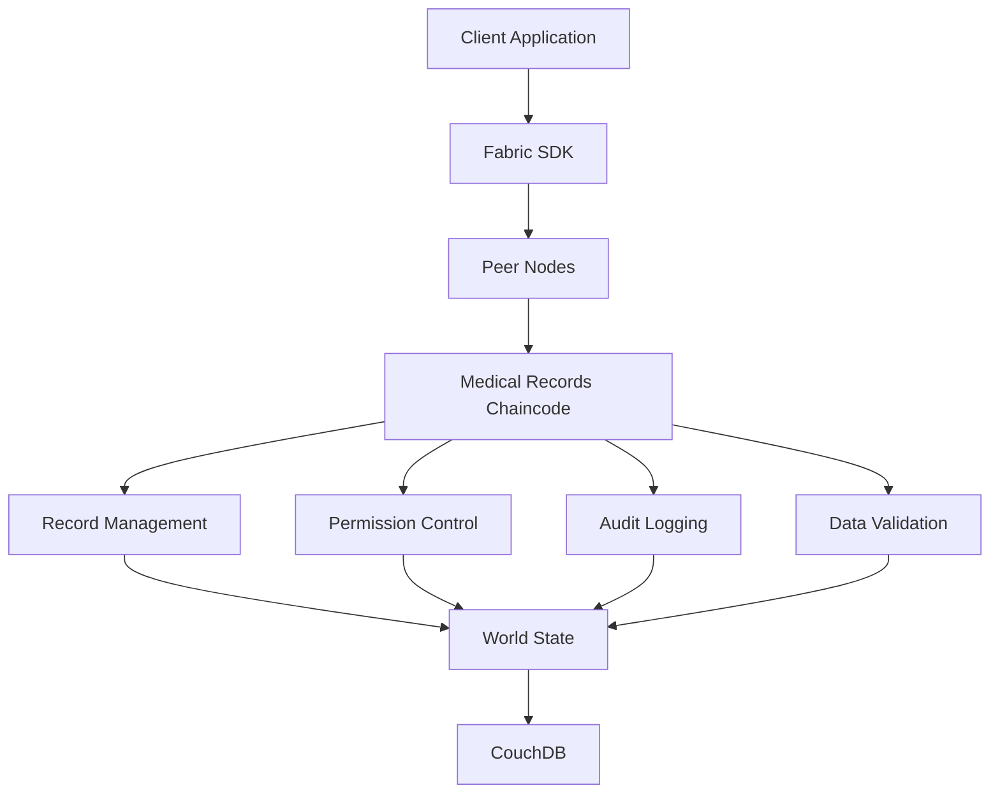

# 智能合约开发指南

## 1. 概述

本文档详细介绍了区块链电子病历共享系统中智能合约的开发规范、架构设计、部署流程和最佳实践。系统采用Hyperledger Fabric作为区块链平台，使用Go语言开发链码（Chaincode）。

### 1.1 技术栈

- **区块链平台**: Hyperledger Fabric 2.4+
- **开发语言**: Go 1.19+
- **合约框架**: Fabric Contract API
- **开发工具**: Fabric SDK Go
- **测试框架**: Go testing + Ginkgo
- **部署工具**: Docker + Kubernetes

### 1.2 设计原则

- **数据隐私**: 敏感医疗数据不直接上链，仅存储哈希值
- **访问控制**: 基于角色的权限管理
- **审计追踪**: 完整的操作日志记录
- **性能优化**: 高效的查询和索引机制
- **安全性**: 多重验证和加密保护

## 2. 合约架构设计

### 2.1 整体架构



### 2.2 合约结构

```go
// chaincode/emr/main.go
package main

import (
    "log"
    
    "github.com/hyperledger/fabric-contract-api-go/contractapi"
    "github.com/medical-blockchain/chaincode/contracts"
)

func main() {
    medicalRecordContract := new(contracts.MedicalRecordContract)
    permissionContract := new(contracts.PermissionContract)
    auditContract := new(contracts.AuditContract)
    
    chaincode, err := contractapi.NewChaincode(
        medicalRecordContract,
        permissionContract,
        auditContract,
    )
    if err != nil {
        log.Panicf("Error creating medical records chaincode: %v", err)
    }
    
    if err := chaincode.Start(); err != nil {
        log.Panicf("Error starting chaincode: %v", err)
    }
}
```

## 3. 数据模型定义

### 3.1 医疗记录结构

```go
// chaincode/emr/models/medical_record.go
package models

import (
    "time"
)

// MedicalRecord 医疗记录结构
type MedicalRecord struct {
    ID          string    `json:"id"`
    PatientID   string    `json:"patientId"`
    DoctorID    string    `json:"doctorId"`
    RecordType  string    `json:"recordType"`
    Title       string    `json:"title"`
    DataHash    string    `json:"dataHash"`     // 实际数据的哈希值
    IPFSHash    string    `json:"ipfsHash"`     // IPFS存储哈希
    Metadata    Metadata  `json:"metadata"`
    Status      string    `json:"status"`
    CreatedAt   time.Time `json:"createdAt"`
    UpdatedAt   time.Time `json:"updatedAt"`
    CreatedBy   string    `json:"createdBy"`
    UpdatedBy   string    `json:"updatedBy"`
}

// Metadata 元数据结构
type Metadata struct {
    Institution   string            `json:"institution"`
    Department    string            `json:"department"`
    Tags          []string          `json:"tags"`
    Classification string           `json:"classification"`
    Attributes    map[string]string `json:"attributes"`
}

// RecordType 记录类型枚举
const (
    RecordTypeConsultation = "consultation"
    RecordTypeDiagnosis    = "diagnosis"
    RecordTypeTreatment    = "treatment"
    RecordTypePrescription = "prescription"
    RecordTypeLabResult    = "lab_result"
    RecordTypeImaging      = "imaging"
    RecordTypeSurgery      = "surgery"
)

// RecordStatus 记录状态枚举
const (
    StatusDraft     = "draft"
    StatusPending   = "pending"
    StatusApproved  = "approved"
    StatusArchived  = "archived"
    StatusDeleted   = "deleted"
)
```

### 3.2 权限管理结构

```go
// chaincode/emr/models/permission.go
package models

import (
    "time"
)

// AccessPermission 访问权限结构
type AccessPermission struct {
    ID           string    `json:"id"`
    RecordID     string    `json:"recordId"`
    GrantedTo    string    `json:"grantedTo"`
    GrantedBy    string    `json:"grantedBy"`
    PermissionType string  `json:"permissionType"`
    ExpiresAt    *time.Time `json:"expiresAt,omitempty"`
    IsActive     bool      `json:"isActive"`
    Reason       string    `json:"reason"`
    CreatedAt    time.Time `json:"createdAt"`
    RevokedAt    *time.Time `json:"revokedAt,omitempty"`
    RevokedBy    string    `json:"revokedBy,omitempty"`
}

// PermissionType 权限类型枚举
const (
    PermissionRead   = "read"
    PermissionWrite  = "write"
    PermissionShare  = "share"
    PermissionDelete = "delete"
)

// UserRole 用户角色枚举
const (
    RolePatient    = "patient"
    RoleDoctor     = "doctor"
    RoleNurse      = "nurse"
    RoleAdmin      = "admin"
    RoleResearcher = "researcher"
)
```

### 3.3 审计日志结构

```go
// chaincode/emr/models/audit_log.go
package models

import (
    "time"
)

// AuditLog 审计日志结构
type AuditLog struct {
    ID           string                 `json:"id"`
    UserID       string                 `json:"userId"`
    Action       string                 `json:"action"`
    ResourceType string                 `json:"resourceType"`
    ResourceID   string                 `json:"resourceId"`
    Details      map[string]interface{} `json:"details"`
    IPAddress    string                 `json:"ipAddress"`
    UserAgent    string                 `json:"userAgent"`
    Timestamp    time.Time              `json:"timestamp"`
    TxID         string                 `json:"txId"`
}

// AuditAction 审计动作枚举
const (
    ActionCreate     = "create"
    ActionRead       = "read"
    ActionUpdate     = "update"
    ActionDelete     = "delete"
    ActionShare      = "share"
    ActionRevoke     = "revoke"
    ActionLogin      = "login"
    ActionLogout     = "logout"
    ActionDownload   = "download"
    ActionUpload     = "upload"
)
```

## 4. 核心合约实现

### 4.1 医疗记录合约

```go
// chaincode/emr/contracts/medical_record_contract.go
package contracts

import (
    "crypto/sha256"
    "encoding/json"
    "fmt"
    "time"
    
    "github.com/hyperledger/fabric-contract-api-go/contractapi"
    "github.com/medical-blockchain/chaincode/models"
    "github.com/medical-blockchain/chaincode/utils"
)

// MedicalRecordContract 医疗记录智能合约
type MedicalRecordContract struct {
    contractapi.Contract
}

// CreateRecord 创建医疗记录
func (mrc *MedicalRecordContract) CreateRecord(
    ctx contractapi.TransactionContextInterface,
    recordID string,
    patientID string,
    doctorID string,
    recordType string,
    title string,
    dataHash string,
    ipfsHash string,
    metadataJSON string,
) error {
    // 验证调用者权限
    if err := mrc.validateCreatePermission(ctx, patientID, doctorID); err != nil {
        return fmt.Errorf("permission denied: %v", err)
    }
    
    // 检查记录是否已存在
    exists, err := mrc.RecordExists(ctx, recordID)
    if err != nil {
        return fmt.Errorf("failed to check record existence: %v", err)
    }
    if exists {
        return fmt.Errorf("record %s already exists", recordID)
    }
    
    // 解析元数据
    var metadata models.Metadata
    if err := json.Unmarshal([]byte(metadataJSON), &metadata); err != nil {
        return fmt.Errorf("invalid metadata format: %v", err)
    }
    
    // 验证数据完整性
    if err := mrc.validateDataIntegrity(dataHash, ipfsHash); err != nil {
        return fmt.Errorf("data integrity validation failed: %v", err)
    }
    
    // 创建记录对象
    record := models.MedicalRecord{
        ID:         recordID,
        PatientID:  patientID,
        DoctorID:   doctorID,
        RecordType: recordType,
        Title:      title,
        DataHash:   dataHash,
        IPFSHash:   ipfsHash,
        Metadata:   metadata,
        Status:     models.StatusDraft,
        CreatedAt:  time.Now(),
        UpdatedAt:  time.Now(),
        CreatedBy:  mrc.getCallerID(ctx),
        UpdatedBy:  mrc.getCallerID(ctx),
    }
    
    // 序列化并存储
    recordJSON, err := json.Marshal(record)
    if err != nil {
        return fmt.Errorf("failed to marshal record: %v", err)
    }
    
    if err := ctx.GetStub().PutState(recordID, recordJSON); err != nil {
        return fmt.Errorf("failed to put record to world state: %v", err)
    }
    
    // 创建复合键索引
    if err := mrc.createIndexes(ctx, &record); err != nil {
        return fmt.Errorf("failed to create indexes: %v", err)
    }
    
    // 记录审计日志
    if err := mrc.logAuditEvent(ctx, models.ActionCreate, "medical_record", recordID, map[string]interface{}{
        "patientId": patientID,
        "doctorId":  doctorID,
        "type":      recordType,
    }); err != nil {
        return fmt.Errorf("failed to log audit event: %v", err)
    }
    
    // 触发事件
    if err := ctx.GetStub().SetEvent("RecordCreated", recordJSON); err != nil {
        return fmt.Errorf("failed to set event: %v", err)
    }
    
    return nil
}

// GetRecord 获取医疗记录
func (mrc *MedicalRecordContract) GetRecord(
    ctx contractapi.TransactionContextInterface,
    recordID string,
) (*models.MedicalRecord, error) {
    // 验证读取权限
    if err := mrc.validateReadPermission(ctx, recordID); err != nil {
        return nil, fmt.Errorf("permission denied: %v", err)
    }
    
    recordJSON, err := ctx.GetStub().GetState(recordID)
    if err != nil {
        return nil, fmt.Errorf("failed to read record from world state: %v", err)
    }
    if recordJSON == nil {
        return nil, fmt.Errorf("record %s does not exist", recordID)
    }
    
    var record models.MedicalRecord
    if err := json.Unmarshal(recordJSON, &record); err != nil {
        return nil, fmt.Errorf("failed to unmarshal record: %v", err)
    }
    
    // 记录访问日志